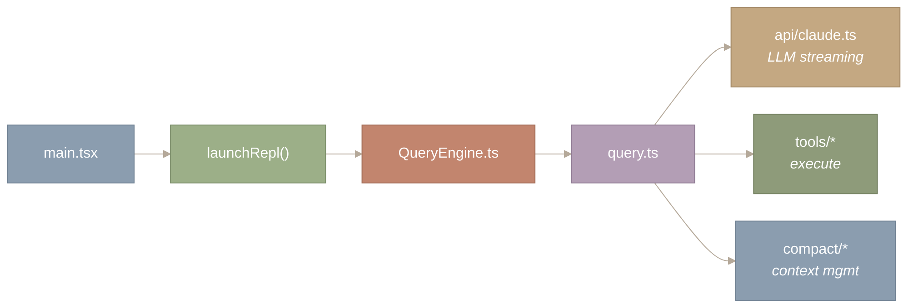
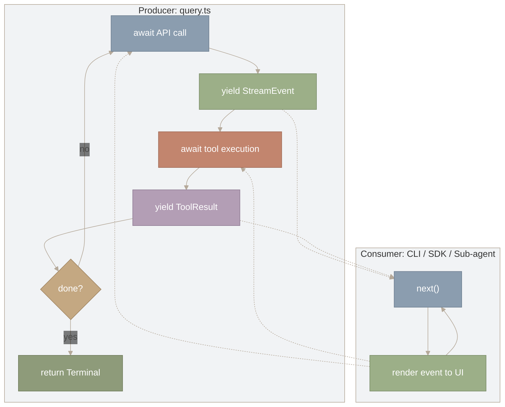
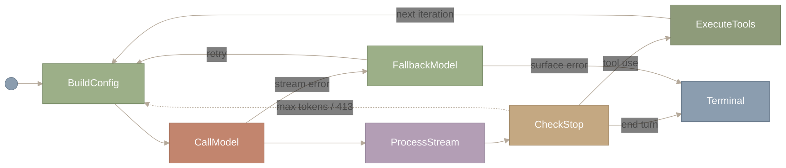
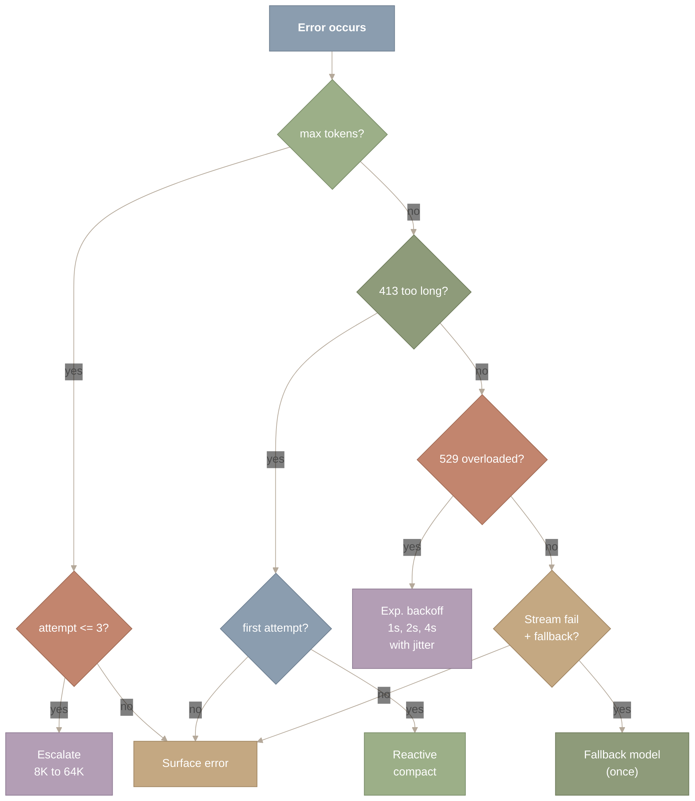
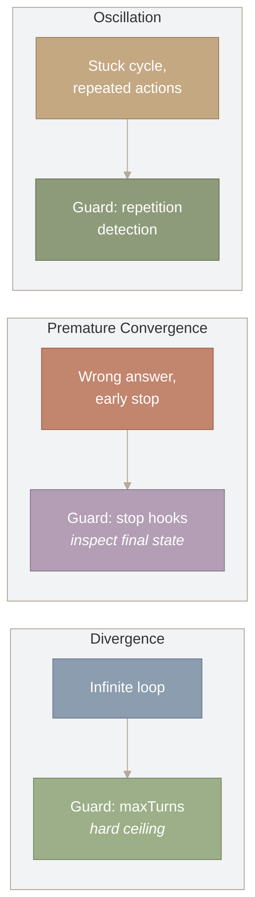
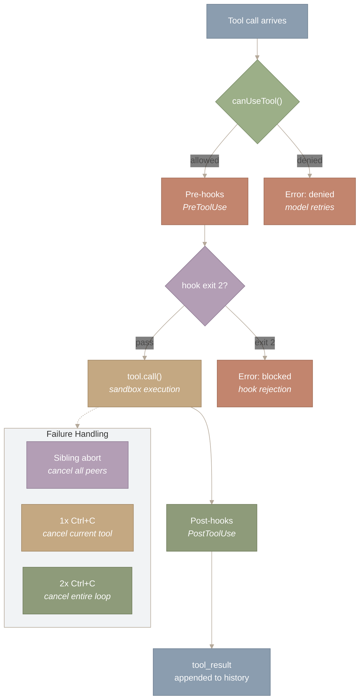

# The Agent Loop & QueryEngine

## 1. Introduction: One Loop, One Abstraction

**Claude Code’s entire agent loop — streaming, tool execution, error recovery, context management — is implemented as a single asynchronous generator. This part examines why that design was chosen, how the generator abstraction shapes the architecture, and why most of the code handles failure recovery rather than the happy path.**

Every interaction with Claude Code — interactive terminal, headless SDK, background sub-agent — flows through `query()` in `query.ts`: a single 1,729-line asynchronous generator that handles API streaming, tool execution, context compaction, token escalation, model fallback, and loop divergence detection. An asynchronous generator is a coroutine that yields streaming events to its caller and suspends until the caller is ready for more. This single language-level choice provides streaming without buffering, backpressure without manual flow control, and composition without callback coordination.

Of the seven states in the loop’s state machine, four exist solely to handle failure. Understanding why requires examining the full architecture: the generator abstraction, the state machine it implements, the error recovery cascade, and the concurrency model. The following diagram shows where `query.ts` sits:



*Figure 1: Where query.ts sits in Claude Code’s call chain. The main entry point flows through the REPL and QueryEngine (session lifecycle) into query.ts (the ReAct loop), which fans out to three subsystems: the LLM streaming client, tool executors, and context compaction. QueryEngine decides when to invoke the loop; query.ts decides what to do inside it.*

**How to read this diagram.** Follow the arrows left to right through the call chain. The entry point (main.tsx) flows through launchRepl() and QueryEngine.ts into query.ts, the central node. From query.ts, three branches fan out to the subsystems it orchestrates: LLM streaming (api/claude.ts), tool execution (tools/*), and context management (compact/*). The key distinction is between QueryEngine.ts (which decides *when* to invoke the loop) and query.ts (which decides *what to do* inside the loop).

`QueryEngine.ts` manages session lifecycle – history, system prompt assembly, the decision of *when* to invoke the loop. `query.ts` is where the agent *thinks*. We begin with the generator abstraction (Section 2), proceed to the state machine it implements (Section 3), trace the policy injection mechanism (Section 4), examine error recovery (Sections 5-6), and close with concurrency and synthesis (Sections 7-8).

**Source files covered in this post:**

| File | Purpose | Size |
| --- | --- | --- |
| `src/main.tsx` | CLI entry point; routes to REPL and QueryEngine | ~800 LOC |
| `src/query.ts` | Core agent loop — async generator implementing the ReAct state machine | ~1,729 LOC |
| `src/QueryEngine.ts` | Session lifecycle, history management, system prompt assembly | ~500 LOC |
| `src/services/api/claude.ts` | LLM streaming client (messages API, retry, rate limiting) | ~1,200 LOC |
| `src/services/tools/` | Tool execution orchestration (dispatch, permissions, hooks) | ~6 files |

---

## 2. Why AsyncGenerator? The Design Space of Agent Loops

**The agent loop has three requirements: (1) stream intermediate results to the UI as they arrive, so the user is never staring at a blank screen; (2) let the consumer control the pace, so a burst of tool results does not overwhelm the renderer; and (3) support multiple consumers (CLI, SDK, sub-agents) from one loop implementation.** Claude Code meets all three with an `AsyncGenerator`.

A regular `async function` cannot stream — the caller waits for the entire multi-turn interaction to complete before seeing anything. An EventEmitter streams, but the producer runs at its own pace; if tool results arrive faster than the UI can render, events pile up in memory. An AsyncGenerator solves both problems with a pull-based protocol: the consumer calls `next()` to request the next event, and the producer *suspends* until that call arrives. The generator cannot outrun its consumer because it physically cannot produce the next value until asked.

Here is the actual function signature:

```
export async function* query(
  params: QueryParams,
): AsyncGenerator<
  StreamEvent | Message | ToolUseSummaryMessage,
  Terminal  // <-- return type: the final outcome
>
```

The `function*` and `yield*` are TypeScript syntax for generators and generator delegation — if unfamiliar, just read them as `function` and `yield`. The key idea: inside the loop, the code `await`s an API call, `yield`s the streamed tokens to the consumer, `await`s tool execution, `yield`s the tool result, and repeats. At each `yield`, the generator freezes its entire stack frame — local variables, loop counter, current state — and hands control to the consumer. When the consumer calls `next()`, the generator resumes exactly where it left off. The code reads like a normal sequential loop, but it produces a stream of events.

The yielded types (`StreamEvent | Message | ...`) are the intermediate events the UI renders in real time. The `Terminal` return type carries the final outcome — why the loop ended and what the last state was. Consumers use `for await...of` to process events as they arrive:

```
const gen = query(params);
for await (const event of gen) {
  renderToUI(event);  // each event renders immediately
}
// gen.return contains the Terminal: why the loop ended
```

**Why producer-consumer?** The agent loop has one producer (the `query()` generator that calls the API and executes tools) but multiple consumers that need the same event stream: the interactive CLI renders tokens to the terminal, the headless SDK collects results programmatically, and sub-agents forward events to their parent. A producer-consumer split means the loop logic is written once and each consumer pulls events at its own pace. The generator suspends between pulls, so a slow consumer (the CLI doing expensive rendering) naturally slows the producer without any explicit synchronization.



*Figure 2: The AsyncGenerator producer-consumer architecture. Read the left subgraph (Producer) top-to-bottom: query.ts awaits an API call, yields the streamed tokens, awaits tool execution, yields the tool result, then checks whether the task is done — if not, it loops back to the API call. Read the right subgraph (Consumer) as a separate loop: the consumer calls next() to pull an event, renders it to the UI, then calls next() again. Dotted lines show the handoff: each yield in the producer delivers an event to the consumer, and each next() call from the consumer resumes the producer. The producer physically cannot advance past a yield until the consumer pulls — this is how backpressure works.*

**How to read this diagram.** Read each subgraph (Producer and Consumer) top-to-bottom as an independent loop. In the Producer, the flow cycles through await API call, yield StreamEvent, await tool execution, yield ToolResult, and a done? check that either loops back or returns Terminal. In the Consumer, a tight loop calls next() and renders each event. The dotted lines between the subgraphs show the handoff: each yield delivers an event to the consumer, and each next() call resumes the producer. The producer cannot advance past a yield until the consumer pulls – this is how backpressure works without explicit coordination code.

The key insight in this diagram is the dotted lines between the two subgraphs. Each dotted arrow represents a *handoff*: when the producer yields, it suspends and the event flows to the consumer; when the consumer finishes rendering and calls `next()`, control flows back to the producer, which resumes from exactly where it left off. This back-and-forth is what makes the architecture pull-based — the consumer sets the pace, not the producer. If the CLI takes 50ms to render a complex diff, the producer simply waits. If the SDK processes events instantly, the producer runs at full speed. Same loop, different pacing, zero coordination code.

Generator delegation enables composition: the outer `query()` delegates to `queryLoop()`, and a logging wrapper can intercept every yielded event without modifying either function. One loop, many consumers, zero code duplication.

---

## 3. The ReAct State Machine: Seven States, Three Happy

**The generator is the mechanism; the ReAct state machine is the logic it executes. This state machine has seven states, but only three constitute the happy path – the remaining four exist entirely for error recovery.**

The classic ReAct loop – where an LLM alternates between *reasoning* about what to do and *acting* by calling tools – sounds simple: think, act, observe, repeat. In a textbook, that is three states. In production, you need to handle truncated responses, overflowing context, crashing tools, overloaded APIs, and an agent that gets stuck in circles. Each failure mode adds a state.

Here is the complete state machine as it exists in `query.ts`:



*Figure 3: The complete ReAct loop state machine with seven states. The happy path (green nodes) flows left to right: BuildConfig, CallModel, ProcessStream, CheckStop, ExecuteTools, then loops back to BuildConfig. Recovery paths (terracotta) branch to FallbackModel on stream errors or loop back on max-tokens/413 errors. Only three of the seven states are on the happy path; the remaining four handle error recovery.*

**How to read this diagram.** Start at the black dot on the left and follow the solid arrows right — this is the happy path: BuildConfig assembles the request, CallModel streams the API response, ProcessStream collects it, CheckStop inspects the `stop_reason`. If the model wants to use a tool (`tool use`), the flow goes up to ExecuteTools and loops back to BuildConfig for the next turn. If the model signals completion (`end turn`), the flow exits right to Terminal. The dotted arrows are recovery paths: a stream error from CallModel drops to FallbackModel, which can retry or surface the error. A `max_tokens` or 413 error from CheckStop loops back to BuildConfig to retry with adjusted parameters. Only three states (BuildConfig → CallModel → ProcessStream) are on every turn; the remaining four activate only when something goes wrong.

Let us trace each path through this machine.

**BUILD CONFIG** snapshots the current environment – model selection, thinking configuration, tool schemas, beta headers – into a frozen `QueryConfig`. This snapshot ensures that mid-loop changes (a user toggling plan mode, a feature flag update) do not take effect until the next turn boundary. It is the same principle as double-buffering in graphics: the running frame never sees a half-updated state.

**CALL MODEL** initiates a streaming request to the Anthropic API via `createMessage()`. The response arrives as a sequence of server-sent events (SSE) – `message_start`, `content_block_delta`, `message_stop` – and each is yielded to the caller for real-time UI rendering. This is where the AsyncGenerator’s pull-based model pays off: each SSE event is yielded as it arrives, and the generator suspends until the consumer is ready for the next one.

**PROCESS STREAM** collects the streamed events into a complete message and passes it to the decision point.

**CHECK STOP REASON** is the critical branching node. The API’s `stop_reason` field determines the next state:

- **`end_turn`**: The model believes it is done. Run stop hooks (lifecycle callbacks that check for premature termination). If a hook says “you forgot to run the tests,” the loop resumes.
- **`tool_use`**: The model wants to call tools. Execute them (details in Section 7), append results to the conversation, continue.
- **`max_tokens`**: The response was truncated. Escalate the output limit and retry.
- **error (413, 529, stream failure)**: Route to the appropriate recovery path.

**FALLBACK MODEL** is reached when the primary model’s stream fails. If a fallback model is configured, the loop switches to it and retries. If the fallback also fails, the error surfaces to the user.

**TERMINAL** is the absorbing state. It carries the reason the loop ended and the final message.

The key insight, and the one that motivates the next two sections, is this: four of the seven states are *recovery* states. The happy path is just BUILD CONFIG, CALL MODEL, PROCESS STREAM, CHECK STOP, EXECUTE TOOLS, and back to BUILD CONFIG. The rest of the machine exists because **production systems spend more time recovering from failure than executing the happy path**. This is the iceberg principle of systems design – the visible logic is the tip; error handling is the mass beneath.

More recovery states mean more code paths to test and more possible state transitions. Claude Code accepts this complexity because an agent that crashes on a 413 error is useless. The alternative – a simpler loop that fails hard – shifts the recovery burden to the user. The 1,729 lines of `query.ts` are the price of never showing users an unrecoverable crash.

The state machine’s behavior, however, is not fixed. Different execution contexts (interactive CLI, headless SDK, plan mode) require different policies. The next section examines the injection mechanism that makes this possible.

---

## 4. The QueryParams Contract: Separating Policy from Mechanism

**The state machine’s behavior varies by context – interactive vs. headless, permissive vs. restricted, primary model vs. fallback. Rather than scattering `if` statements through the loop, Claude Code injects all policy variation through a single parameter object.**

The `QueryParams` type carries everything the loop needs to begin execution. Rather than listing all 13 fields, here are the five that reveal the design principle:

```
export type QueryParams = {
  messages: Message[]        // conversation history (compactable)
  tools: ToolUseContext      // available capabilities (dynamic per mode)
  canUseTool: CanUseToolFn   // permission policy (injected, not hardcoded)
  maxTurns?: number          // iteration budget (prevents runaway)
  fallbackModel?: string     // resilience policy (switch on failure)
  // ... 8 more fields for streaming, caching, budget, hooks
}
```

Notice that `canUseTool` is a *function*, not data. It takes a tool name and returns whether that tool is permitted. This function-as-parameter design means the permission policy is fully decoupled from the loop. Plan mode injects a `canUseTool` that blocks all write tools. Auto-accept mode injects one that allows everything. Custom configurations inject their own. The loop does not know or care which policy it is enforcing.

This is the Strategy pattern applied to agent orchestration. The loop is the context; the injected functions are interchangeable strategies. The same loop runs identically across the interactive CLI, the headless SDK, and background sessions – because the varying behavior lives in the injected parameters, not in the loop itself.

Similarly, `querySource` identifies *who* initiated the query: `user`, `compact`, `session_memory`, or `subagent`. The loop uses this to prevent recursive behavior – a compaction query should not trigger further compaction. This is dependency injection for control flow: the caller tells the loop what it is, and the loop adjusts its behavior without branching on mode flags.

The connection to the state machine is direct: every transition in the state machine that depends on context – whether to attempt compaction, whether to allow a tool, whether to retry on failure – reads from `QueryParams` rather than from ambient state. The generator mechanism is pure; the policy is injected. This separation is what allows a single 1,729-line function to serve every execution mode without conditional sprawl.

Strategy pattern – define a family of algorithms (permission policies), encapsulate each one (as a function), and make them interchangeable. The GoF book (1994) describes this with classes; modern TypeScript does it with higher-order functions. Same insight, lighter syntax.

**Deep Dive: Full QueryParams and Loop State**

The complete `QueryParams` type includes fields for system prompt (`SystemPrompt`, an opaque branded type), user/system context dictionaries, query source identification, output token overrides, task budgets, and cache control flags.

Inside the loop, these are destructured into mutable state:

```
type State = {
  messages: Message[]
  toolUseContext: ToolUseContext
  autoCompactTracking: AutoCompactTrackingState | undefined
  maxOutputTokensRecoveryCount: number       // guards against infinite escalation
  hasAttemptedReactiveCompact: boolean       // guards against compaction loops
  turnCount: number                          // iteration counter
  transition: Continue | undefined           // WHY did the previous turn continue?
  stopHookActive: boolean | undefined        // prevents stop hook re-entrancy
  pendingToolUseSummary: Promise<...> | undefined
}
```

The `transition` field is particularly clever. It records *why* the previous iteration chose to continue – was it a tool use? A max-tokens recovery? A stop hook injection? This lets the current iteration adjust its behavior based on the previous turn’s outcome, without requiring an explicit finite state machine with named states. It is an implicit state machine embedded in a single field.

With both the mechanism (AsyncGenerator), the logic (state machine), and the configuration (QueryParams) established, we can now turn to the question that dominates the loop’s line count: what happens when things go wrong?

---

## 5. Error Recovery as Graceful Degradation

**Four of seven states in the state machine are recovery states. This section examines why each exists and how they interact, revealing a cascading recovery strategy borrowed from distributed systems.**

Think of error recovery in distributed systems. When a web server gets overloaded, it does not simply reject all requests. It sheds load, retries with backoff, falls back to cached responses, and finally returns a degraded response. Claude Code applies the same philosophy to its agent loop – five recovery paths, ordered from cheapest to most expensive.



*Figure 4: Error recovery decision tree with five recovery paths ordered by cost. Max-tokens errors trigger output limit escalation (8K to 64K, capped at 3 attempts). HTTP 413 triggers reactive compaction (once). HTTP 529 triggers exponential backoff with jitter. Stream failures trigger a one-shot model fallback. Each path has an explicit guard against retry loops; all paths terminate at ‘surface error’ if recovery fails.*

**How to read this diagram.** Start at the “Error occurs” node at the top and follow the decision tree downward. Each diamond tests one error type in priority order: max tokens, 413 too long, 529 overloaded, then stream failure. At each decision, the “yes” branch leads to a bounded recovery action (escalate, compact, backoff, or fallback), while the “no” branch falls through to the next check. Every recovery path has an explicit guard (attempt count or boolean flag) that routes to “Surface error” if retries are exhausted. The takeaway: no recovery path can loop indefinitely.

**Max-tokens recovery** handles truncated responses. When the model generates a long code block that exceeds the default 8,192-token output limit, the loop escalates to 64,000 tokens and retries. A counter caps this at three attempts. Most truncations resolve on the first retry – the default limit was simply too conservative for that particular response. The counter is essential: without it, a model that consistently generates maximum-length output would escalate indefinitely.

Reactive compaction (HTTP 413) handles overflowing context. A 413 means the entire request exceeded the API’s context window. This typically happens when a tool returns unexpectedly large output – catting a binary file, reading a massive log. The loop attempts to compress the conversation history (see [Part III.1](https://y-agent.github.io/inside-claude-code/04-context-compaction.html) for the full compaction story). A boolean flag (`hasAttemptedReactiveCompact`) allows exactly one attempt. The single-attempt guard is critical: compaction itself consumes tokens, and if the compacted result is still too large, retrying compaction would loop forever.

**Backoff retry** (HTTP 529) handles API overload. The exponential backoff starts at approximately one second and grows to approximately thirty seconds, with jitter to prevent thundering herd effects.

Model fallback handles persistent stream failures. If the primary model’s stream fails mid-generation and a fallback model is configured, the loop switches models. The critical safety line:

```
yield* queryModelWithStreaming({
  ...options,
  model: params.fallbackModel,
  fallbackModel: undefined,  // <-- prevents infinite fallback chain
})
```

Setting `fallbackModel: undefined` on the recursive call is the circuit breaker. Without it, a failing fallback model would trigger another fallback attempt, creating an infinite cascade. Note the use of `yield*` here – the composed generator delegates to the fallback call, and the consumer sees a seamless stream of events regardless of which model is producing them. This is the AsyncGenerator’s composability at work.

Every recovery path follows the same meta-pattern: **try once (or a bounded number of times), guard against loops, surface to the user if all else fails.** This is exactly how circuit breakers work in microservice architectures (popularized by Netflix’s Hystrix). The circuit breaker monitors failures, trips after a threshold, and prevents the system from repeatedly hammering a broken dependency. Recovery paths handle transient failures – errors that can be resolved by retrying, compacting, or switching models. But there is a more insidious failure mode: the agent that never errors but never finishes. The next section addresses this problem.

---

## 6. The Doom Loop Detector: Applied Halting Problem

**Even with robust error recovery, the loop can still diverge — cycling endlessly without crashing, repeating the same actions, or refusing to stop.** Claude Code uses three heuristics, each targeting a different failure mode:



*Figure 5: Three failure modes of iterative computation – divergence, premature convergence, and oscillation – paired with their corresponding guards. Divergence (infinite loops) is caught by a hard maxTurns ceiling. Premature convergence (wrong answer, early stop) is caught by stop hooks that inspect final state. Oscillation (stuck cycles) is caught by repetition detection. Each guard carries its own explicit bound to prevent meta-divergence.*

**How to read this diagram.** Each of the three subgraphs pairs a failure mode (left node) with its corresponding guard (right node). Read left to right within each: Divergence (infinite loops) is caught by maxTurns, Premature Convergence (wrong answer, early stop) is caught by stop hooks, and Oscillation (stuck cycles) is caught by repetition detection. The three subgraphs are independent and complementary – together they cover the three ways an iterative computation can fail to produce a correct result.

**Heuristic 1: Turn counting (divergence guard).** The `maxTurns` parameter sets a hard ceiling on loop iterations. This is a watchdog timer – the simplest and most robust termination guarantee. The default is generous (dozens of turns), but it catches any form of runaway execution, regardless of cause. Its simplicity is its strength: no matter how the agent misbehaves, the counter eventually fires.

**Heuristic 2: Stop hooks (convergence guard).** When the model says “I’m done” (`end_turn`), Claude Code runs lifecycle callbacks that inspect the final state. A stop hook might check: “Did you modify test files but never run the tests?” If the hook detects a premature stop, it injects an error message and the loop resumes. A counter prevents stop hooks from firing indefinitely – without this guard, a stop hook that always rejects would create its own infinite loop. This is a meta-application of the same bounded-retry principle from Section 5: every recovery mechanism, including the one that checks for premature termination, has an explicit bound.

**Heuristic 3: Repetition detection (oscillation guard).** If the agent repeats the same tool call with the same arguments multiple times, it is likely stuck in a cycle. The loop tracks recent tool invocations and can break the cycle by injecting a “you seem to be repeating yourself” nudge. This is the subtlest failure mode: the agent appears to be making progress – it is calling tools, generating responses – but it is traversing the same states in a loop.

The three heuristics are complementary. Turn counting catches divergence regardless of cause. Stop hooks catch premature convergence that turn counting would miss (the agent stops “successfully” but incorrectly). Repetition detection catches oscillation that neither of the others would flag (the agent neither diverges nor converges – it cycles). Together, they approximate a halting oracle for the specific domain of tool-using agents.

Alan Turing proved in 1936 that no algorithm can decide whether an arbitrary program will halt. An AI agent looping over tool calls is such a program — you cannot guarantee termination in general. But you can engineer around it. Turn limits handle divergence (infinite loops). Stop hooks handle convergence to the wrong answer (premature termination). Repetition detection handles oscillation (stuck in a cycle). Together, these three heuristics cover the three failure modes of iterative computation — and each has an explicit bound to prevent becoming a problem itself.

The doom loop detector addresses the macro question of whether the loop will terminate. The next section turns to the micro question: within a single iteration, how are tools dispatched and executed?

---

## 7. Streaming and Tool Execution: Concurrency Where It Is Safe

**Within each loop iteration, the model may request multiple tool calls. The StreamingToolExecutor overlaps tool execution with model generation, using a readers-writers concurrency model that parallelizes reads while serializing writes.**

The StreamingToolExecutor is a key optimization. When the model’s streaming response contains multiple tool calls, the executor does not wait for the entire response to finish. As soon as a tool call’s input JSON is complete (`content_block_stop`), execution begins – even while subsequent tool calls are still being streamed.

```mermaid
%%{init: {'theme': 'neutral', 'flowchart': {'useMaxWidth': false, 'htmlLabels': true, 'padding': 20, 'nodeSpacing': 30, 'rankSpacing': 40}, 'themeVariables': {'primaryColor': '#8B9DAF', 'primaryTextColor': '#ffffff', 'primaryBorderColor': '#6E7F91', 'secondaryColor': '#9CAF88', 'secondaryTextColor': '#ffffff', 'secondaryBorderColor': '#7A8D68', 'tertiaryColor': '#C2856E', 'tertiaryTextColor': '#ffffff', 'tertiaryBorderColor': '#A06A54', 'lineColor': '#B5A99A', 'textColor': '#4A4A4A', 'mainBkg': '#8B9DAF', 'nodeBorder': '#6E7F91', 'clusterBkg': 'rgba(139,157,175,0.12)', 'clusterBorder': '#B5A99A', 'edgeLabelBackground': 'transparent'}}}%%
gantt
  title Streaming Tool Execution Timeline
  dateFormat X
  axisFormat %s s

  section Model Stream
    tool 1 JSON         :a1, 0, 3
    tool 2 JSON         :a2, 3, 5
    tool 3 JSON         :a3, 5, 8

  section Parallel Reads
    Read(a.ts)          :b1, 3, 6
    Grep(*.ts)          :b2, 4, 7
    Glob(src/)          :b3, 5, 7

  section Sequential Writes
    Edit(b.ts)          :crit, c1, 8, 11
    Bash(test)          :crit, c2, 11, 15
```



*Figure 6: Streaming tool execution timeline showing three concurrent phases. The model stream (top) emits tool call JSON incrementally. Read-only tools (Read, Grep, Glob) begin executing as soon as their JSON completes, running in parallel. Side-effecting tools (Edit, Bash) serialize after the parallel batch, each waiting for the previous to finish. This overlap saves 30-50% of wall-clock time compared to sequential execution.*

**How to read this diagram.** Time flows left to right across three swim lanes. The top lane (Model Stream) shows tool-call JSON being emitted incrementally. The middle lane (Parallel Reads) shows three read-only tools launching as soon as their JSON completes, running concurrently and overlapping in time. The bottom lane (Sequential Writes) shows side-effecting tools running one after another (marked critical in red), each waiting for the previous to finish. The key takeaway is the time saved: reads overlap with each other and with the stream, while writes serialize – this is the readers-writers concurrency model in action.

The concurrency rule is simple and conservative:

- **Read-only tools** (Read, Grep, Glob, WebFetch) share a parallel pool. Three file reads launch simultaneously.
- **Side-effecting tools** (Write, Edit, Bash) acquire exclusive access. A file edit followed by a test run must preserve ordering.

This is the readers-writers problem from concurrent programming – a classic synchronization challenge where multiple readers can access a resource simultaneously, but writers need exclusive access. Claude Code solves it with a concurrency semaphore: readers share the lock, writers acquire it exclusively.

The connection to the AsyncGenerator abstraction is important here. Each tool result is yielded back to the consumer as it completes. Because the generator is pull-based, the consumer processes results at its own pace – a fast terminal can render results as they arrive, while a slower consumer (a network relay, a test harness) naturally applies backpressure. The generator does not need to know which consumer it is serving.

Before any tool executes, it passes through a permission pipeline: first `canUseTool()` (the injected policy function from Section 4), then pre-tool hooks (lifecycle callbacks that can inspect or modify the input), then actual execution, then post-tool hooks. This pipeline runs per-tool, even within the parallel pool – so a permission denial on one read-only tool does not block the others.



*Figure 7: Per-tool permission pipeline and failure handling. Each tool call passes through four stages: canUseTool (policy check), pre-hooks (lifecycle callbacks), tool.call (actual execution in sandbox), and post-hooks (observation/logging). A denial at canUseTool or a block from pre-hooks short-circuits to an error result without executing the tool. When concurrent tools are running and one fails, sibling abort cancels all peers. User interrupts follow the tool’s interruptBehavior flag: cancel tools abort immediately, block tools complete first.*

**How to read this diagram.** Follow the happy path top to bottom: a tool call arrives, passes `canUseTool()` (the injected policy), runs through pre-hooks, executes in the sandbox, runs post-hooks, and produces a `tool_result`. Two short-circuit paths branch left: a denial from `canUseTool()` or a block from a pre-hook (exit code 2) skips execution entirely and returns an error to the model. The dotted arrow from `tool.call()` to the Failure Handling subgraph shows what happens when things go wrong mid-execution: sibling abort cancels concurrent peers, a single Ctrl+C cancels just the current tool, and a double Ctrl+C cancels the entire agent loop.

When multiple tools execute concurrently and one fails, Claude Code implements sibling abort: all concurrently executing tools receive a cancellation signal, and their results are replaced with error messages. User interrupts (Ctrl+C) work similarly – one interrupt cancels the current tool and lets the agent continue; two rapid interrupts cancel the entire loop.

For a typical turn with three file reads followed by an edit, streaming execution saves 30-50% of wall-clock time compared to fully sequential execution. The reads overlap with each other and with the model’s continued streaming. Only the write operations serialize.

Parallel read-only tools are safe because they have no side effects. But what about tools that *appear* read-only but have hidden dependencies – like reading a file that another concurrent tool is about to edit? Claude Code avoids this by classifying at the tool level, not the invocation level. A tool is either always safe for parallel execution or always serialized. Conservative, but correct – and far easier to reason about than per-invocation analysis.

---

## 8. Synthesis: How the AsyncGenerator Choice Enables Everything

**The preceding sections are not independent features – they are consequences of a single architectural decision. The AsyncGenerator abstraction enables the state machine, simplifies error recovery, supports policy injection, and makes concurrent tool execution composable. This final section traces those connections.**

The choice of AsyncGenerator as the loop’s structural primitive is not merely a convenient implementation detail. It is the load-bearing decision that enables the rest of the architecture:

**The state machine lives inside the generator’s control flow.** The seven states of the ReAct machine (Section 3) are not encoded as an explicit state enum with a transition table. They are implicit in the generator’s linear control flow: `while (true) { buildConfig(); callModel(); processStream(); checkStop(); }`. Each `yield` point in this flow corresponds to a state boundary. The generator’s preservation of stack frames between yields means the state machine’s context (local variables, flags, counters) persists naturally, without external storage. An EventEmitter-based loop would need to serialize this state between events; the generator carries it for free.

**Error recovery composes via `yield*`.** The model fallback mechanism (Section 5) delegates to a new generator call via `yield*`. The consumer sees a seamless stream of events regardless of whether the primary or fallback model is producing them. The recovery path is invisible to the consumer – a property that would require explicit event forwarding in a callback or EventEmitter architecture.

**Policy injection works because the generator is a closure.** The `QueryParams` contract (Section 4) is captured in the generator’s closure when `query()` is called. Every subsequent `yield` and `await` within the generator has access to the same parameters. This is simpler and less error-prone than passing configuration through an event chain or storing it in shared mutable state.

**Concurrent tool execution yields results incrementally.** The streaming tool executor (Section 7) yields each tool result as it completes. Because the generator is pull-based, the consumer processes results at its own pace. Backpressure is automatic. A push-based architecture would need explicit buffering to avoid overwhelming a slow consumer during a burst of concurrent tool completions.

**The doom loop detector operates at the yield boundary.** Each time the generator yields and resumes (Section 6), the loop can check its termination conditions: turn count, repetition history, stop hook status. The `yield` point is a natural place for these checks because it is the boundary between one iteration and the next – a boundary that the generator makes explicit in the code’s structure.

In summary, the 1,729 lines of `query.ts` implement a production agent loop that handles seven states, five recovery paths, three termination heuristics, and a concurrent tool executor – all unified by a single asynchronous generator. The generator does not merely provide streaming. It provides the structural backbone that makes the loop’s complexity manageable: linear control flow for the state machine, closures for policy injection, `yield*` for recovery composition, and pull-based backpressure for safe concurrency. The happy path is perhaps 200 lines. The remaining 1,500 lines of recovery logic are the real product – and the generator abstraction is what keeps them readable.

---

*Next in the series: [Part III.1: Prompt Assembly Pipeline](https://y-agent.github.io/inside-claude-code/03-prompt-assembly.html), where we examine how Claude Code constructs the system prompt from 250+ fragments – the context engineering that programs the model before the loop even begins. Then [Part II.3: Multi-Agent Orchestration](https://y-agent.github.io/inside-claude-code/07-multi-agent-orchestration.html) covers how the loop spawns sub-agents – five types, from cheap read-only explorers to persistent teammates.*
