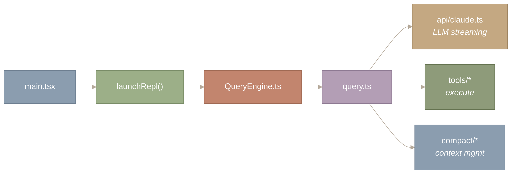
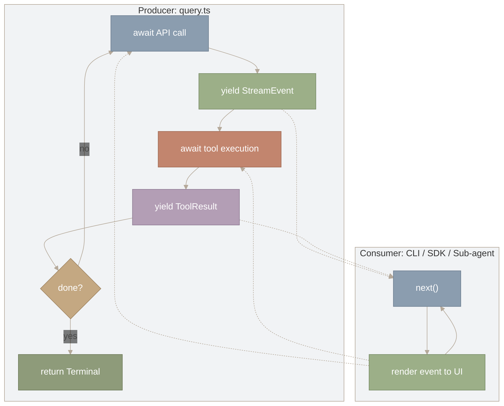
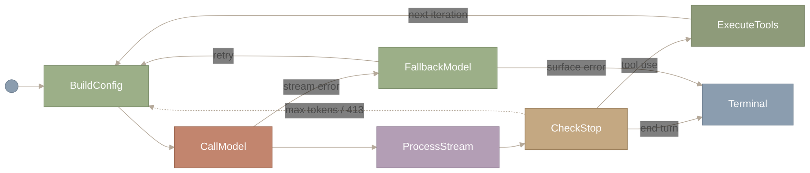
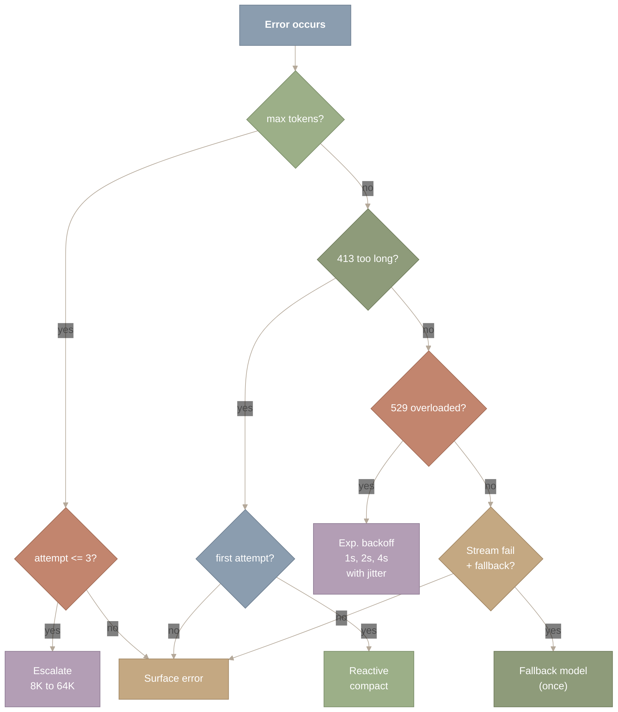
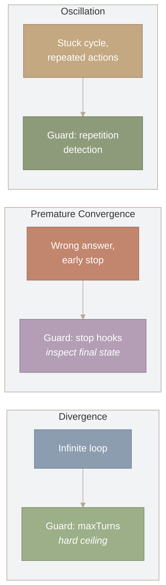
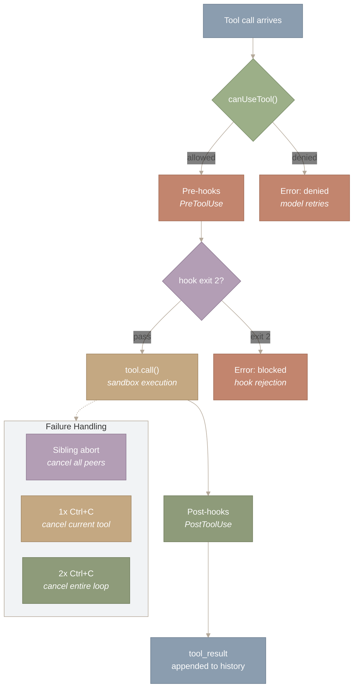

> 译者说明：本文按 2026-08-12 抓取的网页完整翻译，保留原始章节、代码、表格、Mermaid 图源、图注和链接。原文分析基于 Claude Code v2.1.88 的 Source Map；文件行数、工具数量、阈值和实现细节属于该页面快照，不应直接外推到其他版本。

# Agent Loop 与 QueryEngine

## 1. 引言：一个循环，一种抽象

**Claude Code 的整个 Agent Loop——流式输出、工具执行、错误恢复、上下文管理——都实现为单个异步生成器。本篇考察为什么选择这种设计、生成器抽象如何塑造架构，以及为什么大部分代码处理的是失败恢复而不是正常路径。**

与 Claude Code 的每一次交互——交互式终端、无头 SDK、后台子 Agent——都会流经 `query.ts` 中的 `query()`：一个 1,729 行的异步生成器，负责 API 流式传输、工具执行、上下文压缩、token 升级、模型回退和循环发散检测。异步生成器是一种协程：它向调用方产出（yield）流式事件，然后挂起，直到调用方准备好接收更多。这一个语言层面的选择带来了三个收益：无需缓冲的流式传输、无需手动流量控制的背压（backpressure），以及无需回调协调的组合。

在这个循环的状态机的七个状态中，有四个完全为处理失败而存在。要理解原因，需要审视整体架构：生成器抽象、它实现的状态机、错误恢复级联，以及并发模型。下图展示 `query.ts` 所处的位置：



*图 1：query.ts 在 Claude Code 调用链中的位置。主入口经过 REPL 和 QueryEngine（会话生命周期）进入 query.ts（ReAct 循环），后者分发到三个子系统：LLM 流式客户端、工具执行器和上下文压缩。QueryEngine 决定何时调用这个循环；query.ts 决定循环内部做什么。*

图中从左到右沿着箭头跟踪调用链。入口点（main.tsx）经过 launchRepl() 和 QueryEngine.ts 进入中心节点 query.ts。从 query.ts 分出三条分支，指向它编排的三个子系统：LLM 流式传输（api/claude.ts）、工具执行（tools/*）和上下文管理（compact/*）。关键区别在于：QueryEngine.ts 决定*何时*调用循环，而 query.ts 决定循环内部*做什么*。

`QueryEngine.ts` 管理会话生命周期——历史记录、System Prompt 组装、以及*何时*调用循环的决策。`query.ts` 是 Agent *思考*的地方。我们从生成器抽象讲起（第 2 节），然后看它实现的状态机（第 3 节），追踪策略注入机制（第 4 节），考察错误恢复（第 5-6 节），最后讨论并发与综合（第 7-8 节）。

**本文涉及的源文件：**

| 文件 | 用途 | 规模 |
| --- | --- | --- |
| `src/main.tsx` | CLI 入口点；路由到 REPL 和 QueryEngine | 约 800 行 |
| `src/query.ts` | 核心 Agent Loop——实现 ReAct 状态机的异步生成器 | 约 1,729 行 |
| `src/QueryEngine.ts` | 会话生命周期、历史管理、System Prompt 组装 | 约 500 行 |
| `src/services/api/claude.ts` | LLM 流式客户端（messages API、重试、限流） | 约 1,200 行 |
| `src/services/tools/` | 工具执行编排（分发、权限、Hook） | 约 6 个文件 |

---

## 2. 为什么是 AsyncGenerator？Agent Loop 的设计空间

**Agent Loop 有三个需求：（1）中间结果到达时就流式推给 UI，不让用户对着空白屏幕干等；（2）让消费方控制节奏，避免突发的大量工具结果压垮渲染器；（3）用同一份循环实现支持多个消费方（CLI、SDK、子 Agent）。** Claude Code 用一个 `AsyncGenerator` 同时满足了这三点。

普通的 `async function` 无法流式输出——调用方要等整个多轮交互全部完成才能看到任何东西。EventEmitter 可以流式输出，但生产方按自己的节奏运行；如果工具结果到达的速度超过 UI 渲染的速度，事件就会在内存中堆积。AsyncGenerator 用拉取（pull-based）协议同时解决了这两个问题：消费方调用 `next()` 请求下一个事件，生产方则*挂起*，直到这次调用到来。生成器不可能跑在消费方前面，因为在被请求之前，它在物理上无法产生下一个值。

这是实际的函数签名：

```
export async function* query(
  params: QueryParams,
): AsyncGenerator<
  StreamEvent | Message | ToolUseSummaryMessage,
  Terminal  // <-- return type: the final outcome
>
```

`function*` 和 `yield*` 是 TypeScript 中生成器和生成器委托的语法——如果不熟悉，直接把它们读作 `function` 和 `yield` 即可。核心思路是：在循环内部，代码 `await` 一次 API 调用，把流式 token `yield` 给消费方，`await` 工具执行，`yield` 工具结果，然后重复。在每个 `yield` 处，生成器冻结自己的整个栈帧——局部变量、循环计数器、当前状态——把控制权交给消费方。当消费方调用 `next()` 时，生成器从上次离开的位置精确恢复。代码读起来像普通的顺序循环，但它产出的是一个事件流。

产出的类型（`StreamEvent | Message | ...`）是 UI 实时渲染的中间事件。`Terminal` 返回类型携带最终结果——循环为什么结束、最后的状态是什么。消费方用 `for await...of` 在事件到达时处理它们：

```
const gen = query(params);
for await (const event of gen) {
  renderToUI(event);  // each event renders immediately
}
// gen.return contains the Terminal: why the loop ended
```

**为什么是生产者-消费者模式？** Agent Loop 只有一个生产方（调用 API 并执行工具的 `query()` 生成器），但有多个消费方需要同一条事件流：交互式 CLI 把 token 渲染到终端，无头 SDK 以编程方式收集结果，子 Agent 把事件转发给父级。生产者-消费者的拆分意味着循环逻辑只写一次，每个消费方按自己的节奏拉取事件。生成器在两次拉取之间挂起，所以慢消费方（比如在做高开销渲染的 CLI）会自然地拖慢生产方，不需要任何显式同步。



*图 2：AsyncGenerator 的生产者-消费者架构。左侧子图（Producer）从上到下读：query.ts 等待一次 API 调用，产出流式 token，等待工具执行，产出工具结果，然后检查任务是否完成——如果没有，就循环回到 API 调用。右侧子图（Consumer）是另一个独立循环：消费方调用 next() 拉取一个事件，渲染到 UI，然后再次调用 next()。虚线表示交接：生产方的每次 yield 把一个事件交给消费方，消费方的每次 next() 调用让生产方恢复运行。生产方在消费方拉取之前无法越过 yield 点前进——这就是背压的工作方式。*

把两个子图（Producer 和 Consumer）各自从上到下读作两个独立的循环。在 Producer 中，流程依次经过：await API 调用、yield StreamEvent、await 工具执行、yield ToolResult，以及一个 done? 检查——要么循环回去，要么返回 Terminal。在 Consumer 中，一个紧凑的循环反复调用 next() 并渲染每个事件。两个子图之间的虚线表示交接：每次 yield 把一个事件交付给消费方，每次 next() 调用让生产方恢复。生产方在消费方拉取之前无法越过 yield——这就是无需显式协调代码就能实现背压的方式。

这张图的关键在于两个子图之间的虚线。每条虚线箭头代表一次*交接*：当生产方 yield 时，它挂起，事件流向消费方；当消费方完成渲染并调用 `next()` 时，控制权流回生产方，生产方从上次离开的位置精确恢复。这种往返正是该架构基于拉取的原因——节奏由消费方决定，而不是生产方。如果 CLI 需要 50ms 渲染一个复杂 diff，生产方就等着。如果 SDK 能瞬时处理事件，生产方就全速运行。同一个循环，不同的节奏，零协调代码。

生成器委托（generator delegation）支持组合：外层的 `query()` 委托给 `queryLoop()`，而日志包装器可以在不修改这两个函数的情况下拦截每个产出的事件。一个循环，多个消费方，零代码重复。

---

## 3. ReAct 状态机：七个状态，三个走通

**生成器是机制，ReAct 状态机是它执行的逻辑。这个状态机有七个状态，但只有三个构成顺利路径（happy path）——其余四个完全是为错误恢复而存在的。**

经典的 ReAct 循环——LLM 在*推理*该做什么和*行动*调用工具之间交替——听起来很简单：思考、行动、观察、重复。在教科书里，这是三个状态。在生产环境中，你需要处理被截断的响应、溢出的上下文、崩溃的工具、过载的 API，以及原地打转的 Agent。每一种失败模式都会增加一个状态。

下面是完整的状态机，对应 `query.ts` 中的实现：



*图 3：包含七个状态的完整 ReAct 循环状态机。顺利路径（绿色节点）从左向右流动：BuildConfig、CallModel、ProcessStream、CheckStop、ExecuteTools，然后循环回到 BuildConfig。恢复路径（赭色）在流出错时分支到 FallbackModel，或在 max-tokens/413 错误时循环回去。七个状态中只有三个位于顺利路径上，其余四个负责错误恢复。*

图中左侧的黑点是起点，沿着实线箭头向右走就是顺利路径：BuildConfig 组装请求，CallModel 流式获取 API 响应，ProcessStream 收集响应，CheckStop 检查 `stop_reason`。如果模型想使用工具（`tool use`），流程向上进入 ExecuteTools，然后循环回到 BuildConfig 开始下一轮。如果模型发出完成信号（`end turn`），流程向右退出到 Terminal。虚线箭头是恢复路径：CallModel 的流错误会下落到 FallbackModel，在那里可以重试或把错误抛出来。CheckStop 处的 `max_tokens` 或 413 错误会循环回到 BuildConfig，用调整过的参数重试。只有三个状态（BuildConfig → CallModel → ProcessStream）在每一轮都会经过；其余四个只在出问题时才激活。

我们逐条路径跟踪这台状态机。

**BUILD CONFIG** 把当前环境——模型选择、thinking 配置、工具 schema、beta 头——快照成一个冻结的 `QueryConfig`。这个快照保证循环中途的变化（用户切换 plan mode、Feature Flag 更新）要到下一轮边界才生效。这和图形学里的双缓冲是同一个原理：正在运行的帧永远不会看到更新到一半的状态。

**CALL MODEL** 通过 `createMessage()` 向 Anthropic API 发起流式请求。响应以一系列 server-sent events（SSE）的形式到达——`message_start`、`content_block_delta`、`message_stop`——每一个事件都会被 yield 给调用方，用于实时渲染 UI。这正是 AsyncGenerator 拉取（pull-based）模型发挥作用的地方：每个 SSE 事件一到达就被 yield，然后生成器挂起，直到消费方准备好接收下一个。

**PROCESS STREAM** 把流式事件收集成一条完整的消息，交给决策点。

**CHECK STOP REASON** 是关键的分支节点。API 的 `stop_reason` 字段决定下一个状态：

- **`end_turn`**：模型认为自己完成了。运行 stop hook（检查是否过早终止的生命周期回调）。如果某个 hook 说“你忘了跑测试”，循环就继续。
- **`tool_use`**：模型想调用工具。执行这些工具（细节见第 7 节），把结果追加到对话中，继续。
- **`max_tokens`**：响应被截断。提高输出上限并重试。
- **error（413、529、流失败）**：路由到相应的恢复路径。

**FALLBACK MODEL** 在主模型的流失败时进入。如果配置了回退模型，循环切换到它并重试。如果回退模型也失败，错误就被抛给用户。

**TERMINAL** 是吸收态。它携带循环结束的原因和最终消息。

关键的结论——也是推动接下来两节的结论——是：七个状态里有四个是*恢复*状态。顺利路径只有 BUILD CONFIG、CALL MODEL、PROCESS STREAM、CHECK STOP、EXECUTE TOOLS，再回到 BUILD CONFIG。状态机的其余部分之所以存在，是因为**生产系统花在从失败中恢复上的时间，比花在执行顺利路径上的时间更多**。这就是系统设计中的冰山原则——可见的逻辑只是水面上的尖，错误处理才是水下的主体。

恢复状态越多，需要测试的代码路径就越多，可能的状态转移也越多。Claude Code 接受这份复杂度，因为一个遇到 413 错误就崩溃的 Agent 毫无用处。另一种选择——一个失败就直接崩溃的简单循环——是把恢复的负担转嫁给用户。`query.ts` 的 1,729 行代码，就是不向用户展示不可恢复崩溃的代价。

不过，状态机的行为并不是固定的。不同的执行上下文（交互式 CLI、无头 SDK、plan mode）需要不同的策略。下一节考察让这一切成为可能的注入机制。

---

## 4. QueryParams 契约：把策略与机制分离

**状态机的行为随上下文变化——交互式与无头、宽松与受限、主模型与回退模型。Claude Code 没有在循环里撒满 `if` 语句，而是通过一个单一的参数对象注入所有策略变化。**

`QueryParams` 类型携带循环开始执行所需的一切。这里不罗列全部 13 个字段，只列出最能体现设计原则的五个：

```
export type QueryParams = {
  messages: Message[]        // conversation history (compactable)
  tools: ToolUseContext      // available capabilities (dynamic per mode)
  canUseTool: CanUseToolFn   // permission policy (injected, not hardcoded)
  maxTurns?: number          // iteration budget (prevents runaway)
  fallbackModel?: string     // resilience policy (switch on failure)
  // ... 8 more fields for streaming, caching, budget, hooks
}
```

注意 `canUseTool` 是一个*函数*，而不是数据。它接收一个工具名，返回该工具是否被允许。这种函数作为参数的设计意味着权限策略与循环完全解耦。Plan mode 注入一个阻止所有写工具的 `canUseTool`。Auto-accept mode 注入一个放行一切的版本。自定义配置注入它们自己的版本。循环不知道、也不关心自己正在执行的是哪一套策略。

这就是应用在 Agent 编排上的 Strategy 模式（策略模式）。循环是上下文，注入的函数是可互换的策略。同一个循环在交互式 CLI、无头 SDK 和后台会话中以完全相同的方式运行——因为变化的行为存在于注入的参数里，而不是循环本身里。

类似地，`querySource` 标识*谁*发起了这次查询：`user`、`compact`、`session_memory`，或者 `subagent`。循环用它来防止递归行为——一次压缩（compaction）查询不应触发进一步的压缩。这是针对控制流的依赖注入：调用方告诉循环自己是什么，循环据此调整行为，而不必对模式标志做分支判断。

它与状态机的联系很直接：状态机中每一个依赖上下文的转移——是否尝试压缩、是否允许某个工具、失败后是否重试——都从 `QueryParams` 读取，而不是从环境状态读取。生成器机制是纯粹的，策略是注入的。正是这种分离，让一个 1,729 行的函数能服务所有执行模式，而不至于蔓延出大量条件分支。

Strategy 模式——定义一族算法（权限策略），把每一个封装起来（封装成函数），并让它们可以互换。GoF 的书（1994）用类来描述它；现代 TypeScript 用高阶函数实现。同样的洞见，更轻的语法。

**深入：完整的 QueryParams 与循环状态**

完整的 `QueryParams` 类型还包括这些字段：system prompt（`SystemPrompt`，一个不透明的 branded type）、user/system 上下文字典、查询来源标识、输出 token 覆盖、任务预算，以及缓存控制标志。

在循环内部，这些字段被解构为可变状态：

```
type State = {
  messages: Message[]
  toolUseContext: ToolUseContext
  autoCompactTracking: AutoCompactTrackingState | undefined
  maxOutputTokensRecoveryCount: number       // guards against infinite escalation
  hasAttemptedReactiveCompact: boolean       // guards against compaction loops
  turnCount: number                          // iteration counter
  transition: Continue | undefined           // WHY did the previous turn continue?
  stopHookActive: boolean | undefined        // prevents stop hook re-entrancy
  pendingToolUseSummary: Promise<...> | undefined
}
```

`transition` 字段尤其巧妙。它记录上一轮迭代*为什么*选择继续——是一次工具调用？一次 max-tokens 恢复？还是一次 stop hook 注入？这让当前迭代能根据上一轮的结果调整自己的行为，而不需要一个带命名状态的显式有限状态机。它是一个嵌在单个字段里的隐式状态机。

机制（AsyncGenerator）、逻辑（状态机）和配置（QueryParams）都已经确立，现在我们可以转向那个占据循环行数大头的问题：出错时会发生什么？

---

## 5. 错误恢复：优雅降级的实现

状态机的七个状态中，有四个专门负责恢复。把它们放在一起看，会发现 Claude Code 借用了分布式系统里常见的级联恢复思路。

回想一下分布式系统中的错误恢复。当一台 Web 服务器过载时，它不会直接拒绝所有请求，而是先卸载负载、带退避地重试、回退到缓存响应，最后才返回一个降级响应。Claude Code 把同样的思路用在了自己的 Agent Loop 上——五条恢复路径，按代价从低到高排列。



*图 4：错误恢复决策树，五条恢复路径按代价排序。max-tokens 错误触发输出上限升级（8K 升到 64K，最多尝试 3 次）；HTTP 413 触发被动压缩（仅一次）；HTTP 529 触发带抖动的指数退避；流式传输失败触发一次性的模型回退。每条路径都有明确的防重试循环保护；若恢复失败，所有路径最终都收敛到“向用户报错”。*

看图方式：从顶部的“Error occurs”（发生错误）节点出发，沿决策树向下走。每个菱形按优先级依次检查一种错误类型：max tokens、413 too long、529 overloaded，最后是流式传输失败。在每个判断点，“yes”分支通向一个有界的恢复动作（升级、压缩、退避或回退），“no”分支则落入下一项检查。每条恢复路径都有明确的保护（尝试计数或布尔标志），重试耗尽后都会导向“Surface error”（向用户报错）。要点在于：没有任何一条恢复路径会无限循环。

**Max-tokens 恢复**处理被截断的响应。当模型生成的长代码块超出默认的 8,192 token 输出上限时，循环会把上限升级到 64,000 token 并重试。一个计数器把这种重试限制在三次以内。大多数截断在第一次重试时就能解决——默认上限对那一条特定响应来说只是过于保守了。计数器是必不可少的：没有它，一个总是生成最大长度输出的模型会无限升级下去。

被动压缩（HTTP 413）处理溢出的上下文。413 表示整个请求超过了 API 的上下文窗口。典型场景是某个 Tool 返回了出乎意料的大输出——比如 cat 了一个二进制文件、读了一份巨大的日志。循环会尝试压缩对话历史（完整的压缩机制见 [第三部分第 1 节](https://y-agent.github.io/inside-claude-code/04-context-compaction.html)）。一个布尔标志（`hasAttemptedReactiveCompact`）只允许尝试一次。单次尝试的保护至关重要：压缩本身要消耗 token，如果压缩后的结果仍然太大，继续重试压缩就会永远循环下去。

**退避重试**（HTTP 529）处理 API 过载。指数退避从约一秒开始，逐步增长到约三十秒，并加入抖动以避免惊群效应。

模型回退处理持续性的流式传输失败。如果主模型的流在生成中途失败，且配置了回退模型，循环就切换到回退模型。关键的安全措施在这行代码里：

```
yield* queryModelWithStreaming({
  ...options,
  model: params.fallbackModel,
  fallbackModel: undefined,  // <-- prevents infinite fallback chain
})
```

在递归调用上设置 `fallbackModel: undefined` 就是这里的熔断器。没有它，一个同样失败的回退模型会触发又一次回退，形成无限级联。注意这里 `yield*` 的用法——组合后的生成器委托给回退调用，消费方看到的是一条无缝的事件流，无论事件实际由哪个模型产出。这正是 AsyncGenerator 可组合性的体现。

每条恢复路径都遵循同一个元模式：尝试一次（或有界的若干次），防止循环，全部失败就向用户报错。这正是微服务架构中熔断器的工作方式（由 Netflix 的 Hystrix 推广开来）：熔断器监控失败情况，超过阈值后跳闸，阻止系统反复敲打一个已经坏掉的依赖。恢复路径处理的是瞬时故障——那些可以通过重试、压缩或切换模型来解决的错误。但还有一种更隐蔽的故障模式：从不报错却也从不结束的 Agent。下一节处理这个问题。

---

## 6. 死循环检测器：停机问题的工程实践

即使有稳健的错误恢复，循环仍然可能发散——不崩溃地空转、重复同样的动作，或者拒绝停下来。Claude Code 使用三种启发式方法，各自针对一种不同的故障模式：



*图 5：迭代计算的三种故障模式——发散、过早收敛和振荡——分别配对对应的防护机制。发散（无限循环）由 maxTurns 硬上限拦截；过早收敛（答错了但提前停下）由检查最终状态的 stop hook 拦截；振荡（原地打转的循环）由重复检测拦截。每种防护都带有自己的显式界限，以防止“元发散”。*

看图方式：三个子图各自把一种故障模式（左侧节点）与对应的防护（右侧节点）配对，每个子图从左往右读：发散（无限循环）由 maxTurns 拦截，过早收敛（答错了但提前停下）由 stop hook 拦截，振荡（原地打转的循环）由重复检测拦截。三个子图相互独立又彼此互补——合起来覆盖了迭代计算无法产出正确结果的三种方式。

**启发式一：轮次计数（发散防护）。** `maxTurns` 参数为循环迭代次数设置硬上限。这是一个看门狗定时器——最简单也最可靠的终止保证。默认值给得很宽松（几十轮），但无论成因是什么，它都能拦住任何形式的失控执行。它的简单正是它的力量：不管 Agent 怎么出岔子，计数器最终都会触发。

**启发式二：Stop Hook（收敛防护）。** 当模型说“我做完了”（`end_turn`）时，Claude Code 会运行检查最终状态的生命周期回调。一个 stop hook 可能会检查：“你是不是改了测试文件却一次都没跑过测试？”如果 hook 检测到提前停止，它会注入一条错误消息，循环继续运行。一个计数器防止 stop hook 无限触发——没有这道保护，一个永远拒绝放行的 stop hook 自己就会制造一个无限循环。这是第 5 节那条有界重试原则的元层应用：每一个恢复机制，包括负责检查是否过早停止的那个，都必须有显式的界限。

**启发式三：重复检测（振荡防护）。** 如果 Agent 用同样的参数多次重复同一个工具调用，它很可能卡在了一个循环里。主循环跟踪最近的工具调用记录，可以通过注入一条“你似乎在重复自己”的提示来打破循环。这是最隐蔽的故障模式：Agent 看上去在推进——它在调用工具、在生成响应——但它只是在同一组状态之间打转。

三种启发式互为补充。轮次计数不问成因，拦住一切发散。Stop hook 拦住轮次计数会漏掉的过早收敛（Agent“成功地”停下了，但停在错误的结果上）。重复检测拦住前两者都不会标记的振荡（Agent 既不发散也不收敛——它在打转）。三者合起来，为“使用工具的 Agent”这个特定领域近似构造了一个停机判定器。

图灵在 1936 年证明了不存在能判定任意程序是否停机的算法。一个围绕工具调用循环的 AI Agent 正是这样的程序——你无法在一般意义上保证它终止。但你可以在工程上绕开它。轮次上限处理发散（无限循环），stop hook 处理收敛到错误答案（过早终止），重复检测处理振荡（卡在循环里）。这三种启发式合起来覆盖了迭代计算的三种故障模式——而且每一种都有显式界限，防止它自己变成问题。

死循环检测器回答的是宏观问题：循环会不会终止。下一节转向微观问题：在单次迭代内部，工具是如何被分发和执行的？

---

## 7. 流式与工具执行：只在安全的地方并发

**在每一轮循环迭代中，模型可能会请求多个工具调用。StreamingToolExecutor 把工具执行与模型生成重叠起来，使用读写者（readers-writers）并发模型：读操作并行，写操作串行。**

StreamingToolExecutor 是一项关键优化。当模型的流式响应中包含多个工具调用时，执行器不会等整个响应结束。只要某个工具调用的输入 JSON 完整了（`content_block_stop`），就开始执行——哪怕后续的工具调用还在流式输出中。

```mermaid
%%{init: {'theme': 'neutral', 'flowchart': {'useMaxWidth': false, 'htmlLabels': true, 'padding': 20, 'nodeSpacing': 30, 'rankSpacing': 40}, 'themeVariables': {'primaryColor': '#8B9DAF', 'primaryTextColor': '#ffffff', 'primaryBorderColor': '#6E7F91', 'secondaryColor': '#9CAF88', 'secondaryTextColor': '#ffffff', 'secondaryBorderColor': '#7A8D68', 'tertiaryColor': '#C2856E', 'tertiaryTextColor': '#ffffff', 'tertiaryBorderColor': '#A06A54', 'lineColor': '#B5A99A', 'textColor': '#4A4A4A', 'mainBkg': '#8B9DAF', 'nodeBorder': '#6E7F91', 'clusterBkg': 'rgba(139,157,175,0.12)', 'clusterBorder': '#B5A99A', 'edgeLabelBackground': 'transparent'}}}%%
gantt
  title Streaming Tool Execution Timeline
  dateFormat X
  axisFormat %s s

  section Model Stream
    tool 1 JSON         :a1, 0, 3
    tool 2 JSON         :a2, 3, 5
    tool 3 JSON         :a3, 5, 8

  section Parallel Reads
    Read(a.ts)          :b1, 3, 6
    Grep(*.ts)          :b2, 4, 7
    Glob(src/)          :b3, 5, 7

  section Sequential Writes
    Edit(b.ts)          :crit, c1, 8, 11
    Bash(test)          :crit, c2, 11, 15
```



*图 6：流式工具执行时间线，展示三个并发阶段。模型流（顶部）增量地输出工具调用 JSON。只读工具（Read、Grep、Glob）在各自 JSON 完整的瞬间就开始执行，并行运行。有副作用的工具（Edit、Bash）在并行批次之后串行执行，每一个都要等前一个结束。与顺序执行相比，这种重叠能节省 30-50% 的墙钟时间。*

图中时间从左向右流动，分为三条泳道。顶部泳道（Model Stream）展示工具调用 JSON 被增量输出。中间泳道（Parallel Reads）展示三个只读工具在各自 JSON 完成时启动，并发运行、时间上相互重叠。底部泳道（Sequential Writes）展示有副作用的工具一个接一个地运行（以红色标记为关键路径），每一个都等待前一个完成。这张图的重点是节省下来的时间：读操作彼此重叠、也与模型流重叠，而写操作串行——这就是读写者并发模型的实际运作方式。

并发规则简单而保守：

- **只读工具**（Read、Grep、Glob、WebFetch）共享一个并行池。三个文件读取可以同时启动。
- **有副作用的工具**（Write、Edit、Bash）获取独占访问权。先编辑文件再跑测试，必须保持先后顺序。

这就是并发编程中的读写者问题——一个经典的同步难题：多个读者可以同时访问同一资源，但写者需要独占访问。Claude Code 用一个并发信号量来解决它：读者共享锁，写者独占获取锁。

这里与 AsyncGenerator 抽象的关联很重要。每个工具结果在完成时就被 yield 回消费方。由于生成器是拉取式（pull-based）的，消费方按自己的节奏处理结果——一个快速的终端可以随到随渲染，而一个较慢的消费方（比如网络中转、测试框架）会自然地施加背压（backpressure）。生成器不需要知道自己服务的是哪个消费方。

任何工具在执行之前，都要经过一条权限流水线：先过 `canUseTool()`（第 4 节提到的注入式策略函数），然后是 pre-tool hooks（可以检查或修改输入的生命周期回调），然后是实际执行，最后是 post-tool hooks。这条流水线按工具逐个运行，即使在并行池内也不例外——所以某个只读工具被权限拒绝，不会阻塞其他工具。



*图 7：单个工具的权限流水线与失败处理。每个工具调用经过四个阶段：canUseTool（策略检查）、pre-hooks（生命周期回调）、tool.call（沙箱中的实际执行）、post-hooks（观察/日志）。在 canUseTool 处被拒绝，或被 pre-hooks 阻断，都会短路为一个错误结果，工具不会执行。当多个工具并发运行而其中一个失败时，sibling abort 会取消所有同伴。用户中断遵循工具的 interruptBehavior 标志：标记为 cancel 的工具立即中止，标记为 block 的工具先执行完。*

沿正常路径从上到下看：一个工具调用到达，经过 `canUseTool()`（注入的策略），跑过 pre-hooks，在沙箱中执行，跑 post-hooks，最后产出一个 `tool_result`。有两条短路路径向左分出：来自 `canUseTool()` 的拒绝，或来自 pre-hook 的阻断（退出码 2），会完全跳过执行，直接向模型返回错误。从 `tool.call()` 指向 Failure Handling 子图的虚线箭头展示了执行中途出错时会发生什么：sibling abort 取消所有并发同伴，单击 Ctrl+C 只取消当前工具，双击 Ctrl+C 取消整个 Agent Loop。

当多个工具并发执行、其中一个失败时，Claude Code 实现了 sibling abort：所有正在并发执行的工具都会收到取消信号，它们的结果被替换为错误消息。用户中断（Ctrl+C）的工作方式类似——一次中断取消当前工具并让 Agent 继续；快速连续两次中断则取消整个循环。

对于一个典型的轮次——三次文件读取加一次编辑——与完全顺序执行相比，流式执行能节省 30-50% 的墙钟时间。读操作彼此重叠，也与模型的继续流式输出重叠。只有写操作需要串行。

并行的只读工具是安全的，因为它们没有副作用。但那些*看起来*只读、却有隐藏依赖的工具怎么办——比如读取一个即将被另一个并发工具编辑的文件？Claude Code 通过在工具级别（而非调用级别）做分类来回避这个问题：一个工具要么永远可以并行执行，要么永远串行。这很保守，但正确——而且远比按调用逐个分析要容易推理。

---

## 8. 综合分析：AsyncGenerator 这一选择如何支撑一切

前面谈到的状态机、错误恢复、策略注入和并发 Tool 执行，并不是几块偶然拼在一起的功能。它们都建立在同一个选择上：用 AsyncGenerator 来组织循环。

选择 AsyncGenerator，并不只是实现时图方便。后面的许多设计都依赖它：

**状态机写在生成器的控制流里。** ReAct 状态机的七个状态（第 3 节）并没有被写成显式的状态枚举和转移表，而是藏在生成器的线性流程中：`while (true) { buildConfig(); callModel(); processStream(); checkStop(); }`。每个 `yield` 点都是一道状态边界。生成器会在两次 yield 之间保留栈帧，局部变量、标志位和计数器也就能自然延续，不必另存到外部。若改用 EventEmitter，循环还得自行保存这些跨事件状态；生成器本身已经替它做了这件事。

**错误恢复通过 `yield*` 组合。** 模型回退机制（第 5 节）通过 `yield*` 委托给一个新的生成器调用。无论事件是由主模型还是回退模型产生，消费方看到的都是一条无缝的事件流。恢复路径对消费方是不可见的——在回调或 EventEmitter 架构中，要做到这一点必须显式地转发事件。

**策略注入之所以可行，是因为生成器是一个闭包。** `QueryParams` 契约（第 4 节）在 `query()` 被调用时被捕获进生成器的闭包。此后生成器内部的每个 `yield` 和 `await` 都能访问同一组参数。这比把配置沿事件链传递、或存放在共享可变状态里更简单，也更不容易出错。

**并发 Tool 执行以增量方式产出结果。** 流式 Tool 执行器（第 7 节）在每个 Tool 结果完成时立即将其 yield 出去。由于生成器是拉取式（pull-based）的，消费方可以按自己的节奏处理结果，背压（backpressure）是自动产生的。在推送式（push-based）架构中，当并发 Tool 集中完成形成突发流量时，就需要显式的缓冲来避免压垮处理较慢的消费方。

**死循环检测器在 yield 边界上工作。** 每次生成器 yield 并恢复（第 6 节）时，循环都可以检查其终止条件：轮次计数、重复历史、停止 Hook 的状态。`yield` 点是进行这些检查的天然位置，因为它是两次迭代之间的边界——而生成器把这个边界显式地写进了代码结构里。

总结来看，`query.ts` 的 1,729 行实现了一个生产级 Agent Loop，处理七种状态、五条恢复路径、三种终止启发式规则以及一个并发 Tool 执行器——全部由同一个异步生成器统一起来。生成器提供的并不仅仅是流式输出。它提供的是让这套循环的复杂度可控的结构骨架：为状态机提供线性控制流，为策略注入提供闭包，为恢复组合提供 `yield*`，为安全并发提供拉取式背压。顺利路径（happy path）大概只有 200 行，剩下的 1,500 行恢复逻辑才是真正的产品——而正是生成器这一抽象让它们保持了可读性。

---

*本系列下一篇：[Part III.1: Prompt Assembly Pipeline](https://y-agent.github.io/inside-claude-code/03-prompt-assembly.html)，我们将在其中考察 Claude Code 如何用 250 多个片段组装出 System Prompt——也就是在循环开始之前就对模型进行编程的上下文工程。随后的 [Part II.3: Multi-Agent Orchestration](https://y-agent.github.io/inside-claude-code/07-multi-agent-orchestration.html) 将介绍循环如何派生子 Agent——五种类型，从廉价的只读探索者到持续存在的队友。*
