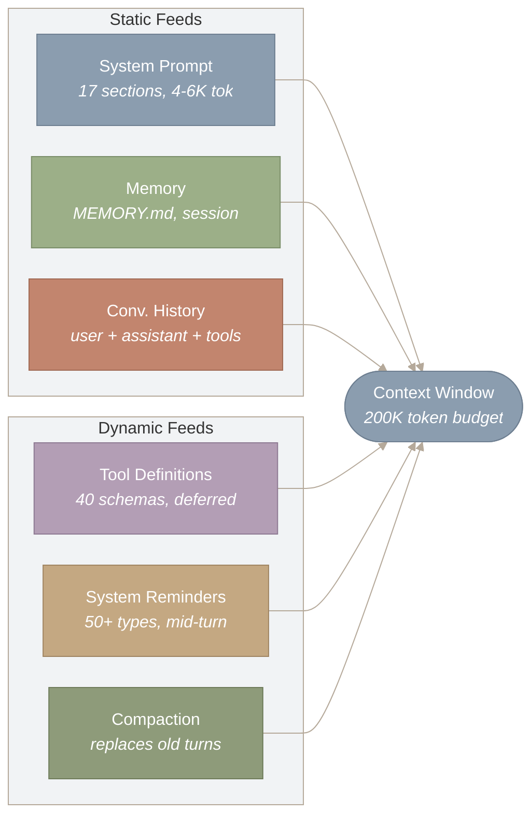
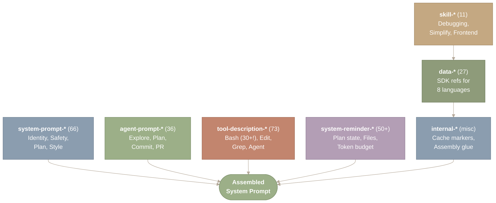
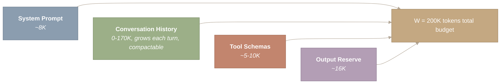
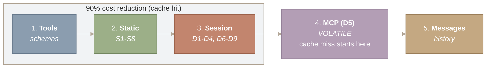
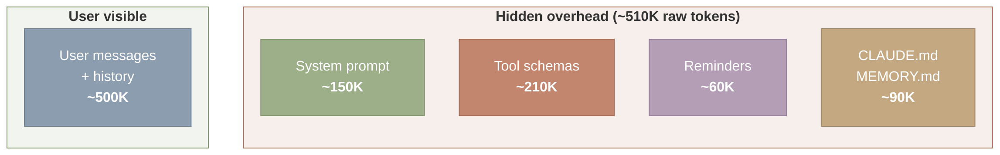
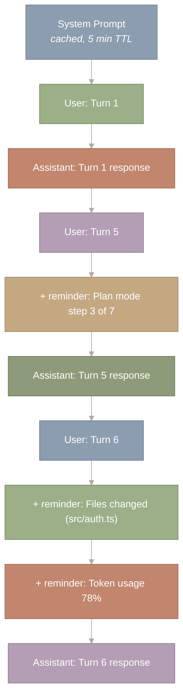

# Prompt Assembly Pipeline

## Context Engineering Overview

This post opens the Context Engineering section of the series. Four subsystems jointly determine what the model sees in every API call: prompt assembly (this post), context compaction (Part III.2), memory hierarchy (Part III.3), and hooks and notifications (Part III.4). The figure below shows how each subsystem contributes to the final context window at each turn of the agent loop.



*Figure 1: What feeds into the context window at each agent turn. Three static feeds (system prompt at 4-6K tokens, memory files, and conversation history) and three dynamic feeds (40 tool schemas with deferred loading, 50 system reminder types injected mid-turn, and compaction summaries that replace old turns) compete for a shared 200K-token budget.*

**How to read this diagram.** Six source nodes feed into a single Context Window node on the right. The left subgraph contains three static feeds (System Prompt, Memory, Conversation History) and the right subgraph contains three dynamic feeds (Tool Definitions, System Reminders, Compaction). All six arrows converge on the 200K-token budget, illustrating the competition for a shared, finite resource. The key insight is that every feed consumes tokens from the same pool – a larger system prompt means less room for conversation history, and vice versa.

**Source files covered in this post:**

| File | Purpose | Size |
| --- | --- | --- |
| `src/constants/prompts.ts` | 403 prompt string templates (~728 KB of text) | ~18,000 LOC |
| `src/constants/system.ts` | System prompt prefixes and static fragments | ~500 LOC |
| `src/utils/systemPrompt.ts` | System prompt assembly pipeline | ~400 LOC |
| `src/utils/claudemd.ts` | CLAUDE.md discovery and parsing (walks directory tree) | ~600 LOC |
| `src/utils/messages.ts` | Message normalization and system reminder injection | ~1,500 LOC |
| `src/utils/tokens.ts` | Token counting and budget estimation | ~300 LOC |
| `src/skills/` | 11 built-in skills (bundled prompt fragments) | ~4,066 LOC |

---

## Introduction: Why Prompt Assembly Matters

You type “Fix the login bug in auth.py” and press Enter. Before the model reads a single token of your request, a middleware pipeline assembles approximately **65 prompt fragments** into a single system prompt, budgets them against a 200K-token context window, and arranges the result to maximize server-side cache hits. The model never sees the machinery — only the finished product.

This post advances a single thesis: **the system prompt is not a static string but a runtime composition, and every design decision in its assembly pipeline is a response to the fundamental scarcity of the context window.** The context window is finite. Every token spent on overhead is a token unavailable for reasoning. Fragment-based assembly, conditional inclusion, static/dynamic partitioning, prompt caching, and mid-conversation injection are all techniques for maximizing behavioral guidance within a fixed budget.

The pipeline is an instance of two classical patterns working in concert: the **builder pattern**, where each stage adds a piece to an immutable request object and the final `build()` step produces the API call, and the **pipeline pattern**, where each stage transforms and passes data downstream without awareness of the full chain. Understanding this pipeline is essential context for the [agent loop](https://y-agent.github.io/inside-claude-code/02-agent-loop-query-engine.html) that consumes its output, the [compaction system](https://y-agent.github.io/inside-claude-code/04-context-compaction.html) that manages budget overflow downstream, and the [multi-agent orchestrator](https://y-agent.github.io/inside-claude-code/07-multi-agent-orchestration.html) that assembles dramatically different prompts for each sub-agent type.

---

## The Assembly Pipeline

**The prompt assembler gathers fragments from eight sources, orders them into 17 sections, and emits a typed `SystemPrompt` object. The entire process is shaped by a single constraint: the token budget.**

When the `QueryEngine` prepares an API call, it constructs the system prompt through a layered process. It begins with a fixed prefix:

```
const DEFAULT_PREFIX = "You are Claude Code, Anthropic's official CLI for Claude."
```

Then it layers on sections in a specific order. The 17 sections split into two groups: eight static sections (computed once per session, invariant across turns) and nine dynamic sections (recomputed per turn or per session). The split is not organizational convenience — it is a cost optimization that determines where the cache boundary falls.

```mermaid
%%{init: {'theme': 'neutral', 'flowchart': {'useMaxWidth': false, 'htmlLabels': true, 'padding': 20, 'nodeSpacing': 30, 'rankSpacing': 40}, 'themeVariables': {'primaryColor': '#8B9DAF', 'primaryTextColor': '#ffffff', 'primaryBorderColor': '#6E7F91', 'secondaryColor': '#9CAF88', 'secondaryTextColor': '#ffffff', 'secondaryBorderColor': '#7A8D68', 'tertiaryColor': '#C2856E', 'tertiaryTextColor': '#ffffff', 'tertiaryBorderColor': '#A06A54', 'lineColor': '#B5A99A', 'textColor': '#4A4A4A', 'mainBkg': '#8B9DAF', 'nodeBorder': '#6E7F91', 'clusterBkg': 'rgba(139,157,175,0.12)', 'clusterBorder': '#B5A99A', 'edgeLabelBackground': 'transparent'}}}%%
flowchart TD
  subgraph STATIC["Static (cached)"]
    S1["S1: Identity"]
    S2["S2: Tool Policy"]
    S3["S3: Anti-Patterns"]
    S4["S4: Reversibility"]
    S5["S5: Tool Rules"]
    S6["S6: Efficiency"]
    S7["S7: Tone"]
    S8["S8: Cache Control"]
  end

  S1 --> S2 --> S3 --> S4 --> S5 --> S6 --> S7 --> S8

  BOUNDARY["- - - cache boundary - - -"]

  S8 --> BOUNDARY

  subgraph DYNAMIC["Dynamic (per-turn)"]
    D1["D1: Memory"]
    D2["D2: Environment"]
    D3["D3: Language"]
    D4["D4: Output Style"]
    D5["D5: MCP"]
    D6["D6: Scratchpad"]
    D7["D7: Fork Config"]
    D8["D8: Summarize"]
    D9["D9: Brief Mode"]
  end

  BOUNDARY --> D1
  D1 --> D2 --> D3 --> D4 --> D5 --> D6 --> D7 --> D8 --> D9

  D9 --> OUT["<b>SystemPrompt</b>"]
  style S1 fill:#8B9DAF,color:#fff,stroke:#6E7F91
  style S2 fill:#9CAF88,color:#fff,stroke:#7A8D68
  style S3 fill:#C2856E,color:#fff,stroke:#A06A54
  style S4 fill:#B39EB5,color:#fff,stroke:#8E7A93
  style S5 fill:#C4A882,color:#fff,stroke:#A08562
  style S6 fill:#8E9B7A,color:#fff,stroke:#6E7B5A
  style S7 fill:#8B9DAF,color:#fff,stroke:#6E7F91
  style S8 fill:#9CAF88,color:#fff,stroke:#7A8D68
  style BOUNDARY fill:#C2856E,color:#fff,stroke:#A06A54
  style D1 fill:#B39EB5,color:#fff,stroke:#8E7A93
  style D2 fill:#C4A882,color:#fff,stroke:#A08562
  style D3 fill:#8E9B7A,color:#fff,stroke:#6E7B5A
  style D4 fill:#8B9DAF,color:#fff,stroke:#6E7F91
  style D5 fill:#9CAF88,color:#fff,stroke:#7A8D68
  style D6 fill:#C2856E,color:#fff,stroke:#A06A54
  style D7 fill:#B39EB5,color:#fff,stroke:#8E7A93
  style D8 fill:#C4A882,color:#fff,stroke:#A08562
  style D9 fill:#8E9B7A,color:#fff,stroke:#6E7B5A
  style OUT fill:#8B9DAF,color:#fff,stroke:#6E7F91
```



*Figure 2: The 17-section assembly pipeline. Static sections S1-S8 (Identity, Tool Policy, Anti-Patterns, Reversibility, Tool Rules, Efficiency, Tone, Cache Control) form a cacheable prefix that is byte-identical across turns. Dynamic sections D1-D9 (Memory, Environment, Language, Output Style, MCP, Scratchpad, Fork Config, Summarize, Brief Mode) are appended after the cache boundary. The dashed boundary marks the cache breakpoint; everything above it qualifies for 90% cost reduction.*

**How to read this diagram.** Follow the flow top to bottom through 17 numbered sections. The upper subgraph (Static) contains sections S1 through S8, connected in order. A dashed cache boundary separates them from the lower subgraph (Dynamic), which contains sections D1 through D9. The flow terminates at the SystemPrompt output node. Everything above the cache boundary is byte-identical across turns and qualifies for 90% cost reduction via prompt caching; everything below is recomputed per turn.

The version tags visible in the minified source (vr9, Tr9, kr9, etc.) reveal revision history. The identity section `vr9` has been through nine revisions — each presumably tested against evaluation suites for behavioral regressions. Prompt engineering at this scale requires the same discipline as code: version control, regression testing, and careful rollout.

The result is typed as an opaque `SystemPrompt` — a deliberate design choice. TypeScript’s type system prevents accidental concatenation or mutation downstream. You cannot pass a raw string where a `SystemPrompt` is expected.

---

## Fragment Taxonomy: The Eight Categories

**Every prompt fragment belongs to one of eight categories, each corresponding to a different lifecycle and a different position in the assembly order.**

Instead of a single monolithic system prompt, Claude Code scatters its instructions across approximately 250 individual prompt fragments in eight categories. These fragments are template literals, conditional blocks, and dynamically generated strings spread throughout the codebase. They are selected, ordered, and composed based on context: Is this the main agent or a sub-agent? Is plan mode active? Has compaction occurred? Are MCP servers connected?

This is not accidental complexity. It is a compiler for behavior: source fragments are selected, assembled, optimized for caching, and delivered to the model as a single prompt. The total assembled size ranges from 15 KB to 25 KB — a substantial portion of the input token budget.



*Figure 3: The eight fragment categories with approximate counts, converging into a single assembled system prompt. system-prompt-* (66 fragments) covers identity and safety; tool-description-* (73 fragments) is the largest category, with Bash alone requiring 30+; system-reminder-* (50+ fragments) handles mid-conversation injection; data-* (27 fragments) injects SDK reference docs for 8 languages as just-in-time prompt components – the surprise category.*

**How to read this diagram.** Each labeled box represents one of the eight fragment categories, with its count in parentheses. All categories flow into the central Assembled System Prompt node at the bottom right. The top four categories (system-prompt, agent-prompt, tool-description, system-reminder) feed directly into the output, while skill, data, and internal chain through each other first – reflecting their dependency order. The largest category by far is tool-description (73 fragments), with Bash alone accounting for 30+, underscoring how much of the prompt budget goes to tool instructions.

Three categories deserve closer examination.

**`tool-description-*`** (73 fragments) is the largest category. BashTool alone requires 30+ fragments covering sandbox restrictions, git safety, sleep avoidance, command descriptions, and mode-specific rules. Each tool’s description becomes part of the `tools` parameter in the API call, meaning these fragments are not documentation — they are active instructions on every turn. The volume is proportional to risk: Bash has the most fragments because it has the most potential for damage. See [Part IV.1: Tool System](https://y-agent.github.io/inside-claude-code/05-tool-system.html) for the full tool architecture.

**`system-reminder-*` (50 fragments)** are the dynamic injection mechanism. Unlike system prompt fragments (which appear once at the beginning), reminders are inserted throughout the conversation to reinforce context mid-session. We examine these in the system reminders section below.

**`data-*` (27 fragments)** is the surprise. These are not prompts at all — they are SDK reference documentation for Python, TypeScript, Go, C#, Java, Ruby, PHP, and cURL. When a user asks Claude Code to write Anthropic SDK code, the relevant `data-*` fragment is injected as just-in-time reference material. This is a clever repurposing of the fragment system: it treats documentation as a prompt component.

### Why Fragments Instead of One Big String?

A monolithic system prompt would be simpler to maintain but impossible to conditionally compose. The fragment approach has three advantages that connect directly to the token budget constraint:

1. **Conditional inclusion.** Plan mode does not need all 73 tool fragments. Sub-agents get stripped-down prompts. Fragments can be toggled by feature flags. Every excluded fragment saves tokens for conversation history.
2. **Independent versioning.** Each fragment evolves independently. The diff between v2.1.81 and v2.1.88 shows fragments being added, removed, and reworded with nearly every release — without touching the assembly logic.
3. **Cache-friendly boundaries.** Fragments that do not change between turns can be placed in a single cacheable block, reducing redundant processing.

The trade-off is real: hundreds of pieces to maintain, with ordering dependencies and the possibility of conflicting instructions across fragments. This is the classic flexibility-versus-simplicity trade-off in any template system. But given the context window constraint, the ability to conditionally include only what is needed outweighs the maintenance cost.

---

## CLAUDE.md Discovery: Project Instructions as Prompt Fragments

**Two sources feed dynamic context into the assembly. User context collects project-specific data; system context adds runtime state. Both are memoized because they do not change between turns.**

The most visible dynamic fragment is the CLAUDE.md file — project-specific instructions that customize agent behavior per-repository. Claude Code discovers these files through a hierarchical walk:

```
export const getUserContext = memoize(async () => ({
  claudeMd: await loadClaudeMd(),     // Project + user CLAUDE.md files
  currentDate: `Today's date is ${getLocalISODate()}.`,
}))
```

The `loadClaudeMd()` function searches three scopes:

1. **User-level** (`~/.claude/CLAUDE.md`) — personal preferences that apply to every project.
2. **Project-level** (`./CLAUDE.md`) — repository-specific instructions checked into version control.
3. **Directory-level** (`.claude/CLAUDE.md` in subdirectories) — scoped instructions for monorepo components.

Files at each level are concatenated, with more specific scopes appearing later in the assembled prompt (and thus receiving more attention from the model due to recency bias). The entire CLAUDE.md payload is injected as section D1 in the assembly pipeline and receives its own cache breakpoint, so editing a CLAUDE.md file only invalidates that block — not the entire cached prefix.

System context adds runtime state that the model needs for situational awareness:

- **Git status** — current branch, uncommitted changes, recent commits.
- **OS information** — platform, shell, working directory.
- **Available tools** — which tools are registered for the current agent type and mode.

Both user context and system context are memoized (cached for the session). Recomputing git status on every turn would add latency without value, since the model’s own tool calls are the primary source of repository changes.

---

## Dynamic Context: What Changes Per Turn

**Static fragments define who the agent is. Dynamic fragments tell it where it is.**

Beyond CLAUDE.md, several categories of context are computed or updated on each turn:

**Environment** (D2) injects the working directory, platform, shell type, and OS version. This is why Claude Code knows to use `brew` on macOS and `apt` on Linux without being told.

**Language** (D3) sets the response language based on user locale or explicit configuration.

**MCP** (D5) is the only truly **volatile** section. When Model Context Protocol servers connect or disconnect mid-session, this section changes. Its placement last in the dynamic block is a deliberate cache optimization — any change to a cached section invalidates everything after it, so the most volatile content goes at the end. See [Part VI.1: MCP](https://y-agent.github.io/inside-claude-code/10-model-context-protocol.html) for the full protocol.

**Scratchpad** (D6) provides working memory within a session — notes the model writes to itself that persist across compaction boundaries.

**Brief mode** (D9) modifies output style when the user activates terse mode, reducing the model’s response verbosity.

The agent-specific fragments are equally important. Sub-agents receive dramatically smaller prompts — approximately 3 KB compared to the main agent’s 20 KB. The Explore sub-agent gets a prompt that starts with *“You are a file search specialist”* and operates in read-only mode with only `Read`, `Glob`, `Grep`, and `LSP`. The Plan sub-agent is a *“software architect”* with the same restricted tools but a different output format. This 7x size difference is a direct cost optimization: sub-agents are spawned frequently, and each spawn incurs the full system prompt cost. See [Part II.3: Multi-Agent Orchestration](https://y-agent.github.io/inside-claude-code/07-multi-agent-orchestration.html) for the sub-agent architecture.

Each sub-agent’s prompt is assembled from a 3-part structure that determines its final size and content:

1. **Part I: Agent-specific prompt.** This is the role definition and behavioral contract. The general-purpose sub-agent receives approximately 600 characters of instructions (“You are an agent for Claude Code” plus guidelines on thoroughness and scope). The verification agent, which must validate complex constraints, receives up to 4,500 characters. The Explore and Plan agents fall in between, with structured output format requirements that add to their prompt length.
2. **Part II: Thread notes and environment info.** All sub-agent types share a common block of behavioral constraints (use absolute paths, no emojis, report concisely) plus runtime context: the current working directory, platform, shell type, and model ID. These prevent sub-agents from producing output that confuses the parent and ensure each child knows where it is without needing to discover this via tool calls.
3. **Part III: Context injection.** This is the variable-cost component. CLAUDE.md files and git status are included for the general-purpose Subagent and Teammate types, but explicitly omitted for Explore and Plan. The omission is a deliberate cost optimization: at 34 million Explore spawns per week, even a few hundred tokens of CLAUDE.md content per spawn compounds to billions of tokens saved at fleet scale.

The total assembled prompt ranges from approximately 100 lines for Explore (no CLAUDE.md, no git status, minimal role definition) to approximately 500 lines for Teammate (full main-agent prompt plus team memory plus CLAUDE.md hierarchy).

---

## Budget Management: The Knapsack Constraint

**The token budget is not one concern among many — it is THE concern that generates the pipeline’s architecture.**

Every LLM has a **context window** — the maximum number of tokens it can process in a single request. For Claude, this is typically 200K tokens. The challenge is packing the most useful information into that window, because anything left out is invisible to the model.

The budget constraint is expressed as:

\[|system| + |history| + |tools| + |output| \leq W\]

where \(W\) is the context window size. This is a **knapsack problem**: a container of fixed capacity, items of varying sizes and values, and the goal of maximizing total value within the capacity.



*Figure 4: Token budget allocation within the 200K context window, partitioned across four consumers. The system prompt (~8K), tool schemas (~5-10K), and output reserve (~16K) are fixed costs consuming roughly 30K tokens. The remainder (up to 170K) is available for conversation history, which grows each turn and is the primary target of the compaction system when the budget is exceeded.*

**How to read this diagram.** The four boxes represent the four consumers of the 200K-token budget, arranged left to right. System Prompt (~8K), Conversation History (0-170K, the only variable-size consumer), Tool Schemas (~5-10K), and Output Reserve (~16K) all feed into the total budget node. The critical insight is that System Prompt, Tool Schemas, and Output Reserve are essentially fixed costs (~30K), leaving at most 170K for conversation history – and that history is the only component that can be compacted when the budget runs out.

Now we can see how each pipeline stage serves this constraint:

| Stage | How It Manages the Budget |
| --- | --- |
| **Fragment assembly** | Conditionally includes only the fragments needed for the current mode, minimizing the fixed ~8K overhead |
| **Static/dynamic split** | Places invariant content before the cache boundary so it is processed once, not every turn |
| **Tool descriptions** | Compressed per-tool fragments rather than verbose documentation |
| **Message normalization** | Merges adjacent content blocks, resolves tombstones, consolidates tool results |
| **Prompt caching** | Marks invariant blocks with `cache_control` for 90% cost reduction on cache hits |

The budget is checked before every API call:

```
const tokenCount = tokenCountWithEstimation(messages)
const threshold = getEffectiveContextWindowSize(model) - AUTOCOMPACT_BUFFER_TOKENS
// AUTOCOMPACT_BUFFER_TOKENS = 13,000 -- a safety margin
return tokenCount >= threshold
```

That 13,000-token buffer exists because token counting is an *estimate*. The exact count depends on the model’s tokenizer, and getting it wrong means a rejected request (HTTP 413). The buffer provides margin for error — another instance of the engineering principle that estimates need safety margins. When the budget is exceeded, the [compaction system](https://y-agent.github.io/inside-claude-code/04-context-compaction.html) triggers a cascade that ranges from lightweight trimming to emergency summarization.

---

## The Anti-Pattern Directives: Negative Instructions at Scale

**Most LLM agents define what they should do. Claude Code also defines what they should NOT do — and the density of these negative instructions reveals the gap between LLM capability and reliable behavior.**

The system prompt contains over 40 explicit prohibitions. The word “NEVER” appears dozens of times. Each rule is a scar from a real failure — a case where the model’s default behavior caused a problem in testing or production.

A sampling from the tool descriptions alone:

- “NEVER use the -i flag (interactive input not supported)”
- “NEVER push to the remote repository unless explicitly asked”
- “NEVER skip hooks (–no-verify) unless the user explicitly asks”
- “NEVER amend commits that are already pushed”
- “NEVER create documentation files unless explicitly requested”

The rules cluster into four categories:

| Category | Purpose | Budget Connection |
| --- | --- | --- |
| **Safety** (~12) | Prevent destructive operations (rm -rf, force push, secret exposure) | A destructive action wastes an entire session’s token investment |
| **Correctness** (~10) | Prevent hallucination (read files before editing, use absolute paths) | Hallucinated edits require rollback turns, consuming budget |
| **UX quality** (~10) | Maintain voice (no emojis, no filler phrases, no unsolicited docs) | Filler tokens waste output budget directly |
| **Efficiency** (~8) | Prevent token waste (do not re-read files, use specialized tools) | Directly reduces per-turn token consumption |

Beyond individual prohibitions, the prompt includes six explicit **anti-pattern directives** that address the most common LLM coding failure modes:

| Anti-Pattern | Why It Matters |
| --- | --- |
| “Don’t add features beyond what was asked” | Prevents scope creep (the #1 LLM coding failure mode) |
| “Don’t add error handling for impossible scenarios” | Prevents defensive over-coding |
| “Don’t create abstractions for one-time operations” | Prevents premature abstraction |
| “Avoid backwards-compatibility hacks” | Prevents unnecessary compatibility shims |
| “Avoid time estimates” | LLMs are bad at time estimation; silence beats noise |
| “Do not over-engineer” | Prefer simple/direct over architecturally “pure” |

These anti-patterns work alongside a reversibility framework that maps every action along two axes — reversibility and scope — to determine the required confirmation behavior. A reversible, local action (editing a file) can be taken freely. An irreversible, broad-scope action (force-pushing to main) requires explicit confirmation with explanation of consequences. See [Part IV.2: Safety & Sandbox](https://y-agent.github.io/inside-claude-code/06-safety-sandbox.html) for the full permission model.

---

## Prompt Caching: Where Architecture Meets Economics

### What Prompt Caching Is

Every API call to Claude includes the full message payload: system prompt, tool definitions, conversation history, and the new user message. Without optimization, the server must **process the entire payload from scratch on every call** — tokenizing, encoding, and computing attention over content it has already seen on the previous turn. For a 20-turn session sending an 8K-token system prompt, that is 20 copies of the same 8K tokens being processed from scratch. At API pricing, this redundancy is expensive.

Prompt caching is Anthropic’s server-side optimization that eliminates this redundancy. The idea is simple: the client marks a prefix of the request as “unchanged since last time,” and the server reuses its internal representation of that prefix instead of recomputing it. The cached prefix is stored server-side for a TTL (5 minutes by default, or 1 hour for eligible accounts). On a cache hit, input tokens in the cached prefix are billed at a 90% discount — 10% of the normal input token price.

The critical constraint is that **caching is prefix-based**: the server caches a contiguous prefix of the request, starting from the beginning. If any byte changes within the cached prefix, everything from that point onward is invalidated.

Why? Because of how transformer inference works. The server’s cached representation is not just raw text — it is the KV cache (key-value cache), the intermediate attention states computed during the forward pass. In a transformer, every token’s representation depends on all tokens before it. If you change token 5,000 in a 20,000-token sequence, the attention states for tokens 5,001 through 20,000 are all invalid because they were computed with the old token 5,000 as input. Only tokens 1 through 4,999 can be reused. This is the same reason you cannot splice a frame into the middle of a video and keep the subsequent frames unchanged — each frame (like each attention state) depends on what came before it.

This means the **ordering of content in the request determines the cache hit rate**. Stable content must come first; volatile content must come last. A change at position \(k\) invalidates the cache for all \(n - k\) tokens after it, so the cost of a change is proportional to how early it occurs.

**The entire prompt assembly pipeline is ordered to maximize cache hit rates. This is not an exaggeration — the render order, the static/dynamic split, and the placement of volatile content at the end all serve one goal: reducing API costs.**

Claude Code marks cache breakpoints with a single field:

```
{
  type: 'text',
  text: appendSystemContext(systemPrompt, systemContext),
  cache_control: { type: 'ephemeral' },  // <-- 5-minute cache TTL
}
```

The `cache_control: { type: 'ephemeral' }` marker creates a breakpoint. Everything before this marker is cached server-side for five minutes. Subsequent turns skip re-processing the system prompt entirely.



*Figure 5: Prompt assembly order optimized for caching, arranged from most stable to most volatile. Tool schemas and static sections (S1-S8) form the cached prefix at 90% cost reduction. Session-scoped dynamic sections (D1-D4, D6-D9) extend the prefix when stable. MCP (D5), the only truly volatile section, is placed last so that its changes do not invalidate the preceding cached content. Messages (conversation history) follow after all system content.*

**How to read this diagram.** Follow the five nodes left to right, ordered from most stable to most volatile. The shaded subgraph (Tools, Static, Session) represents the cached prefix that receives a 90% cost reduction on cache hits. MCP (D5) is placed immediately outside this boundary because it is the only truly volatile section – any change here marks where cache misses begin. Messages (conversation history) follow last. The ordering principle: stable content first, volatile content last, so that changes invalidate as little cached content as possible.

In a session with no MCP servers (D5 is empty), the cache prefix extends all the way to the messages — the best-case scenario. The math for a 50-turn session:

```
  System prompt: ~15,000 tokens
  Without caching:  50 × 15,000 = 750,000 input tokens
  With 90% cache:   50 × 15,000 × 0.10 = 75,000 effective input tokens
  Savings:          675,000 tokens per session
```

The system prompt is separated into multiple blocks to maximize cache hit rates. The main prompt (stable across turns) and the user context like CLAUDE.md content (stable across turns but different per project) each get their own cache breakpoint:

```
export function buildSystemPromptBlocks(
  systemPrompt: SystemPrompt,
  userContext: Record<string, string>,
  systemContext: Record<string, string>,
): BetaContentBlockParam[] {
  return [
    {
      type: 'text',
      text: appendSystemContext(systemPrompt, systemContext),
      cache_control: { type: 'ephemeral' },
    },
    // CLAUDE.md as separate cacheable block
    ...userContext.claudeMd ? [{
      type: 'text',
      text: userContext.claudeMd,
    }] : [],
  ]
}
```

There is also a **fork worker optimization**. When Claude Code runs parallel tool calls, all fork children inherit the same system prompt. The cache write by the first worker benefits all subsequent workers in the same batch. A fork of five parallel workers pays the full input token cost once, not five times.

Prompt caching turns prompt engineering into cost engineering. The decision to place MCP instructions (D5) last in the assembly order is not about readability or logical grouping — it is about money. Any change to a cached section invalidates everything after it. By placing the only volatile section last, all preceding content stays cached. This is the same principle as putting the most frequently changing files at the end of a backup archive.

### How Tool Responses Affect Caching

Tool responses create an interesting caching challenge. When the model calls a tool (e.g., reads a file), the tool result — potentially 10,000+ tokens of file content — is inserted into the conversation history as a `tool_result` block. On subsequent turns, that tool result is part of the messages payload and must be sent again. Without optimization, a session that reads 20 files accumulates 200K+ tokens of tool results that are resent on every subsequent API call.

Claude Code addresses this through two mechanisms built on the cache_editing beta:

**`cache_reference` on tool results.** For tool_result blocks that fall within the cached prefix (i.e., earlier in the conversation than the last `cache_control` marker), Claude Code adds a `cache_reference` field set to the `tool_use_id`. This tells the server: “you already have this tool result cached from a previous request; reference it by ID instead of re-processing the full content.” The server matches the reference to its cached representation and skips the re-encoding.

```
// Add cache_reference to tool_result blocks within the cached prefix
if (isToolResultBlock(block)) {
  msg.content[j] = Object.assign({}, block, {
    cache_reference: block.tool_use_id,
  })
}
```

**`cache_edits` for eviction.** When old tool results are no longer worth caching (the model has moved on to different files), the [Microcompact tier](https://y-agent.github.io/inside-claude-code/04-context-compaction.html) inserts a `cache_edits` block that tells the server to delete specific cached tool results. This is cache eviction at the application layer: Claude Code decides which tool results are stale, and the server reclaims their cache space.

The combined effect: tool results from recent turns are cached and referenced cheaply. Tool results from older turns are evicted. The system prompt, tool schemas, and recent conversation history remain in the cache prefix, while only the newest user message and system reminders fall outside it.

This is a write-through cache with explicit eviction. New tool results are written to the cache on first use (`cache_control: ephemeral`). They are read from the cache on subsequent turns (`cache_reference`). And they are evicted when stale (`cache_edits`). The three operations — write, read, evict — are the fundamental operations of any cache, here applied at the API protocol level rather than in memory.

### MCP and Cache Invalidation

MCP servers present the most severe cache challenge, and the source code reveals a multi-stage mitigation strategy that evolved over time.

**The original problem.** MCP server instructions — the natural-language descriptions of what each MCP server’s tools do and how to use them — were originally placed in the system prompt as the last dynamic section (the “MCP section” in the [assembly order diagram above](https://y-agent.github.io/inside-claude-code/03-prompt-assembly.html#fig-cache-order)). To understand why this was uniquely problematic, note what the cache prefix contains vs. what it doesn’t. Regular tool *responses* (the output of Bash, Read, Grep, etc.) live in the conversation message stream, which comes *after* the cached prefix. A Bash command returning different output on every turn has zero effect on the system prompt cache. But MCP server *instructions and tool definitions* were placed inside the system prompt itself — part of the cached prefix. Every other system prompt section was stable: the identity text never changes, built-in tool schemas are compiled into the binary, CLAUDE.md changes only when the user edits it, and the date section uses month-level granularity to minimize churn. The MCP section was the only system prompt section whose bytes depended on the runtime state of external processes. MCP servers can crash, restart, or be added by the user at any moment during a session. A user types `/mcp add postgres` on turn 15, or the GitHub MCP server’s process dies and respawns on turn 30 — and suddenly the MCP section has different bytes than it did on the previous turn. Since caching is prefix-based, this change invalidated everything after it in the request. A user who connected a single MCP server could inadvertently increase their per-turn cost by thousands of tokens.

**The mitigation: `mcp_instructions_delta`.** The source reveals that MCP instructions have been migrated out of the system prompt entirely. Instead of rebuilding D5 every turn, Claude Code now delivers MCP instructions via a `mcp_instructions_delta` [system reminder](https://y-agent.github.io/inside-claude-code/04-context-compaction.html) injected into the conversation messages:

```
// prompts.ts — MCP instructions moved to delta attachments
// instead of this per-turn recompute, which busts the prompt
// cache on late MCP connect.
```

When an MCP server connects, its instructions arrive as a system reminder on the next turn — not as a change to the system prompt. The system prompt stays byte-identical, the cache stays valid, and the instructions still reach the model. When an MCP server disconnects, a corresponding delta reminder lists the disconnected servers.

**The same pattern applies to MCP tool schemas.** When MCP tools appear in the tool definition array, they could bust the tool schema cache. The `deferred_tools_delta` attachment carries new or removed tool announcements as system reminders instead of modifying the tool array, preserving the tool schema cache prefix.

The engineering lesson: **every volatile signal that was originally placed in the system prompt has been systematically migrated to system reminders**. The date (uses month granularity to minimize changes), the current model, MCP instructions, deferred tool listings — all moved to the message stream to protect the ~20K-token cached prefix. The source comments are explicit about the motivation: `"busts the prompt cache"` appears 15+ times across the codebase as the justification for these migrations.

### Quantifying the Token Cost

Why does all this caching engineering matter? Consider a typical 30-turn interactive session:



*Figure 6: Token cost breakdown for a 30-turn session, split into user-visible and hidden overhead. The user-visible portion (slate, ~500K tokens) is messages and history. Hidden overhead comprises four components: system prompt (~150K raw, cacheable), tool schemas (~210K raw, cacheable), system reminders (~60K cumulative new tokens), and CLAUDE.md/MEMORY.md (~90K raw, cacheable). The hidden overhead totals approximately 510K raw input tokens. With prompt caching (90% discount on repeated prefixes), the effective hidden cost drops to ~85K tokens, adding roughly 20% to the effective input cost.*

**How to read this diagram.** Compare the two side-by-side groups: the “User visible” block on the left shows the user’s own messages and history (~500K tokens across 30 turns), while the “Hidden overhead” block on the right breaks down four invisible components – system prompt, tool schemas, reminders, and CLAUDE.md/MEMORY.md – totaling ~510K raw input tokens. The key insight is that hidden overhead *exceeds* user-visible content in raw token volume. Prompt caching reduces the effective hidden cost to ~85K tokens (since three of the four components are cacheable at 90% discount, and previously-injected reminders are cached as part of the conversation history), adding ~20% to the effective input cost.

| Component | Tokens (30 turns) | Cached? | Effective Cost |
| --- | --- | --- | --- |
| User messages + history | ~500,000 | Partial (last msg) | ~400,000 |
| System prompt (S1–S8, D1–D9) | ~150,000 (5K × 30) | Yes (90%) | ~15,000 |
| Tool schemas (73 fragments) | ~210,000 (7K × 30) | Yes (90%) | ~21,000 |
| System reminders (cumulative) | ~60,000 | Partial (new only) | ~40,000 |
| CLAUDE.md + MEMORY.md | ~90,000 (3K × 30) | Yes (90%) | ~9,000 |

**Total hidden overhead: ~510,000 raw input tokens, ~85,000 effective tokens after caching.** In a session where the user’s own messages total ~500,000 tokens (~400,000 effective), the hidden overhead adds ~20% to the effective input token cost. Without prompt caching, the full 510,000 raw tokens would be billed at standard input rates — nearly doubling the bill. This is why Claude Code invests so heavily in cache stability: the prefix-ordering constraints, the `cache_reference` mechanism for tool results, and the migration of every volatile signal out of the system prompt are not premature optimizations — they are load-bearing cost engineering.

---

## System Reminders: Mid-Conversation Injection

**System reminders inject dynamic context into the middle of a conversation without modifying the system prompt.** There are over 50 of them (see the [full inventory in Post 4](https://y-agent.github.io/inside-claude-code/04-context-compaction.html)), and they solve a specific problem: how do you update the model’s context mid-session without breaking the prompt cache?

LLMs suffer from instruction decay — the longer the conversation, the less attention the model pays to instructions at the beginning of the context. As the conversation history grows and pushes the system prompt further from the model’s current focus, critical behavioral rules fade in influence. System reminders counteract this by re-emphasizing rules at the point where they are most relevant.

The mechanism is straightforward. Reminders are wrapped in `<system-reminder>` XML tags and appended to the next user message, riding inside conversation messages rather than in the system prompt:



*Figure 7: System reminders injected into a conversation timeline. The system prompt (cached, 5-min TTL) remains untouched at the top. Reminders (shown in terracotta) are appended to user messages at strategic points: plan mode status at turn 5, file-change notifications and token usage at turn 6. This preserves the cached system prompt while counteracting instruction decay – the phenomenon where the model pays less attention to distant instructions.*

**How to read this diagram.** Time flows downward through the conversation timeline. The System Prompt (cached, 5-min TTL) sits at the top and remains untouched throughout. User and Assistant messages alternate below it. The terracotta-colored reminder nodes are injected between user messages and assistant responses – notice how Turn 5 gets one reminder (plan mode status) while Turn 6 gets two (file changes and token usage). The key takeaway: reminders ride inside conversation messages rather than modifying the system prompt, preserving the cache while counteracting instruction decay deeper in the conversation.

### Event-Driven Trigger Taxonomy

The 50+ reminder types are not fired at random. Each one is triggered by a specific runtime event, and these events fall into four categories that together define the reminder lifecycle:

1. **After a tool result.** When a tool finishes executing, the runtime evaluates what changed and injects the appropriate reminders on the next turn. Examples include current git status (injected after Bash commands that modify the repository), token budget remaining (updated after every API round-trip), and recently changed files (injected after Edit or Write calls modify the working tree).
2. **After a permission decision.** When the permission system allows or denies a tool call, the outcome and rationale are captured as a reminder. This ensures the model knows what it was permitted to do and why, preventing it from re-requesting a denied action or from being unaware that a sensitive operation was silently approved.
3. **After compaction.** When the compaction cascade summarizes older turns (see [Part III.2: Context Compaction](https://y-agent.github.io/inside-claude-code/04-context-compaction.html)), a reminder is injected describing what was summarized and what information may have been lost. This is critical because the model cannot detect that its own history was compressed. Without the reminder, it might reference details that no longer exist in the context.
4. **Periodic reinforcement.** Some reminders fire on a schedule rather than in response to a specific event. Safety constraints, coding style rules, and output format directives are re-injected periodically to counteract instruction decay. These are the reminders most analogous to the “aspect advice” described below: cross-cutting behavioral rules that must remain salient regardless of what the conversation is about.

### A Worked Example: The `edited_text_file` Reminder

To make the mechanism concrete, consider one of the most practically important reminder types: `edited_text_file`, implemented in `src/utils/messages.ts` at line 3538, via the `normalizeAttachmentForAPI()` function.

The scenario is straightforward. The user opens `src/auth.ts` in their IDE and changes a function signature while the agent is working. The agent does not know this happened. On its next turn, it might overwrite the user’s change, or make edits that conflict with the new signature. A file watcher detects the external modification. The runtime wraps a notification in a `<system-reminder>` XML tag and injects it into the next user-turn message. The exact message template from the source code reads:

> “Note: {filename} was modified, either by the user or by a linter. This change was intentional, so make sure to take it into account as you proceed (ie. don’t revert it unless the user asks you to). Don’t tell the user this, since they are already aware. Here are the relevant changes (shown with line numbers): {snippet}”

Here, `{filename}` is the path to the modified file (e.g., `src/auth.ts`) and `{snippet}` is a line-numbered diff of the changes. Without this reminder, the model would have a stale view of the file and might silently overwrite the user’s work. The reminder gives the model environmental awareness at zero tool-call cost. The phrasing is carefully chosen: “don’t tell the user this, since they are already aware” prevents the model from narrating the change back to the user, which would be both annoying and a waste of output tokens.

### The AOP Analogy

This is **aspect-oriented programming (AOP)** applied to LLM conversations. In traditional AOP (Spring Framework, AspectJ), cross-cutting concerns like logging, security, and transactions are injected at join points without modifying the core business logic. System reminders do the same thing: cross-cutting concerns (token state, plan progress, file changes) are injected at conversation join points without modifying the system prompt.

| AOP Concept | System Reminder Equivalent |
| --- | --- |
| **Aspect** | A reminder category (plan state, file changes, tokens) |
| **Join point** | A position in the conversation (before user message, after tool result) |
| **Advice** | The reminder content that gets injected |
| **Weaving** | The runtime injection of reminders into messages |
| **Cross-cutting concern** | Context that spans multiple turns but does not belong in the system prompt |

The 50 reminders cover ten categories: **plan and mode** (plan steps, auto mode, re-entry), **file and IDE state** (modified files, opened files, selected lines), **hook results** (success, blocking errors, additional context), **resource budget** (token usage, USD budget, task status), **memory and context** (CLAUDE.md, recalled memories, compaction, date changes), **skills and commands** (invoked skills, skill listing, queued commands), **task management** (todo/task reminders, plan verification), **tool and agent changes** (deferred tools, agent listings, MCP instructions), **behavioral** (output style, diagnostics, reasoning effort), and **team coordination** (team context, teammate messages). See the [full inventory in Post 4](https://y-agent.github.io/inside-claude-code/04-context-compaction.html).

### The Hooks-to-Reminder Pipeline

The reminder system is not limited to the 50+ built-in types. The hooks system extends it into a user-programmable injection mechanism. Users can attach arbitrary shell commands to any of 25+ lifecycle events, including `PreToolUse`, `PostToolUse`, `SessionStart`, `Stop`, `Notification`, and others defined in the hooks configuration. When a lifecycle event fires, the registered hook command executes, and any stdout it produces is captured by the runtime and injected as a system reminder on the next turn. This makes the reminder system user-extensible without modifying Claude Code’s source.

The practical implications are significant. A team can enforce project-specific invariants (e.g., “always run `cargo clippy` after editing a Rust file”) by attaching a `PostToolUse` hook to the Edit tool that runs the linter and pipes warnings back as reminders. A security-conscious organization can attach a `PreToolUse` hook to Bash that scans proposed commands against a deny-list and returns a warning reminder if a match is found. In each case, the hook’s stdout flows through the same `<system-reminder>` XML injection path as the built-in reminders, so the model treats hook-generated context with the same visibility as a direct user instruction.

For a full treatment of the system reminder architecture and the lifecycle hooks that trigger them, see [Part III.4: Hooks & Lifecycle](https://y-agent.github.io/inside-claude-code/11-hooks-lifecycle.html).

---

## Summary

The prompt assembly pipeline reveals something fundamental about production LLM agents: **prompts are code, and they demand code-level engineering.** Version tags, fragment-based architecture, conditional assembly, cache-optimized ordering, and regression testing — Claude Code treats its prompts with the same discipline as its source code.

The pipeline solves the central tension of context-window scarcity through a coordinated set of techniques:

1. **Fragment-based composition** enables conditional inclusion, so each mode and agent type receives only the fragments it needs. A sub-agent’s 3 KB prompt costs 85% less per turn than the main agent’s 20 KB.
2. **Static/dynamic partitioning** places invariant content before the cache boundary, ensuring the 90% cache discount applies to the bulk of the system prompt across all turns in a session.
3. **Negative instructions** prune the model’s action space more effectively than positive instructions alone. The 40+ “NEVER” rules and six anti-pattern directives are not sloppy engineering — they are the prompt equivalent of defensive programming, systematically encoding every failure mode observed in production.
4. **System reminders** counteract instruction decay by re-injecting critical context mid-conversation without invalidating the cached system prompt. They are the AOP of LLM engineering.
5. **Budget checking** at every turn, with a 13,000-token safety margin, triggers [compaction](https://y-agent.github.io/inside-claude-code/04-context-compaction.html) before the window overflows rather than after.

The unifying insight is that the prompt is not merely *input* to the model — it is the **program** that the model executes. The assembly pipeline is the compiler, the fragments are the source modules, the cache breakpoints are the optimization passes, and the token budget is the target architecture’s memory limit. Understanding this pipeline is prerequisite to understanding every other component in Claude Code, because every component — the [agent loop](https://y-agent.github.io/inside-claude-code/02-agent-loop-query-engine.html), the [tool system](https://y-agent.github.io/inside-claude-code/05-tool-system.html), the [safety layer](https://y-agent.github.io/inside-claude-code/06-safety-sandbox.html), the [multi-agent orchestrator](https://y-agent.github.io/inside-claude-code/07-multi-agent-orchestration.html) — operates within the budget this pipeline establishes.

1. **The system prompt is assembled from 250+ fragments in 8 categories**, organized into 17 ordered sections. This architecture enables conditional inclusion, independent versioning, and cache-optimized delivery.
2. **The static/dynamic split is a cost optimization.** Static sections form a cacheable prefix; dynamic sections are appended after the cache boundary. This ordering reduces system prompt processing costs by approximately 90% in a typical session.
3. **Negative instructions map the reliability gap.** Every “NEVER” rule is a scar from a failure mode where LLM capability diverged from reliable behavior. They are the prompt equivalent of defensive programming.
4. **System reminders are AOP for LLMs.** Cross-cutting concerns (plan state, file changes, token pressure) are injected at conversation join points without modifying the cached system prompt.
5. **Prompt caching turns prompt engineering into cost engineering.** The render order, cache breakpoints, and volatile-content-last placement all exist to maximize cache hits — the difference between a viable product and an unprofitably expensive one.

---

*Next: [Part II.3 – Multi-Agent Orchestration](https://y-agent.github.io/inside-claude-code/07-multi-agent-orchestration.html) shows how the prompt assembly pipeline adapts for sub-agents – from 3 KB Explore prompts to 20 KB Teammate prompts. Then [Part III.2 – Context Compaction](https://y-agent.github.io/inside-claude-code/04-context-compaction.html) examines what happens when the context window fills up — the five-tier compaction cascade that decides what to keep and what to discard.*

*All analysis based on source extracted from the v2.1.88 source map leak. File sizes and line counts reference the unminified reconstruction.*
