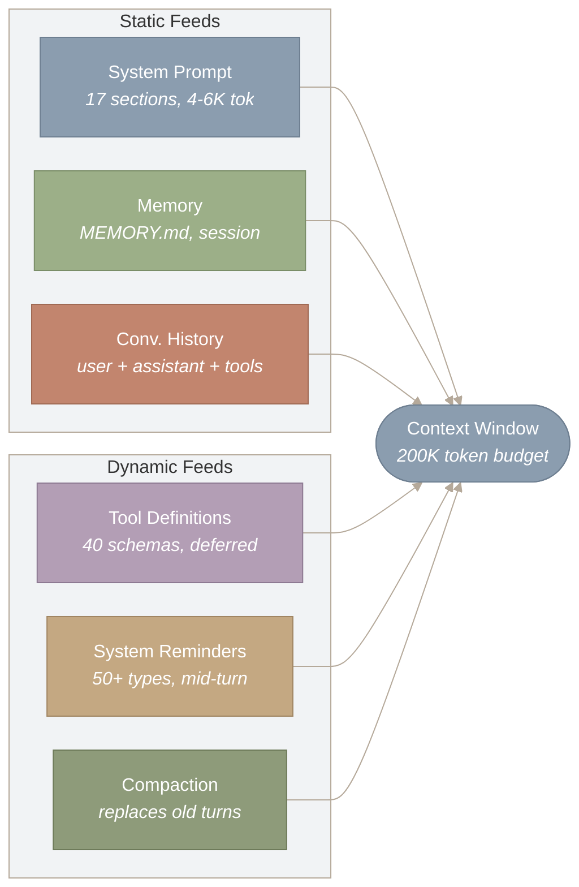
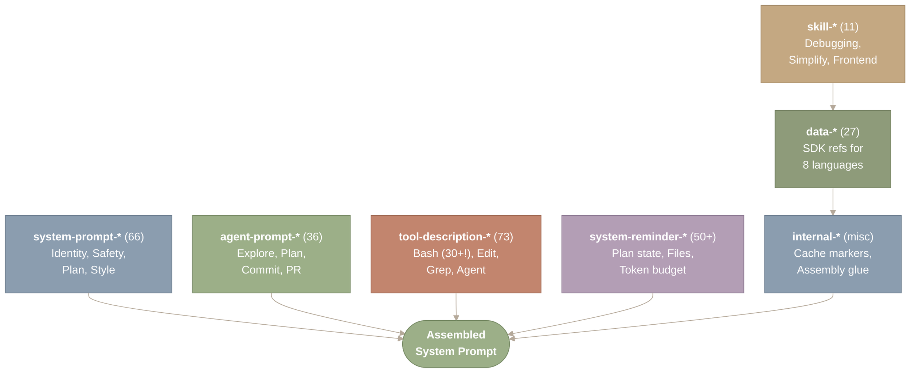
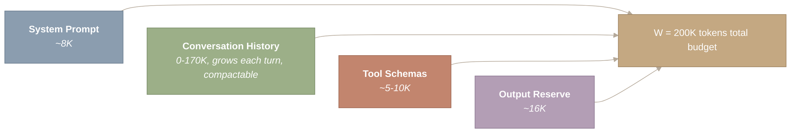
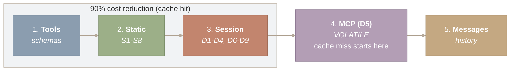
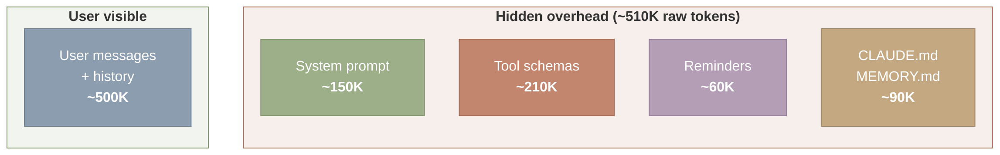
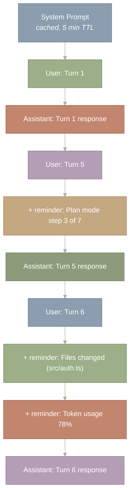

> 译者说明：本文按 2026-08-12 抓取的网页完整翻译，保留原始章节、代码、表格、Mermaid 图源、图注和链接。原文分析基于 Claude Code v2.1.88 的 Source Map；文件行数、工具数量、阈值和实现细节属于该页面快照，不应直接外推到其他版本。

# Prompt 组装流水线

## Context Engineering（上下文工程）概述

本文是本系列 Context Engineering 部分的开篇。四个子系统共同决定了模型在每次 API 调用中看到的内容：Prompt 组装（本文）、上下文压缩（第 III.2 部分）、记忆层级（第 III.3 部分），以及 Hook 与通知（第 III.4 部分）。下图展示了在 Agent Loop 的每一轮中，各子系统如何为最终的上下文窗口做出贡献。



*图 1：在 Agent 的每一轮中，有哪些内容被送入上下文窗口。三个静态来源（约 4–6K Token 的 System Prompt、记忆文件、对话历史）和三个动态来源（40 个带延迟加载的 Tool Schema、在轮次中途注入的 50 种 System Reminder、用于替换旧轮次的压缩摘要）共同竞争一个共享的 200K Token 预算。*

这张图的结构是：六个来源节点汇入右侧唯一的 Context Window 节点。左侧子图包含三个静态来源（System Prompt、Memory、Conversation History），右侧子图包含三个动态来源（Tool Definitions、System Reminders、Compaction）。全部六条箭头都汇聚到 200K Token 预算上，呈现的是对同一份有限资源的竞争。要点在于：每个来源都从同一个池子里消耗 Token——System Prompt 变大，留给对话历史的空间就变小，反之亦然。

**本文涉及的源文件：**

| 文件 | 用途 | 规模 |
| --- | --- | --- |
| `src/constants/prompts.ts` | 403 个 Prompt 字符串模板（约 728 KB 文本） | 约 18,000 行 |
| `src/constants/system.ts` | System Prompt 前缀与静态片段 | 约 500 行 |
| `src/utils/systemPrompt.ts` | System Prompt 组装流水线 | 约 400 行 |
| `src/utils/claudemd.ts` | CLAUDE.md 的发现与解析（遍历目录树） | 约 600 行 |
| `src/utils/messages.ts` | 消息规范化与 System Reminder 注入 | 约 1,500 行 |
| `src/utils/tokens.ts` | Token 计数与预算估算 | 约 300 行 |
| `src/skills/` | 11 个内置 Skill（打包的 Prompt 片段） | 约 4,066 行 |

---

## 引言：为什么 Prompt 组装重要

你输入「修复 auth.py 里的登录 bug」并按下回车。在模型读到你的请求的第一个 Token 之前，一条中间件流水线已经把大约 **65 个 Prompt 片段**组装成一个 System Prompt，拿它们和 200K Token 的上下文窗口做预算核算，并把结果按最大化服务器端缓存命中的方式排好顺序。模型看不到这套机制——它只看到最终成品。

本文的核心判断是：**System Prompt 由运行时动态组装，流水线中的每一项设计，都在应对上下文窗口有限这个现实。** 花在固定开销上的 Token 越多，留给推理的空间就越少。基于片段的组装、条件式包含、静态/动态分区、Prompt Caching（提示词缓存）和对话中途注入，都是为了在固定预算内尽可能有效地引导模型行为。

这条流水线是两个经典模式协同工作的实例：**建造者模式（builder pattern）**——每个阶段往一个不可变的请求对象上添加一部分内容，最后由 `build()` 步骤产出 API 调用；以及**流水线模式（pipeline pattern）**——每个阶段转换数据并传递给下游，而不需要感知整条链的全貌。理解这条流水线，是理解以下各部分的前提：消费其输出的 [Agent Loop](https://y-agent.github.io/inside-claude-code/02-agent-loop-query-engine.html)、在下游处理预算溢出的[压缩系统](https://y-agent.github.io/inside-claude-code/04-context-compaction.html)，以及为每种子 Agent 类型组装截然不同的 Prompt 的[多 Agent 编排器](https://y-agent.github.io/inside-claude-code/07-multi-agent-orchestration.html)。

---

## 组装流水线

**Prompt 组装器从八个来源收集片段，把它们排成 17 个分区，并产出一个带类型的 `SystemPrompt` 对象。整个过程受单一约束支配：Token 预算。**

当 `QueryEngine` 准备一次 API 调用时，它通过一个分层过程构造 System Prompt。它以一个固定前缀开始：

```
const DEFAULT_PREFIX = "You are Claude Code, Anthropic's official CLI for Claude."
```

然后按特定顺序叠加各个分区。这 17 个分区分为两组：八个静态分区（每个会话只计算一次，跨轮次保持不变）和九个动态分区（每轮或每个会话重新计算）。这种划分不是出于组织上的便利——它是一项成本优化，决定了缓存边界落在哪里。

```mermaid
%%{init: {'theme': 'neutral', 'flowchart': {'useMaxWidth': false, 'htmlLabels': true, 'padding': 20, 'nodeSpacing': 30, 'rankSpacing': 40}, 'themeVariables': {'primaryColor': '#8B9DAF', 'primaryTextColor': '#ffffff', 'primaryBorderColor': '#6E7F91', 'secondaryColor': '#9CAF88', 'secondaryTextColor': '#ffffff', 'secondaryBorderColor': '#7A8D68', 'tertiaryColor': '#C2856E', 'tertiaryTextColor': '#ffffff', 'tertiaryBorderColor': '#A06A54', 'lineColor': '#B5A99A', 'textColor': '#4A4A4A', 'mainBkg': '#8B9DAF', 'nodeBorder': '#6E7F91', 'clusterBkg': 'rgba(139,157,175,0.12)', 'clusterBorder': '#B5A99A', 'edgeLabelBackground': 'transparent'}}}%%
flowchart TD
  subgraph STATIC["Static (cached)"]
    S1["S1: Identity"]
    S2["S2: Tool Policy"]
    S3["S3: Anti-Patterns"]
    S4["S4: Reversibility"]
    S5["S5: Tool Rules"]
    S6["S6: Efficiency"]
    S7["S7: Tone"]
    S8["S8: Cache Control"]
  end

  S1 --> S2 --> S3 --> S4 --> S5 --> S6 --> S7 --> S8

  BOUNDARY["- - - cache boundary - - -"]

  S8 --> BOUNDARY

  subgraph DYNAMIC["Dynamic (per-turn)"]
    D1["D1: Memory"]
    D2["D2: Environment"]
    D3["D3: Language"]
    D4["D4: Output Style"]
    D5["D5: MCP"]
    D6["D6: Scratchpad"]
    D7["D7: Fork Config"]
    D8["D8: Summarize"]
    D9["D9: Brief Mode"]
  end

  BOUNDARY --> D1
  D1 --> D2 --> D3 --> D4 --> D5 --> D6 --> D7 --> D8 --> D9

  D9 --> OUT["<b>SystemPrompt</b>"]
  style S1 fill:#8B9DAF,color:#fff,stroke:#6E7F91
  style S2 fill:#9CAF88,color:#fff,stroke:#7A8D68
  style S3 fill:#C2856E,color:#fff,stroke:#A06A54
  style S4 fill:#B39EB5,color:#fff,stroke:#8E7A93
  style S5 fill:#C4A882,color:#fff,stroke:#A08562
  style S6 fill:#8E9B7A,color:#fff,stroke:#6E7B5A
  style S7 fill:#8B9DAF,color:#fff,stroke:#6E7F91
  style S8 fill:#9CAF88,color:#fff,stroke:#7A8D68
  style BOUNDARY fill:#C2856E,color:#fff,stroke:#A06A54
  style D1 fill:#B39EB5,color:#fff,stroke:#8E7A93
  style D2 fill:#C4A882,color:#fff,stroke:#A08562
  style D3 fill:#8E9B7A,color:#fff,stroke:#6E7B5A
  style D4 fill:#8B9DAF,color:#fff,stroke:#6E7F91
  style D5 fill:#9CAF88,color:#fff,stroke:#7A8D68
  style D6 fill:#C2856E,color:#fff,stroke:#A06A54
  style D7 fill:#B39EB5,color:#fff,stroke:#8E7A93
  style D8 fill:#C4A882,color:#fff,stroke:#A08562
  style D9 fill:#8E9B7A,color:#fff,stroke:#6E7B5A
  style OUT fill:#8B9DAF,color:#fff,stroke:#6E7F91
```



*图 2：17 分区组装流水线。静态分区 S1–S8（身份、工具策略、反模式、可逆性、工具规则、效率、语气、缓存控制）构成一个跨轮次逐字节一致的、可被缓存的前缀。动态分区 D1–D9（记忆、环境、语言、输出风格、MCP、Scratchpad、Fork 配置、摘要、简洁模式）被追加在缓存边界之后。虚线边界标记缓存断点；其上方的所有内容都有资格获得 90% 的成本减免。*

这张图从上到下依次流经 17 个编号分区。上方子图（Static）包含按顺序连接的 S1 到 S8。一条虚线缓存边界把它们与下方子图（Dynamic）隔开，后者包含 D1 到 D9。流程终止于 SystemPrompt 输出节点。缓存边界上方的所有内容跨轮次逐字节一致，因此有资格通过 Prompt Caching 获得 90% 的成本减免；边界下方的所有内容则每轮重新计算。

在压缩后的源码中可见的版本标记（vr9、Tr9、kr9 等）揭示了修订历史。身份分区 `vr9` 已经历过九次修订——据推测，每一次都要经过评估套件的测试，以检查行为回退。在这个规模上做 Prompt 工程，需要与写代码同等的纪律：版本控制、回归测试和谨慎的发布节奏。

最终结果被打上一个不透明的 `SystemPrompt` 类型——这是有意的设计选择。TypeScript 的类型系统会阻止下游发生意外拼接或篡改。在需要 `SystemPrompt` 的地方，你无法传入一个裸字符串。

---

## 片段分类法：八个类别

**每个 prompt 片段都属于八个类别之一，每个类别对应不同的生命周期，也对应组装顺序中的不同位置。**

Claude Code 没有采用单一的整体式 system prompt，而是把指令分散到大约 250 个独立的 prompt 片段中，分属八个类别。这些片段是分布在代码库各处的模板字面量、条件块和动态生成的字符串。系统会根据上下文来选择、排序和组合它们：当前是主 agent 还是子 agent？plan 模式是否激活？是否发生过 compaction？是否连接了 MCP 服务器？

这不是意外产生的复杂度。它是一个行为编译器：源片段被选中、组装、为缓存做优化，然后作为单个 prompt 交付给模型。组装后的总大小在 15 KB 到 25 KB 之间——占输入 token 预算的相当可观的一部分。



*图 3：八个片段类别及其大致数量，汇聚成单个组装完成的 system prompt。system-prompt-*（66 个片段）覆盖身份与安全；tool-description-*（73 个片段）是最大的类别，仅 Bash 就需要 30 多个；system-reminder-*（50 多个片段）负责对话中途注入；data-*（27 个片段）把 8 种语言的 SDK 参考文档作为即时 prompt 组件注入——出人意料的类别。*

图中每个带标签的方框代表八个片段类别之一，括号内是其数量。所有类别都汇入右下方中央的 Assembled System Prompt（组装完成的系统提示）节点。最上面的四个类别（system-prompt、agent-prompt、tool-description、system-reminder）直接汇入输出，而 skill、data 和 internal 则先彼此串联——这反映了它们之间的依赖顺序。目前最大的类别是 tool-description（73 个片段），仅 Bash 就占 30 多个，可见 prompt 预算中有多少花在了工具指令上。

有三个类别值得仔细考察。

**`tool-description-*`**（73 个片段）是最大的类别。仅 BashTool 就需要 30 多个片段，覆盖沙箱限制、git 安全、避免使用 sleep、命令描述以及特定模式下的规则。每个工具的描述都会成为 API 调用中 `tools` 参数的一部分，这意味着这些片段不是文档——它们是每一轮都在生效的指令。片段数量与风险成正比：Bash 的片段最多，因为它造成破坏的潜在可能性最大。完整的工具架构见[第四部分第 1 节：工具系统](https://y-agent.github.io/inside-claude-code/05-tool-system.html)。

**`system-reminder-*`（50 个片段）**是动态注入机制。与 system prompt 片段（只在开头出现一次）不同，reminder 会在整个对话过程中被插入，在会话中段强化上下文。我们将在下文的 system reminder 小节中考察它们。

**`data-*`（27 个片段）**比较特殊，里面装的是 Python、TypeScript、Go、C#、Java、Ruby、PHP 和 cURL 的 SDK 参考文档。当用户要求 Claude Code 编写 Anthropic SDK 代码时，相关的 `data-*` 片段会作为即时参考资料注入。片段系统在这里也承担了文档注入的工作。

### 为什么用片段而不是一个大字符串？

整体式 system prompt 维护起来更简单，但无法进行条件组合。片段方案有三个优势，且都直接关系到 token 预算约束：

1. **条件包含。** Plan 模式不需要全部 73 个工具片段。子 agent 拿到的是精简版 prompt。片段可以通过 Feature Flag 开关。每排除一个片段，就为对话历史省下了 token。
2. **独立版本演进。** 每个片段独立演化。对比 v2.1.81 和 v2.1.88 的 diff 可以看到，几乎每次发布都有片段被新增、移除或改写——而组装逻辑完全不受影响。
3. **利于缓存的边界。** 在轮次之间不发生变化的片段可以放进单个可缓存块中，减少重复处理。

代价也是真实存在的：要维护数百个部件，存在排序依赖，不同片段之间还可能出现相互冲突的指令。这是任何模板系统中经典的灵活性与简单性之间的取舍。但考虑到上下文窗口的约束，能够按条件只包含所需内容，这一能力超过了维护成本。

---

## CLAUDE.md 发现机制：作为 prompt 片段的项目指令

**有两个来源向组装过程输送动态上下文。用户上下文收集项目特有的数据；系统上下文添加运行时状态。两者都被记忆化（memoize），因为它们在轮次之间不会变化。**

最显眼的动态片段是 CLAUDE.md 文件——按仓库定制 agent 行为的项目级指令。Claude Code 通过一次分层遍历来发现这些文件：

```
export const getUserContext = memoize(async () => ({
  claudeMd: await loadClaudeMd(),     // Project + user CLAUDE.md files
  currentDate: `Today's date is ${getLocalISODate()}.`,
}))
```

`loadClaudeMd()` 函数会搜索三个作用域：

1. **用户级**（`~/.claude/CLAUDE.md`）——适用于每个项目的个人偏好。
2. **项目级**（`./CLAUDE.md`）——提交进版本控制的仓库专属指令。
3. **目录级**（子目录中的 `.claude/CLAUDE.md`）——面向 monorepo 组件的作用域指令。

每一级的文件会被拼接起来，更具体的作用域出现在组装后 prompt 的更靠后位置（因此由于近因偏差，会从模型那里获得更多关注）。整个 CLAUDE.md 载荷作为组装流水线中的 D1 段被注入，并拥有自己的缓存断点，因此编辑 CLAUDE.md 文件只会让这一个块失效——而不是整个缓存前缀。

系统上下文则添加模型进行情境感知所需的运行时状态：

- **Git 状态**——当前分支、未提交的更改、最近的提交。
- **操作系统信息**——平台、shell、工作目录。
- **可用工具**——当前 agent 类型和模式下注册了哪些工具。

用户上下文和系统上下文都被记忆化（在整个会话期间缓存）。每一轮都重新计算 git 状态只会增加延迟而没有价值，因为仓库变化的主要来源是模型自己发起的工具调用。

---

## 动态上下文：每轮变化的部分

静态片段定义了 Agent 是谁，动态片段则告诉它身处何处。

除了 CLAUDE.md 之外，还有几类上下文会在每一轮被计算或更新：

**环境信息**（D2）注入工作目录、平台、Shell 类型和操作系统版本。这就是为什么 Claude Code 无需被告知，就知道在 macOS 上使用 `brew`、在 Linux 上使用 `apt`。

**语言**（D3）根据用户的区域设置或显式配置来确定回复语言。

**MCP**（D5）是唯一真正**易变**的部分。当 Model Context Protocol 服务器在会话中途连接或断开时，这部分内容就会变化。它被放在动态区块的最后，是一处有意的缓存优化——对某个已缓存部分的任何改动，都会使其后的所有内容失效，所以最易变的内容要放在末尾。完整协议参见 [第 VI.1 节：MCP](https://y-agent.github.io/inside-claude-code/10-model-context-protocol.html)。

**Scratchpad**（D6，暂存区）提供会话内的工作记忆——模型写给自己的笔记，在压缩（compaction）边界之后依然保留。

**简短模式**（D9）在用户激活精简模式时修改输出风格，降低模型回复的冗长度。

Agent 专属片段同样重要。子 Agent 拿到的提示词要小得多——约 3 KB，而主 Agent 是 20 KB。Explore 子 Agent 的提示词以 *"You are a file search specialist"*（你是文件搜索专家）开头，以只读模式运行，只有 `Read`、`Glob`、`Grep` 和 `LSP` 这几个工具。Plan 子 Agent 则是一位 *"软件架构师"*，拥有同样受限的工具集，但输出格式不同。这 7 倍的体积差异是一项直接的成本优化：子 Agent 被频繁创建，每次创建都要付出完整的系统提示词成本。子 Agent 架构参见 [第 II.3 节：多 Agent 编排](https://y-agent.github.io/inside-claude-code/07-multi-agent-orchestration.html)。

每个子 Agent 的提示词由三段结构组装而成，这三段决定了它的最终大小和内容：

1. **第一部分：Agent 专属提示词。** 这是角色定义和行为契约。通用子 Agent 收到约 600 个字符的指令（"You are an agent for Claude Code" 加上关于彻底性和工作范围的准则）。需要验证复杂约束的验证 Agent 会收到多达 4,500 个字符。Explore 和 Plan Agent 介于两者之间，它们的结构化输出格式要求会增加提示词长度。
2. **第二部分：会话备注和环境信息。** 所有类型的子 Agent 共享一段共同的行为约束（使用绝对路径、不用表情符号、简洁汇报），外加运行时上下文：当前工作目录、平台、Shell 类型和模型 ID。这些约束防止子 Agent 产出令父 Agent 困惑的输出，并确保每个子 Agent 无需通过工具调用自行探查就知道自己身在何处。
3. **第三部分：上下文注入。** 这是可变成本的部分。通用 Subagent 和 Teammate 类型会包含 CLAUDE.md 文件和 git 状态，而 Explore 和 Plan 则被显式排除。这个排除是有意的成本优化：按每周 3,400 万次 Explore 创建计算，即使每次创建只包含几百个 token 的 CLAUDE.md 内容，在整个集群规模上也会累积成数十亿个 token 的节省。

组装完成的提示词总量，从 Explore 的约 100 行（无 CLAUDE.md、无 git 状态、极简角色定义）到 Teammate 的约 500 行（完整的主 Agent 提示词加团队记忆加 CLAUDE.md 层级）不等。

---

## 预算管理：背包约束

token 预算不是众多考量之一——它是催生整条流水线架构的那个核心考量。

每个 LLM 都有一个**上下文窗口**——单次请求能处理的最大 token 数。对 Claude 来说通常是 200K token。挑战在于把最有用的信息装进这个窗口，因为任何被留在外面的东西，模型都看不见。

预算约束可以表达为：

\[|system| + |history| + |tools| + |output| \leq W\]

其中 \(W\) 是上下文窗口大小。这是一个**背包问题**：一个容量固定的容器、大小和价值各异的物品，目标是在容量之内最大化总价值。



*图 4：200K 上下文窗口内的 token 预算分配，划分为四个消耗方。系统提示词（约 8K）、工具 schema（约 5-10K）和输出预留（约 16K）是固定成本，合计消耗约 30K token。剩余部分（至多 170K）可供对话历史使用，它每轮都会增长，也是预算超支时压缩系统的主要处理对象。*

图中四个方框代表 200K token 预算的四个消耗方，从左到右排列。系统提示词（约 8K）、对话历史（0-170K，唯一大小可变的消耗方）、工具 schema（约 5-10K）和输出预留（约 16K）全部汇入总预算节点。要点在于：系统提示词、工具 schema 和输出预留本质上是固定成本（约 30K），留给对话历史的至多有 170K——而对话历史是预算耗尽时唯一可以被压缩的部分。

现在我们可以看到流水线的每个阶段是如何服务于这个约束的：

| 阶段 | 它如何管理预算 |
| --- | --- |
| **片段组装** | 有条件地只包含当前模式所需的片段，把约 8K 的固定开销压到最小 |
| **静态/动态拆分** | 把不变的内容放在缓存边界之前，使其只被处理一次，而不是每轮都处理 |
| **工具描述** | 使用压缩过的单工具片段，而不是冗长的文档 |
| **消息规范化** | 合并相邻内容块、处理墓碑标记、整合工具结果 |
| **Prompt Caching** | 用 `cache_control` 标记不变的内容块，缓存命中时降低 90% 成本 |

每次 API 调用之前都会检查预算：

```
const tokenCount = tokenCountWithEstimation(messages)
const threshold = getEffectiveContextWindowSize(model) - AUTOCOMPACT_BUFFER_TOKENS
// AUTOCOMPACT_BUFFER_TOKENS = 13,000 -- a safety margin
return tokenCount >= threshold
```

这 13,000 个 token 的缓冲之所以存在，是因为 token 计数只是一种*估算*。精确数字取决于模型的分词器，估算错误就意味着请求被拒绝（HTTP 413）。缓冲提供了容错空间——这再次体现了那条工程原则：估算值需要安全余量。当预算被突破时，[压缩系统](https://y-agent.github.io/inside-claude-code/04-context-compaction.html)会触发一系列级联操作，从轻量修剪一直到紧急摘要。

---

## 反模式指令：大规模的否定式指令

大多数 LLM Agent 定义的是它们应该做什么。Claude Code 还定义了它们不应该做什么——而这些否定式指令的密度，暴露出 LLM 能力与可靠行为之间的差距。

系统提示词中包含 40 多条明确的禁令。"NEVER"（绝不）一词出现了几十次。每条规则都是一次真实失败留下的疤痕——都是模型的默认行为在测试或生产环境中引发过问题的案例。

仅从工具描述中抽样：

- "NEVER use the -i flag (interactive input not supported)"（绝不使用 -i 标志，不支持交互式输入）
- "NEVER push to the remote repository unless explicitly asked"（除非明确要求，绝不推送到远程仓库）
- "NEVER skip hooks (–no-verify) unless the user explicitly asks"（除非用户明确要求，绝不跳过 Hook，即 –no-verify）
- "NEVER amend commits that are already pushed"（绝不修改已推送的提交）
- "NEVER create documentation files unless explicitly requested"（除非明确要求，绝不创建文档文件）

这些规则聚为四类：

| 类别 | 目的 | 与预算的关系 |
| --- | --- | --- |
| **安全**（约 12 条） | 防止破坏性操作（rm -rf、强制推送、密钥泄露） | 一次破坏性操作会浪费整个会话的 Token 投入 |
| **正确性**（约 10 条） | 防止幻觉（编辑前先读文件、使用绝对路径） | 幻觉式编辑需要回滚轮次，消耗预算 |
| **UX 质量**（约 10 条） | 维持语气（不用 emoji、不用填充性短语、不主动写文档） | 填充性 Token 直接浪费输出预算 |
| **效率**（约 8 条） | 防止 Token 浪费（不重复读文件、使用专用工具） | 直接降低每轮的 Token 消耗 |

除了单条禁令，提示词还包含六条明确的**反模式指令**，针对最常见的 LLM 编码失败模式：

| 反模式 | 为什么重要 |
| --- | --- |
| "不要添加超出要求的功能" | 防止范围蔓延（LLM 编码失败模式之首） |
| "不要为不可能发生的场景添加错误处理" | 防止防御性过度编码 |
| "不要为一次性操作创建抽象" | 防止过早抽象 |
| "避免向后兼容的补丁式写法" | 防止不必要的兼容垫片 |
| "避免给出时间估计" | LLM 不擅长估算时间；沉默好过噪音 |
| "不要过度设计" | 优先简单直接，而非架构上的"纯粹" |

这些反模式与一个可逆性框架协同工作。该框架沿两个轴——可逆性和影响范围——来评估每一个动作，以决定需要何种确认行为。一个可逆的局部动作（编辑文件）可以自由执行。一个不可逆的大范围动作（向 main 分支强制推送）则必须显式确认，并解释后果。完整的权限模型见 [第四部分.2：安全与沙箱](https://y-agent.github.io/inside-claude-code/06-safety-sandbox.html)。

---

## Prompt Caching：架构与经济学的交汇点

### Prompt Caching 是什么

每一次对 Claude 的 API 调用都包含完整的消息负载：系统提示词、工具定义、对话历史，以及新的用户消息。如果不做优化，服务器必须在每次调用时**从头处理整个负载**——对那些上一轮已经见过的内容，重新做分词、编码和注意力计算。对于一个发送 8K Token 系统提示词的 20 轮会话，这意味着同一份 8K Token 被从头处理了 20 遍。按 API 定价计算，这种冗余很昂贵。

Prompt Caching 是 Anthropic 的服务端优化，用来消除这种冗余。思路很简单：客户端把请求中的一段前缀标记为"自上次以来未变"，服务器就复用该前缀的内部表示，而不再重新计算。缓存的前缀在服务端按 TTL 保存（默认 5 分钟，符合条件的账户为 1 小时）。缓存命中时，缓存前缀内的输入 Token 按 90% 折扣计费——即正常输入 Token 价格的 10%。

关键的约束在于**缓存是基于前缀的**：服务器缓存的是请求中从开头算起的一段连续前缀。如果缓存前缀内有任何一个字节发生变化，从该位置往后的所有内容都会失效。

为什么？这源于 Transformer 推理的工作方式。服务器缓存的表示并不只是原始文本——而是 KV cache（键值缓存），即前向传播过程中计算出的中间注意力状态。在 Transformer 中，每个 Token 的表示都依赖它之前的所有 Token。如果你改动了 20,000 Token 序列中的第 5,000 个 Token，那么第 5,001 到 20,000 个 Token 的注意力状态全部失效，因为它们是带着旧的第 5,000 个 Token 作为输入计算出来的。只有第 1 到 4,999 个 Token 可以复用。这和你无法在视频中间插入一帧而保持后续帧不变是同一个道理——每一帧（就像每个注意力状态）都依赖它之前的内容。

这意味着**请求中内容的排列顺序决定了缓存命中率**。稳定的内容必须放在前面；易变的内容必须放在最后。位置 \(k\) 处的一处改动会使其后全部 \(n - k\) 个 Token 的缓存失效，所以一处改动的代价与它出现得有多早成正比。

整个提示词组装流水线的排序都是为了最大化缓存命中率。这不是夸张——渲染顺序、静态/动态划分、以及把易变内容放在末尾，全都服务于同一个目标：降低 API 成本。

Claude Code 用单个字段标记缓存断点：

```
{
  type: 'text',
  text: appendSystemContext(systemPrompt, systemContext),
  cache_control: { type: 'ephemeral' },  // <-- 5-minute cache TTL
}
```

`cache_control: { type: 'ephemeral' }` 标记会创建一个断点。该标记之前的所有内容都会在服务端缓存五分钟。后续轮次完全跳过对系统提示词的重新处理。



*图 5：针对缓存优化的提示词组装顺序，按从最稳定到最易变排列。工具 Schema 和静态部分（S1-S8）构成缓存前缀，成本降低 90%。会话级动态部分（D1-D4、D6-D9）在稳定时延伸前缀。MCP（D5）是唯一真正易变的部分，被放在最后，这样它的变化不会使前面的缓存内容失效。消息（对话历史）排在所有系统内容之后。*

图中五个节点从左到右按从最稳定到最易变排列。阴影子图（Tools、Static、Session）代表缓存前缀，命中时享受 90% 的成本降低。MCP（D5）被放在这条边界之外紧邻的位置，因为它是唯一真正易变的部分——这里的任何变化就是缓存开始失效的位置。消息（对话历史）排在最后。排序原则是：稳定内容在前，易变内容在后，让变化尽可能少地使缓存内容失效。

在没有 MCP 服务器的会话中（D5 为空），缓存前缀会一直延伸到消息——这是最佳情形。一个 50 轮会话的数学账：

```
  System prompt: ~15,000 tokens
  Without caching:  50 × 15,000 = 750,000 input tokens
  With 90% cache:   50 × 15,000 × 0.10 = 75,000 effective input tokens
  Savings:          675,000 tokens per session
```

系统提示词被拆分为多个块，以最大化缓存命中率。主提示词（跨轮次稳定）和 CLAUDE.md 内容这类用户上下文（跨轮次稳定，但随项目不同而不同）各自拥有自己的缓存断点：

```
export function buildSystemPromptBlocks(
  systemPrompt: SystemPrompt,
  userContext: Record<string, string>,
  systemContext: Record<string, string>,
): BetaContentBlockParam[] {
  return [
    {
      type: 'text',
      text: appendSystemContext(systemPrompt, systemContext),
      cache_control: { type: 'ephemeral' },
    },
    // CLAUDE.md as separate cacheable block
    ...userContext.claudeMd ? [{
      type: 'text',
      text: userContext.claudeMd,
    }] : [],
  ]
}
```

另外还有一个 **fork worker 优化**。当 Claude Code 并行执行工具调用时，所有 fork 出来的子进程继承同一份系统提示词。第一个 worker 写入的缓存惠及同一批次的所有后续 worker。一个包含五个并行 worker 的 fork 只付一次完整的输入 Token 成本，而不是五次。

Prompt Caching 把提示词工程变成了成本工程。把 MCP 指令（D5）放在组装顺序末尾的决定，与可读性或逻辑分组无关——它只与钱有关。对某个已缓存部分的任何改动都会使其后所有内容失效。把唯一易变的部分放在最后，前面的所有内容就能保持缓存。这和把变化最频繁的文件放在备份归档末尾是同一个原则。

### Tool 响应如何影响缓存

Tool 响应带来了一个有趣的缓存难题。当模型调用一个工具（比如读取文件）时，工具结果——可能是 10,000+ Token 的文件内容——会作为 `tool_result` 块插入到对话历史中。在后续的轮次里，这个工具结果属于 messages 载荷的一部分，必须再次发送。如果不做优化，一个读取了 20 个文件的会话会累积 200K+ Token 的工具结果，并在之后的每一次 API 调用中重新发送。

Claude 通过构建在 cache_editing beta 之上的两个机制来解决这个问题：

**对工具结果使用 `cache_reference`。** 对于落在缓存前缀之内的 tool_result 块（即位于最后一个 `cache_control` 标记之前的部分），Claude Code 会添加一个 `cache_reference` 字段，并将其设为 `tool_use_id`。这等于告诉服务器：“你在之前的请求中已经缓存过这个工具结果；按 ID 引用它即可，不用重新处理完整内容。”服务器将该引用匹配到它的缓存表示，跳过重新编码。

```
// Add cache_reference to tool_result blocks within the cached prefix
if (isToolResultBlock(block)) {
  msg.content[j] = Object.assign({}, block, {
    cache_reference: block.tool_use_id,
  })
}
```

**用 `cache_edits` 做驱逐。** 当旧的工具结果不再值得缓存（模型已经转向处理其他文件）时，[Microcompact 层](https://y-agent.github.io/inside-claude-code/04-context-compaction.html)会插入一个 `cache_edits` 块，告诉服务器删除特定的已缓存工具结果。这是应用层的缓存驱逐：由 Claude Code 决定哪些工具结果已经过时，服务器回收它们的缓存空间。

综合效果是：最近几轮的工具结果被缓存起来，可以低成本地引用。更早轮次的工具结果被驱逐。System Prompt、工具 schema 和最近的对话历史保持在缓存前缀内，只有最新的用户消息和 system reminder 落在前缀之外。

这是一个带显式驱逐的写穿（write-through）缓存。新的工具结果在首次使用时写入缓存（`cache_control: ephemeral`），在后续轮次中从缓存读取（`cache_reference`），并在过时时被驱逐（`cache_edits`）。写、读、驱逐这三个操作是任何缓存的基本操作，只不过这里它们被应用在 API 协议层，而不是内存中。

### MCP 与缓存失效

MCP 服务器带来了最严峻的缓存挑战，源码揭示了一套随时间逐步演进的多阶段缓解策略。

**最初的问题。** MCP 服务器指令——即用自然语言描述每个 MCP 服务器的工具是做什么的、如何使用——最初被放在 System Prompt 中，作为最后一个动态部分（即上文[组装顺序图](https://y-agent.github.io/inside-claude-code/03-prompt-assembly.html#fig-cache-order)中的“MCP 部分”）。要理解为什么这尤其成问题，需要看清缓存前缀里有什么、没有什么。常规的工具*响应*（Bash、Read、Grep 等的输出）位于对话消息流中，在缓存前缀*之后*。一个 Bash 命令每轮返回不同的输出，对 System Prompt 缓存毫无影响。但 MCP 服务器的*指令和工具定义*被放在 System Prompt 内部——属于缓存前缀的一部分。System Prompt 的其他部分都是稳定的：身份文本从不变化，内置工具的 schema 编译进了二进制文件，CLAUDE.md 只在用户编辑时才变化，日期部分使用月级粒度来尽量减少变动。MCP 部分是唯一一个字节内容取决于外部进程运行时状态的 System Prompt 部分。MCP 服务器随时可能崩溃、重启，或由用户在会话中途添加。用户在第 15 轮输入 `/mcp add postgres`，或者 GitHub MCP 服务器的进程在第 30 轮死掉并重启——突然之间，MCP 部分的字节就和上一轮不一样了。由于缓存是基于前缀的，这一变化会使请求中位于其后的所有内容失效。一个只连接了一个 MCP 服务器的用户，可能在不知不觉中让每轮成本增加数千 Token。

**缓解措施：`mcp_instructions_delta`。** 源码显示，MCP 指令已经被完全移出 System Prompt。Claude Code 不再每轮重建 D5，而是通过注入到对话消息中的 `mcp_instructions_delta` [system reminder](https://y-agent.github.io/inside-claude-code/04-context-compaction.html) 来传递 MCP 指令：

```
// prompts.ts — MCP instructions moved to delta attachments
// instead of this per-turn recompute, which busts the prompt
// cache on late MCP connect.
```

当一个 MCP 服务器连接时，它的指令会作为 system reminder 在下一轮送达——而不是作为对 System Prompt 的修改。System Prompt 保持字节级一致，缓存保持有效，指令依然能到达模型。当一个 MCP 服务器断开时，一条对应的增量 reminder 会列出已断开的服务器。

**同样的模式也适用于 MCP 工具 schema。** 当 MCP 工具出现在工具定义数组中时，它们可能会击穿工具 schema 缓存。`deferred_tools_delta` 附件改为以 system reminder 的形式携带新增或移除的工具公告，而不修改工具数组，从而保护工具 schema 的缓存前缀。

工程上的教训是：**每一个原本放在 System Prompt 中的易变信号，都被系统性地迁移到了 system reminder**。日期（使用月级粒度以尽量减少变化）、当前模型、MCP 指令、延迟加载的工具列表——全部被移入消息流，以保护约 20K Token 的缓存前缀。源码注释对这一动机写得很明确：`"busts the prompt cache"` 在整个代码库中出现了 15 次以上，作为这些迁移的理由。

### 量化 Token 成本

为什么这些缓存工程如此重要？考虑一个典型的 30 轮交互式会话：



*图 6：一个 30 轮会话的 Token 成本分解，分为用户可见部分和隐藏开销。用户可见部分（石板色，约 500K Token）是消息和历史。隐藏开销由四个部分组成：System Prompt（约 150K 原始 Token，可缓存）、工具 schema（约 210K 原始 Token，可缓存）、system reminder（约 60K 累计新增 Token），以及 CLAUDE.md/MEMORY.md（约 90K 原始 Token，可缓存）。隐藏开销合计约 510K 原始输入 Token。启用 Prompt Caching 后（重复前缀按 90% 折扣计），有效的隐藏成本降至约 85K Token，约使有效输入成本增加 20%。*

图中左右并排的两组可以对比来看：左侧的“用户可见”块展示用户自己的消息和历史（30 轮共约 500K Token），右侧的“隐藏开销”块拆出四个不可见的组成部分——System Prompt、工具 schema、reminder、CLAUDE.md/MEMORY.md——合计约 510K 原始输入 Token。要点在于，按原始 Token 量计算，隐藏开销*超过*了用户可见内容。Prompt Caching 将有效的隐藏成本降至约 85K Token（因为四个组成部分中有三个可按 90% 折扣缓存，而此前注入的 reminder 会作为对话历史的一部分被缓存），约使有效输入成本增加 20%。

| 组成部分 | Token 数（30 轮） | 是否缓存？ | 有效成本 |
| --- | --- | --- | --- |
| 用户消息 + 历史 | ~500,000 | 部分（最后一条消息） | ~400,000 |
| System Prompt（S1–S8，D1–D9） | ~150,000（5K × 30） | 是（90%） | ~15,000 |
| 工具 schema（73 个片段） | ~210,000（7K × 30） | 是（90%） | ~21,000 |
| System reminder（累计） | ~60,000 | 部分（仅新增） | ~40,000 |
| CLAUDE.md + MEMORY.md | ~90,000（3K × 30） | 是（90%） | ~9,000 |

**隐藏开销合计：约 510,000 原始输入 Token，缓存后约 85,000 有效 Token。** 在一个用户自己的消息总计约 500,000 Token（有效约 400,000）的会话中，隐藏开销使有效输入 Token 成本增加约 20%。如果没有 Prompt Caching，全部 510,000 原始 Token 将按标准输入费率计费——账单几乎翻倍。这就是为什么 Claude Code 在缓存稳定性上投入如此之大：前缀顺序约束、用于工具结果的 `cache_reference` 机制、以及把每一个易变信号迁出 System Prompt，都不是过早优化——它们是承重的成本工程。

---

## System Reminder：对话中途注入

**System reminder 在不修改 System Prompt 的前提下，把动态上下文注入对话中间。** 这样的 reminder 超过 50 种（完整清单见 [Post 4](https://y-agent.github.io/inside-claude-code/04-context-compaction.html)），它们解决的是一个具体问题：如何在不破坏 Prompt Cache 的情况下，在会话进行中更新模型的上下文？

LLM 存在指令衰减（instruction decay）问题——对话越长，模型对上下文开头处的指令关注越少。随着对话历史不断增长、把 System Prompt 推得离模型当前关注点越来越远，关键的行为规则影响力会逐渐减弱。System reminder 通过在规则最相关的位置重新强调它们，来抵消这种衰减。

机制很直接。reminder 被包裹在 `<system-reminder>` XML 标签里，附加到下一条 user 消息上，搭在对话消息内部传递，而不是放进 System Prompt：



*图 7：注入到对话时间线中的 System reminder。System Prompt（已缓存，TTL 5 分钟）始终位于顶部、不被改动。reminder（赭色节点）在关键位置附加到 user 消息上：第 5 轮注入 plan mode 状态，第 6 轮注入文件变更通知和 Token 用量。这样既保住了缓存的 System Prompt，又能抵消指令衰减——即模型对距离较远的指令关注下降的现象。*

图的时间轴自上而下。System Prompt（已缓存，TTL 5 分钟）位于顶部，全程不被改动。下方 User 和 Assistant 消息交替排列。赭色的 reminder 节点被注入在 user 消息和 assistant 回复之间——注意第 5 轮只有一个 reminder（plan mode 状态），而第 6 轮有两个（文件变更和 Token 用量）。要点是：reminder 搭在对话消息内部，而不是修改 System Prompt，因此在对话深入之后既保住了缓存，又抵消了指令衰减。

### 事件驱动的触发分类

这 50 多种 reminder 并不是随机触发的。每一种都由特定的运行时事件触发，这些事件分为四类，共同定义了 reminder 的生命周期：

1. **工具结果之后。** 当一个工具执行完毕，运行时会评估发生了什么变化，并在下一轮注入相应的 reminder。例子包括当前 git 状态（在修改了仓库的 Bash 命令之后注入）、剩余 Token 预算（每次 API 往返之后更新）、最近变更的文件（在 Edit 或 Write 调用修改了工作区之后注入）。
2. **权限决策之后。** 当权限系统允许或拒绝一次工具调用时，结果和理由会被记录为一条 reminder。这确保模型知道自己被允许做什么、为什么，避免它重复请求已被拒绝的操作，或者对一个被静默批准的敏感操作毫不知情。
3. **压缩（compaction）之后。** 当压缩级联对较早的轮次做摘要时（见 [Part III.2：Context Compaction](https://y-agent.github.io/inside-claude-code/04-context-compaction.html)），会注入一条 reminder，描述哪些内容被摘要了、哪些信息可能丢失。这一步很关键，因为模型无法察觉自己的历史被压缩了。没有这条 reminder，它可能会引用上下文中已不复存在的细节。
4. **周期性强化。** 有些 reminder 按固定节奏触发，而不是响应某个具体事件。安全约束、代码风格规则和输出格式指令会被定期重新注入，以抵消指令衰减。这类 reminder 与下文所说的“aspect advice”最为相似：无论对话在讨论什么，这些横切的行为规则都必须保持显著。

### 一个具体例子：`edited_text_file` reminder

为了让这个机制更具体，来看实际中最重要的一类 reminder：`edited_text_file`，实现在 `src/utils/messages.ts` 的第 3538 行，经由 `normalizeAttachmentForAPI()` 函数。

场景很简单。用户在 IDE 里打开 `src/auth.ts`，在 agent 工作的同时改掉了一个函数签名。agent 并不知道这件事。下一轮，它可能覆盖用户的改动，或者做出与新签名冲突的编辑。文件监视器检测到这次外部修改。运行时把一条通知包裹进 `<system-reminder>` XML 标签，注入到下一条 user 轮次的消息里。源码中的确切消息模板是：

> “Note: {filename} was modified, either by the user or by a linter. This change was intentional, so make sure to take it into account as you proceed (ie. don’t revert it unless the user asks you to). Don’t tell the user this, since they are already aware. Here are the relevant changes (shown with line numbers): {snippet}”（注意：{filename} 被修改了，修改者可能是用户，也可能是 linter。这次改动是有意的，请在后续工作中将其考虑在内（即除非用户要求，否则不要回退它）。不要告诉用户这件事，因为他们已经知道了。以下是相关改动（带行号显示）：{snippet}）

其中 `{filename}` 是被修改文件的路径（例如 `src/auth.ts`），`{snippet}` 是带行号的改动 diff。没有这条 reminder，模型持有的就是一份过期的文件视图，可能会悄悄覆盖用户的工作。这条 reminder 以零工具调用的成本给了模型环境感知能力。措辞经过仔细斟酌：“不要告诉用户这件事，因为他们已经知道了”这一句防止模型把改动复述给用户——那既烦人，又浪费输出 Token。

### AOP 类比

这是把**面向切面编程（AOP）**应用到 LLM 对话上。在传统 AOP（Spring Framework、AspectJ）中，日志、安全、事务这类横切关注点被注入到连接点（join point）上，而不修改核心业务逻辑。System reminder 做的是同一件事：横切关注点（Token 状态、计划进度、文件变更）被注入到对话的连接点上，而不修改 System Prompt。

| AOP 概念 | System Reminder 对应物 |
| --- | --- |
| **Aspect（切面）** | 一类 reminder（计划状态、文件变更、Token） |
| **Join point（连接点）** | 对话中的一个位置（user 消息之前、工具结果之后） |
| **Advice（通知）** | 被注入的 reminder 内容 |
| **Weaving（织入）** | 运行时把 reminder 注入消息的过程 |
| **Cross-cutting concern（横切关注点）** | 横跨多轮对话但不属于 System Prompt 的上下文 |

这 50 种 reminder 覆盖十个类别：**计划与模式**（plan 步骤、auto 模式、重新进入）、**文件与 IDE 状态**（被修改的文件、打开的文件、选中的行）、**Hook 结果**（成功、阻塞错误、附加上下文）、**资源预算**（Token 用量、美元预算、任务状态）、**记忆与上下文**（CLAUDE.md、召回的记忆、压缩、日期变更）、**技能与命令**（被调用的 skill、skill 列表、排队的命令）、**任务管理**（todo/task 提醒、计划验证）、**工具与 agent 变更**（延迟加载的工具、agent 列表、MCP 指令）、**行为类**（输出风格、诊断、推理强度），以及**团队协调**（团队上下文、队友消息）。完整清单见 [Post 4](https://y-agent.github.io/inside-claude-code/04-context-compaction.html)。

### Hook 到 Reminder 的管道

reminder 系统并不限于 50 多种内置类型。Hook 系统把它扩展成了一个用户可编程的注入机制。用户可以把任意 shell 命令挂到 25 个以上的生命周期事件上，包括 `PreToolUse`、`PostToolUse`、`SessionStart`、`Stop`、`Notification`，以及 hooks 配置中定义的其他事件。当一个生命周期事件触发时，注册的 hook 命令被执行，它产生的任何 stdout 都会被运行时捕获，并作为 System reminder 注入下一轮。这让 reminder 系统在不修改 Claude Code 源码的情况下实现了用户可扩展。

实际影响很可观。一个团队可以强制推行项目特有的不变量（例如“每次编辑 Rust 文件后必须运行 `cargo clippy`”），做法是给 Edit 工具挂一个 `PostToolUse` hook，运行 linter 并把警告作为 reminder 回传。一个重视安全的组织可以给 Bash 挂一个 `PreToolUse` hook，用拒绝清单扫描待执行的命令，命中时返回一条警告 reminder。在每种情况下，hook 的 stdout 都走与内置 reminder 相同的 `<system-reminder>` XML 注入路径，因此模型会以与直接的用户指令同等的可见度对待 hook 生成的上下文。

关于 System reminder 架构以及触发它们的生命周期 Hook 的完整论述，见 [Part III.4：Hooks 与生命周期](https://y-agent.github.io/inside-claude-code/11-hooks-lifecycle.html)。

---

## 总结

提示词组装流水线说明了生产级 LLM Agent 的一个基本事实：**提示词就是代码，也需要代码级的工程纪律。** 版本标记、片段化架构、条件组装、面向缓存优化的排序以及回归测试——Claude Code 管理提示词的方式，与管理源代码并无二致。

这条流水线通过一组相互配合的技术，解决了上下文窗口稀缺这个核心矛盾：

1. **片段化组合**支持按条件包含，每种模式和每种 Agent 类型只拿到它需要的片段。子 Agent 的 3 KB 提示词每轮的成本比主 Agent 的 20 KB 低 85%。
2. **静态/动态分区**把不变的内容放在缓存边界之前，确保会话中每一轮系统提示词的主体部分都能享受 90% 的缓存折扣。
3. **否定式指令**比单纯的肯定式指令更能削减模型的动作空间。40 多条“NEVER”规则和六条反模式指令不是粗糙的工程——它们是提示词领域的防御式编程，系统性地把生产中观察到的每一种失败模式都编码了进去。
4. **System Reminder** 通过在对话中途重新注入关键上下文来对抗指令衰减，同时不让已缓存的系统提示词失效。它们就是 LLM 工程里的 AOP（面向切面编程）。
5. **预算检查**在每一轮执行，留出 13,000 Token 的安全余量，在窗口溢出之前（而不是之后）触发[压缩](https://y-agent.github.io/inside-claude-code/04-context-compaction.html)。

贯穿始终的洞见是：提示词不仅仅是模型的*输入*——它是模型执行的**程序**。组装流水线是编译器，片段是源代码模块，缓存断点是优化遍次，Token 预算是目标架构的内存上限。理解这条流水线是理解 Claude Code 其他所有组件的前提，因为每个组件——[Agent Loop](https://y-agent.github.io/inside-claude-code/02-agent-loop-query-engine.html)、[工具系统](https://y-agent.github.io/inside-claude-code/05-tool-system.html)、[安全层](https://y-agent.github.io/inside-claude-code/06-safety-sandbox.html)、[多 Agent 编排器](https://y-agent.github.io/inside-claude-code/07-multi-agent-orchestration.html)——都运行在这条流水线划定的预算之内。

1. **系统提示词由 8 大类、250 多个片段组装而成**，组织成 17 个有序小节。这种架构支持按条件包含、独立版本化和面向缓存优化的交付。
2. **静态/动态切分是一项成本优化。** 静态小节构成可缓存的前缀；动态小节追加在缓存边界之后。在典型会话中，这种排序把系统提示词的处理成本降低了约 90%。
3. **否定式指令描画出了可靠性缺口。** 每一条“NEVER”规则都是一道伤疤，对应一次 LLM 能力与可靠行为发生偏离的失败模式。它们是提示词领域的防御式编程。
4. **System Reminder 是 LLM 的 AOP。** 横切关注点（计划状态、文件变更、Token 压力）在对话的连接点注入，不修改已缓存的系统提示词。
5. **Prompt Caching 把提示词工程变成了成本工程。** 渲染顺序、缓存断点、易变内容靠后放置，这些设计都是为了最大化缓存命中——这决定了一个产品是可行，还是贵到无法盈利。

---

*下一篇：[Part II.3 – 多 Agent 编排](https://y-agent.github.io/inside-claude-code/07-multi-agent-orchestration.html)将展示提示词组装流水线如何为子 Agent 做适配——从 3 KB 的 Explore 提示词到 20 KB 的 Teammate 提示词。随后 [Part III.2 – 上下文压缩](https://y-agent.github.io/inside-claude-code/04-context-compaction.html)会考察上下文窗口被填满时会发生什么——决定保留什么、丢弃什么的五级压缩级联。*

*全部分析基于从 v2.1.88 Source Map 泄漏中提取的源代码。文件大小和行数引用的是还原后的未压缩代码。*
