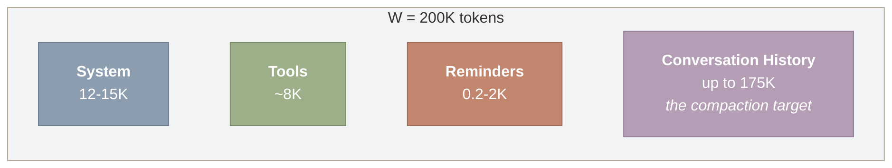
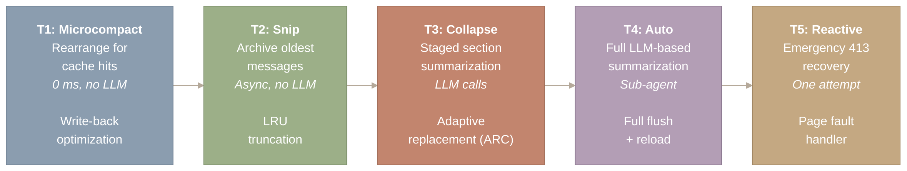
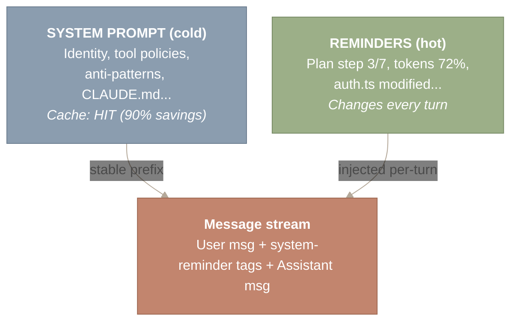
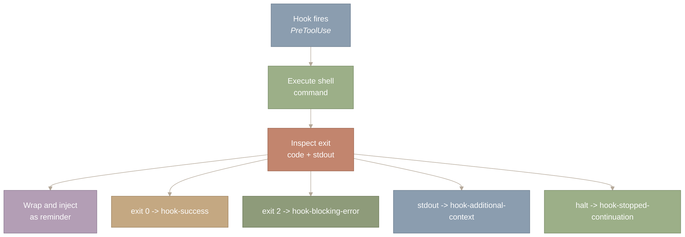
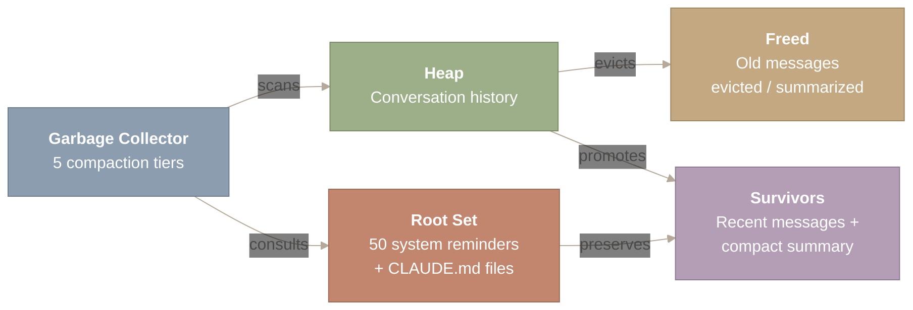

# Context Compaction

## Introduction: The Scarcest Resource

A 200K-token context window sounds generous until you watch it evaporate during a real coding session. A single large source file consumes 8,000–12,000 tokens. A `grep` across a monorepo returns 30,000 tokens. Pipe test output into the conversation and you burn 50,000 tokens in one turn. A busy two-hour session easily generates 400K+ tokens of raw conversation – double the window.

The naive solution is truncation: chop the oldest messages. This is what most open-source agents do, and it is catastrophically bad for coding tasks – the agent forgets the user’s original intent, drops the mental model it built over dozens of turns, and starts making changes that conflict with earlier decisions.

Claude Code treats context management as an optimization problem: minimize information loss subject to a token budget constraint. The result is a multi-tier compaction cascade combined with a system of 50 adaptive mid-conversation injections that carry volatile state without disturbing the cached prompt prefix. This post covers both mechanisms: the compaction tiers that manage conversation history, and the system reminder pipeline that carries real-time signals to the model’s attention.

**Source files covered in this post:**

| File | Purpose | Size |
| --- | --- | --- |
| `src/services/compact/autoCompact.ts` | Proactive compaction (token threshold trigger) | ~300 LOC |
| `src/services/compact/compact.ts` | Main compaction execution engine | ~500 LOC |
| `src/services/compact/microCompact.ts` | Inline API-based compaction (cache_editing) | ~200 LOC |
| `src/services/compact/reactiveCompact.ts` | Fallback compaction (413 error recovery) | ~150 LOC |
| `src/services/compact/sessionMemoryCompact.ts` | Session memory preservation across compaction | ~200 LOC |
| `src/services/compact/prompt.ts` | Compaction prompt templates | ~150 LOC |

---

## The Budget Constraint

Before examining any algorithm, it helps to state the problem precisely. Every API call to Claude must satisfy a hard constraint:

\[ |S_{\text{system}}| + |H_{\text{history}}| + |T_{\text{tools}}| + |R_{\text{reminders}}| \;\leq\; W \]

where \(W\) is the context window size (200K tokens for Claude), \(S\) is the system prompt (~12–15K tokens), \(T\) is tool definitions (~8K tokens), and \(R\) is the system reminders injected on this turn. What remains – \(W - |S| - |T| - |R|\) – is the budget available for conversation history \(H\). This is a variant of the **knapsack problem**: maximize information value of retained messages subject to a token budget.



*Figure 1: The context window budget (W = 200K tokens) partitioned across four competing consumers. System prompt (12-15K), tool definitions (~8K), and system reminders (0.2-2K per turn) are fixed costs consuming roughly 20-25K tokens. Conversation history receives whatever remains (up to ~175K tokens) and is the sole target of the compaction tiers when the budget is exceeded.*

**How to read this diagram.** The four boxes represent competing consumers of the fixed 200K-token context window, read left to right. System prompt, tool definitions, and reminders are fixed costs that consume roughly 20-25K tokens before a single user message is sent. The remaining space – “Conversation History” on the far right – is the sole target of compaction, and its flexible size is what the rest of this post is about.

The fixed costs (\(S + T\)) consume roughly 20–23K tokens before a single user message is sent. System reminders add another 200–2,000 tokens depending on the turn. That leaves approximately 175K tokens for history – and history is where all the interesting engineering happens, because history grows without bound while the window does not.

---

## Token Accounting: You Cannot Manage What You Cannot Measure

Before the system can decide *when* to compact, it needs to know *how many tokens* it is using. Claude Code implements three counting methods, each trading accuracy for speed – the same trade-off every monitoring system faces.

| Method | Speed | When Used |
| --- | --- | --- |
| API `count_tokens` (exact BPE tokenizer) | Slow (network) | Session start, calibration |
| Character heuristic (chars / 4 + overhead) | Fast (local) | Every message (workhorse) |
| Fixed estimates (flat constants) | Instant | Images (~2K), documents (~2K) |

The character heuristic is the workhorse. For a text block of length \(\ell\), the estimate is \(\hat{t} = \lceil \ell / 4 \rceil + 1\). For tool-use blocks, \(\ell\) includes both the tool name and the JSON-serialized input:

```
// The core estimation logic -- fast, no network, ~85% accurate
function estimateTokens(block: ContentBlock): number {
  switch (block.type) {
    case 'text':
      return Math.ceil(block.text.length / 4) + 1;
    case 'tool_use':
      return Math.ceil(
        (block.name.length + JSON.stringify(block.input).length) / 4
      ) + 1;
  }
}
```

Why not use the exact tokenizer every time? Because it requires a network round-trip to Anthropic’s API. On the hot path of every message, that latency is unacceptable. The heuristic is fast and conservative – it tends to overestimate, which is safer than underestimating when managing a hard limit.

The token monitoring system maintains a continuous **warning state** that drives compaction decisions:

| Token Usage | Warning State | Action |
| --- | --- | --- |
| 0–60% | `normal` | Normal operation |
| 60–75% | `shortened outputs` | Shorter tool outputs |
| 75–90% | `aggressive summarization` | More aggressive summarization |
| 90%+ | `auto-compact trigger` | Trigger auto-compact |

A key optimization sits between counting and compaction: tokenSaverOutput on BashTool. When a bash command produces voluminous output (test logs, build output, file listings), the full output goes to the UI for display, but a compressed version goes to the model. This single optimization can save tens of thousands of tokens per session without any loss of information from the user’s perspective.

---

## The Compaction Tiers: A Cascade from Free to Expensive

The compaction system implements five tiers, each more aggressive, more expensive, and triggered by more severe conditions. The system always prefers the lightest intervention that keeps the conversation within bounds. The tiers map directly to known cache eviction strategies.



*Figure 2: The five compaction tiers, ordered from least aggressive (left) to most aggressive (right), each mapped to a classical cache eviction analogue. Tier 1 (Microcompact) rearranges content for cache hits with zero cost and no LLM calls. Tier 2 (Snip) archives oldest messages via LRU truncation. Tier 3 (Collapse) performs staged section summarization, analogous to Adaptive Replacement Cache. Tier 4 (Auto) launches a full LLM-based summarization sub-agent. Tier 5 (Reactive) fires only on API 413 errors, preserving only the last 4 messages as an emergency page-fault handler.*

**How to read this diagram.** Start at Tier 1 on the left and follow the arrows rightward through increasingly aggressive compaction strategies. Each box shows the tier name, what it does, its cost (from zero-cost rearrangement to a full LLM sub-agent call), and its classical cache-eviction analogue. The system always prefers the lightest tier that keeps the conversation within budget; it escalates rightward only when cheaper tiers are insufficient.

### Tier 1: Microcompact – Rearranging for Cache Hits

Microcompact does not reduce conversation size at all. It manages prompt cache invalidation to minimize API costs. When Claude Code sends a request, it uses Anthropic’s `cache_editing` beta feature to mark sections as cacheable. Any change to a cached section invalidates the cache for everything after it.

Microcompact detects these cache breaks and performs minimal content rearrangement. If a system reminder in the middle of the conversation changes (say, the token warning state updated), Microcompact pushes volatile content to the end, preserving the cache for the stable prefix. Think of this as defragmentation for your prompt cache. No data is lost – just reorganized for better hit rates.

### Tier 2: Snip Compact – LRU Archival

When the token buffer exceeds 13K tokens over target, Snip Compact activates. It does not summarize anything. It performs archival: older messages are moved to a separate store and replaced with a lightweight marker. This is textbook LRU (Least Recently Used) eviction. The earliest messages – exploratory file reads, directory listings, structure discovery – are valuable for provenance but not for ongoing work. Snip Compact removes them from the active budget without an expensive LLM call.

### Tier 3: Context Collapse – Staged Summarization

When usage exceeds 90%, the system begins grouped section summarization. Rather than summarizing the entire conversation at once, it identifies logical sections – a debugging session, a file edit sequence, a code review – and summarizes each independently. The critical design choice is progressive degradation rather than cliff-edge behavior:

```
At 90% usage:  oldest section summarized
At 92% usage:  next oldest section summarized
At 94% usage:  third section summarized
...
Conversation degrades gracefully, not catastrophically
```

This is analogous to how ARC (Adaptive Replacement Cache) manages eviction – instead of a single eviction policy, it adaptively balances multiple strategies based on the workload.

### Tier 4: Auto Compact – The Full Summarizer

This is the tier most users encounter. When tokens reach `effectiveContextWindow - 13K`, Auto Compact launches a **compaction sub-agent** via `runForkedAgent()`, which forks from the parent agent. The fork shares the parent’s model and prompt cache prefix; there is no fixed model tier, because the sub-agent uses whatever model the parent uses. This design means the long system prompt and conversation prefix are a cache hit rather than a redundant cost. The sub-agent summarizes the older portion of the conversation into a structured summary.

**The 9-section compaction prompt.** The sub-agent’s instructions come from `BASE_COMPACT_PROMPT` in `src/services/compact/prompt.ts`, a structured template that covers nine sections: (i) primary request and intent, (ii) key technical concepts, (iii) files and code sections with relevant snippets, (iv) errors and fixes encountered, (v) problem-solving approaches, (vi) all user messages verbatim, (vii) pending tasks, (viii) current work in progress, and (ix) an optional next step. This structure ensures the summary preserves not just what was discussed but why, capturing both the technical state and the user’s intent.

**The two-block output format.** The sub-agent’s output follows a two-block structure. First, an `<analysis>` scratchpad block where the sub-agent reasons through the conversation chronologically, identifying what matters and what can be discarded. Second, a `<summary>` block containing the actual structured summary. At injection time, the runtime’s `formatCompactSummary()` function strips the `<analysis>` block before inserting the summary into context. This is a deliberate design: the scratchpad gives the sub-agent space to reason carefully about what to preserve, but the drafting work does not consume the token budget it just freed. Only the distilled `<summary>` enters the conversation history.

The resulting summary follows a consistent format:

```
This session is being continued from a previous conversation
that ran out of context.

Summary:
- Scope: 47 earlier messages compacted (user=18, assistant=20, tool=9)
- Tools mentioned: bash, read, edit, grep
- Recent user requests:
  - Fix the authentication middleware for expired tokens
  - Add unit tests for the token refresh flow
- Key files: src/auth/middleware.ts, tests/auth/middleware.test.ts
- Current work: Implementing retry logic for failed refreshes
```

Two critical mechanisms prevent disaster. First, a recursion guard: the compaction sub-agent’s `querySource` is set to `'compact'`, and the compaction trigger checks for this and suppresses itself. Without this guard, compaction would trigger compaction in an infinite loop. Second, budget carryover: the system records the token count before compaction so that billing and progress tracking remain accurate after the summary replaces the original messages.

The recursion guard is the same pattern as a reentrant lock or a reentrancy guard in Solidity smart contracts. When a system can invoke itself recursively, you need an explicit check to prevent infinite loops.

### Tier 5: Reactive Compact – The Page Fault Handler

Despite all proactive tiers, edge cases exist. A tool result is unexpectedly large. Multiple system reminders inject simultaneously. The heuristic underestimates the true count. When the API returns a **413 Prompt Too Long** error, Reactive Compact fires. It performs immediate, aggressive compaction – preserving only the last 4 messages and summarizing everything else – then retries.

A one-attempt guard (`hasAttemptedReactiveCompact`) prevents retry loops. If one reactive compaction is not enough, the error surfaces to the user. This tier exists because **no estimation system is perfect**. Rather than engineering perfect token counting, Claude Code accepts imprecision and provides a robust recovery path.

---

## Compaction in Action: A Two-Hour Session

To make all of this concrete, consider how context management behaves during a realistic coding session. The chart below shows the characteristic “sawtooth” pattern of token usage, where compaction events periodically bring usage back down.

```mermaid
%%{init: {'theme': 'neutral', 'flowchart': {'useMaxWidth': false, 'htmlLabels': true, 'padding': 20, 'nodeSpacing': 30, 'rankSpacing': 40}, 'themeVariables': {'primaryColor': '#8B9DAF', 'primaryTextColor': '#ffffff', 'primaryBorderColor': '#6E7F91', 'secondaryColor': '#9CAF88', 'secondaryTextColor': '#ffffff', 'secondaryBorderColor': '#7A8D68', 'tertiaryColor': '#C2856E', 'tertiaryTextColor': '#ffffff', 'tertiaryBorderColor': '#A06A54', 'lineColor': '#B5A99A', 'textColor': '#4A4A4A', 'mainBkg': '#8B9DAF', 'nodeBorder': '#6E7F91', 'clusterBkg': 'rgba(139,157,175,0.12)', 'clusterBorder': '#B5A99A', 'edgeLabelBackground': 'transparent'}}}%%
flowchart LR
  subgraph Phase1["Bootstrap (0-5 min)"]
    B1["~17K tokens<br>System prompt +<br>first messages"]
  end

  subgraph Phase2["Exploration (5-30 min)"]
    E1["Tokens grow<br>to ~95K"]
    E2["T2 Snip<br>drops ~15K"]
  end

  subgraph Phase3["Implementation (30-55 min)"]
    I1["Tokens grow<br>to ~185K"]
    I2["T2 Snip<br>trims briefly"]
    I3["T4 Auto Compact<br>drops to ~30K"]
  end

  subgraph Phase4["Second Phase (65-100 min)"]
    S1["Tokens regrow<br>to ~185K"]
    S2["T4 Auto Compact<br>drops to ~35K"]
  end

  subgraph Phase5["Final Push (100-120 min)"]
    F1["Tokens at ~140K<br>Session ends"]
  end

  B1 --> E1
  E1 --> E2
  E2 --> I1
  I1 --> I2
  I2 --> I3
  I3 --> S1
  S1 --> S2
  S2 --> F1
  style B1 fill:#8B9DAF,color:#fff,stroke:#6E7F91
  style E1 fill:#9CAF88,color:#fff,stroke:#7A8D68
  style E2 fill:#C2856E,color:#fff,stroke:#A06A54
  style I1 fill:#B39EB5,color:#fff,stroke:#8E7A93
  style I2 fill:#C4A882,color:#fff,stroke:#A08562
  style I3 fill:#8E9B7A,color:#fff,stroke:#6E7B5A
  style S1 fill:#8B9DAF,color:#fff,stroke:#6E7F91
  style S2 fill:#9CAF88,color:#fff,stroke:#7A8D68
  style F1 fill:#C2856E,color:#fff,stroke:#A06A54
```



*Figure 3: Sawtooth token usage pattern across a two-hour coding session, progressing through five phases. Bootstrap (0-5 min) reaches ~17K tokens. Exploration (5-30 min) grows to ~95K before a Tier 2 snip drops ~15K. Implementation (30-55 min) grows to ~185K, triggering both Tier 2 snips and a Tier 4 auto-compact that resets usage to ~30K. The cycle repeats in the second implementation phase, with a second Tier 4 compact at minute 95. The final push ends the session at ~140K tokens.*

**How to read this diagram.** Follow the arrow chain left to right through five session phases, each representing a time window. Token counts climb within each phase (green nodes) until a compaction event fires (terracotta/purple nodes) and drops the count back down. The characteristic “sawtooth” shape – rising usage punctuated by sharp drops – shows how the compaction tiers keep a 400K+ token session within the 200K window.

**Minutes 0–5: Bootstrap.** System prompt assembles (~12K tokens). The user describes their task. Total: ~17K tokens. All tiers dormant.

**Minutes 5–30: Exploration.** The agent reads files, runs grep, examines project structure. Each tool result adds 2K–8K tokens. Around minute 25, the buffer exceeds 13K over target. **Tier 2 (Snip)** quietly archives the earliest exploration messages. Token count drops ~15K.

**Minutes 30–55: Implementation.** Active code writing, test running, iteration. Token growth accelerates because edits produce diffs and test output is verbose. Multiple Tier 2 snips occur. Around minute 50, usage crosses 90%. **Tier 3 (Context Collapse)** begins staged summarization of the oldest implementation sections.

**Minutes 55–65: First Auto Compact.** Despite Tier 3, continuous tool use pushes to the threshold. **Tier 4 fires.** The sub-agent summarizes everything except the last 4 messages. Tokens drop from ~185K to ~30K. The user sees “[compacting conversation…]” briefly. The summary preserves: which files were modified, original intent, test status, remaining work.

**Minutes 65–100: Second phase.** Fresh budget. The pattern repeats. Around minute 95, a second Tier 4 fires. This summary is richer because it incorporates the previous one – the `merge_compact_summaries` function layers prior context under “Previously compacted context.”

**Minutes 100–120: Final push.** The rolling-window pattern is clear: full fidelity for the last 20–30 minutes, compressed history for everything before. If a 413 fires, Tier 5 handles it transparently.

The result: a session that would consume 400K+ tokens in a naive implementation operates comfortably within a 200K window, with no user-visible degradation in recent work.

The economic impact is substantial. Without compaction, a two-hour session at 400K tokens costs roughly 2x what it costs with compaction. Multiply by millions of sessions and the savings fund the engineering effort many times over. Compaction is not just a technical feature – it is a business requirement.

---

## System Reminders: 50 Adaptive Mid-Conversation Injections

Compaction manages what the model *forgets*. System reminders manage what the model *learns* – mid-turn, without the user typing it, and without breaking the prompt cache. Every turn you take in Claude Code, invisible XML gets injected into your conversation. You never see it. The model always does.

These `<system-reminder>` tags carry 50 distinct notification types stitched into the message stream at `messages.create()` time. They are the nervous system of the agent: constant, adaptive, and invisible to the end user. The key constraint is that reminders must live in the conversation messages, not in the system prompt, because the system prompt is cached (90% cost savings at ~15K tokens per turn) and any byte change would invalidate that cache.



*Figure 4: Hot/cold data separation for prompt economics. The system prompt (cold data) is cached server-side with a 5-minute TTL and achieves 90% cost savings; it must remain byte-identical across turns. System reminders (hot data) change every turn – plan step, token percentage, modified files – and are injected into the message stream rather than the system prompt to preserve the cache.*

**How to read this diagram.** Two sources feed into the message stream at the bottom. The top-left “SYSTEM PROMPT” box represents cold, cached data that stays byte-identical across turns for 90% cost savings. The top-right “REMINDERS” box represents hot, volatile data that changes every turn. The arrows show that both converge into the message stream, but reminders are injected into conversation messages (not the system prompt) specifically to preserve the cache on the stable prefix.

### The Reminder Taxonomy

The 50 reminder types are organized into 10 categories, each addressing a different class of mid-conversation context. Think of it as the interrupt vector table in an x86 processor: the CPU has ~256 interrupt types organized by class (hardware faults, software traps, external interrupts), and each carries specific context that triggers a specific handler.

| Category | Count | Reminder Types |
| --- | --- | --- |
| **Plan & Mode** | 6 | plan_mode (5-phase / iterative / subagent), plan_mode_reentry, plan_mode_exit, auto_mode, auto_mode_exit, plan_file_reference |
| **File & IDE State** | 7 | edited_text_file, directory, file (text/image/notebook/pdf), compact_file_reference, pdf_reference, selected_lines_in_ide, opened_file_in_ide |
| **Hook Results** | 5 | hook_success, hook_blocking_error, hook_additional_context, hook_stopped_continuation, async_hook_response |
| **Resource Budget** | 4 | token_usage, budget_usd, output_token_usage, task_status |
| **Memory & Context** | 6 | nested_memory, relevant_memories, compaction_reminder, context_efficiency, date_change, current_session_memory |
| **Skills & Commands** | 4 | invoked_skills, skill_listing, skill_discovery, queued_command |
| **Task Management** | 3 | todo_reminder, task_reminder, verify_plan_reminder |
| **Tool & Agent Changes** | 5 | deferred_tools_delta, agent_listing_delta, mcp_instructions_delta, agent_mention, mcp_resource |
| **Behavioral** | 5 | output_style, diagnostics, ultrathink_effort, critical_system_reminder, companion_intro |
| **Team** | 3 | team_context, teammate_mailbox, teammate_shutdown_batch |

The categories are not arbitrary. They map to the agent’s operational concerns:

**Plan Mode (5)** tracks where the agent is in multi-step execution. The `plan-mode-is-active` reminder alone has three variants – 5-phase, iterative, and subagent – because different planning strategies need different instructions. After compaction discards conversation history, these reminders are often the *only* mechanism by which the agent knows what step it is on.

**File State (6)** is the sensory layer. When a user edits a file outside Claude Code, `file-modified-by-user` fires. When the IDE has a file open, `file-opened-in-ide` injects that context. These reminders give the agent environmental awareness it would otherwise lack entirely – it cannot see the filesystem; these reminders are its eyes.

**Hook Results (5)** close the feedback loop between the [hooks system](https://y-agent.github.io/inside-claude-code/11-hooks-lifecycle.html) and the agent’s reasoning. When a PreToolUse hook blocks a command, `hook-blocking-error` tells the model what happened and why. Without this feedback, the model would retry the same blocked command indefinitely.

**Resource Budget (3)** implements backpressure. Token pressure, dollar budget, and task status are not cosmetic warnings – they actively shape the model’s behavior, prompting shorter responses and more efficient tool use as resources deplete.

### Sparse vs. Full: Adaptive Selection

Not every reminder fires on every turn. The system adaptively selects between `full` and `sparse` variants based on whether the context is novel or redundant.

| Variant | When Used | Token Cost |
| --- | --- | --- |
| **full** | First occurrence, critical state changes, after compaction | ~500 tokens |
| **sparse** | Repeated/stable state, non-critical updates | ~20 tokens |

For example, the plan mode reminder in full mode includes all five phases of planning instructions (~500 tokens). In sparse mode, it collapses to “Plan mode active. Continue current phase.” (~20 tokens) – a 96% reduction on repeated turns.

The analogy to adaptive bitrate streaming is precise. Netflix does not always request the highest quality video; it monitors bandwidth, buffer level, and playback state, then selects the appropriate bitrate. Claude Code’s reminder system does the same: it monitors conversation state and injects the appropriate level of detail. Full when the context is novel. Sparse when it is stable.

---

## The Hook-to-Reminder Pipeline

Hooks execute shell commands at lifecycle events (see [Hooks & Lifecycle](https://y-agent.github.io/inside-claude-code/11-hooks-lifecycle.html)). But execution alone is useless if the model does not know what happened. The hook-to-reminder pipeline closes this loop: hook results become system reminders that inform the model’s next decision.



*Figure 5: Hook-to-reminder pipeline showing the four-stage flow from hook firing to conversation injection. A lifecycle hook (e.g., PreToolUse) fires, executes a shell command, inspects the exit code and stdout, then wraps the result as a typed system reminder. Exit code 0 produces hook-success; exit code 2 produces hook-blocking-error (which tells the model to try a different approach); stdout content produces hook-additional-context (e.g., lint feedback injected without an explicit tool call).*

**How to read this diagram.** Start at the top where a lifecycle hook fires, then follow the vertical chain downward through execution, inspection, and injection – time flows top to bottom. At the “Inspect exit code + stdout” node, the flow branches into four possible outcomes on the right: success (exit 0), blocking error (exit 2), additional context (stdout content), or stopped continuation (halt). Each branch produces a different typed system reminder that the model reads on its next turn.

The five hook reminder types form a complete outcome taxonomy:

| Reminder Type | Trigger | Model Behavior |
| --- | --- | --- |
| `hook-success` | Hook exits 0, no blocking output | Proceed normally |
| `hook-blocking-error` | Hook exits 2 (deny) | Stop this approach; try a different strategy |
| `hook-stopped-continuation` | Hook halted further execution | Acknowledge the halt; do not retry |
| `hook-stopped-continuation-prefix` | Hook halted with partial output | Use the partial output |
| `hook-additional-context` | Hook stdout contains extra info | Incorporate into reasoning |

The `hook-additional-context` type is particularly interesting. A PostToolUse hook on `Write` might run a linter and pipe the results to stdout. That output becomes a system reminder on the next turn, giving the model lint feedback without requiring an explicit tool call. The hook acts as a sensor, and the reminder acts as the sensory nerve carrying the signal to the brain.

This is the **Observer pattern** with a twist. Classic Observer: subject changes state, notifies observers, observers react. Here: hook executes (event), result is captured (notification), and the *model* reacts on the next turn (observer callback). The twist is that the observer is not code – it is a language model interpreting natural language feedback.

---

## File State and Resource Backpressure

Two reminder categories deserve additional attention because they solve problems that plague every LLM coding agent.

File state reminders solve stale-read hazards. When the model reads a file on turn 3 and the user edits it externally on turn 7, the model’s mental model of that file is now wrong. Without the `file-modified-by-user` reminder, the model might overwrite the user’s changes on turn 8. This is the same cache coherence problem that `inotify` (Linux) and `FSEvents` (macOS) solve for applications – maintaining consistency between in-memory state and on-disk reality.

The IDE-related reminders (`file-opened-in-ide`, `lines-selected-in-ide`) create a shared attention channel between human and agent. When you open a file and select specific lines, the model receives proactive context about what you are looking at, even before you type a prompt. This is proactive context injection – information pushed because it is likely to be relevant, not because it was requested.

**Resource budget reminders** implement backpressure in the distributed-systems sense. As token usage climbs from 40% to 70% to 90%, the reminder escalates from absent to advisory to urgent. The model shifts its behavior: shorter responses, more efficient tool use, eventually wrapping up. The `usd-budget` reminder does the same for dollar spending when a user sets `--max-cost`. Both are closed-loop control systems where a downstream consumer (the context window, the wallet) signals an upstream producer (the model) to reduce output.

---

## The AOP Analogy: Cross-Cutting Concerns for Prompts

The reminder system implements **aspect-oriented programming** for LLM conversations. The structural mapping to AOP frameworks like AspectJ or Spring AOP is exact, not metaphorical:

| AOP Concept | System Reminder Equivalent |
| --- | --- |
| **Aspect** | A reminder category (plan, file, hook…) |
| **Join point** | A position in the conversation stream (before next API call) |
| **Advice** | The reminder content injected at that point |
| **Pointcut** | The selection logic (is plan mode active? did a hook fire?) |
| **Weaving** | Runtime injection at `messages.create()` time |
| **Cross-cutting concern** | Token state, plan progress, file changes – spans all turns |

The key property that makes this AOP rather than simple middleware is that **reminders are orthogonal to the core conversation**. The user’s messages and the model’s responses form the base program. Reminders are woven in without modifying either – the user never types `<system-reminder>`, and the model’s responses do not contain them. They exist in a separate plane that intersects the conversation at join points.

This orthogonality has the same benefit in prompts that it has in code: you can add, remove, or modify a reminder category without touching the system prompt, the tool definitions, or any other reminder category. This is separation of concerns at the prompt level.

AOP was invented to solve the “scattering and tangling” problem in software: cross-cutting code scattered across modules and tangled with business logic. LLM prompts have the same problem – token budget awareness, plan state tracking, and file change detection are concerns that cut across every turn but do not belong in the base system prompt. Reminders solve prompt scattering the same way aspects solve code scattering.

---

## Memory Persistence: Knowledge That Outlives Sessions

Compaction manages the *within-session* memory problem. But what about *across-session* knowledge? When a Tier 4 compaction fires and discards the history of a two-hour session, certain knowledge should survive: the user prefers tabs over spaces, the project uses a specific test framework, a particular file is the entry point.

Claude Code addresses this through the `memory-file-contents` and `nested-memory-contents` reminder types. CLAUDE.md files – placed at the project root, in subdirectories, or in `~/.claude/` – are loaded at session start and injected as system reminders. After compaction discards conversation history, these memory files remain intact because they are re-injected on every turn as part of the reminder pipeline.

The `session-continuation` reminder serves a related purpose. When a session resumes after interruption, or when a Tier 4 compaction resets the conversation, this reminder carries forward a compressed summary of what was accomplished. It is the bridge between the old context (now summarized) and the new context (starting fresh).

Together, these mechanisms create a three-tier memory architecture:

1. **Ephemeral memory** – the conversation history, managed by the five compaction tiers
2. **Session memory** – compact summaries that survive compaction within a session
3. **Persistent memory** – CLAUDE.md files and user preferences that survive across sessions

This mirrors the storage hierarchy in any database system: RAM (fast, volatile, capacity-limited), WAL/journal (survives crashes within a transaction), and disk (survives restarts, effectively permanent).

---

## Summary

Step back and the full picture emerges. Claude Code’s context management system is a garbage collector for conversation history.



*Figure 6: The garbage collector analogy mapping Claude Code’s context management to JVM generational GC. The five compaction tiers act as the collector, scanning the conversation history (heap). System reminders and CLAUDE.md files form the root set – the references that are never collected and survive every compaction cycle. Recent messages and compact summaries are the survivors promoted across generations; old messages are the freed objects evicted or summarized away.*

**How to read this diagram.** The “Garbage Collector” node on the left drives the process: it scans the “Heap” (conversation history) and consults the “Root Set” (system reminders and CLAUDE.md files). Arrows show the two outcomes – old messages are evicted or summarized into “Freed,” while recent messages and compact summaries are promoted into “Survivors.” The root set is never collected; it is the anchor that preserves critical context across every compaction cycle.

Like a generational garbage collector in the JVM, the system partitions memory into generations. Young messages (recent turns) are kept at full fidelity. Old messages are promoted to a summary generation. Ancient messages are collected entirely. The root set – system reminders, CLAUDE.md contents, and the user’s most recent messages – is never collected.

The parallels extend further:

- **Stop-the-world pauses** correspond to Tier 4 compaction, where the agent briefly pauses to summarize (“compacting conversation…”).
- **Concurrent collection** corresponds to Tier 2 snips, which happen asynchronously without blocking the conversation.
- **The write barrier** corresponds to the recursion guard that prevents compaction from triggering compaction.
- **Finalization** corresponds to the `merge_compact_summaries` function that folds prior summaries into new ones, ensuring no summary is orphaned.

The system reminder pipeline completes the analogy: it is the mechanism by which the root set is maintained. On every GC cycle (every API turn), the 50 reminder types are re-evaluated, ensuring that critical volatile state – plan progress, file modifications, resource pressure – remains reachable even after collection discards the messages that originally contained it.

**Context management is cache eviction in disguise.** The five tiers map to known strategies: cache-line rearrangement (T1), LRU truncation (T2), adaptive replacement (T3), full flush-and-reload (T4), and fault recovery (T5). Recognizing this shape lets you borrow decades of systems research.

**Volatile context must live outside cached regions.** The system prompt is a 15K-token cached asset. Reminders are volatile signals that change every turn. Mixing them would destroy the cache. The hot/cold separation is the same pattern database architects use to keep working sets in the buffer pool.

**Adaptive injection beats fixed injection.** The sparse/full discriminator saves up to 96% of tokens on stable-state turns while preserving full context when state changes. Two levels, selected by a simple predicate (has this state changed?), are enough when the cost difference is 25x.

**Progressive degradation beats cliff-edge failure.** The graduated approach – Tier 2 snips before Tier 3 summarization before Tier 4 full compaction – means the conversation degrades gracefully. The user never experiences sudden context loss.

**Reminders are the feedback loop that makes hooks useful.** Without the hook-to-reminder pipeline, hooks would be invisible side effects. The pipeline transforms hooks from opaque actions into observable events that shape the model’s reasoning.

**Prompt caching turns architecture into economics.** The static/dynamic section split saves up to 90% on system prompt costs. The placement of volatile MCP instructions last, the ordering of stable fragments first – every architectural decision serves this economic goal. In a product serving millions of sessions, this is the difference between viability and bankruptcy.

The context management system is the invisible foundation that makes everything else in Claude Code possible. The [tool system](https://y-agent.github.io/inside-claude-code/05-tool-system.html), the [agent loop](https://y-agent.github.io/inside-claude-code/02-agent-loop-query-engine.html), the [multi-agent orchestrator](https://y-agent.github.io/inside-claude-code/07-multi-agent-orchestration.html) – they all assume the conversation remains coherent for as long as the user needs. The five compaction tiers and 50 system reminders are what make that assumption hold.

---

## Appendix: Full List of System Reminder Types

Every system reminder is injected via the `normalizeAttachmentForAPI()` function in `messages.ts`, which wraps attachment content in `<system-reminder>` XML tags before inserting into the message stream. A handful of additional reminders are injected directly from specialized modules (noted below). The table lists all 50 types, grouped by category.

**Plan & Mode (6)**

| Type | Trigger | Content Summary | Implementation |
| --- | --- | --- | --- |
| `plan_mode` | Plan mode activated | Full planning instructions (5-phase, iterative, or subagent variant); up to ~500 tokens in full mode, ~20 in sparse | `src/utils/attachments.ts` → `getPlanModeInstructions()` |
| `plan_mode_reentry` | Re-entering plan mode after exit | Instructions to read existing plan file, evaluate against new request, decide fresh vs. continue | `src/utils/messages.ts` |
| `plan_mode_exit` | Exiting plan mode | “You have exited plan mode. You can now make edits, run tools, and take actions.” | `src/utils/messages.ts` |
| `auto_mode` | Auto mode activated | Auto mode behavioral instructions | `src/utils/attachments.ts` → `getAutoModeInstructions()` |
| `auto_mode_exit` | Exiting auto mode | “You have exited auto mode. Ask clarifying questions when the approach is ambiguous.” | `src/utils/messages.ts` |
| `plan_file_reference` | Plan file exists post-compaction | Full plan file contents with path; instructs to continue if relevant | `src/utils/messages.ts` |

**File & IDE State (7)**

| Type | Trigger | Content Summary | Implementation |
| --- | --- | --- | --- |
| `edited_text_file` | File modified externally (user or linter) | Notification with filename and diff snippet; “Don’t revert unless the user asks” | `src/utils/messages.ts` |
| `directory` | Directory listing injected | Wraps as synthetic `ls` tool_use / tool_result pair | `src/utils/messages.ts` |
| `file` | File content attached (text, image, notebook, PDF) | Wraps as synthetic FileRead tool_use / tool_result; adds truncation note if file exceeds `MAX_LINES_TO_READ` | `src/utils/messages.ts` |
| `compact_file_reference` | File previously read, now compacted | “You already read this file” reference with abbreviated content | `src/utils/messages.ts` |
| `pdf_reference` | PDF file attached | PDF content with page reference | `src/utils/messages.ts` |
| `selected_lines_in_ide` | User selects lines in connected IDE | File path, line range, and selected content — proactive context injection | `src/utils/attachments.ts` |
| `opened_file_in_ide` | User opens file in connected IDE | File path notification — shared attention channel between human and agent | `src/utils/attachments.ts` |

**Hook Results (5)**

| Type | Trigger | Content Summary | Implementation |
| --- | --- | --- | --- |
| `hook_success` | Hook exits 0 (only for `SessionStart` and `UserPromptSubmit` events) | “{hookName} hook success: {stdout}” | `src/utils/messages.ts` |
| `hook_blocking_error` | Hook exits 2 (deny) | “{hookName} hook blocking error from command: ‘{cmd}’: {error}” — model must try different approach | `src/utils/messages.ts` |
| `hook_additional_context` | Hook stdout contains extra info | “{hookName} hook additional context: {lines}” — e.g., lint results piped from a PostToolUse hook | `src/utils/messages.ts` |
| `hook_stopped_continuation` | Hook halts further execution | “{hookName} hook stopped continuation: {message}” — model must not retry | `src/utils/messages.ts` |
| `async_hook_response` | Async hook completes after initial turn | Delayed hook result delivered on subsequent turn | `src/utils/messages.ts` |

**Resource Budget (4)**

| Type | Trigger | Content Summary | Implementation |
| --- | --- | --- | --- |
| `token_usage` | Every turn (when tracking enabled) | “Token usage: {used}/{total}; {remaining} remaining” | `src/utils/messages.ts` |
| `budget_usd` | `--max-cost` flag set | “USD budget: \({used}/\){total}; ${remaining} remaining” | `src/utils/messages.ts` |
| `output_token_usage` | Output token budget feature enabled | “Output tokens — turn: {current}/{budget} · session: {total}” | `src/utils/messages.ts` |
| `task_status` | Background agent completes, fails, or is killed | Task ID, type, status, delta summary; warns “Do NOT spawn a duplicate” for running tasks | `src/utils/messages.ts` |

**Memory & Context (6)**

| Type | Trigger | Content Summary | Implementation |
| --- | --- | --- | --- |
| `nested_memory` | Session start (CLAUDE.md files loaded) | “Contents of {path}:” followed by full CLAUDE.md content | `src/utils/messages.ts` |
| `relevant_memories` | Auto-memory system finds matching saved memories | Memory header with staleness note + memory content | `src/utils/messages.ts`, `src/memdir/memoryAge.ts` |
| `compaction_reminder` | Auto-compact enabled | “Auto-compact is enabled. Older messages will be automatically summarized. You have unlimited context.” | `src/utils/messages.ts` |
| `context_efficiency` | `HISTORY_SNIP` feature flag enabled | Snip nudge text from `snipCompact.js` — encourages concise responses | `src/services/compact/snipCompact.js` |
| `date_change` | Calendar date changes during session | “The date has changed. Today’s date is now {date}. DO NOT mention this to the user.” | `src/utils/messages.ts` |
| `current_session_memory` | Session memory preserved across compaction | Session-scoped memory content that survives Tier 4 compaction | `src/utils/attachments.ts` |

**Skills & Commands (4)**

| Type | Trigger | Content Summary | Implementation |
| --- | --- | --- | --- |
| `invoked_skills` | Skill(s) invoked in current session | “The following skills were invoked. Continue to follow these guidelines:” + full skill content | `src/utils/messages.ts` |
| `skill_listing` | Skills available in project | “The following skills are available for use with the Skill tool:” + skill names/descriptions | `src/utils/messages.ts` |
| `skill_discovery` | Relevant skills auto-discovered for current task | “Skills relevant to your task:” + matched skill names; feature-gated on `EXPERIMENTAL_SKILL_SEARCH` | `src/utils/messages.ts` |
| `queued_command` | Slash command queued mid-turn | Queued command text, possibly with images; wraps in `<command-name>` tags for `/`-prefixed commands | `src/utils/messages.ts` |

**Task Management (3)**

| Type | Trigger | Content Summary | Implementation |
| --- | --- | --- | --- |
| `todo_reminder` | TodoWrite tool not used recently | “Consider using the TodoWrite tool to track progress” + existing todo list if any | `src/utils/messages.ts` |
| `task_reminder` | TaskCreate/TaskUpdate not used recently | “Consider using TaskCreate/TaskUpdate to track progress” + existing tasks; feature-gated on `TodoV2` | `src/utils/messages.ts` |
| `verify_plan_reminder` | Plan implementation complete | “Call the VerifyPlanExecution tool to verify all plan items were completed” | `src/utils/messages.ts` |

**Tool & Agent Changes (5)**

| Type | Trigger | Content Summary | Implementation |
| --- | --- | --- | --- |
| `deferred_tools_delta` | MCP tools become available/unavailable | Lists newly available deferred tools or disconnected tools | `src/utils/messages.ts` |
| `agent_listing_delta` | Agent types become available/unavailable | Lists new/removed agent types; initial load includes concurrency note | `src/utils/messages.ts` |
| `mcp_instructions_delta` | MCP servers connect/disconnect | MCP server instructions blocks; lists disconnected servers | `src/utils/messages.ts` |
| `agent_mention` | User @-mentions an agent type | “The user has expressed a desire to invoke the agent ‘{type}’. Please invoke appropriately.” | `src/utils/messages.ts` |
| `mcp_resource` | MCP resource content attached | Full resource text content wrapped in `<mcp-resource>` tags; handles empty/binary gracefully | `src/utils/messages.ts` |

**Behavioral (5)**

| Type | Trigger | Content Summary | Implementation |
| --- | --- | --- | --- |
| `output_style` | Output style mode active (e.g., brief, verbose) | Style-specific behavioral instructions | `src/utils/messages.ts` |
| `diagnostics` | IDE reports new diagnostic issues | Formatted diagnostic summary in `<new-diagnostics>` tags | `src/utils/messages.ts` |
| `ultrathink_effort` | User requests specific reasoning effort level | “The user has requested reasoning effort level: {level}. Apply this to the current turn.” | `src/utils/messages.ts` |
| `critical_system_reminder` | Custom agent definition includes `criticalSystemReminder_EXPERIMENTAL` | Arbitrary critical instructions (e.g., verification agent READ-ONLY constraint) | `src/utils/messages.ts`, `src/utils/attachments.ts` |
| `companion_intro` | Companion buddy first introduced | Companion role and interaction instructions; feature-gated on `BUDDY` | `src/buddy/prompt.ts` |

**Team Coordination (3)**

| Type | Trigger | Content Summary | Implementation |
| --- | --- | --- | --- |
| `team_context` | Agent is a teammate in a swarm | Team name, identity, resources paths, task list guidance, messaging format | `src/utils/messages.ts` |
| `teammate_mailbox` | Teammate messages received | Formatted teammate messages from mailbox | `src/utils/messages.ts` |
| `teammate_shutdown_batch` | Multiple teammates shut down | Collapsed count of teammate shutdowns | `src/utils/collapseTeammateShutdowns.ts` |

**Non-Attachment System Reminders (injected directly, not via the attachment pipeline)**

| Type | Trigger | Content Summary | Implementation |
| --- | --- | --- | --- |
| Side question | User asks a `/btw` side question | “This is a side question. Answer directly in a single response. NO tools available.” | `src/utils/sideQuestion.ts` |
| Context injection | CLAUDE.md / context data available | “As you answer the user’s questions, you can use the following context:” + key-value pairs | `src/utils/api.ts` |
| Malware analysis | File read (non-Opus models) | “Consider whether this file would be considered malware. You CAN provide analysis but MUST refuse to improve it.” | `src/tools/FileReadTool/FileReadTool.ts` |
| File read warning | Empty file or offset beyond file length | “Warning: the file exists but the contents are empty” / “shorter than the provided offset” | `src/tools/FileReadTool/FileReadTool.ts` |

**No-Op Types (defined but return empty arrays)**

Nine attachment types are defined in the type system but produce no system-reminder content: `already_read_file`, `command_permissions`, `edited_image_file`, `hook_cancelled`, `hook_error_during_execution`, `hook_non_blocking_error`, `hook_system_message`, `structured_output`, `hook_permission_decision`. These exist for UI rendering or internal bookkeeping only.

---

*Series: [Inside Claude Code](https://y-agent.github.io/inside-claude-code/00-birds-eye-architecture.html) | Part III.2 of 13* *Previous: [Prompt Assembly](https://y-agent.github.io/inside-claude-code/03-prompt-assembly.html) | Next: [The Tool System](https://y-agent.github.io/inside-claude-code/05-tool-system.html)*
