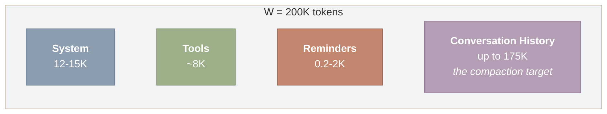
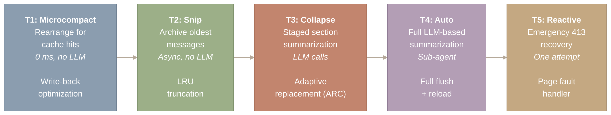
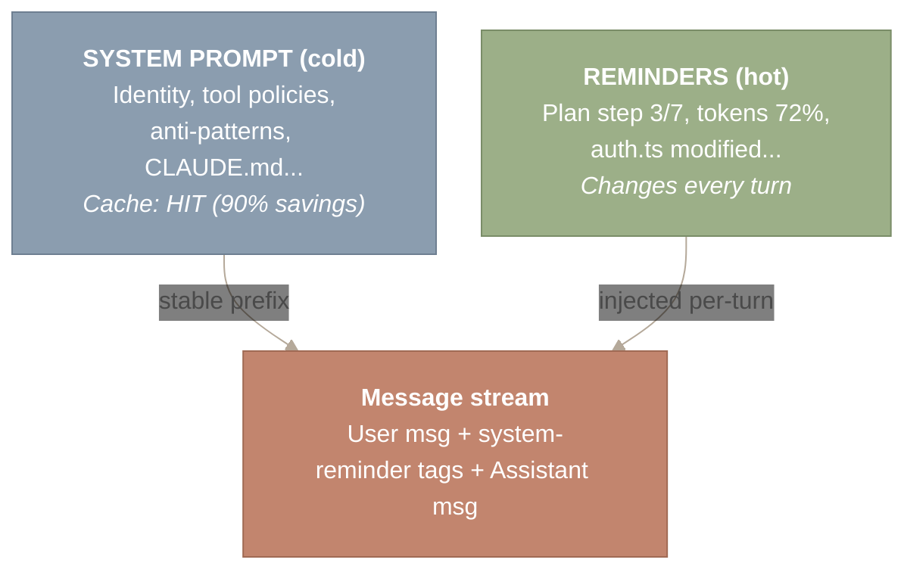
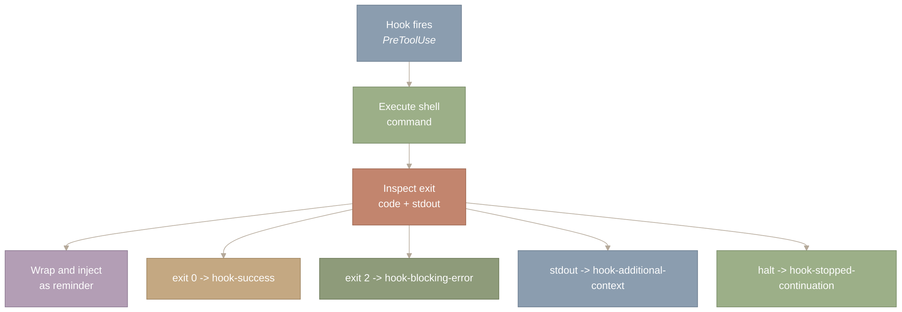
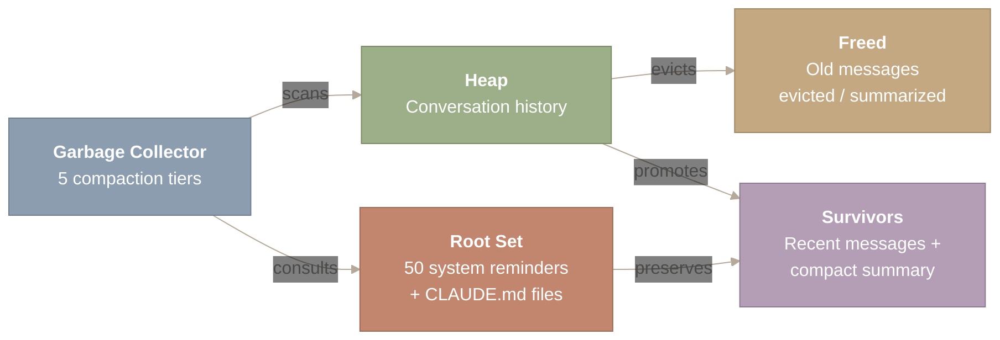

> 译者说明：本文按 2026-08-12 抓取的网页完整翻译，保留原始章节、代码、表格、Mermaid 图源、图注和链接。原文分析基于 Claude Code v2.1.88 的 Source Map；文件行数、工具数量、阈值和实现细节属于该页面快照，不应直接外推到其他版本。

# 上下文压缩（Context Compaction）

## 引言：最稀缺的资源

200K Token 的上下文窗口听起来很宽裕，直到你在一次真实的编码会话中亲眼看着它蒸发殆尽。一个大型源码文件就要消耗 8,000–12,000 个 Token。在 monorepo 中做一次 `grep` 会返回 30,000 个 Token。把测试输出灌进对话里，一个回合就烧掉 50,000 个 Token。一次忙碌的两小时会话轻松产生 400K+ Token 的原始对话——是窗口容量的两倍。

朴素的解法是截断：砍掉最早的消息。大多数开源 Agent 就是这么做的，而这对编码任务来说是灾难性的——Agent 会忘记用户的原始意图，丢掉它在几十个回合里建立起来的心智模型，然后开始做出与先前决定相冲突的修改。

Claude Code 把上下文管理当作一个优化问题：在 Token 预算约束下，最小化信息损失。它的答案是一个多层级压缩级联（compaction cascade），外加一套由 50 种自适应会话中途注入（mid-conversation injection）组成的系统，这些注入在不惊动已缓存 Prompt 前缀的前提下传递易变状态。本文同时覆盖这两套机制：管理对话历史的压缩层级，以及把实时信号送到模型注意力之下的 system reminder 管线。

**本文涉及的源文件：**

| 文件 | 作用 | 规模 |
| --- | --- | --- |
| `src/services/compact/autoCompact.ts` | 主动压缩（Token 阈值触发） | ~300 行 |
| `src/services/compact/compact.ts` | 主压缩执行引擎 | ~500 行 |
| `src/services/compact/microCompact.ts` | 内联 API 压缩（cache_editing） | ~200 行 |
| `src/services/compact/reactiveCompact.ts` | 兜底压缩（413 错误恢复） | ~150 行 |
| `src/services/compact/sessionMemoryCompact.ts` | 跨压缩的会话记忆保存 | ~200 行 |
| `src/services/compact/prompt.ts` | 压缩 Prompt 模板 | ~150 行 |

---

## 预算约束

在研究任何算法之前，先把问题精确地陈述出来。每一次对 Claude 的 API 调用都必须满足一个硬约束：

\[ |S_{\text{system}}| + |H_{\text{history}}| + |T_{\text{tools}}| + |R_{\text{reminders}}| \;\leq\; W \]

其中 \(W\) 是上下文窗口大小（Claude 为 200K Token），\(S\) 是 System Prompt（约 12–15K Token），\(T\) 是工具定义（约 8K Token），\(R\) 是本轮注入的 system reminder。剩下的部分——\(W - |S| - |T| - |R|\)——才是分配给对话历史 \(H\) 的预算。这是**背包问题**（knapsack problem）的一个变体：在 Token 预算约束下，最大化所保留消息的信息价值。



*图 1：上下文窗口预算（W = 200K Token）在四个相互竞争的消耗方之间的划分。System Prompt（12-15K）、工具定义（约 8K）和 system reminder（每轮 0.2-2K）是固定成本，合计消耗约 20-25K Token。对话历史拿走剩余的一切（最多约 175K Token），也是预算超支时压缩层级的唯一作用对象。*

图中四个方框代表固定 200K Token 上下文窗口的四个竞争消耗方，从左到右阅读。System Prompt、工具定义和 reminder 是固定成本，在第一条用户消息发出之前就已消耗约 20-25K Token。剩下的空间——最右侧的“对话历史”——是压缩的唯一作用目标，它的大小是弹性的，这正是本文余下部分要讨论的内容。

固定成本（\(S + T\)）在第一条用户消息发出之前就消耗约 20–23K Token。system reminder 根据轮次不同再增加 200–2,000 个 Token。于是留给历史的约为 175K Token——而所有有趣的工程都发生在历史这一侧，因为历史会无限增长，窗口却不会。

---

## Token 计量：无法度量的东西就无法管理

系统要决定*何时*压缩，先得知道*用了多少 Token*。Claude Code 实现了三种计数方法，各自在准确性和速度之间做取舍——这是每个监控系统都面临的同一个取舍。

| 方法 | 速度 | 使用时机 |
| --- | --- | --- |
| API `count_tokens`（精确 BPE 分词器） | 慢（需要网络） | 会话开始、校准 |
| 字符启发式（字符数 / 4 + 开销） | 快（本地） | 每条消息（主力） |
| 固定估计（常量） | 即时 | 图片（约 2K）、文档（约 2K） |

字符启发式是主力。对于长度为 \(\ell\) 的文本块，估计值为 \(\hat{t} = \lceil \ell / 4 \rceil + 1\)。对于工具调用块，\(\ell\) 同时包含工具名和 JSON 序列化后的输入：

```
// The core estimation logic -- fast, no network, ~85% accurate
function estimateTokens(block: ContentBlock): number {
  switch (block.type) {
    case 'text':
      return Math.ceil(block.text.length / 4) + 1;
    case 'tool_use':
      return Math.ceil(
        (block.name.length + JSON.stringify(block.input).length) / 4
      ) + 1;
  }
}
```

为什么不每次都调用精确分词器？因为那需要一次到 Anthropic API 的网络往返。在每条消息的热路径上，这个延迟是不可接受的。启发式方法快而且保守——它倾向于高估，而在管理一个硬上限时，高估比低估更安全。

Token 监控系统维护一个持续的**警告状态**（warning state），由它驱动压缩决策：

| Token 用量 | 警告状态 | 动作 |
| --- | --- | --- |
| 0–60% | `normal` | 正常运行 |
| 60–75% | `shortened outputs` | 缩短工具输出 |
| 75–90% | `aggressive summarization` | 更激进的摘要 |
| 90%+ | `auto-compact trigger` | 触发自动压缩 |

在计数和压缩之间还有一个关键优化：BashTool 上的 tokenSaverOutput。当一条 bash 命令产生海量输出（测试日志、构建输出、文件列表）时，完整输出会送到 UI 供展示，但送到模型那里的是压缩版本。仅这一个优化，每个会话就能省下数万个 Token，而且从用户视角看没有任何信息损失。

---

## 压缩层级：从免费到昂贵的级联

压缩系统实现了五个层级，每一级都比前一级更激进、更昂贵、触发条件也更严峻。系统总是优先选择能把对话维持在预算内的最轻干预手段。这些层级与已知的缓存驱逐策略一一对应。



*图 2：五个压缩层级，按从最温和（左）到最激进（右）排列，各自对应一个经典的缓存驱逐类比。Tier 1（Microcompact）以零成本重排内容换取缓存命中，不调用 LLM。Tier 2（Snip）通过 LRU 截断归档最旧消息。Tier 3（Collapse）执行分阶段的分节摘要，类似自适应替换缓存（Adaptive Replacement Cache）。Tier 4（Auto）启动一个完整的基于 LLM 的摘要子 Agent。Tier 5（Reactive）仅在 API 返回 413 错误时触发，只保留最后 4 条消息，充当紧急的缺页处理程序。*

从最左侧的 Tier 1 开始，沿着箭头向右，经过一系列越来越激进的压缩策略。每个方框标出层级名称、它做什么、它的成本（从零成本重排到一次完整的 LLM 子 Agent 调用），以及它对应的经典缓存驱逐策略。系统总是优先选择能把对话维持在预算内的最轻层级；只有当更便宜的层级不够用时，才向右升级。

### Tier 1：Microcompact——为缓存命中而重排

Microcompact 完全不缩小对话体积。它管理的是 Prompt 缓存失效，目标是最小化 API 成本。Claude Code 发送请求时，会使用 Anthropic 的 `cache_editing` beta 特性把若干段落标记为可缓存。已缓存段落的任何改动，都会使其后所有内容的缓存失效。

Microcompact 检测这些缓存断点，并做最小限度的内容重排。如果对话中间的一条 system reminder 发生变化（比如 Token 警告状态更新了），Microcompact 会把易变内容推到末尾，保住稳定前缀的缓存。可以把它理解为 Prompt 缓存的碎片整理。没有数据丢失——只是为了更高的命中率重新组织。

### Tier 2：Snip Compact——LRU 归档

当 Token 缓冲超出目标值 13K 以上时，Snip Compact 激活。它不做任何摘要，而是执行归档：较旧的消息被移入单独的存储，原地替换为一个轻量标记。这是教科书式的 LRU（Least Recently Used，最近最少使用）驱逐。最早的消息——探索性的文件读取、目录列表、结构勘察——对溯源有价值，但对正在进行的工作没有价值。Snip Compact 把它们从活跃预算中移除，不需要昂贵的 LLM 调用。

### Tier 3：Context Collapse——分阶段摘要

当用量超过 90% 时，系统开始按组分节摘要。它会先识别出逻辑小节——一次调试会话、一串文件编辑、一轮代码评审——再分别做摘要，而不是把整段对话一次性压成一团。这样，上下文会逐步降级，不会在某个阈值突然丢失大块信息：

```
At 90% usage:  oldest section summarized
At 92% usage:  next oldest section summarized
At 94% usage:  third section summarized
...
Conversation degrades gracefully, not catastrophically
```

这类似于 ARC（Adaptive Replacement Cache，自适应替换缓存）管理驱逐的方式——不依赖单一的驱逐策略，而是根据负载自适应地在多种策略之间取得平衡。

### 第 4 层：Auto Compact——完整摘要器

这是大多数用户会遇到的层。当 Token 数量达到 `effectiveContextWindow - 13K` 时，Auto Compact 会通过 `runForkedAgent()` 启动一个 **压缩子 Agent**（compaction sub-agent），该子 Agent 从父 Agent 分叉出来。这个分叉与父 Agent 共享模型和 prompt cache 前缀；没有固定的模型层级，因为子 Agent 使用的就是父 Agent 所用的模型。这种设计意味着，冗长的 System Prompt 和对话前缀会被缓存命中，而不是产生冗余开销。子 Agent 把对话中较早的部分摘要成一份结构化摘要。

**九段式压缩提示词。** 子 Agent 的指令来自 `src/services/compact/prompt.ts` 中的 `BASE_COMPACT_PROMPT`，这是一个覆盖九个部分的结构化模板：(i) 主要请求和意图，(ii) 关键技术概念，(iii) 文件和代码片段（含相关代码），(iv) 遇到的错误及修复，(v) 问题解决方法，(vi) 所有用户消息的原文，(vii) 待办任务，(viii) 正在进行的工作，(ix) 一个可选的下一步。这样做摘要时，讨论内容、决策原因、技术状态和用户意图都能被保留下来。

**双块输出格式。** 子 Agent 的输出遵循双块结构。第一块是 `<analysis>` 草稿块，子 Agent 在其中按时间顺序推理整个对话，识别哪些内容重要、哪些可以丢弃。第二块是 `<summary>` 块，包含真正的结构化摘要。在注入时，运行时的 `formatCompactSummary()` 函数会在把摘要插入上下文之前剥掉 `<analysis>` 块。这是一个刻意的设计：草稿块给了子 Agent 仔细推敲该保留什么的空间，但推敲过程本身不会消耗它刚刚释放出来的 Token 预算。只有提炼后的 `<summary>` 会进入对话历史。

生成的摘要遵循一致的格式：

```
This session is being continued from a previous conversation
that ran out of context.

Summary:
- Scope: 47 earlier messages compacted (user=18, assistant=20, tool=9)
- Tools mentioned: bash, read, edit, grep
- Recent user requests:
  - Fix the authentication middleware for expired tokens
  - Add unit tests for the token refresh flow
- Key files: src/auth/middleware.ts, tests/auth/middleware.test.ts
- Current work: Implementing retry logic for failed refreshes
```

有两个关键机制防止灾难发生。第一个是递归守卫：压缩子 Agent 的 `querySource` 被设置为 `'compact'`，压缩触发器会检查这一点并抑制自身。没有这个守卫，压缩会触发压缩，形成无限循环。第二个是预算结转：系统在压缩前记录 Token 数量，这样摘要替换原始消息之后，计费和进度追踪仍然准确。

递归守卫与可重入锁（reentrant lock）或 Solidity 智能合约中的重入守卫（reentrancy guard）是同一个模式。当一个系统可以递归调用自身时，你需要一个显式检查来防止无限循环。

### 第 5 层：Reactive Compact——缺页处理器

尽管有多层主动防御，边缘情况仍然存在。某个 Tool 结果出乎意料地大。多个系统提醒同时注入。启发式估算低估了真实数量。当 API 返回 **413 Prompt Too Long** 错误时，Reactive Compact 触发。它执行一次立即且激进的压缩——只保留最后 4 条消息，把其余全部摘要——然后重试。

一个单次尝试守卫（`hasAttemptedReactiveCompact`）防止重试循环。如果一次反应式压缩还不够，错误会呈现给用户。这一层存在的原因是**没有完美的估算系统**。与其去工程化一个完美的 Token 计数器，Claude Code 选择接受不精确，并提供一条稳健的恢复路径。

---

## 压缩实战：一场两小时的会话

为了把这些讲具体，我们来看上下文管理在一场真实的编码会话中的表现。下图展示了 Token 使用量特有的“锯齿”模式：压缩事件周期性地把使用量压回去。

```mermaid
%%{init: {'theme': 'neutral', 'flowchart': {'useMaxWidth': false, 'htmlLabels': true, 'padding': 20, 'nodeSpacing': 30, 'rankSpacing': 40}, 'themeVariables': {'primaryColor': '#8B9DAF', 'primaryTextColor': '#ffffff', 'primaryBorderColor': '#6E7F91', 'secondaryColor': '#9CAF88', 'secondaryTextColor': '#ffffff', 'secondaryBorderColor': '#7A8D68', 'tertiaryColor': '#C2856E', 'tertiaryTextColor': '#ffffff', 'tertiaryBorderColor': '#A06A54', 'lineColor': '#B5A99A', 'textColor': '#4A4A4A', 'mainBkg': '#8B9DAF', 'nodeBorder': '#6E7F91', 'clusterBkg': 'rgba(139,157,175,0.12)', 'clusterBorder': '#B5A99A', 'edgeLabelBackground': 'transparent'}}}%%
flowchart LR
  subgraph Phase1["Bootstrap (0-5 min)"]
    B1["~17K tokens<br>System prompt +<br>first messages"]
  end

  subgraph Phase2["Exploration (5-30 min)"]
    E1["Tokens grow<br>to ~95K"]
    E2["T2 Snip<br>drops ~15K"]
  end

  subgraph Phase3["Implementation (30-55 min)"]
    I1["Tokens grow<br>to ~185K"]
    I2["T2 Snip<br>trims briefly"]
    I3["T4 Auto Compact<br>drops to ~30K"]
  end

  subgraph Phase4["Second Phase (65-100 min)"]
    S1["Tokens regrow<br>to ~185K"]
    S2["T4 Auto Compact<br>drops to ~35K"]
  end

  subgraph Phase5["Final Push (100-120 min)"]
    F1["Tokens at ~140K<br>Session ends"]
  end

  B1 --> E1
  E1 --> E2
  E2 --> I1
  I1 --> I2
  I2 --> I3
  I3 --> S1
  S1 --> S2
  S2 --> F1
  style B1 fill:#8B9DAF,color:#fff,stroke:#6E7F91
  style E1 fill:#9CAF88,color:#fff,stroke:#7A8D68
  style E2 fill:#C2856E,color:#fff,stroke:#A06A54
  style I1 fill:#B39EB5,color:#fff,stroke:#8E7A93
  style I2 fill:#C4A882,color:#fff,stroke:#A08562
  style I3 fill:#8E9B7A,color:#fff,stroke:#6E7B5A
  style S1 fill:#8B9DAF,color:#fff,stroke:#6E7F91
  style S2 fill:#9CAF88,color:#fff,stroke:#7A8D68
  style F1 fill:#C2856E,color:#fff,stroke:#A06A54
```



*图 3：一场两小时编码会话中的锯齿形 Token 使用模式，依次经历五个阶段。引导阶段（0–5 分钟）达到约 17K Token。探索阶段（5–30 分钟）增长到约 95K，然后一次第 2 层裁剪削掉约 15K。实现阶段（30–55 分钟）增长到约 185K，触发了多次第 2 层裁剪和一次第 4 层 Auto Compact，把使用量重置到约 30K。循环在第二个实现阶段重演，第 95 分钟发生第二次第 4 层压缩。最后冲刺阶段以约 140K Token 结束会话。*

图中自左向右的箭头链穿过五个会话阶段，每个阶段代表一个时间窗口。Token 数量在每个阶段内爬升（绿色节点），直到某个压缩事件触发（赭红/紫色节点），把数量压回去。这种特有的“锯齿”形状——使用量不断上升、间以骤降——展示了各压缩层如何让一场 400K+ Token 的会话始终运行在 200K 窗口之内。

**第 0–5 分钟：引导阶段。** System Prompt 完成组装（约 12K Token）。用户描述自己的任务。总计约 17K Token。所有层都处于休眠状态。

**第 5–30 分钟：探索阶段。** Agent 读取文件、运行 grep、查看项目结构。每个 Tool 结果增加 2K–8K Token。大约在第 25 分钟，缓冲区超出目标 13K 以上。**第 2 层（裁剪）** 悄悄归档最早的探索消息。Token 数量下降约 15K。

**第 30–55 分钟：实现阶段。** 活跃的代码编写、测试运行、迭代。Token 增长加速，因为编辑会产生 diff，而测试输出很啰嗦。发生多次第 2 层裁剪。大约在第 50 分钟，使用量越过 90%。**第 3 层（Context Collapse）** 开始对最早的实现部分做分阶段摘要。

**第 55–65 分钟：第一次 Auto Compact。** 尽管有第 3 层，持续的 Tool 调用还是把使用量推到了阈值。**第 4 层触发。** 子 Agent 摘要除最后 4 条消息以外的所有内容。Token 从约 185K 降到约 30K。用户短暂看到“[compacting conversation…]”。摘要保留了：修改过哪些文件、原始意图、测试状态、剩余工作。

**第 65–100 分钟：第二阶段。** 预算重置。模式重演。大约在第 95 分钟，第 4 层第二次触发。这次摘要内容更丰富，因为它纳入了上一份摘要——`merge_compact_summaries` 函数会把之前的上下文叠放在“Previously compacted context”（此前压缩的上下文）之下。

**第 100–120 分钟：最后冲刺。** 滚动窗口的模式很清晰：最近 20–30 分钟保持完整保真度，之前的一切只有压缩历史。如果此时触发 413，第 5 层会透明地处理掉。

结果是：一场在朴素实现中会消耗 400K+ Token 的会话，舒适地运行在 200K 窗口之内，且用户感觉不到最近工作的质量有任何下降。

经济影响相当可观。没有压缩的话，一场 400K Token 的两小时会话，成本大约是有压缩时的 2 倍。乘以数百万场会话，节省下来的费用足以覆盖这项工程投入的许多倍。压缩不只是一个技术特性——它是一项业务必需。

---

## 系统提醒：50 种自适应的会话中途注入

压缩管理的是模型*遗忘*什么。系统提醒（system reminder）管理的是模型*学到*什么——在一轮对话中途注入，不需要用户输入，也不会破坏 prompt cache。你在 Claude Code 中进行的每一轮对话，都会有不可见的 XML 被注入到你的会话里。你永远看不到它。模型每次都看得到。

这些 `<system-reminder>` 标签携带 50 种不同的通知类型，在 `messages.create()` 时被织入消息流。它们是 Agent 的神经系统：持续、自适应、对最终用户不可见。关键约束是：提醒必须放在会话消息里，而不是 System Prompt 里，因为 System Prompt 是被缓存的（每轮约 15K Token，节省 90% 成本），任何一个字节的变化都会使缓存失效。



*图 4：面向 prompt 经济性的冷热数据分离。System Prompt（冷数据）在服务端缓存，TTL 为 5 分钟，带来 90% 的成本节省；它必须在各轮之间保持字节级一致。系统提醒（热数据）每轮都在变化——计划步骤、Token 百分比、修改过的文件——因此注入到消息流中而不是 System Prompt 中，以保护缓存。*

图中底部的消息流由两个来源汇入。左上的“SYSTEM PROMPT”框代表冷的、被缓存的数据，它在各轮之间保持字节级一致，换来 90% 的成本节省。右上的“REMINDERS”框代表热的、易变的数据，每轮都在变化。箭头显示两者都汇入消息流，但提醒被特意注入到会话消息中（而不是 System Prompt 中），正是为了保护稳定前缀上的缓存。

### Reminder 分类体系

这 50 种 reminder 类型被组织成 10 个类别，每个类别处理一类不同的对话中途上下文。可以把它类比为 x86 处理器的中断向量表：CPU 有约 256 种中断类型，按类别组织（硬件故障、软件陷阱、外部中断），每种中断携带特定上下文并触发特定的处理程序。

| 类别 | 数量 | Reminder 类型 |
| --- | --- | --- |
| **Plan & Mode** | 6 | plan_mode (5-phase / iterative / subagent), plan_mode_reentry, plan_mode_exit, auto_mode, auto_mode_exit, plan_file_reference |
| **File & IDE State** | 7 | edited_text_file, directory, file (text/image/notebook/pdf), compact_file_reference, pdf_reference, selected_lines_in_ide, opened_file_in_ide |
| **Hook Results** | 5 | hook_success, hook_blocking_error, hook_additional_context, hook_stopped_continuation, async_hook_response |
| **Resource Budget** | 4 | token_usage, budget_usd, output_token_usage, task_status |
| **Memory & Context** | 6 | nested_memory, relevant_memories, compaction_reminder, context_efficiency, date_change, current_session_memory |
| **Skills & Commands** | 4 | invoked_skills, skill_listing, skill_discovery, queued_command |
| **Task Management** | 3 | todo_reminder, task_reminder, verify_plan_reminder |
| **Tool & Agent Changes** | 5 | deferred_tools_delta, agent_listing_delta, mcp_instructions_delta, agent_mention, mcp_resource |
| **Behavioral** | 5 | output_style, diagnostics, ultrathink_effort, critical_system_reminder, companion_intro |
| **Team** | 3 | team_context, teammate_mailbox, teammate_shutdown_batch |

这些类别不是随意划分的。它们对应 agent 的运行关注点：

**Plan Mode（5）** 跟踪 agent 在多步执行中所处的位置。仅 `plan-mode-is-active` 这一个 reminder 就有三个变体——5-phase、iterative 和 subagent——因为不同的规划策略需要不同的指令。在 compaction 丢弃对话历史之后，这些 reminder 往往是 agent 知道自己进行到哪一步的*唯一*机制。

**File State（6）** 是感知层。当用户在 Claude Code 之外编辑了文件，`file-modified-by-user` 触发。当 IDE 中打开了某个文件，`file-opened-in-ide` 把该上下文注入进来。这些 reminder 赋予 agent 一种它原本完全不具备的环境感知能力——它看不到文件系统；这些 reminder 就是它的眼睛。

**Hook Results（5）** 闭合了 [hooks 系统](https://y-agent.github.io/inside-claude-code/11-hooks-lifecycle.html)与 agent 推理之间的反馈回路。当一个 PreToolUse hook 拦截了某条命令，`hook-blocking-error` 会告诉模型发生了什么以及为什么。没有这层反馈，模型会无限重试同一条被拦截的命令。

**Resource Budget（3）** 实现背压（backpressure）。Token 压力、美元预算和任务状态不是装饰性的警告——它们会随着资源消耗，促使模型缩短回复、更节制地调用工具。

### Sparse 与 Full：自适应选择

不是每个 reminder 都会在每一轮触发。系统会根据上下文是新信息还是冗余信息，在 `full` 和 `sparse` 两种变体之间自适应选择。

| 变体 | 使用时机 | Token 成本 |
| --- | --- | --- |
| **full** | 首次出现、关键状态变化、compaction 之后 | ~500 tokens |
| **sparse** | 重复/稳定状态、非关键更新 | ~20 tokens |

例如，plan mode reminder 在 full 模式下包含全部五个阶段的规划指令（约 500 tokens）。在 sparse 模式下，它收缩为 “Plan mode active. Continue current phase.”（约 20 tokens）——在重复的轮次上减少了 96%。

它与自适应码率流媒体的类比是精确的。Netflix 并不总是请求最高画质的视频；它监控带宽、缓冲区水位和播放状态，然后选择合适的码率。Claude Code 的 reminder 系统做的是同样的事：它监控对话状态，注入合适程度的细节。上下文是新信息时用 full，状态稳定时用 sparse。

---

## Hook 到 Reminder 的流水线

Hook 在生命周期事件发生时执行 shell 命令（见 [Hooks 与生命周期](https://y-agent.github.io/inside-claude-code/11-hooks-lifecycle.html)）。但如果模型不知道发生了什么，光有执行是没有用的。Hook 到 reminder 的流水线闭合了这个回路：hook 的结果变成 system reminder，为模型的下一步决策提供信息。



*图 5：Hook 到 reminder 的流水线，展示从 hook 触发到注入对话的四阶段流程。一个生命周期 hook（如 PreToolUse）触发，执行 shell 命令，检查退出码和 stdout，然后把结果包装成带类型的 system reminder。退出码 0 产生 hook-success；退出码 2 产生 hook-blocking-error（告诉模型换一种方法）；stdout 内容产生 hook-additional-context（例如不经显式工具调用就注入的 lint 反馈）。*

这张图从顶部开始读：一个生命周期 hook 触发，然后沿垂直链条向下依次经过执行、检查和注入——时间自上而下流动。在 “Inspect exit code + stdout” 节点，流程在右侧分出四种可能的结果：成功（退出码 0）、阻断错误（退出码 2）、附加上下文（stdout 内容）或停止续行（halt）。每个分支产生不同类型的 system reminder，模型在下一轮读取它。

五种 hook reminder 类型构成了一套完整的结果分类：

| Reminder 类型 | 触发条件 | 模型行为 |
| --- | --- | --- |
| `hook-success` | Hook 以 0 退出，无阻断输出 | 正常继续 |
| `hook-blocking-error` | Hook 以 2 退出（deny） | 停止当前做法；尝试不同策略 |
| `hook-stopped-continuation` | Hook 中止了后续执行 | 确认中止；不要重试 |
| `hook-stopped-continuation-prefix` | Hook 中止但带部分输出 | 使用这部分输出 |
| `hook-additional-context` | Hook 的 stdout 含有额外信息 | 纳入推理过程 |

`hook-additional-context` 类型特别有意思。一个挂在 `Write` 上的 PostToolUse hook 可能运行 linter 并把结果输出到 stdout。这份输出会在下一轮变成 system reminder，让模型无需显式工具调用就能获得 lint 反馈。hook 充当传感器，reminder 充当把信号传向大脑的感觉神经。

这是带有一个变奏的**观察者模式（Observer pattern）**。经典观察者模式：主体改变状态，通知观察者，观察者作出反应。这里则是：hook 执行（事件），结果被捕获（通知），*模型*在下一轮作出反应（观察者回调）。变奏在于观察者不是代码——它是一个在解读自然语言反馈的语言模型。

---

## 文件状态与资源背压

有两个 reminder 类别值得额外关注，因为它们解决的问题困扰着每一个 LLM 编码 agent。

文件状态 reminder 解决的是过期读取（stale-read）风险。当模型在第 3 轮读取了一个文件，而用户在第 7 轮从外部编辑了它，模型脑中对那个文件的认知此刻就是错的。没有 `file-modified-by-user` reminder，模型可能在第 8 轮覆盖掉用户的修改。这与 `inotify`（Linux）和 `FSEvents`（macOS）为应用程序解决的是同一个缓存一致性问题——维持内存中状态与磁盘上现实之间的一致性。

与 IDE 相关的 reminder（`file-opened-in-ide`、`lines-selected-in-ide`）在人与 agent 之间建立了一条共享的注意力通道。当你打开一个文件并选中特定行时，模型甚至在你输入 prompt 之前就收到了关于你正在看什么的主动上下文。这是主动式上下文注入——信息被推送是因为相关，而不是因为它被请求了。

**资源预算 reminder** 实现的是分布式系统意义上的背压。当 token 用量从 40% 攀升到 70% 再到 90%，reminder 从缺席升级为提醒再升级为紧急。模型随之转变行为：更短的回复、更高效的工具使用，最终收尾。当用户设置了 `--max-cost` 时，`usd-budget` reminder 对美元开销做同样的事。两者都是闭环控制系统：下游消费者（上下文窗口、钱包）向上游生产者（模型）发出减少产出的信号。

---

## AOP 类比：为 Prompt 而生的横切关注点

reminder 系统为 LLM 对话实现了**面向切面编程（aspect-oriented programming）**。它与 AspectJ 或 Spring AOP 这类 AOP 框架在结构上的映射是精确的，而非比喻：

| AOP 概念 | System Reminder 对应物 |
| --- | --- |
| **Aspect（切面）** | 一种 reminder 类别（plan、file、hook……） |
| **Join point（连接点）** | 对话流中的一个位置（在下一次 API 调用之前） |
| **Advice（通知）** | 在该位置注入的 reminder 内容 |
| **Pointcut（切点）** | 选择逻辑（plan mode 是否激活？是否有 hook 触发？） |
| **Weaving（织入）** | 在 `messages.create()` 时刻进行的运行时注入 |
| **Cross-cutting concern（横切关注点）** | Token 状态、plan 进度、文件变更——横跨所有轮次 |

使这套机制成为 AOP 而非简单中间件的关键性质在于：**reminder 与核心对话是正交的**。用户的消息和模型的回复构成基础程序。reminder 被织入其中，却不改动任何一方——用户从不输入 `<system-reminder>`，模型的回复中也不包含它们。它们存在于一个独立的平面上，只在连接点处与对话相交。

这种正交性在 prompt 中带来的好处与它在代码中带来的好处相同：你可以添加、删除或修改某个 reminder 类别，而无需触碰 system prompt、tool 定义或任何其他 reminder 类别。这就是 prompt 层面的关注点分离。

AOP 被发明出来是为了解决软件中的"散布与纠缠"（scattering and tangling）问题：横切代码散布在各个模块中，并与业务逻辑纠缠在一起。LLM prompt 有同样的问题——Token 预算感知、plan 状态跟踪、文件变更检测，这些关注点横切每一轮对话，却不属于基础 system prompt。reminder 解决 prompt 散布问题的方式，与切面解决代码散布问题的方式相同。

---

## 记忆持久化：活过会话的知识

Compaction 管理的是*会话内*的记忆问题。但*跨会话*的知识怎么办？当一次 Tier 4 compaction 触发、丢弃了两小时会话的历史时，某些知识应当存活下来：用户偏好用 Tab 而不是空格、项目使用某个特定的测试框架、某个特定文件是入口点。

Claude Code 通过 `memory-file-contents` 和 `nested-memory-contents` 这两种 reminder 类型来解决这个问题。CLAUDE.md 文件——可以放在项目根目录、子目录或 `~/.claude/` 中——在会话启动时加载，并作为 system reminder 注入。在 compaction 丢弃对话历史之后，这些记忆文件依然完好，因为它们会作为 reminder 流水线的一部分在每一轮被重新注入。

`session-continuation` reminder 服务于一个相关目的。当会话在中断后恢复，或者 Tier 4 compaction 重置了对话时，这种 reminder 会携带一份关于已完成工作的压缩摘要继续向前。它是旧上下文（现已被摘要化）与新上下文（全新开始）之间的桥梁。

这些机制共同构成了一个三层记忆架构：

1. **瞬时记忆**——对话历史，由五个 compaction 层级管理
2. **会话记忆**——在会话内能活过 compaction 的压缩摘要
3. **持久记忆**——跨会话存活的 CLAUDE.md 文件和用户偏好

这对应着任何数据库系统中的存储层级：RAM（快、易失、容量有限）、WAL/日志（在事务内存活于崩溃）、磁盘（存活于重启，实际上是永久的）。

---

## 总结

退后一步，全貌浮现。Claude Code 的上下文管理系统是一个面向对话历史的垃圾回收器。



*图 6：垃圾回收器类比，将 Claude Code 的上下文管理映射为 JVM 分代 GC。五个 compaction 层级充当回收器，扫描对话历史（堆）。system reminder 和 CLAUDE.md 文件构成根集合——这些引用永远不会被回收，能活过每一次 compaction 周期。最近的消息和压缩摘要是跨代晋升的存活对象；旧消息是被驱逐或被摘要掉的已释放对象。*

图 6 中，左侧的"Garbage Collector"节点驱动整个流程：它扫描"Heap"（对话历史）并查询"Root Set"（system reminder 和 CLAUDE.md 文件）。箭头展示了两种结果——旧消息被驱逐或被摘要后进入"Freed"，而最近的消息和压缩摘要则晋升进入"Survivors"。根集合永远不会被回收；它是在每一次 compaction 周期中保住关键上下文的锚点。

与 JVM 中的分代垃圾回收器一样，这套系统把内存划分为不同的代。年轻消息（最近的轮次）以完整保真度保留。老消息被晋升到摘要代。远古消息则被整体回收。根集合——system reminder、CLAUDE.md 内容以及用户最近的消息——永远不会被回收。

这种平行关系还能进一步延伸：

- **Stop-the-world 停顿**对应 Tier 4 compaction，agent 会短暂停下来做摘要（"compacting conversation…"）。
- **并发回收**对应 Tier 2 的 snip，它异步发生，不阻塞对话。
- **写屏障**对应那个防止 compaction 触发 compaction 的递归守卫。
- **终结处理（finalization）**对应 `merge_compact_summaries` 函数，它把先前的摘要折叠进新摘要，确保没有摘要成为孤儿。

system reminder 流水线补全了这个类比：它是维护根集合的机制。在每一个 GC 周期（每一次 API 轮次）上，50 种 reminder 类型都会被重新评估，确保关键的易失状态——plan 进度、文件修改、资源压力——即使在回收丢弃了最初包含这些状态的消息之后，依然保持可达。

**上下文管理是伪装起来的缓存淘汰。**五个层级映射到已知策略：缓存行重排（T1）、LRU 截断（T2）、自适应替换（T3）、全量冲刷并重载（T4）、故障恢复（T5）。认出这个形状，你就能借用数十年的系统研究成果。

**易失上下文必须生活在缓存区域之外。**system prompt 是一份 15K Token 的缓存资产。reminder 是每轮都变化的易失信号。把它们混在一起会摧毁缓存。热/冷分离与数据库架构师用来把工作集留在缓冲池中的模式是同一个。

**自适应注入胜过固定注入。**sparse/full 判别器在状态稳定的轮次上节省多达 96% 的 Token，同时在状态变化时保留完整上下文。当成本差异达到 25 倍时，用一个简单谓词（这个状态变了吗？）选出两个级别就足够了。

**渐进式降级胜过悬崖式失败。**逐级推进的方式——先 Tier 2 snip，再 Tier 3 摘要化，最后 Tier 4 全量 compaction——意味着对话是优雅降级的。用户永远不会经历突然的上下文丢失。

**reminder 是让 hook 变得有用的反馈回路。**没有 hook 到 reminder 的流水线，hook 就只是不可见的副作用。这条流水线把 hook 从不透明的动作转变为可观察的事件，进而塑造模型的推理。

**Prompt Caching 把架构变成了经济学。**静态/动态分段的切分在 system prompt 成本上节省多达 90%。把易失的 MCP 指令放在最后、把稳定片段排在前面——每一个架构决策都服务于这个经济目标。在一个服务数百万会话的产品中，这就是可行与破产之间的差别。

上下文管理系统是让 Claude Code 中其他一切成为可能的隐形地基。[tool 系统](https://y-agent.github.io/inside-claude-code/05-tool-system.html)、[agent loop](https://y-agent.github.io/inside-claude-code/02-agent-loop-query-engine.html)、[多 agent 编排器](https://y-agent.github.io/inside-claude-code/07-multi-agent-orchestration.html)——它们都假设对话能在用户需要的时长内保持连贯。五个 compaction 层级和 50 种 system reminder 正是让这个假设成立的东西。

---

## 附录：System Reminder 类型完整清单

每条 system reminder 都通过 `messages.ts` 中的 `normalizeAttachmentForAPI()` 函数注入，该函数会把 attachment 内容包裹在 `<system-reminder>` XML 标签中，再插入消息流。另有少数 reminder 由专门的模块直接注入（下文已注明）。下表按类别分组，列出全部 50 种类型。

**计划与模式（6 种）**

| 类型 | 触发条件 | 内容摘要 | 实现位置 |
| --- | --- | --- | --- |
| `plan_mode` | Plan mode 被激活 | 完整的规划指令（5 阶段、迭代式或 subagent 变体）；完整模式下约 500 个 token，精简模式下约 20 个 | `src/utils/attachments.ts` → `getPlanModeInstructions()` |
| `plan_mode_reentry` | 退出后重新进入 Plan mode | 指示读取已有计划文件，对照新请求评估，决定从头开始还是继续 | `src/utils/messages.ts` |
| `plan_mode_exit` | 退出 Plan mode | "You have exited plan mode. You can now make edits, run tools, and take actions." | `src/utils/messages.ts` |
| `auto_mode` | Auto mode 被激活 | Auto mode 行为指令 | `src/utils/attachments.ts` → `getAutoModeInstructions()` |
| `auto_mode_exit` | 退出 Auto mode | "You have exited auto mode. Ask clarifying questions when the approach is ambiguous." | `src/utils/messages.ts` |
| `plan_file_reference` | 压缩之后仍存在计划文件 | 完整的计划文件内容和路径；指示相关时继续执行 | `src/utils/messages.ts` |

**文件与 IDE 状态（7 种）**

| 类型 | 触发条件 | 内容摘要 | 实现位置 |
| --- | --- | --- | --- |
| `edited_text_file` | 文件被外部修改（用户或 linter） | 携带文件名和 diff 片段的通知；"Don't revert unless the user asks" | `src/utils/messages.ts` |
| `directory` | 目录列表被注入 | 包装成合成的 `ls` tool_use / tool_result 对 | `src/utils/messages.ts` |
| `file` | 文件内容被附加（文本、图片、notebook、PDF） | 包装成合成的 FileRead tool_use / tool_result；文件超过 `MAX_LINES_TO_READ` 时追加截断说明 | `src/utils/messages.ts` |
| `compact_file_reference` | 文件之前读过，现已被压缩 | "You already read this file" 引用，附缩略内容 | `src/utils/messages.ts` |
| `pdf_reference` | PDF 文件被附加 | 带页码引用的 PDF 内容 | `src/utils/messages.ts` |
| `selected_lines_in_ide` | 用户在已连接的 IDE 中选中了若干行 | 文件路径、行范围和选中内容——主动注入上下文 | `src/utils/attachments.ts` |
| `opened_file_in_ide` | 用户在已连接的 IDE 中打开了文件 | 文件路径通知——人与 agent 之间的共享注意力通道 | `src/utils/attachments.ts` |

**Hook 结果（5 种）**

| 类型 | 触发条件 | 内容摘要 | 实现位置 |
| --- | --- | --- | --- |
| `hook_success` | Hook 以退出码 0 结束（仅 `SessionStart` 和 `UserPromptSubmit` 事件） | "{hookName} hook success: {stdout}" | `src/utils/messages.ts` |
| `hook_blocking_error` | Hook 以退出码 2 结束（deny） | "{hookName} hook blocking error from command: '{cmd}': {error}"——模型必须换一种做法 | `src/utils/messages.ts` |
| `hook_additional_context` | Hook 的 stdout 携带额外信息 | "{hookName} hook additional context: {lines}"——例如 PostToolUse hook 管道输出的 lint 结果 | `src/utils/messages.ts` |
| `hook_stopped_continuation` | Hook 中止后续执行 | "{hookName} hook stopped continuation: {message}"——模型不得重试 | `src/utils/messages.ts` |
| `async_hook_response` | 异步 Hook 在初始回合之后完成 | 延迟的 Hook 结果在后续回合送达 | `src/utils/messages.ts` |

**资源预算（4 种）**

| 类型 | 触发条件 | 内容摘要 | 实现位置 |
| --- | --- | --- | --- |
| `token_usage` | 每个回合（追踪开启时） | "Token usage: {used}/{total}; {remaining} remaining" | `src/utils/messages.ts` |
| `budget_usd` | 设置了 `--max-cost` 标志 | "USD budget: \({used}/\){total}; ${remaining} remaining" | `src/utils/messages.ts` |
| `output_token_usage` | 输出 token 预算功能开启 | "Output tokens — turn: {current}/{budget} · session: {total}" | `src/utils/messages.ts` |
| `task_status` | 后台 agent 完成、失败或被终止 | 任务 ID、类型、状态、增量摘要；对仍在运行的任务警告"Do NOT spawn a duplicate" | `src/utils/messages.ts` |

**记忆与上下文（6 种）**

| 类型 | 触发条件 | 内容摘要 | 实现位置 |
| --- | --- | --- | --- |
| `nested_memory` | 会话开始（加载 CLAUDE.md 文件） | "Contents of {path}:" 后接完整的 CLAUDE.md 内容 | `src/utils/messages.ts` |
| `relevant_memories` | 自动记忆系统找到匹配的已存记忆 | 带时效性说明的记忆头部 + 记忆内容 | `src/utils/messages.ts`, `src/memdir/memoryAge.ts` |
| `compaction_reminder` | 自动压缩开启 | "Auto-compact is enabled. Older messages will be automatically summarized. You have unlimited context." | `src/utils/messages.ts` |
| `context_efficiency` | `HISTORY_SNIP` Feature Flag 开启 | 来自 `snipCompact.js` 的精简提示文本——鼓励简洁回复 | `src/services/compact/snipCompact.js` |
| `date_change` | 会话期间日历日期发生变化 | "The date has changed. Today's date is now {date}. DO NOT mention this to the user." | `src/utils/messages.ts` |
| `current_session_memory` | 会话记忆跨压缩保留 | 能在第 4 级（Tier 4）压缩后存活的会话级记忆内容 | `src/utils/attachments.ts` |

**Skill 与命令（4 种）**

| 类型 | 触发条件 | 内容摘要 | 实现位置 |
| --- | --- | --- | --- |
| `invoked_skills` | 当前会话中调用了 Skill | "The following skills were invoked. Continue to follow these guidelines:" + 完整的 Skill 内容 | `src/utils/messages.ts` |
| `skill_listing` | 项目中存在可用 Skill | "The following skills are available for use with the Skill tool:" + Skill 名称与描述 | `src/utils/messages.ts` |
| `skill_discovery` | 为当前任务自动发现相关 Skill | "Skills relevant to your task:" + 匹配到的 Skill 名称；由 `EXPERIMENTAL_SKILL_SEARCH` Feature Flag 控制 | `src/utils/messages.ts` |
| `queued_command` | 回合中途有斜杠命令排队 | 排队的命令文本，可能附带图片；以 `/` 开头的命令会包裹在 `<command-name>` 标签中 | `src/utils/messages.ts` |

**任务管理（3 种）**

| 类型 | 触发条件 | 内容摘要 | 实现位置 |
| --- | --- | --- | --- |
| `todo_reminder` | 最近未使用 TodoWrite 工具 | "Consider using the TodoWrite tool to track progress" + 现有待办列表（如有） | `src/utils/messages.ts` |
| `task_reminder` | 最近未使用 TaskCreate/TaskUpdate | "Consider using TaskCreate/TaskUpdate to track progress" + 现有任务；由 `TodoV2` Feature Flag 控制 | `src/utils/messages.ts` |
| `verify_plan_reminder` | 计划实施完成 | "Call the VerifyPlanExecution tool to verify all plan items were completed" | `src/utils/messages.ts` |

**工具与 Agent 变化（5 种）**

| 类型 | 触发条件 | 内容摘要 | 实现位置 |
| --- | --- | --- | --- |
| `deferred_tools_delta` | MCP 工具变为可用或不可用 | 列出新可用的延迟加载工具或已断开的工具 | `src/utils/messages.ts` |
| `agent_listing_delta` | Agent 类型变为可用或不可用 | 列出新增或移除的 agent 类型；首次加载时附并发说明 | `src/utils/messages.ts` |
| `mcp_instructions_delta` | MCP 服务器连接或断开 | MCP 服务器指令块；列出已断开的服务器 | `src/utils/messages.ts` |
| `agent_mention` | 用户 @ 提及某个 agent 类型 | "The user has expressed a desire to invoke the agent '{type}'. Please invoke appropriately." | `src/utils/messages.ts` |
| `mcp_resource` | MCP 资源内容被附加 | 完整资源文本包裹在 `<mcp-resource>` 标签中；空内容和二进制内容会被妥善处理 | `src/utils/messages.ts` |

**行为指令（5 种）**

| 类型 | 触发条件 | 内容摘要 | 实现位置 |
| --- | --- | --- | --- |
| `output_style` | 输出风格模式生效（如 brief、verbose） | 风格特定的行为指令 | `src/utils/messages.ts` |
| `diagnostics` | IDE 报告新的诊断问题 | 格式化的诊断摘要，包裹在 `<new-diagnostics>` 标签中 | `src/utils/messages.ts` |
| `ultrathink_effort` | 用户请求特定的推理强度级别 | "The user has requested reasoning effort level: {level}. Apply this to the current turn." | `src/utils/messages.ts` |
| `critical_system_reminder` | 自定义 agent 定义中包含 `criticalSystemReminder_EXPERIMENTAL` | 任意关键指令（如验证 agent 的只读约束） | `src/utils/messages.ts`, `src/utils/attachments.ts` |
| `companion_intro` | 伙伴助手首次引入 | 伙伴角色与互动指令；由 `BUDDY` Feature Flag 控制 | `src/buddy/prompt.ts` |

**团队协作（3 种）**

| 类型 | 触发条件 | 内容摘要 | 实现位置 |
| --- | --- | --- | --- |
| `team_context` | Agent 是 swarm 中的一名队友 | 团队名称、身份、资源路径、任务列表指引、消息格式 | `src/utils/messages.ts` |
| `teammate_mailbox` | 收到队友消息 | 来自邮箱的格式化队友消息 | `src/utils/messages.ts` |
| `teammate_shutdown_batch` | 多名队友关闭 | 合并统计的队友关闭数量 | `src/utils/collapseTeammateShutdowns.ts` |

**非 Attachment 型 System Reminder（直接注入，不经过 attachment 管线）**

| 类型 | 触发条件 | 内容摘要 | 实现位置 |
| --- | --- | --- | --- |
| 旁支问题（Side question） | 用户提出一个 `/btw` 旁支问题 | “This is a side question. Answer directly in a single response. NO tools available.”（这是一个旁支问题。直接在单次回复中回答。没有可用工具。） | `src/utils/sideQuestion.ts` |
| 上下文注入（Context injection） | 存在 CLAUDE.md / 上下文数据 | “As you answer the user’s questions, you can use the following context:”（在回答用户问题时，你可以使用以下上下文：）+ 键值对 | `src/utils/api.ts` |
| 恶意软件分析（Malware analysis） | 读取文件（非 Opus 模型） | “Consider whether this file would be considered malware. You CAN provide analysis but MUST refuse to improve it.”（请考虑这个文件是否可被视为恶意软件。你可以提供分析，但必须拒绝改进它。） | `src/tools/FileReadTool/FileReadTool.ts` |
| 文件读取警告 | 文件为空或偏移量超出文件长度 | “Warning: the file exists but the contents are empty”（警告：文件存在，但内容为空）/ “shorter than the provided offset”（文件长度小于给定的偏移量） | `src/tools/FileReadTool/FileReadTool.ts` |

**空操作类型（已定义但返回空数组）**

有九种 attachment 类型在类型系统中有定义，但不产生任何 system-reminder 内容：`already_read_file`、`command_permissions`、`edited_image_file`、`hook_cancelled`、`hook_error_during_execution`、`hook_non_blocking_error`、`hook_system_message`、`structured_output`、`hook_permission_decision`。它们仅用于 UI 渲染或内部记账。

---

*系列文章：[Inside Claude Code](https://y-agent.github.io/inside-claude-code/00-birds-eye-architecture.html) | 第 III.2 部分，共 13 部分* *上一篇：[Prompt 组装](https://y-agent.github.io/inside-claude-code/03-prompt-assembly.html) | 下一篇：[工具系统](https://y-agent.github.io/inside-claude-code/05-tool-system.html)*
