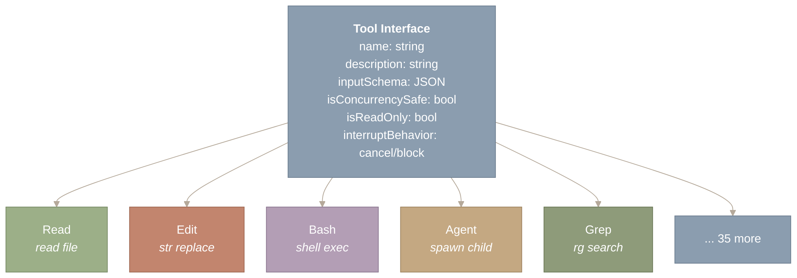
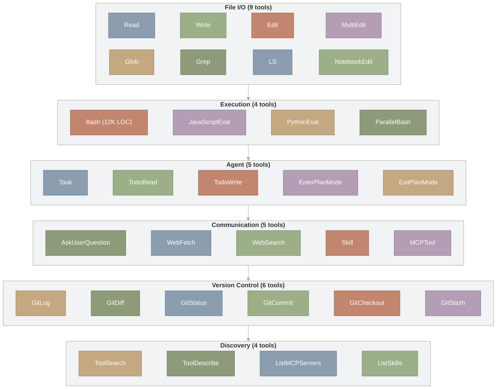
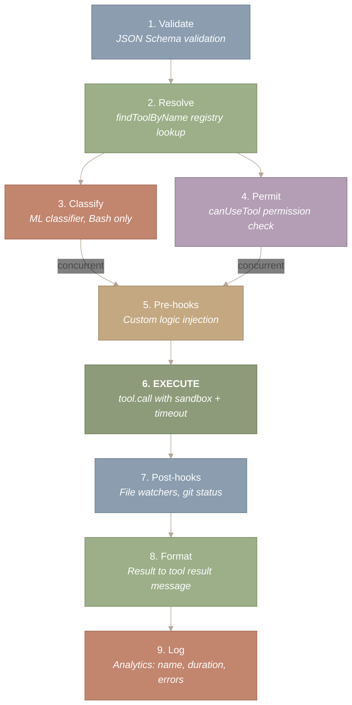
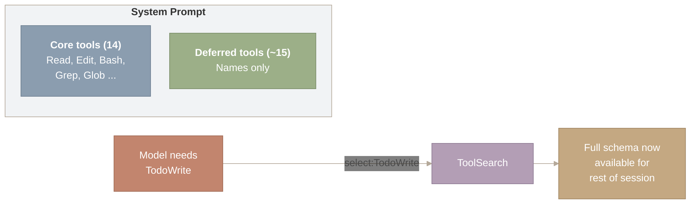
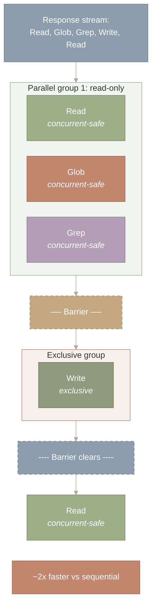

# Tool System & Registry

## Why Tools Are the Differentiator

Without tools, a language model can only read text and produce text – it cannot open a file, run a test, or check whether a directory exists. Tools are what transform a chatbot into a software engineer: each tool bridges the model’s reasoning (“I should check if this file exists”) to an actual effect in the world (a filesystem call that returns `true` or `false`).

Claude Code ships approximately 40 tools, and they form a carefully stratified system organized around three design problems: how to give an LLM agent maximum capability with minimum context cost, how to enforce safety without paralyzing usefulness, and how to enable extensibility without sacrificing coherence.

> **This post covers:**
>
>
> 1. Why tools are THE differentiator between chatbots and agents
> 2. The uniform tool contract (Strategy pattern)
> 3. A taxonomy of ~40 tools across 6 categories
> 4. The tool execution pipeline (9 steps from request to result)
> 5. Deferred loading – virtual memory for tool schemas
> 6. Streaming concurrent execution

**Source files covered in this post:**

| File | Purpose | Size |
| --- | --- | --- |
| `src/Tool.ts` | Tool base types, interface definitions, and registry | ~400 LOC |
| `src/tools.ts` | Tool registration entry point | ~50 LOC |
| `src/tools/BashTool/` | Shell command execution (security, sandbox, TTY) | 18 files, ~12,400 LOC |
| `src/tools/AgentTool/` | Sub-agent spawning and orchestration | 14 files, ~6,000 LOC |
| `src/tools/FileReadTool/` | File and attachment reading (multimodal) | ~7 files |
| `src/tools/FileEditTool/` | String-replace editing with validation | ~8 files |
| `src/tools/FileWriteTool/` | File creation | ~5 files |
| `src/tools/GlobTool/` | Glob pattern matching | ~5 files |
| `src/tools/GrepTool/` | ripgrep-based content search | ~5 files |
| `src/tools/ToolSearchTool/` | Deferred tool discovery (meta-tool) | ~3 files |
| `src/services/tools/` | Tool dispatch, permissions, and execution orchestration | ~6 files |
| `src/utils/computerUse/` | macOS computer-use MCP server (screenshots, input, locking) | 15 files, ~1,800 LOC |

---

## The Uniform Contract – Every Tool Speaks the Same Language

**Every tool in Claude Code – from reading a file to spawning a sub-agent – implements the same interface.** This is the Strategy pattern at scale: roughly 40 interchangeable implementations behind a uniform contract.



*Figure 1: The uniform tool interface with six properties (name, description, inputSchema, isConcurrencySafe, isReadOnly, interruptBehavior), implemented by all ~40 tools. The interface fans out to concrete implementations: Read, Edit, Bash, Agent, Grep, and 35 more. Each concrete tool is an interchangeable Strategy behind the same contract, enabling uniform permission checking, sandbox enforcement, and hook injection without per-tool dispatch logic.*

**How to read this diagram.** Start at the “Tool Interface” box at the top, which defines the six properties every tool must implement. The arrows fan downward to six concrete tool implementations (Read, Edit, Bash, Agent, Grep, and 35 more). The key takeaway is that all tools are interchangeable strategies behind this single contract – the orchestrator interacts only with the interface, never with individual implementations.

The power of this uniformity is that the orchestrator – the code that dispatches tool calls – does not need to know anything about what each tool does. It only needs to know the interface. This enables four capabilities for free:

1. **Tool description generation.** The system prompt includes each tool’s `description` and `inputSchema` – the model sees a menu of capabilities.
2. **Permission checking.** Every tool call passes through `canUseTool()` before execution, regardless of what tool it is.
3. **Sandbox enforcement.** Every tool that touches the filesystem goes through the same sandbox layer.
4. **Hook injection.** Pre- and post-tool-use hooks fire for every tool, enabling logging, policy enforcement, and automation.

This is the **Strategy pattern** from the Gang of Four. The tool registry is the context, each tool is a concrete strategy, and the dispatch mechanism selects a strategy at runtime based on the model’s `tool_use` block. The Command pattern is similar – each tool encapsulates an action with its parameters.

The `isConcurrencySafe` flag deserves attention. Tools like Read, Glob, and Grep are marked concurrent-safe and read-only – multiple instances can execute simultaneously. Tools like Write, Edit, and Bash are not – they must execute exclusively to prevent filesystem race conditions. This flag is a capability declaration: the tool announces what it can handle, and the orchestrator acts accordingly.

The `interruptBehavior` field determines what happens when a user presses Escape mid-execution. `cancel` tools are aborted immediately. `block` tools complete before the interrupt propagates. This matters for operations like git commits where partial execution could leave the repository inconsistent.

---

## The Tool Taxonomy – Six Categories, Six Design Insights

**The tools fall into six categories, and each category reveals a design philosophy.** Grouping by capability (not alphabetically) shows what an AI agent needs to be effective.



*Figure 2: Approximately 40 tools organized into six capability categories. File I/O (9 tools) handles reads, writes, edits, and notebook manipulation. Execution (4 tools) centers on BashTool at 12K LOC – the primary security boundary. Agent (5 tools) enables recursive sub-agent spawning and plan mode. Communication (5 tools) includes web access and skill invocation. Version Control (6 tools) wraps git operations. Discovery (4 tools) provides meta-tools like ToolSearch that load other tools on demand.*

**How to read this diagram.** The six subgraph boxes represent capability categories, connected top to bottom. Within each category, individual tools are listed side by side. Read from top (File I/O, the most frequently used) to bottom (Discovery, the meta-tools). The vertical ordering roughly reflects dependency: lower categories build on capabilities provided by higher ones – for instance, the Discovery tools load and manage the tools defined in the categories above them.

**File I/O (4 tools): Unix philosophy.** One tool per operation. `Read` reads files (including images, PDFs, notebooks). `Write` creates or overwrites. `Edit` applies `str_replace` patches. `NotebookEdit` manipulates Jupyter cells. The separation is deliberate: `Edit` sends only the diff (cheaper in tokens), while `Write` sends the entire file (necessary for creation). The system prompt steers the model toward Edit for modifications.

**Discovery (3 tools): Multiple search strategies.** `Glob` finds files by pattern. `Grep` (wrapping ripgrep) searches content. `LSP` provides semantic understanding – go-to-definition, find-references, diagnostics. Each tool addresses a different scope: structural (file names), textual (content patterns), and semantic (symbol relationships). Together they give the agent a complete search toolkit.

**Execution (1 tool, but it is enormous): The security boundary.** BashTool is 12,411 lines across 18 files. Its size reflects its responsibility: it is the point where the model’s intentions become real-world actions. BashTool includes permission matching, an ML-based safety classifier, sandbox enforcement, sed command parsing (to detect file edits disguised as shell commands), destructive command warnings, and background execution support. Every other tool’s blast radius is bounded by design. Bash’s is not – it can do anything the user’s shell can do.

**Agent (2 tools): Recursive architecture.** The Agent tool spawns sub-agents – isolated Claude instances with their own context, tools, and working directory. `SendMessage` enables inter-agent communication. This is `fork()` for AI agents: same binary, different context. Sub-agents enable parallel problem-solving but introduce coordination complexity (covered in Part VI.1).

**Web (2 tools): Local + cloud hybrid.** `WebFetch` retrieves and converts web pages to markdown. `WebSearch` performs server-side search. These tools run on Anthropic’s infrastructure (not the user’s machine), requiring no local permission checks. The architecture blends local capabilities (filesystem, shell) with cloud capabilities (search, web access) – each tool running where it makes the most sense.

**Meta (5+ tools): Tools that manage tools.** ToolSearch is a meta-tool – it loads other tools. `TaskGet`/`TaskList` monitor background tasks. `TodoWrite` maintains persistent task lists. Skill invokes registered workflows. These tools give the agent self-management capabilities: it can discover new tools, track its own progress, and invoke higher-level workflows.

Here are the 10 most important tools with their design insight:

| Tool | Category | Key Design Insight |
| --- | --- | --- |
| **Bash** | Execution | Security boundary; 12K LOC because unconstrained power demands maximal safety |
| **Edit** | File I/O | `str_replace` with uniqueness constraint; token-efficient, auditable, precise |
| **Read** | File I/O | Multimodal (files, images, PDFs, notebooks); the agent’s primary “eyes” |
| **Grep** | Discovery | Wraps ripgrep; schema mirrors CLI flags so the model’s training transfers |
| **Agent** | Agent | Sub-agent spawning; recursive architecture enables parallel work |
| **ToolSearch** | Meta | Meta-tool that loads other tools; enables deferred loading optimization |
| **Write** | File I/O | Requires prior Read (guard against blind overwrites); whole-file semantics |
| **Glob** | Discovery | Results sorted by mtime; surfaces recently-changed files first |
| **LSP** | Discovery | Semantic search (definitions, references); what grep cannot do |
| **WebFetch** | Web | HTML-to-markdown conversion; 15-minute cache for repeated access |

**Full tool catalog (approximately 40 tools)**

**Core tools (always in system prompt):** Read, Write, Edit, NotebookEdit, Glob, Grep, LSP, Bash, Agent, SendMessage, WebFetch, ToolSearch, TaskGet, TaskList

**Deferred tools (loaded via ToolSearch):** AskUserQuestion, CronCreate, CronDelete, CronList, EnterPlanMode, ExitPlanMode, EnterWorktree, ExitWorktree, TaskCreate, TaskUpdate, TaskStop, TaskOutput, TodoWrite, Skill

**Server-side tools (run on Anthropic infrastructure):** web_search, web_fetch, code_execution, text_editor

**MCP tools (from external servers):** Dynamically registered, named `mcp__server__tool`

---

## The Tool Execution Pipeline – 9 Steps from Intent to Effect

**When the model decides to use a tool, the request passes through a nine-step pipeline.** Understanding this pipeline is key to understanding Claude Code’s safety and extensibility.



*Figure 3: The 9-step tool execution pipeline from intent to effect. Steps 1-2 validate input and resolve the tool by name. Steps 3 (ML classifier, Bash only) and 4 (canUseTool permission check) run concurrently to hide latency. Step 5 runs pre-tool hooks for custom logic injection. Step 6 (highlighted in terracotta) is the only step with real-world side effects – tool.call() within the sandbox. Steps 7-9 run post-hooks, format the result as a tool_result message, and log analytics.*

**How to read this diagram.** Time flows top to bottom through nine numbered steps. Start at step 1 (Validate) and follow the arrows down. Note the fork after step 2: steps 3 (ML Classify) and 4 (Permit) run concurrently – shown by the two parallel arrows merging back at step 5 (Pre-hooks). Step 6 (Execute, highlighted) is the only step with real-world side effects; everything before it is validation and gating, everything after is observation and logging.

Three steps deserve closer attention:

**Step 3 (Classify)** is unique to BashTool. An ML-based classifier predicts whether a command is safe *before* execution. It runs concurrently with step 4 (permission check) to minimize latency. If both the classifier and the permission rules agree the command is safe, execution proceeds without user interaction. This is speculative execution applied to security – start the safety analysis early, cancel if it fails.

**Step 4 (Permit)** evaluates the tool call against the current permission mode. For Bash, this includes wildcard pattern matching against pre-approved commands and the classifier result. A denied tool returns an error to the model, which can adjust and retry.

**Step 6 (Execute)** is where real-world effects happen. For Bash, this means sandbox enforcement and timeout management. For Edit, it means finding the unique match and applying the replacement. For Agent, it means spawning an entire sub-agent lifecycle. If execution throws, the error is wrapped in a `tool_result` with `is_error: true` – the model sees the error and can decide how to proceed.

---

## Deferred Loading – Virtual Memory for Tool Schemas

**Not all tool schemas go into the system prompt.** Loading all of them would waste thousands of tokens per turn on tools the model may never use. Instead, Claude Code divides tools into two tiers: core (always loaded) and deferred (loaded on demand).



*Figure 4: Deferred tool loading as virtual memory for tool schemas. The system prompt contains full schemas for 14 core tools (Read, Edit, Bash, Grep, Glob, etc.) that are used on nearly every turn. Approximately 15 deferred tools are listed by name only. When the model needs a deferred tool (e.g., TodoWrite), it calls the ToolSearch meta-tool, which returns the full JSON schema. The tool then becomes callable for the rest of the session – analogous to a page fault loading a page into the resident set.*

**How to read this diagram.** The left side shows the system prompt containing two groups: core tools with full schemas (always loaded) and deferred tools listed by name only. When the model needs a deferred tool, follow the arrow rightward: it calls ToolSearch with a query like “select:TodoWrite,” which returns the full schema. Once loaded, the tool becomes callable for the rest of the session – this is the “page fault” that brings a tool’s schema into the working set.

This is virtual memory for tool schemas. Just as an operating system gives each process the illusion of having all of memory while only loading pages on demand, Claude Code gives the model the illusion of having all tools while only loading schemas when accessed.

The economics are compelling. A complex tool schema consumes 300-500 tokens. With 15 deferred tools at ~400 tokens each:

```
  Without deferred loading:  15 tools x 400 tokens x 50 turns = 300,000 extra tokens
  With deferred loading:     0 tokens (until needed) + ~400 per tool when loaded
  Savings per session:       Up to 300,000 tokens (if most deferred tools unused)
```

The **ToolSearch** meta-tool makes this work. It accepts queries in multiple forms: `"select:TodoWrite"` for exact name matching, keyword searches for fuzzy matching, and prefix-required searches like `"+slack send"`. When a match is found, the full JSON schema is returned and the tool becomes callable for the rest of the conversation. ::: {.callout-warning title=“Trade-off”} Deferred loading saves tokens but adds a round-trip. The model must first recognize it needs a deferred tool, call ToolSearch, wait for the schema, and then call the actual tool. This adds one turn of latency for the first use of any deferred tool. Core tools – the ones used on virtually every turn – are kept eagerly loaded because the token cost of their schemas is amortized across many uses. :::

---

## Streaming Execution – Concurrent Where Safe

**The StreamingToolExecutor starts executing tools before the full API response has arrived.** When a response contains multiple tool calls, this concurrent execution can dramatically reduce latency.

The concurrency rule is simple:

```
// A tool can start executing if:
// (a) nothing else is running, OR
// (b) both the new tool and ALL running tools are concurrent-safe
canExecuteTool(isConcurrencySafe: boolean): boolean {
  const executing = this.tools.filter(t => t.status === 'executing');
  return executing.length === 0 ||
    (isConcurrencySafe && executing.every(t => t.isConcurrencySafe));
}
```

In practice, this means:



*Figure 5: Concurrent execution of read-only tools with barriers before write tools. The response stream contains five tool calls: Read, Glob, Grep, Write, Read. The first three (all concurrent-safe) run in parallel within a green shared-access group. A dashed barrier separates them from the Write tool, which runs exclusively in a terracotta group. After the barrier clears, the final Read resumes in parallel. This readers-writers model yields approximately 2x speedup versus fully sequential execution.*

**How to read this diagram.** Time flows top to bottom. The response stream at the top contains five tool calls. The first three (Read, Glob, Grep) are all concurrent-safe, so they run in parallel within the green “Parallel group 1” box. A dashed barrier separates them from Write, which requires exclusive access and runs alone in the terracotta box. After Write completes, the barrier clears and the final Read runs. The key takeaway is the readers-writers pattern: read-only tools overlap freely, but any write tool forces a sequential barrier.

Two additional behaviors handle edge cases:

**Bash sibling abort.** When a Bash command errors out, the executor aborts sibling subprocesses from the same response. But it does *not* abort the parent query. The error is reported to the model, which decides how to proceed. A single failing command does not cascade into a conversation-ending failure.

**User interrupt handling.** When the user presses Escape, the system checks each tool’s `interruptBehavior`. `cancel` tools are aborted immediately. `block` tools complete first. This prevents the user from accidentally corrupting a multi-step file operation.

The execution model is a **readers-writers lock with priority queuing**. Read-only tools are readers (any number can proceed concurrently). Write tools are writers (must have exclusive access). The barrier between concurrent and exclusive groups ensures correctness. This is the same concurrency model used in database transaction isolation.

---

## Schema Design – Teaching the Model to Use Tools Well

**The input and output schemas are not just type definitions – they are the UX layer for an LLM user.** Each schema is designed to make correct usage easy and dangerous usage hard.

The Edit tool’s schema illustrates this principle:

```
// Input: minimal, precise, safe-by-default
interface FileEditInput {
  file_path: string;      // Absolute path required
  old_string: string;     // Must be unique in file  <-- KEY CONSTRAINT
  new_string: string;     // Must differ from old_string
  replace_all?: boolean;  // Default: false
}
```

The uniqueness constraint on `old_string` eliminates an entire class of accidental edits. If the target text appears in multiple places, the edit fails and the model must provide more surrounding context to disambiguate. This is a deliberate friction that forces precision.

Grep’s schema takes a different approach – it mirrors the CLI flags the model was trained on:

```
interface GrepInput {
  pattern: string;        // Regex (ripgrep syntax)
  '-A'?: number;          // Lines after match (-A flag)
  '-B'?: number;          // Lines before match (-B flag)
  '-i'?: boolean;         // Case insensitive (-i flag)
  output_mode?: 'content' | 'files_with_matches' | 'count';
  head_limit?: number;    // Default 250 (prevents result flooding)
}
```

The parameter names `'-A'` and `'-B'` are unusual in a JSON schema, but deliberate. The model has been trained on ripgrep documentation and examples. Using the familiar flag names reduces the cognitive translation between “what I know” and “what parameter to set.”

Tool schemas are an API between a human engineer (the designer) and an LLM (the user). The best schemas leverage the LLM’s training data: familiar names, sensible defaults, and constraints that prevent common mistakes. `str_replace` over whole-file edits is not just more token-efficient – it is more auditable, more precise, and harder to misuse.

---

## Tool Result Truncation – Protecting the Context Budget

**A single tool call can flood the context window.** A `Read` of a 2,000-line file produces ~16K tokens; a `Grep` across a monorepo can return 30K+ tokens. Left unchecked, one oversized result would consume a sixth of the 200K-token context window — crowding out reasoning space and inflating API costs. The tool system applies truncation at multiple levels to prevent this.

**Per-tool output caps.** Several tools enforce their own limits before the general truncation layer ever fires:

- Grep defaults `head_limit` to 250 lines. The model can override this (passing `head_limit: 0` for unlimited), but the default prevents accidental flooding.
- Read defaults to 2,000 lines from the start of the file. For longer files, the model must specify `offset` and `limit` to read specific ranges.
- Bash captures both stdout and stderr but applies a byte cap to each stream independently.

**System-level truncation.** After a tool returns its raw result, the execution pipeline (Step 7 in the 9-step pipeline above) checks the result size against a token threshold. If the result exceeds the threshold, the system truncates it and appends a structured notice:

```
[Result truncated — original output was ~30,000 tokens, showing first 10,000.
 Use more specific parameters (e.g., line ranges, file filters, head_limit) to
 narrow the result.]
```

This notice is not just informational — it is a **prompt to the model** to retry with a more targeted query. The model reads the truncation notice, understands the output was incomplete, and typically responds with a refined request: reading a specific line range instead of the full file, adding a `glob` filter to Grep, or piping Bash output through `head`.

**The feedback loop.** Truncation creates a natural refinement loop: broad query → truncated result → narrow retry → complete result. This mirrors how human developers work — you run `grep` on a large codebase, see too many results, add flags to narrow the search, and iterate until the output is manageable. The truncation system teaches the model this same discipline.

---

## Tool Description Prompts — What the Model Sees

Each tool carries a description string that is injected into the system prompt (for eager tools) or returned via `ToolSearchTool` (for deferred tools). These descriptions are not brief labels — they are detailed behavioral contracts that shape how the model uses each tool. The total description text across all tools exceeds 15,000 words.

**BashTool has the longest description at approximately 3,700 words** — longer than most blog posts. Its description covers seven distinct concerns:

| Section | Purpose | Key directives |
| --- | --- | --- |
| Tool preference guidance | Redirect to specialized tools | “Use Glob (NOT find or ls), Grep (NOT grep or rg), Read (NOT cat/head/tail)” |
| Execution instructions | Timeout, background, parallel commands | “DO NOT use newlines to separate commands” |
| Git safety protocol | Commit workflow, destructive operation prevention | 6 NEVER rules; “CRITICAL: Always create NEW commits rather than amending” |
| PR creation workflow | Branch, push, create PR via `gh` | 3-step process with parallel batching |
| Sandbox rules | Filesystem and network restrictions | “Do NOT attempt to set `dangerouslyDisableSandbox: true` unless…” |
| Sleep guidelines | Avoid unnecessary polling | “Do not retry failing commands in a sleep loop — diagnose the root cause” |
| Common operations | GitHub API patterns | `gh api` for PR comments, issues |

The opening section is particularly notable — it actively discourages its own use:

> *“IMPORTANT: Avoid using this tool to run `find`, `grep`, `cat`, `head`, `tail`, `sed`, `awk`, or `echo` commands, unless explicitly instructed or after you have verified that a dedicated tool cannot accomplish your task.”*

This self-deprecation is deliberate: BashTool is the most powerful tool (it can do anything the shell can do) but also the most dangerous and least reviewable. By redirecting to specialized tools, the description steers the model toward operations that are safer, easier for users to review, and more token-efficient in their results.

**Other tools have shorter but equally directive descriptions:**

| Tool | Description length | Notable directives |
| --- | --- | --- |
| `Agent` | ~1,500 words | “Don’t peek at fork output files mid-flight”; “Don’t race or predict fork results” |
| `Read` | ~300 words | “Must use absolute paths”; reads images, PDFs, Jupyter notebooks |
| `Edit` | ~200 words | “MUST use Read tool at least once before editing”; “edit will FAIL if old_string not unique” |
| `Write` | ~100 words | “MUST read existing files first”; “NEVER create documentation files unless explicitly requested” |
| `Grep` | ~150 words | “ALWAYS use Grep for search tasks. NEVER invoke `grep` or `rg` as a Bash command” |
| `Glob` | ~50 words | Minimal — just describes pattern matching and sorting |
| `Skill` | ~150 words | “BLOCKING REQUIREMENT: invoke the relevant Skill tool BEFORE generating any other response” |
| `ToolSearch` | ~100 words | Query forms: “select:Read,Edit”, keyword search, “+slack send” |

---

## Summary

**Tools are THE differentiator between a chatbot and an agent.** Without tools, an LLM is a brain in a jar. The tool system is not an accessory – it is the core capability that makes agency possible. Every tool is a bridge between reasoning and action.

**The Strategy pattern enables uniform orchestration.** Because every tool implements the same interface, the system gets permission checking, sandboxing, hook injection, and concurrent execution for free. You do not need to understand each tool’s internals to orchestrate all of them. This is the power of a uniform contract.

**Deferred loading is virtual memory for tool schemas.** Core tools are the working set (always resident). Deferred tools are swapped out (names known, schemas loaded on demand). This saves up to 300K tokens per session – a direct translation of OS principles into LLM economics.

**Schema design is UX design for LLMs.** Edit’s uniqueness constraint prevents accidental edits. Grep’s flag-mirroring parameter names leverage training data. BashTool’s mandatory description field forces the model to articulate intent before executing. Every schema choice shapes behavior.

**Separate concerns that change at different rates.** The 9-step pipeline separates security policy, tool implementation, and analytics into independent stages. Each can evolve without touching the others. This is the pipeline pattern applied to agent architecture.

The tool system is where architecture meets agency. The model’s intelligence sets the direction; the tools provide the means. In the next post, we examine the other half of this equation: the prompt fragments that teach the model *how* to use these tools effectively.

*Next: [Part IV.2 – Safety, Permissions & Sandbox](https://y-agent.github.io/inside-claude-code/06-safety-sandbox.html) examines how Claude Code defends against the inherent risks of an AI agent that can run arbitrary shell commands.*

## Appendix: Full Tool Inventory

Claude Code ships 40 tools organized into ten functional categories. Deferred tools (marked with †) are loaded on demand via `ToolSearchTool` to keep the initial system prompt compact. Each tool is implemented in its own directory under `src/tools/`.

| Category | Tool | Model Name | Implementation | Loaded |
| --- | --- | --- | --- | --- |
| **File I/O** | FileReadTool | `Read` | `src/tools/FileReadTool/` | Eager |
|  | FileEditTool | `Edit` | `src/tools/FileEditTool/` | Eager |
|  | FileWriteTool | `Write` | `src/tools/FileWriteTool/` | Eager |
|  | GlobTool | `Glob` | `src/tools/GlobTool/` | Eager |
|  | GrepTool | `Grep` | `src/tools/GrepTool/` | Eager |
|  | NotebookEditTool | `NotebookEdit` | `src/tools/NotebookEditTool/` | Deferred † |
| **Execution** | BashTool | `Bash` | `src/tools/BashTool/` (18 files) | Eager |
|  | PowerShellTool | `PowerShell` | `src/tools/PowerShellTool/` (16 files) | Eager (Windows) |
|  | REPLTool | `REPL` | `src/tools/REPLTool/` | Deferred † |
| **Agent** | AgentTool | `Agent` | `src/tools/AgentTool/` (14 files) | Eager |
|  | SendMessageTool | `SendMessage` | `src/tools/SendMessageTool/` | Eager |
|  | TeamCreateTool | `TeamCreate` | `src/tools/TeamCreateTool/` | Deferred † |
|  | TeamDeleteTool | `TeamDelete` | `src/tools/TeamDeleteTool/` | Deferred † |
| **Task** | TaskCreateTool | `TaskCreate` | `src/tools/TaskCreateTool/` | Deferred † |
|  | TaskGetTool | `TaskGet` | `src/tools/TaskGetTool/` | Deferred † |
|  | TaskListTool | `TaskList` | `src/tools/TaskListTool/` | Deferred † |
|  | TaskUpdateTool | `TaskUpdate` | `src/tools/TaskUpdateTool/` | Deferred † |
|  | TaskStopTool | `TaskStop` | `src/tools/TaskStopTool/` | Deferred † |
|  | TaskOutputTool | `TaskOutput` | `src/tools/TaskOutputTool/` | Deferred † |
|  | TodoWriteTool | `TodoWrite` | `src/tools/TodoWriteTool/` | Deferred † |
| **Planning** | EnterPlanModeTool | `EnterPlanMode` | `src/tools/EnterPlanModeTool/` | Deferred † |
|  | ExitPlanModeTool | `ExitPlanMode` | `src/tools/ExitPlanModeTool/` | Deferred † |
|  | EnterWorktreeTool | `EnterWorktree` | `src/tools/EnterWorktreeTool/` | Deferred † |
|  | ExitWorktreeTool | `ExitWorktree` | `src/tools/ExitWorktreeTool/` | Deferred † |
| **Web & Search** | WebFetchTool | `WebFetch` | `src/tools/WebFetchTool/` | Deferred † |
|  | WebSearchTool | `WebSearch` | `src/tools/WebSearchTool/` | Deferred † |
|  | ToolSearchTool | `ToolSearch` | `src/tools/ToolSearchTool/` | Eager |
| **MCP** | MCPTool | `mcp__*` | `src/tools/MCPTool/` | Dynamic |
|  | ListMcpResourcesTool | `ListMcpResources` | `src/tools/ListMcpResourcesTool/` | Deferred † |
|  | ReadMcpResourceTool | `ReadMcpResource` | `src/tools/ReadMcpResourceTool/` | Deferred † |
|  | McpAuthTool | `McpAuth` | `src/tools/McpAuthTool/` | Deferred † |
| **Code Intelligence** | LSPTool | `LSP` | `src/tools/LSPTool/` | Deferred † |
| **Interaction** | AskUserQuestionTool | `AskUserQuestion` | `src/tools/AskUserQuestionTool/` | Deferred † |
|  | SkillTool | `Skill` | `src/tools/SkillTool/` | Eager |
|  | BriefTool | `Brief` | `src/tools/BriefTool/` | Deferred † |
|  | ConfigTool | `Config` | `src/tools/ConfigTool/` | Deferred † |
| **Scheduling** | ScheduleCronTool | `ScheduleCron` | `src/tools/ScheduleCronTool/` | Deferred † |
|  | SleepTool | `Sleep` | `src/tools/SleepTool/` | Deferred † |
| **Internal** | RemoteTriggerTool | `RemoteTrigger` | `src/tools/RemoteTriggerTool/` | Internal |
|  | SyntheticOutputTool | `SyntheticOutput` | `src/tools/SyntheticOutputTool/` | Internal |

Of these 40 tools, approximately 10 are eager-loaded (always present in the system prompt) and ~25 are deferred (loaded via `ToolSearchTool` when the model needs them). MCP tools are dynamically registered at runtime based on configured MCP servers. Internal tools are not exposed to the model in normal operation.

---

## Appendix: Computer Use

Claude Code includes a feature-gated computer-use subsystem that provides native macOS screen control — screenshots, mouse, keyboard, and clipboard — delivered as an MCP server named `computer-use`. This is a **macOS-only** capability (15 files, ~1,800 LOC) backed by two native modules: `@ant/computer-use-swift` (screenshots, app management, display detection, TCC permission checks) and `@ant/computer-use-input` (Rust/enigo bindings for mouse, keyboard, clipboard).

### Architecture

The subsystem follows a three-layer design:

| Layer | Component | Purpose |
| --- | --- | --- |
| Native | `@ant/computer-use-swift` | Swift bindings for macOS screen capture, app management |
| Native | `@ant/computer-use-input` | Rust/enigo bindings for mouse, keyboard, clipboard |
| CLI Wrapper | `src/utils/computerUse/` | Bridges `ToolUseContext` to the MCP session dispatcher |

The executor (`executor.ts`, 659 lines) implements a `ComputerExecutor` interface routing all operations to native modules. Key operations include screenshot capture with display filtering, animated mouse movement (ease-out cubic at 60fps), keyboard input, and app management. The terminal emulator is automatically detected (iTerm, Terminal, Ghostty, Kitty, Warp, VS Code) and exempted from hiding and screenshot capture.

### Feature Gating

Three layers of gating control access:

1. **Build-time:** `feature('CHICAGO_MCP')` — entire subsystem compiled out if false
2. **Runtime (GrowthBook):** `tengu_malort_pedway` gate, restricted to Max/Pro subscribers (or `USER_TYPE === 'ant'`)
3. **Platform:** Throws on `process.platform !== 'darwin'`

Sub-gates control individual behaviors: `pixelValidation`, `clipboardPasteMultiline`, `mouseAnimation`, `hideBeforeAction`, `autoTargetDisplay`, `clipboardGuard`.

### Safety

An atomic file-based session lock (`computerUseLock.ts`) ensures only one Claude Code instance controls the screen at a time, with stale-PID recovery and a 7-day timeout. A global Escape hotkey (`escHotkey.ts`) is registered via CGEventTap on first lock acquire — user pressing Escape aborts the turn, while model-synthesized Escapes are passed through with a 100ms decay window (prompt injection defense). Turn-end cleanup (`cleanup.ts`) auto-unhides hidden apps, unregisters the hotkey, and releases the lock.

**Source files:** `src/utils/computerUse/executor.ts` (executor factory), `src/utils/computerUse/gates.ts` (feature gates), `src/utils/computerUse/wrapper.tsx` (session adapter), `src/utils/computerUse/setup.ts` (MCP config), `src/utils/computerUse/computerUseLock.ts` (session locking), `src/utils/computerUse/escHotkey.ts` (abort hotkey), `src/utils/computerUse/cleanup.ts` (turn-end cleanup).

---

*Series: Inside Claude Code | Part III.2 of 10*
