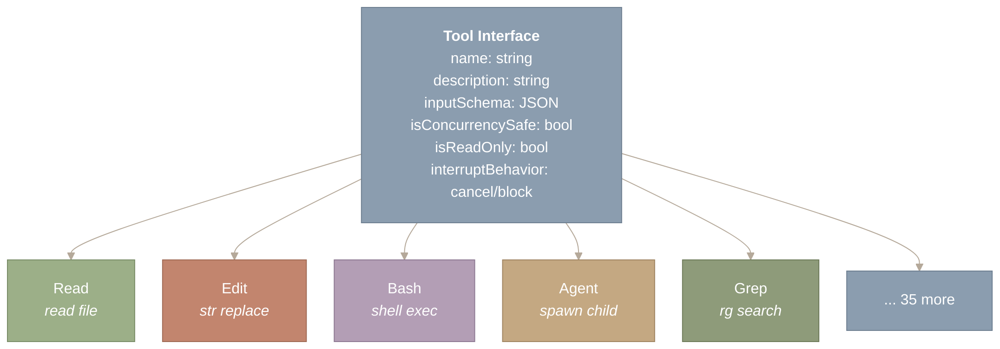
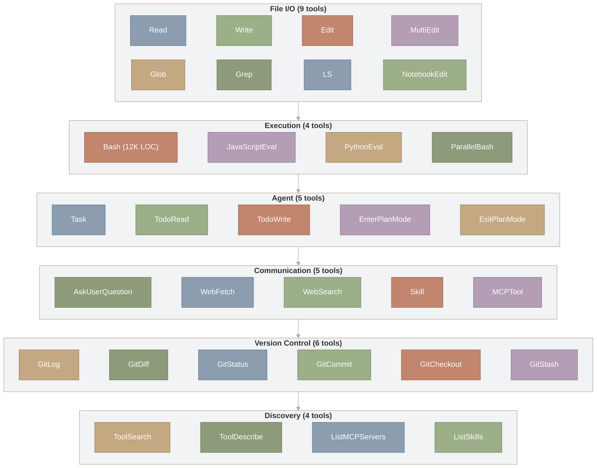
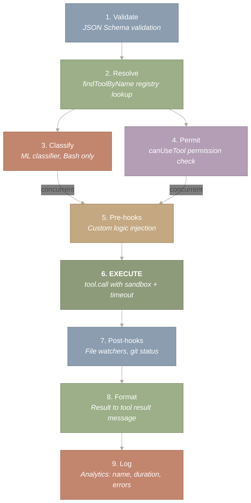
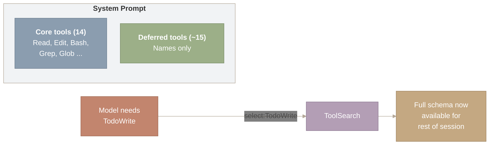
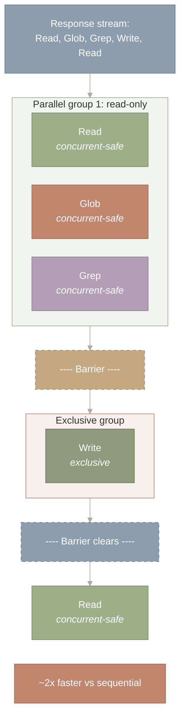

> 译者说明：本文按 2026-08-12 抓取的网页完整翻译，保留原始章节、代码、表格、Mermaid 图源、图注和链接。原文分析基于 Claude Code v2.1.88 的 Source Map；文件行数、工具数量、阈值和实现细节属于该页面快照，不应直接外推到其他版本。

# 工具系统与注册表（Tool System & Registry）

## 为什么工具才是真正的分水岭

没有工具，语言模型只能读文本、写文本——它无法打开一个文件、运行一次测试，也无法确认某个目录是否存在。正是工具把聊天机器人变成了软件工程师：每个工具把模型的推理（“我应该检查一下这个文件是否存在”）桥接到现实世界中的真实效果（一次返回 `true` 或 `false` 的文件系统调用）。

Claude Code 内置了大约 40 个工具，它们构成了一套围绕三个设计问题精心分层的系统：如何以最小的上下文开销赋予 LLM Agent 最大的能力；如何在不瘫痪可用性的前提下实施安全约束；以及如何在不牺牲一致性的前提下实现可扩展性。

> **本文涵盖：**
>
>
> 1. 为什么工具是聊天机器人与 Agent 之间的分水岭
> 2. 统一的工具契约（Strategy 模式）
> 3. 约 40 个工具、横跨 6 大类别的分类法
> 4. 工具执行管线（从请求到结果的 9 个步骤）
> 5. 延迟加载——工具 Schema 的“虚拟内存”
> 6. 流式并发执行

**本文涉及的源文件：**

| 文件 | 用途 | 规模 |
| --- | --- | --- |
| `src/Tool.ts` | 工具基础类型、接口定义与注册表 | 约 400 行 |
| `src/tools.ts` | 工具注册入口 | 约 50 行 |
| `src/tools/BashTool/` | Shell 命令执行（安全、沙箱、TTY） | 18 个文件，约 12,400 行 |
| `src/tools/AgentTool/` | 子 Agent 的生成与编排 | 14 个文件，约 6,000 行 |
| `src/tools/FileReadTool/` | 文件与附件读取（多模态） | 约 7 个文件 |
| `src/tools/FileEditTool/` | 带校验的字符串替换编辑 | 约 8 个文件 |
| `src/tools/FileWriteTool/` | 文件创建 | 约 5 个文件 |
| `src/tools/GlobTool/` | Glob 模式匹配 | 约 5 个文件 |
| `src/tools/GrepTool/` | 基于 ripgrep 的内容搜索 | 约 5 个文件 |
| `src/tools/ToolSearchTool/` | 延迟工具发现（元工具） | 约 3 个文件 |
| `src/services/tools/` | 工具分发、权限与执行编排 | 约 6 个文件 |
| `src/utils/computerUse/` | macOS 电脑操作（computer-use）MCP 服务器（截图、输入、锁定） | 15 个文件，约 1,800 行 |

---

## 统一契约——所有工具说同一种语言

**Claude Code 中的每个工具——从读取文件到生成子 Agent——都实现同一个接口。** 这是 Strategy 模式（策略模式）的规模化应用：大约 40 个可互换的实现，藏在一份统一契约背后。



*图 1：统一的工具接口包含六个属性（name、description、inputSchema、isConcurrencySafe、isReadOnly、interruptBehavior），由全部约 40 个工具实现。该接口向下分支出具体实现：Read、Edit、Bash、Agent、Grep 以及另外 35 个工具。每个具体工具都是同一份契约背后可互换的 Strategy，使得权限检查、沙箱强制和 Hook 注入可以统一进行，无需针对每个工具编写分发逻辑。*

**如何读这张图。** 从顶部的“Tool Interface”方框开始，它定义了每个工具必须实现的六个属性。箭头向下分支出六个具体工具实现（Read、Edit、Bash、Agent、Grep 以及另外 35 个）。这张图的核心结论是：所有工具都是这同一份契约背后可互换的策略——编排器只与接口交互，从不与具体实现打交道。

这种统一性的威力在于：编排器——负责分发工具调用的代码——不需要知道每个工具具体做什么。它只需要知道接口。由此免费获得了四项能力：

1. **工具描述生成。** System Prompt 中包含每个工具的 `description` 和 `inputSchema`——模型看到的是一份能力菜单。
2. **权限检查。** 每次工具调用，无论是什么工具，在执行前都要经过 `canUseTool()`。
3. **沙箱强制。** 每个触及文件系统的工具都经过同一层沙箱。
4. **Hook 注入。** 工具使用前后的 Hook 对每个工具都会触发，从而支持日志记录、策略执行和自动化。

这就是 GoF（四人组）所说的 **Strategy 模式**。工具注册表是上下文（context），每个工具是一个具体策略，分发机制在运行时根据模型的 `tool_use` 块选择相应的策略。Command 模式也与此类似——每个工具把一次动作连同其参数封装起来。

`isConcurrencySafe` 标志值得专门说明。Read、Glob、Grep 这类工具被标记为并发安全且只读——多个实例可以同时执行。Write、Edit、Bash 则不是——它们必须独占执行，以防止文件系统竞态条件。这个标志是一种能力声明：工具声明自己能承受什么，编排器据此行事。

`interruptBehavior` 字段决定用户在执行中途按下 Escape 时会发生什么。`cancel` 工具会被立即中止。`block` 工具会先执行完毕，然后中断才生效。这一点对 git commit 这类操作很重要——如果只执行了一半，仓库可能会被置于不一致的状态。

---

## 工具分类法——六个类别，六种设计洞见

这些工具分为六个类别，每个类别都揭示了一种设计哲学。按能力分组（而不是按字母顺序）可以看出一个 AI Agent 要高效工作需要什么。



*图 2：约 40 个工具，按能力组织成六个类别。文件 I/O（9 个工具）处理读取、写入、编辑和 notebook 操作。执行（4 个工具）以 BashTool 为核心，它有 12K 行代码，是主要的安全边界。Agent（5 个工具）支持递归生成子 Agent 和计划模式（plan mode）。通信（5 个工具）包括 Web 访问和技能调用。版本控制（6 个工具）封装了 git 操作。发现（4 个工具）提供元工具，例如按需加载其他工具的 ToolSearch。*

图中六个子图方框代表能力类别，自上而下连接。每个类别内部，各个工具并排列出。从顶部（文件 I/O，使用最频繁）读到底部（发现，即元工具）。纵向排列大致反映了依赖关系：靠下的类别建立在靠上类别提供的能力之上——例如，发现类工具负责加载和管理上方各类别中定义的工具。

**文件 I/O（4 个工具）：Unix 哲学。** 一个操作对应一个工具。`Read` 读取文件（包括图片、PDF、notebook）。`Write` 创建或覆盖文件。`Edit` 应用 `str_replace` 补丁。`NotebookEdit` 操作 Jupyter 单元格。这种拆分是有意为之：`Edit` 只发送差异部分（更省 token），而 `Write` 发送整个文件（创建文件时必须如此）。System Prompt 会引导模型在修改文件时使用 Edit。

**发现（3 个工具）：多种搜索策略。** `Glob` 按模式查找文件。`Grep`（封装了 ripgrep）搜索文件内容。`LSP` 提供语义理解——跳转到定义、查找引用、诊断信息。每个工具覆盖不同的范围：结构层面（文件名）、文本层面（内容模式）、语义层面（符号关系）。三者合起来，给 Agent 提供了一套完整的搜索工具箱。

**执行（1 个工具，但体量巨大）：安全边界。** BashTool 有 12,411 行代码，分布在 18 个文件中。它的体量反映了它的责任：模型的意图在这里变成真实世界的动作。BashTool 包含权限匹配、基于机器学习的安全分类器、沙箱强制隔离、sed 命令解析（用于检测伪装成 shell 命令的文件编辑）、破坏性命令警告，以及后台执行支持。其他所有工具的影响范围在设计上都有限制，Bash 没有——用户 shell 能做的事它都能做。

**Agent（2 个工具）：递归架构。** Agent 工具生成子 Agent——相互隔离的 Claude 实例，各自拥有自己的上下文、工具和工作目录。`SendMessage` 支持 Agent 之间的通信。这相当于给 AI Agent 加上了 `fork()`：同一个二进制程序，不同的上下文。子 Agent 让问题可以并行求解，但也引入了协调上的复杂性（第六部分第 1 节会讲到）。

**Web（2 个工具）：本地 + 云端混合。** `WebFetch` 抓取网页并转换为 Markdown。`WebSearch` 执行服务端搜索。这些工具运行在 Anthropic 的基础设施上（而不是用户的机器），因此不需要本地权限检查。这套架构把本地能力（文件系统、shell）和云端能力（搜索、Web 访问）混合在一起——每个工具都运行在最适合它的位置。

**元工具（5+ 个）：管理工具的工具。** ToolSearch 是一个元工具——它加载其他工具。`TaskGet`/`TaskList` 监控后台任务。`TodoWrite` 维护持久的任务列表。Skill 调用已注册的工作流。这些工具赋予 Agent 自我管理能力：它能发现新工具、跟踪自己的进度、调用更高层的工作流。

以下是 10 个最重要的工具及其设计洞见：

| 工具 | 类别 | 核心设计洞见 |
| --- | --- | --- |
| **Bash** | 执行 | 安全边界；之所以有 12K 行代码，是因为不受限的能力要求最高强度的安全防护 |
| **Edit** | 文件 I/O | 带唯一性约束的 `str_replace`；节省 token、可审计、精确 |
| **Read** | 文件 I/O | 多模态（文件、图片、PDF、notebook）；Agent 的主要“眼睛” |
| **Grep** | 发现 | 封装 ripgrep；参数结构镜像 CLI 选项，让模型的训练知识可以直接迁移 |
| **Agent** | Agent | 生成子 Agent；递归架构支持并行工作 |
| **ToolSearch** | 元工具 | 加载其他工具的元工具；支撑延迟加载优化 |
| **Write** | 文件 I/O | 要求先 Read（防止盲目覆盖）；整文件语义 |
| **Glob** | 发现 | 结果按 mtime（修改时间）排序；最近改动的文件排在最前 |
| **LSP** | 发现 | 语义搜索（定义、引用）；完成 grep 做不到的事 |
| **WebFetch** | Web | HTML 转 Markdown；为重复访问提供 15 分钟缓存 |

**完整工具目录（约 40 个工具）**

**核心工具（始终在 System Prompt 中）：** Read、Write、Edit、NotebookEdit、Glob、Grep、LSP、Bash、Agent、SendMessage、WebFetch、ToolSearch、TaskGet、TaskList

**延迟加载工具（通过 ToolSearch 加载）：** AskUserQuestion、CronCreate、CronDelete、CronList、EnterPlanMode、ExitPlanMode、EnterWorktree、ExitWorktree、TaskCreate、TaskUpdate、TaskStop、TaskOutput、TodoWrite、Skill

**服务端工具（运行在 Anthropic 基础设施上）：** web_search、web_fetch、code_execution、text_editor

**MCP 工具（来自外部服务器）：** 动态注册，命名为 `mcp__server__tool`

---

## 工具执行流水线——从意图到生效的 9 个步骤

当模型决定使用某个工具时，请求会经过一条九步流水线。理解这条流水线，是理解 Claude Code 安全性和可扩展性的关键。



*图 3：从意图到生效的 9 步工具执行流水线。第 1–2 步校验输入并按名称解析工具。第 3 步（机器学习分类器，仅 Bash 使用）和第 4 步（canUseTool 权限检查）并发执行，以隐藏延迟。第 5 步运行前置工具 Hook，用于注入自定义逻辑。第 6 步（以赭红色高亮）是唯一产生真实世界副作用的步骤——在沙箱内调用 tool.call()。第 7–9 步运行后置 Hook、把结果格式化为 tool_result 消息，并记录分析数据。*

时间沿九个编号的步骤自上而下流动。从第 1 步（校验）开始，顺着箭头往下读。注意第 2 步之后的分叉：第 3 步（机器学习分类）和第 4 步（权限检查）并发执行——图中用两条并行箭头表示，并在第 5 步（前置 Hook）处重新汇合。第 6 步（执行，高亮显示）是唯一产生真实世界副作用的步骤；它之前的所有步骤是校验和关卡，之后的所有步骤是观察和日志记录。

有三个步骤值得细看：

**第 3 步（分类）** 是 BashTool 独有的。一个基于机器学习的分类器在执行*之前*预测命令是否安全。它与第 4 步（权限检查）并发运行，以最小化延迟。如果分类器和权限规则都判定命令安全，执行就会直接进行，无需用户介入。这是把推测执行（speculative execution）的思路用在安全上——尽早启动安全分析，如果失败就取消。

**第 4 步（权限检查）** 根据当前的权限模式评估这次工具调用。对 Bash 而言，这包括用通配符模式匹配预先批准的命令，以及参考分类器的结果。被拒绝的工具会向模型返回一个错误，模型可以调整参数后重试。

**第 6 步（执行）** 是真实世界效果发生的地方。对 Bash 而言，这意味着沙箱强制隔离和超时管理。对 Edit 而言，这意味着找到唯一的匹配位置并应用替换。对 Agent 而言，这意味着启动一整个子 Agent 的生命周期。如果执行抛出异常，错误会被包装成一个带 `is_error: true` 的 `tool_result`——模型能看到这个错误，并决定接下来怎么做。

---

## 延迟加载——工具 Schema 的虚拟内存

**并非所有工具的 schema 都会进入 System Prompt。**全部加载的话，每一轮都要在模型可能根本用不到的工具上浪费数千个 token。因此，Claude Code 把工具分成两层：核心层（始终加载）和延迟层（按需加载）。



*图 4：延迟工具加载相当于工具 schema 的虚拟内存。System Prompt 中包含了 14 个核心工具（Read、Edit、Bash、Grep、Glob 等）的完整 schema，这些工具几乎每一轮都会用到。约 15 个延迟工具只按名字列出。当模型需要某个延迟工具（比如 TodoWrite）时，它会调用 ToolSearch 这个元工具（meta-tool），后者返回完整的 JSON schema。此后该工具在本次会话的剩余时间里都可直接调用——类似于一次缺页中断（page fault）把页加载进常驻内存集。*

图中左侧是 System Prompt，里面有两组工具：核心工具带完整 schema（始终加载），延迟工具只列出名字。当模型需要某个延迟工具时，沿着向右的箭头走：它以类似 “select:TodoWrite” 的查询调用 ToolSearch，后者返回完整 schema。加载完成后，该工具在会话剩余时间里都可调用——这就是把工具 schema 调入工作集的那次“缺页中断”。

这就是工具 schema 的虚拟内存。正如操作系统让每个进程产生拥有全部内存的错觉、实际上只在访问时才加载页面，Claude Code 让模型产生拥有全部工具的错觉，实际上只在访问时才加载 schema。

经济账很划算。一个复杂的工具 schema 要消耗 300-500 个 token。按 15 个延迟工具、每个约 400 token 计算：

```
  Without deferred loading:  15 tools x 400 tokens x 50 turns = 300,000 extra tokens
  With deferred loading:     0 tokens (until needed) + ~400 per tool when loaded
  Savings per session:       Up to 300,000 tokens (if most deferred tools unused)
```

让这套机制运转起来的是 **ToolSearch** 元工具。它接受多种形式的查询：用于精确匹配名字的 `"select:TodoWrite"`、用于模糊匹配的关键词搜索，以及像 `"+slack send"` 这样需要前缀的搜索。匹配成功后，完整的 JSON schema 会被返回，该工具在对话剩余时间里都可调用。 ::: {.callout-warning title=“Trade-off”} 延迟加载节省了 token，但增加了一次往返。模型必须先意识到需要某个延迟工具，调用 ToolSearch，等待 schema 返回，然后才能调用真正的工具。这给任何延迟工具的首次使用增加了一轮延迟。核心工具——几乎每一轮都会用到的那些——保持即时加载，因为它们 schema 的 token 成本被摊销到了大量调用之中。 :::

---

## 流式执行——在安全的前提下并发

**StreamingToolExecutor 会在 API 完整响应到达之前就开始执行工具。**当一个响应包含多个工具调用时，这种并发执行能大幅降低延迟。

并发规则很简单：

```
// A tool can start executing if:
// (a) nothing else is running, OR
// (b) both the new tool and ALL running tools are concurrent-safe
canExecuteTool(isConcurrencySafe: boolean): boolean {
  const executing = this.tools.filter(t => t.status === 'executing');
  return executing.length === 0 ||
    (isConcurrencySafe && executing.every(t => t.isConcurrencySafe));
}
```

实际效果如下：



*图 5：只读工具并发执行，写入工具之前设屏障（barrier）。响应流中包含五个工具调用：Read、Glob、Grep、Write、Read。前三个（均为并发安全）在绿色的共享访问组内并行运行。一条虚线屏障把它们与 Write 工具隔开，Write 在陶土色的组内独占运行。屏障解除后，最后一个 Read 恢复并行。这种读者-写者（readers-writers）模型相比完全串行执行能带来约 2 倍的加速。*

时间从上到下流动。顶部的响应流包含五个工具调用。前三个（Read、Glob、Grep）都是并发安全的，因此它们在绿色的“Parallel group 1”框内并行运行。一条虚线屏障把它们与 Write 隔开——Write 需要独占访问，独自在陶土色的框内运行。Write 完成后，屏障解除，最后一个 Read 开始运行。这张图的重点是读者-写者模式：只读工具可以自由重叠，但任何写入工具都会强制设置一道串行屏障。

另外两种行为处理边界情况：

**Bash 兄弟进程中止。**当某个 Bash 命令出错时，执行器会中止同一响应中的兄弟子进程，但*不会*中止父查询。错误会被报告给模型，由模型决定如何继续。单个命令失败不会级联成终止对话的失败。

**用户中断处理。**当用户按下 Escape 时，系统会检查每个工具的 `interruptBehavior`。`cancel` 类工具立即中止。`block` 类工具先执行完毕。这样可以防止用户意外破坏一个多步骤的文件操作。

这套执行模型是一个**带优先级队列的读者-写者锁**。只读工具是读者（任意数量可以并发推进）。写入工具是写者（必须独占访问）。并发组与独占组之间的屏障保证了正确性。这与数据库事务隔离中使用的并发模型相同。

---

## Schema 设计——教模型用好工具

**输入和输出 schema 不只是类型定义——它们是为 LLM 这位用户准备的 UX 层。**每个 schema 的设计目标都是让正确用法变得容易、让危险用法变得困难。

Edit 工具的 schema 体现了这一原则：

```
// Input: minimal, precise, safe-by-default
interface FileEditInput {
  file_path: string;      // Absolute path required
  old_string: string;     // Must be unique in file  <-- KEY CONSTRAINT
  new_string: string;     // Must differ from old_string
  replace_all?: boolean;  // Default: false
}
```

对 `old_string` 的唯一性约束消除了整整一类意外编辑。如果目标文本出现在多处，编辑就会失败，模型必须提供更多上下文来消除歧义。这是一种刻意制造的摩擦，用来迫使模型做到精确。

Grep 的 schema 走的是另一条路——它直接照搬模型训练时见过的 CLI 参数：

```
interface GrepInput {
  pattern: string;        // Regex (ripgrep syntax)
  '-A'?: number;          // Lines after match (-A flag)
  '-B'?: number;          // Lines before match (-B flag)
  '-i'?: boolean;         // Case insensitive (-i flag)
  output_mode?: 'content' | 'files_with_matches' | 'count';
  head_limit?: number;    // Default 250 (prevents result flooding)
}
```

`'-A'` 和 `'-B'` 这样的参数名在 JSON schema 里并不常见，但这是刻意的。模型在训练时看过大量 ripgrep 的文档和示例。沿用熟悉的参数名，可以减少“我知道什么”和“该设置哪个参数”之间的认知翻译成本。

工具 schema 是人类工程师（设计者）和 LLM（用户）之间的 API。最好的 schema 会利用 LLM 的训练数据：熟悉的名字、合理的默认值、防止常见错误的约束。相比整文件编辑，`str_replace` 不只是更省 token——它更可审计、更精确，也更难被误用。

---

## 工具结果截断——守住上下文预算

**一次工具调用就可能淹没上下文窗口。**对一个 2,000 行的文件执行 `Read` 会产生约 16K token；在 monorepo 里执行一次 `Grep` 可能返回 30K+ token。如果不加控制，一个超大的结果就会吃掉 200K token 上下文窗口的六分之一——挤占推理空间，还推高 API 成本。工具系统在多个层面施加截断来防止这种情况。

**单工具输出上限。**有几个工具在通用截断层触发之前就强制执行自己的限制：

- Grep 默认把 `head_limit` 设为 250 行。模型可以覆盖这个默认值（传入 `head_limit: 0` 表示不限制），但默认值能防止意外刷屏。
- Read 默认从文件开头读取 2,000 行。对于更长的文件，模型必须指定 `offset` 和 `limit` 来读取特定区间。
- Bash 同时捕获 stdout 和 stderr，但对每个流分别施加字节数上限。

**系统级截断。**工具返回原始结果后，执行管线（前面 9 步管线中的第 7 步）会检查结果大小是否超过一个 token 阈值。如果超过，系统会截断结果并追加一条结构化的提示：

```
[Result truncated — original output was ~30,000 tokens, showing first 10,000.
 Use more specific parameters (e.g., line ranges, file filters, head_limit) to
 narrow the result.]
```

这条提示不只是告知信息——它本身就是**给模型的一个 prompt**，促使模型用更有针对性的查询重试。模型读到截断提示后，会明白输出不完整，通常会以更精细的请求回应：改为读取特定行区间而不是整个文件、给 Grep 加上 `glob` 过滤条件，或者把 Bash 输出用 `head` 管道处理。

**反馈循环。**截断制造了一个自然的细化循环：宽泛查询 → 截断的结果 → 收窄后重试 → 完整结果。这复刻了人类开发者的工作方式——你在大代码库上跑 `grep`，看到结果太多，加参数收窄搜索，反复迭代直到输出可控。截断系统把这种纪律教给了模型。

---

## 工具描述提示词 —— 模型实际看到的内容

每个工具都带有一段描述字符串，它会被注入到系统提示词中（针对 Eager 加载的工具），或者通过 `ToolSearchTool` 返回（针对 Deferred 延迟加载的工具）。这些描述不是简短的标签——它们是详细的行为契约，塑造着模型使用每个工具的方式。所有工具的描述文本加起来超过 15,000 个词。

**BashTool 的描述最长，约 3,700 个词**——比大多数博客文章还长。它的描述覆盖了七个不同的关注点：

| 部分 | 用途 | 关键指令 |
| --- | --- | --- |
| 工具偏好引导 | 重定向到专用工具 | “使用 Glob（而不是 find 或 ls）、Grep（而不是 grep 或 rg）、Read（而不是 cat/head/tail）” |
| 执行指令 | 超时、后台、并行命令 | “不要使用换行符来分隔命令” |
| Git 安全协议 | 提交流程、破坏性操作防范 | 6 条 NEVER 规则；“关键：始终创建新的提交，而不是修改（amend）已有提交” |
| PR 创建工作流 | 分支、推送、通过 `gh` 创建 PR | 3 步流程，带并行批处理 |
| 沙箱规则 | 文件系统和网络限制 | “除非……否则不要尝试设置 `dangerouslyDisableSandbox: true`” |
| Sleep 指南 | 避免不必要的轮询 | “不要在 sleep 循环中重试失败的命令——要诊断根本原因” |
| 常见操作 | GitHub API 模式 | 用 `gh api` 处理 PR 评论和 issue |

开头部分尤其值得一提——它主动劝阻模型使用自己：

> *“重要：避免使用本工具运行 `find`、`grep`、`cat`、`head`、`tail`、`sed`、`awk` 或 `echo` 命令，除非被明确指示，或者你已经验证了专用工具无法完成你的任务。”*

这种自我贬低是刻意的：BashTool 是最强大的工具（它能做 shell 能做的一切），但同时也是最危险、最难审查的工具。通过重定向到专用工具，这段描述引导模型走向更安全、更便于用户审查、返回结果也更省 Token 的操作。

**其他工具的描述较短，但同样具有指令性：**

| 工具 | 描述长度 | 值得注意的指令 |
| --- | --- | --- |
| `Agent` | 约 1,500 词 | “不要在 fork 执行中途偷看输出文件”；“不要抢跑或预测 fork 的结果” |
| `Read` | 约 300 词 | “必须使用绝对路径”；可读取图片、PDF、Jupyter notebook |
| `Edit` | 约 200 词 | “编辑前必须至少使用一次 Read 工具”；“如果 old_string 不唯一，编辑会失败” |
| `Write` | 约 100 词 | “必须先读取已有文件”；“除非被明确要求，否则绝不创建文档文件” |
| `Grep` | 约 150 词 | “搜索任务一律使用 Grep。绝不以 Bash 命令形式调用 `grep` 或 `rg`” |
| `Glob` | 约 50 词 | 极简——只描述模式匹配和排序 |
| `Skill` | 约 150 词 | “阻塞性要求：在生成任何其他响应之前，先调用相关的 Skill 工具” |
| `ToolSearch` | 约 100 词 | 查询形式：“select:Read,Edit”、关键词搜索、“+slack send” |

---

## 小结

**工具是聊天机器人与 Agent 之间的分水岭。** 没有工具，LLM 就是罐子里的大脑。工具系统不是附属品——它是让行动能力（agency）成为可能的核心能力。每个工具都是连接推理与行动的桥梁。

**Strategy 模式实现了统一的编排。** 因为每个工具都实现同一个接口，系统免费获得了权限检查、沙箱、Hook 注入和并发执行。你不需要理解每个工具的内部实现，就能编排所有工具。这就是统一契约的威力。

**延迟加载是工具 Schema 的虚拟内存。** 核心工具是工作集（始终驻留）。延迟加载的工具被换出（名字已知，Schema 按需加载）。这每个会话最多节省 300K Token——这是操作系统原则向 LLM 经济学的直接转译。

**Schema 设计就是面向 LLM 的 UX 设计。** Edit 的唯一性约束防止误编辑。Grep 镜像命令行 flag 的参数命名利用了训练数据。BashTool 的强制 description 字段迫使模型在执行前阐明意图。每一个 Schema 选择都在塑造行为。

**把变化速率不同的关注点分开。** 9 步流水线把安全策略、工具实现和分析统计拆成独立的阶段。每个阶段都可以独立演进，不触碰其他阶段。这就是流水线模式在 Agent 架构上的应用。

工具系统是架构与行动能力交汇的地方。模型的智能决定方向；工具提供手段。在下一篇中，我们将考察这个等式的另一半：教会模型*如何*有效使用这些工具的提示词片段。

*下一篇：[第四部分（下）—— 安全、权限与沙箱](https://y-agent.github.io/inside-claude-code/06-safety-sandbox.html)，考察 Claude Code 如何防御一个能运行任意 shell 命令的 AI Agent 所固有的风险。*

## 附录：完整工具清单

Claude Code 内置了 40 个工具，组织成十个功能类别。延迟加载的工具（以 † 标记）通过 `ToolSearchTool` 按需加载，以保持初始系统提示词紧凑。每个工具都在 `src/tools/` 下自己的目录中实现。

| 类别 | 工具 | 模型侧名称 | 实现位置 | 加载方式 |
| --- | --- | --- | --- | --- |
| **文件 I/O** | FileReadTool | `Read` | `src/tools/FileReadTool/` | Eager |
|  | FileEditTool | `Edit` | `src/tools/FileEditTool/` | Eager |
|  | FileWriteTool | `Write` | `src/tools/FileWriteTool/` | Eager |
|  | GlobTool | `Glob` | `src/tools/GlobTool/` | Eager |
|  | GrepTool | `Grep` | `src/tools/GrepTool/` | Eager |
|  | NotebookEditTool | `NotebookEdit` | `src/tools/NotebookEditTool/` | Deferred † |
| **执行** | BashTool | `Bash` | `src/tools/BashTool/`（18 个文件） | Eager |
|  | PowerShellTool | `PowerShell` | `src/tools/PowerShellTool/`（16 个文件） | Eager（Windows） |
|  | REPLTool | `REPL` | `src/tools/REPLTool/` | Deferred † |
| **Agent** | AgentTool | `Agent` | `src/tools/AgentTool/`（14 个文件） | Eager |
|  | SendMessageTool | `SendMessage` | `src/tools/SendMessageTool/` | Eager |
|  | TeamCreateTool | `TeamCreate` | `src/tools/TeamCreateTool/` | Deferred † |
|  | TeamDeleteTool | `TeamDelete` | `src/tools/TeamDeleteTool/` | Deferred † |
| **任务** | TaskCreateTool | `TaskCreate` | `src/tools/TaskCreateTool/` | Deferred † |
|  | TaskGetTool | `TaskGet` | `src/tools/TaskGetTool/` | Deferred † |
|  | TaskListTool | `TaskList` | `src/tools/TaskListTool/` | Deferred † |
|  | TaskUpdateTool | `TaskUpdate` | `src/tools/TaskUpdateTool/` | Deferred † |
|  | TaskStopTool | `TaskStop` | `src/tools/TaskStopTool/` | Deferred † |
|  | TaskOutputTool | `TaskOutput` | `src/tools/TaskOutputTool/` | Deferred † |
|  | TodoWriteTool | `TodoWrite` | `src/tools/TodoWriteTool/` | Deferred † |
| **规划** | EnterPlanModeTool | `EnterPlanMode` | `src/tools/EnterPlanModeTool/` | Deferred † |
|  | ExitPlanModeTool | `ExitPlanMode` | `src/tools/ExitPlanModeTool/` | Deferred † |
|  | EnterWorktreeTool | `EnterWorktree` | `src/tools/EnterWorktreeTool/` | Deferred † |
|  | ExitWorktreeTool | `ExitWorktree` | `src/tools/ExitWorktreeTool/` | Deferred † |
| **Web 与搜索** | WebFetchTool | `WebFetch` | `src/tools/WebFetchTool/` | Deferred † |
|  | WebSearchTool | `WebSearch` | `src/tools/WebSearchTool/` | Deferred † |
|  | ToolSearchTool | `ToolSearch` | `src/tools/ToolSearchTool/` | Eager |
| **MCP** | MCPTool | `mcp__*` | `src/tools/MCPTool/` | 动态 |
|  | ListMcpResourcesTool | `ListMcpResources` | `src/tools/ListMcpResourcesTool/` | Deferred † |
|  | ReadMcpResourceTool | `ReadMcpResource` | `src/tools/ReadMcpResourceTool/` | Deferred † |
|  | McpAuthTool | `McpAuth` | `src/tools/McpAuthTool/` | Deferred † |
| **代码智能** | LSPTool | `LSP` | `src/tools/LSPTool/` | Deferred † |
| **交互** | AskUserQuestionTool | `AskUserQuestion` | `src/tools/AskUserQuestionTool/` | Deferred † |
|  | SkillTool | `Skill` | `src/tools/SkillTool/` | Eager |
|  | BriefTool | `Brief` | `src/tools/BriefTool/` | Deferred † |
|  | ConfigTool | `Config` | `src/tools/ConfigTool/` | Deferred † |
| **调度** | ScheduleCronTool | `ScheduleCron` | `src/tools/ScheduleCronTool/` | Deferred † |
|  | SleepTool | `Sleep` | `src/tools/SleepTool/` | Deferred † |
| **内部** | RemoteTriggerTool | `RemoteTrigger` | `src/tools/RemoteTriggerTool/` | Internal |
|  | SyntheticOutputTool | `SyntheticOutput` | `src/tools/SyntheticOutputTool/` | Internal |

在这 40 个工具中，约 10 个是 Eager 加载的（始终出现在系统提示词中），约 25 个是延迟加载的（在模型需要时通过 `ToolSearchTool` 加载）。MCP 工具在运行时根据配置的 MCP 服务器动态注册。内部工具在正常运行中不对模型暴露。

---

## 附录：Computer Use

Claude Code 内置了一个由 Feature Flag 控制的 computer-use 子系统，提供 macOS 原生的屏幕控制能力——截屏、鼠标、键盘和剪贴板——以一个名为 `computer-use` 的 MCP server 形式交付。这是**仅支持 macOS** 的能力（15 个文件，约 1,800 行代码），由两个原生模块支撑：`@ant/computer-use-swift`（截屏、应用管理、显示器检测、TCC 权限检查）和 `@ant/computer-use-input`（基于 Rust/enigo 的鼠标、键盘、剪贴板绑定）。

### 架构

该子系统采用三层设计：

| 层 | 组件 | 用途 |
| --- | --- | --- |
| 原生层 | `@ant/computer-use-swift` | macOS 屏幕捕获、应用管理的 Swift 绑定 |
| 原生层 | `@ant/computer-use-input` | 鼠标、键盘、剪贴板的 Rust/enigo 绑定 |
| CLI 封装层 | `src/utils/computerUse/` | 把 `ToolUseContext` 桥接到 MCP 会话调度器 |

执行器（`executor.ts`，659 行）实现了 `ComputerExecutor` 接口，把所有操作路由到原生模块。主要操作包括：带显示器过滤的截屏、动画式鼠标移动（60fps 的 ease-out cubic 缓动）、键盘输入以及应用管理。终端模拟器会被自动检测（iTerm、Terminal、Ghostty、Kitty、Warp、VS Code），并被排除在隐藏和截屏范围之外。

### Feature Flag 门控

三层门控共同控制访问：

1. **构建时：** `feature('CHICAGO_MCP')`——若为 false，整个子系统会被编译排除
2. **运行时（GrowthBook）：** `tengu_malort_pedway` 门控，仅对 Max/Pro 订阅用户开放（或 `USER_TYPE === 'ant'`）
3. **平台：** 在 `process.platform !== 'darwin'` 上直接抛错

子门控控制各项单独行为：`pixelValidation`、`clipboardPasteMultiline`、`mouseAnimation`、`hideBeforeAction`、`autoTargetDisplay`、`clipboardGuard`。

### 安全性

一个基于文件的原子会话锁（`computerUseLock.ts`）保证同一时刻只有一个 Claude Code 实例控制屏幕，并带有过期 PID 恢复机制和 7 天超时。全局 Escape 热键（`escHotkey.ts`）在首次获取锁时通过 CGEventTap 注册——用户按下 Escape 会中止当前轮次，而模型合成的 Escape 按键则会被放行，但附带 100 毫秒的衰减窗口（用于防御 prompt injection）。轮次结束时的清理逻辑（`cleanup.ts`）会自动恢复被隐藏的应用、注销热键并释放锁。

**源文件：** `src/utils/computerUse/executor.ts`（执行器工厂）、`src/utils/computerUse/gates.ts`（feature gate）、`src/utils/computerUse/wrapper.tsx`（会话适配器）、`src/utils/computerUse/setup.ts`（MCP 配置）、`src/utils/computerUse/computerUseLock.ts`（会话锁）、`src/utils/computerUse/escHotkey.ts`（中止热键）、`src/utils/computerUse/cleanup.ts`（轮次结束清理）。

---

*系列：Inside Claude Code | 第 III.2 篇 / 共 10 篇*
