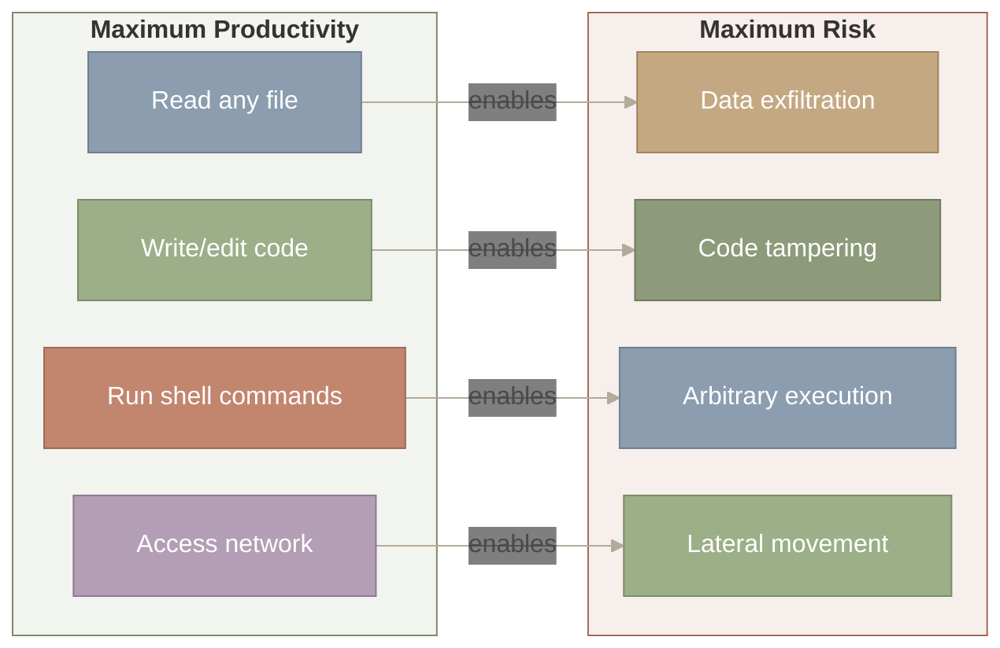
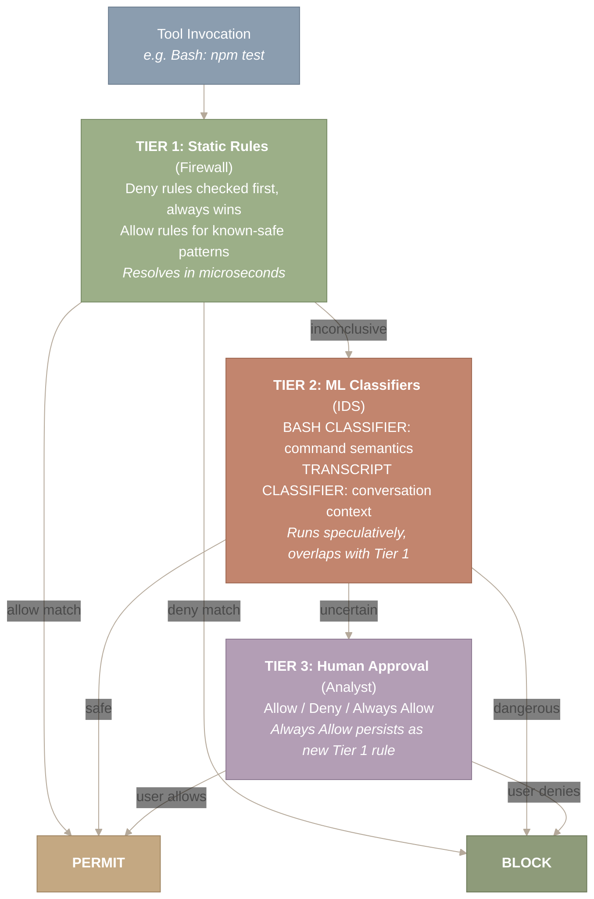
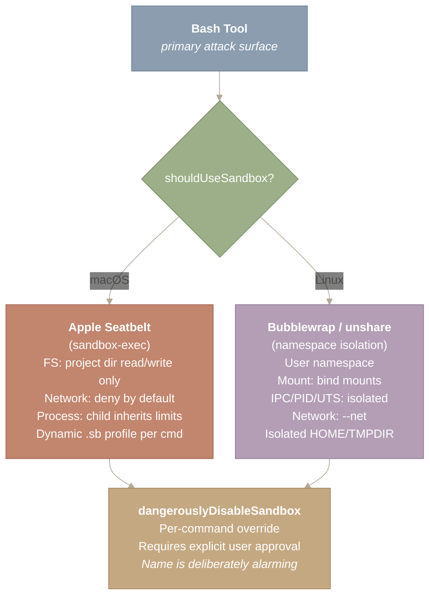
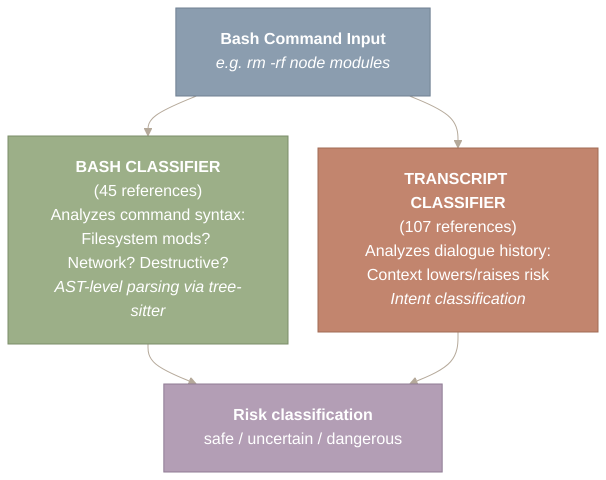
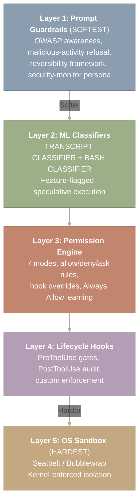

# Safety & Sandboxing

Hand an AI agent a shell and you have created something powerful – and something dangerous. A single hallucinated `rm -rf /` stands between a productive coding session and catastrophe. Claude Code’s safety architecture tackles this with a strategy borrowed from network security: defense in depth. Three tiers of permission checks, two ML classifiers, and OS-level sandboxing form concentric barriers, each catching what the previous layer missed. This is mandatory access control (MAC) – a concept from operating systems – reimagined for AI agents.

This post maps the permission architecture, explains the security-UX trade-off that drives every design choice, and connects the sandbox to OS-level isolation primitives from containers and seccomp profiles.

> **This post covers:**
>
>
> - The Trust Problem – why shell access demands layered defense
> - Three-Tier Permission Architecture – config rules, ML classifiers, human approval
> - OS-Level Sandboxing – Seatbelt (macOS) / Bubblewrap (Linux)
> - The Security-UX Spectrum – seven modes from read-only to YOLO
> - Command Risk Classification – tree-sitter AST + ML classifiers

**Source files covered in this post:**

| File | Purpose | Size |
| --- | --- | --- |
| `src/utils/permissions/permissions.ts` | Core permission engine (allow/deny/ask evaluation) | ~500 LOC |
| `src/utils/permissions/bashClassifier.ts` | ML-based command risk classification | ~400 LOC |
| `src/utils/permissions/dangerousPatterns.ts` | Dangerous command pattern matching | ~300 LOC |
| `src/utils/permissions/permissionsLoader.ts` | Permission rules loader from settings | ~200 LOC |
| `src/utils/permissions/yoloClassifier.ts` | Auto-approve classifier for trusted commands | ~200 LOC |
| `src/tools/BashTool/bashSecurity.ts` | Bash-specific security checks | ~300 LOC |
| `src/tools/BashTool/bashPermissions.ts` | Bash permission evaluation | ~200 LOC |
| `src/tools/BashTool/destructiveCommandWarning.ts` | Destructive command warnings | ~150 LOC |
| `src/utils/settings/settings.ts` | Settings management (allow/deny/ask rules) | ~500 LOC |

---

## The Trust Problem – Why Shell Access Changes Everything

**An AI agent with `exec()` is fundamentally different from a chatbot.** The moment you grant shell access, every LLM failure mode becomes a system security event.

Think about what a coding agent needs to do its job. It must read your files, write new ones, run build commands, install dependencies, and query the network. These are the same capabilities a remote attacker would want. The difference is intent – but intent is hard to verify when your “user” is a language model that occasionally hallucinates.

This is not a hypothetical concern. Prompt injection – where malicious content in a file or webpage tricks the model into running unintended commands – is a known attack vector. A `README.md` containing hidden instructions could direct the agent to exfiltrate environment variables or modify source code in subtle ways.



*Figure 1: The fundamental tension between agent productivity and security risk. Each capability the agent needs – file reading, code writing, shell execution, network access – maps directly to a corresponding attack vector (data exfiltration, code tampering, arbitrary execution, lateral movement). Designing a safe agent requires managing all four channels simultaneously.*

**How to read this diagram.** The left box lists capabilities the agent needs for productivity; the right box lists the attack vectors those same capabilities enable. Each horizontal arrow labeled “enables” connects a capability to its corresponding risk – for example, “Read any file” enables “Data exfiltration.” The takeaway is that every productive capability is simultaneously an attack surface, and the safety architecture must manage all four channels at once.

A naive solution asks the user about every action. Safe, but so slow nobody would use it. The opposite extreme – auto-approve everything – is one bad hallucination away from disaster. Claude Code’s answer is **defense in depth**: multiple independent layers, each with different strengths, so that no single failure is catastrophic.

---

## The Three-Tier Permission Architecture – Firewall, IDS, Analyst

**Every tool invocation passes through a deterministic decision tree with three tiers: static rules, ML classifiers, and human approval.**

The analogy to network security is precise. Each tier handles different kinds of threats at different speeds:



*Figure 2: The three-tier permission decision tree for every tool invocation. Tier 1 (static rules) resolves known patterns in microseconds with deny-rules-always-win semantics. Tier 2 (ML classifiers) handles novel commands via speculative execution overlapping with Tier 1. Tier 3 (human approval) decides genuinely uncertain cases, with ‘Always Allow’ feeding back into Tier 1 as a learning loop.*

**How to read this diagram.** Start at “Tool Invocation” at the top and follow the arrows downward through three tiers. Each tier either resolves the decision (arrows to PERMIT or BLOCK on the sides) or passes it to the next tier via “inconclusive” or “uncertain.” Tier 1 (static rules) resolves the fastest. Tier 2 (ML classifiers) handles novel commands. Tier 3 (human approval) is the final arbiter, and its “Always Allow” option feeds learned patterns back into Tier 1 as new static rules.

The decision flow follows strict priority ordering. Deny rules are evaluated first and cannot be overridden – they represent unconditional policy boundaries. Hook overrides come next (a `PreToolUse` hook can return Allow, Deny, or Ask). Then ask rules, which force a user prompt even in permissive modes. Finally, allow rules and the current permission mode resolve the remainder.

The rule format uses a `ToolName(argument_pattern)` syntax with wildcard support:

```
{
  "permissions": {
    "allow": ["Bash(npm test:*)", "Bash(git:*)", "Read"],
    "deny": ["Bash(rm -rf:*)"],
    "ask": ["Bash(git push:*)"]
  }
}
```

When a user chooses “Always Allow” at the permission prompt, the tool+argument pattern is persisted to `settings.json` as a new Tier 1 allow rule. This creates a learning loop: a new user on an unfamiliar codebase is prompted frequently, but after a few sessions, common patterns are auto-approved. The system adapts to the user’s workflow without sacrificing safety for genuinely novel commands.

---

## The Security-UX Spectrum – Seven Permission Modes

**Claude Code offers seven permission modes, each representing a different point on the trade-off between security and productivity.**

This is not an accident – it reflects the reality that “the right level of security” depends entirely on context. Reviewing a stranger’s open-source project demands different constraints than running tests in a Docker container that gets destroyed after every CI job.

```mermaid
%%{init: {'theme': 'neutral', 'flowchart': {'useMaxWidth': false, 'htmlLabels': true, 'padding': 20, 'nodeSpacing': 30, 'rankSpacing': 40}, 'themeVariables': {'primaryColor': '#8B9DAF', 'primaryTextColor': '#ffffff', 'primaryBorderColor': '#6E7F91', 'secondaryColor': '#9CAF88', 'secondaryTextColor': '#ffffff', 'secondaryBorderColor': '#7A8D68', 'tertiaryColor': '#C2856E', 'tertiaryTextColor': '#ffffff', 'tertiaryBorderColor': '#A06A54', 'lineColor': '#B5A99A', 'textColor': '#4A4A4A', 'mainBkg': '#8B9DAF', 'nodeBorder': '#6E7F91', 'clusterBkg': 'rgba(139,157,175,0.12)', 'clusterBorder': '#B5A99A', 'edgeLabelBackground': 'transparent'}}}%%
flowchart LR
  P["<b>plan</b><br>Read-only<br><i>Explore + plan</i>"]
  A["<b>ask</b><br>Ask for every tool<br><i>Maximum caution</i>"]
  BU["<b>bubble</b><br>Subagent mode<br><i>Escalate to parent</i>"]
  D["<b>default</b><br>Standard mode<br><i>Ask for destructive</i>"]
  AE["<b>acceptEdits</b><br>Auto-approve edits<br><i>Still ask for Bash</i>"]
  DA["<b>dontAsk</b><br>Auto-approve all<br><i>Deny rules honored</i>"]
  BY["<b>bypass</b><br>Skip ALL checks<br><i>YOLO mode, CI only</i>"]

  P --> A --> BU --> D --> AE --> DA --> BY

  style P fill:#9CAF88,color:#ffffff,stroke:#7A8D68
  style A fill:#9CAF88,color:#ffffff,stroke:#7A8D68
  style BU fill:#8B9DAF,color:#ffffff,stroke:#6E7F91
  style D fill:#B5A99A,color:#4A4A4A,stroke:#8A7F72
  style AE fill:#B5A99A,color:#4A4A4A,stroke:#8A7F72
  style DA fill:#C2856E,color:#ffffff,stroke:#A06A54
  style BY fill:#A06A54,color:#ffffff,stroke:#8B5642
  style P fill:#8B9DAF,color:#fff,stroke:#6E7F91
  style A fill:#9CAF88,color:#fff,stroke:#7A8D68
  style BU fill:#C2856E,color:#fff,stroke:#A06A54
  style D fill:#B39EB5,color:#fff,stroke:#8E7A93
  style AE fill:#C4A882,color:#fff,stroke:#A08562
  style DA fill:#8E9B7A,color:#fff,stroke:#6E7B5A
  style BY fill:#8B9DAF,color:#fff,stroke:#6E7F91
```



*Figure 3: The seven permission modes arranged from most restrictive to least restrictive. Plan mode is read-only; ask mode prompts for every tool; bubble mode escalates to a parent agent; default mode asks only for destructive actions; acceptEdits auto-approves file writes; dontAsk auto-approves everything while still honoring deny rules; bypass skips all checks entirely. All seven share a single PermissionPolicy engine with different default policies.*

**How to read this diagram.** The seven boxes are arranged left to right from most restrictive (plan: read-only) to least restrictive (bypass: skip all checks). Follow the arrows to see the progression of increasing trust. Each box names the mode and summarizes its policy in italics. The key insight is that all seven modes share a single PermissionPolicy engine – only the default policy changes, not the underlying security logic.

The key insight is that these modes share a single underlying permission engine – a PermissionPolicy object with a configurable mode. The engine evaluates every request identically; only the default policy changes. This means the security logic is tested once but deployed in seven configurations, reducing the chance that a permissive mode introduces a bug absent in restrictive modes.

The `acceptEdits` mode illustrates a principled boundary. File edits are reversible via `git checkout`, so auto-approving them is a reasonable risk. Shell commands may not be reversible (a database migration, a deployed binary), so they still require approval. The reversibility of an action determines its default permission level.

This is the **Policy pattern** – a family of interchangeable strategies behind a uniform interface. The seven modes are seven policy instances, all implementing the same `authorize()` method.

---

## OS-Level Sandboxing – The Concrete Bunker Walls

**Even if every software check fails, the OS sandbox constrains what an executed command can actually do.**

The permission system operates at the application layer. If a prompt injection exploits a parser bug or a race condition, the executed command runs with the user’s full privileges – unless the OS prevents it. This is why Claude Code implements OS-level sandboxing as its final defensive layer.

The Bash tool is the primary attack surface. It is the only tool that can execute arbitrary code, spawn processes, and access the network without constraint. File tools (Read, Write, Edit) operate through Claude Code’s own I/O layer with built-in path validation. But Bash is a direct conduit to the operating system.



*Figure 4: OS-level sandbox architecture showing platform-specific isolation mechanisms. On macOS, Apple Seatbelt generates a dynamic .sb profile per command restricting filesystem, network, and process capabilities. On Linux, Bubblewrap/unshare creates isolated user, mount, IPC, PID, UTS, and network namespaces. Both platforms support per-command bypass via the deliberately alarming dangerouslyDisableSandbox flag, which requires explicit user approval.*

**How to read this diagram.** Start at “Bash Tool” at the top and follow the arrow to the platform decision diamond. The flow branches left to macOS (Apple Seatbelt with dynamic .sb profiles) or right to Linux (Bubblewrap/unshare with namespace isolation). Both branches converge at the bottom on “dangerouslyDisableSandbox,” the per-command escape hatch that requires explicit user approval. The diagram shows that regardless of platform, the sandbox architecture follows the same pattern: detect the OS, apply platform-native isolation, and provide a controlled override path.

On macOS, Claude Code leverages Apple’s Seatbelt framework – the same technology that sandboxes App Store applications. Each Bash command gets a dynamically generated sandbox profile restricting filesystem access to the project directory and TMPDIR, denying network access by default, and controlling process spawning. The profile adapts to the current working directory, so the sandbox fits the project rather than applying a one-size-fits-all policy.

On Linux, the sandbox uses namespace isolation via `unshare` – the same primitive that powers Docker containers. The implementation creates isolated namespaces for user, mount, IPC, PID, UTS, and network. The sandboxed process appears to run as root but has no actual root privileges on the host.

### Evidence-Based Bypass Detection

Sometimes the sandbox is too restrictive for a legitimate command. Claude Code implements evidence-based detection: when a command fails with signatures like “Operation not permitted” or “Access denied” for paths outside allowed directories, the system infers a sandbox-caused failure and offers to retry with `dangerouslyDisableSandbox: true` – but only with explicit user approval.

The per-command granularity is important. Disabling the sandbox for one `npm install` does not disable it for the next `rm -rf`. Each command is evaluated independently.

---

## Command Risk Classification – The ML Layer

**Two machine learning classifiers augment the static rules, analyzing both command semantics and conversation context.**

Static rules handle known patterns well, but real-world agent usage generates novel commands constantly. A developer asking Claude Code to “set up the project” produces commands the allow list has never seen. This is where ML classifiers fill the gap.



*Figure 5: The dual-classifier architecture for command risk assessment. The BASH CLASSIFIER (45 codebase references) parses command syntax via tree-sitter AST analysis, categorizing along dimensions like filesystem modification, network access, and destructiveness. The TRANSCRIPT CLASSIFIER (107 references) analyzes the full conversation history to assess intent in context. Both classifiers run speculatively in parallel with static rules, adding zero latency when static rules resolve the decision.*

**How to read this diagram.** A single bash command input at the top feeds into two classifiers running in parallel: the Bash Classifier (which analyzes command syntax via tree-sitter AST) and the Transcript Classifier (which analyzes the full conversation history for intent). Both arrows converge at the bottom into a single risk classification output with three possible labels: safe, uncertain, or dangerous. The dual-path design means the system evaluates both what the command does and why the model is running it.

The BASH_CLASSIFIER focuses on command semantics. Given a shell command string, it categorizes along safety dimensions: does it modify the filesystem? Access the network? Is it destructive? Reversible? The classifier uses tree-sitter – an incremental parsing library – to build an Abstract Syntax Tree (AST) of the command, enabling analysis that goes beyond naive string matching. It can distinguish `rm -rf node_modules` (deleting a regenerable directory) from `rm -rf /` (destroying the filesystem).

The TRANSCRIPT_CLASSIFIER takes a wider view. It analyzes the full conversation history to classify intent and risk in context. The same command – `rm -rf node_modules` – gets different risk scores depending on whether the conversation is about “clean up and reinstall dependencies” versus a suspicious sequence suggesting prompt injection.

The critical performance optimization is speculative execution. Both classifiers start running in parallel with the static rule evaluation. If static rules resolve the decision, the classifier result is discarded – zero added latency. If static rules are inconclusive and the classifier has completed, its result informs the decision. If the classifier is still running, the system falls back to the interactive prompt. This overlap means the ML tier never slows down the common case.

Both classifiers are feature-flagged, meaning they can be enabled, disabled, or adjusted server-side without a client update. This is essential for safety infrastructure – if a classifier starts producing false positives, Anthropic can tune it within minutes.

Static rules and ML classifiers are complementary, not competing. Rules handle known patterns at zero cost. Classifiers handle novel patterns with some cost. Speculative execution ensures you pay the ML cost only when static rules cannot resolve the decision. This is the same optimization as branch prediction in CPUs – speculate on the common case, recover when wrong.

---

## Prompt-Level Guardrails – The Outermost Defense

**The final layer operates not at code level but at prompt level, shaping the model’s behavior before any tool is invoked.**

Claude Code’s system prompt includes several safety fragments. The `system-prompt-censoring-assistance-with-malicious-activities` fragment establishes a baseline refusal to assist with malware, exploitation, or social engineering. The coding guidelines embed OWASP top 10 awareness, steering the model away from SQL injection, XSS, and path traversal in generated code.

A reversibility and blast-radius framework instructs the model to prefer reversible actions over irreversible ones, small-scope changes over large-scope, and read-before-write patterns over blind overwrites. For auto-mode (unattended operation), additional fragments inject a security monitoring persona that continuously evaluates for prompt injection attempts.

These prompt-level guardrails are the outermost and least reliable layer – prompt constraints can be circumvented by clever adversarial inputs. This is precisely why the system does not rely on them alone. They are the first line of defense and the broadest in scope, catching the most common issues while deeper layers handle what slips through.

Prompt-level safety is cheap (no runtime cost beyond tokens) and broad (covers all model behavior) but soft (bypassable by adversarial inputs). OS-level sandboxing is expensive (process overhead) and narrow (only constrains Bash) but hard (kernel-enforced). A complete system needs both.

---

## The Complete Safety Stack – Putting It Together

**Five layers form concentric barriers, each with different strengths, ensuring no single failure is catastrophic.**



*Figure 6: The complete five-layer safety stack arranged from softest to hardest enforcement. Layer 1 (prompt guardrails) shapes model behavior via OWASP awareness and reversibility heuristics. Layer 2 (ML classifiers) runs speculative risk assessment with feature-flagged control. Layer 3 (permission engine) applies seven configurable modes with allow/deny/ask rules. Layer 4 (lifecycle hooks) enables custom PreToolUse gates and PostToolUse audit. Layer 5 (OS sandbox) provides kernel-enforced Seatbelt or Bubblewrap isolation. An attack must penetrate all five concentric layers to cause harm.*

**How to read this diagram.** Start at Layer 1 (Prompt Guardrails) at the top – the softest, broadest defense – and follow the arrows downward through increasingly hard enforcement to Layer 5 (OS Sandbox) at the bottom – the hardest, narrowest defense. Each layer catches threats that slip past the layer above it. An attack must penetrate all five concentric layers to cause harm, which is the essence of defense in depth.

---

## Summary

**Safety in AI agents is an architecture problem, not a feature.** Claude Code’s five-layer defense is not a checklist of security features bolted on after the fact. It is a structural element woven through every tool invocation, from the broadest prompt-level guidelines to the narrowest kernel-enforced sandbox. Each layer is independently valuable, but their power comes from composition.

**The security-UX trade-off is a spectrum, not a binary.** Seven permission modes let users choose friction levels appropriate to context. The same engine powers all seven – only the default policy changes. This is the Policy pattern applied to security, and it means security logic is tested once but deployed in seven configurations.

**Static rules and ML classifiers are complementary, not competing.** Rules handle the known at zero cost; classifiers handle the novel with some cost. Speculative execution ensures the ML layer adds latency only when needed. This parallels how CPUs use branch prediction – speculate on the common case, recover when wrong.

**The OS sandbox is the layer of last resort.** When every software check has been bypassed – through bugs, blind spots, or social engineering – the sandbox constrains what is physically possible. It is the concrete bunker walls behind the security guards. The evidence-based bypass detection ensures the sandbox does not make the tool unusable, while the deliberately alarming `dangerouslyDisableSandbox` name prevents casual misuse.

**The system learns from its users.** Every “Always Allow” at the permission prompt becomes a new static rule, reducing future friction. A new user on an unfamiliar codebase is prompted frequently; after a few sessions, the same user is rarely interrupted. The permission system adapts to workflows without requiring explicit configuration.

---

*Next in the series: [Part II.3: Hooks & Lifecycle](https://y-agent.github.io/inside-claude-code/11-hooks-lifecycle.html) and [Part VI.1: Model Context Protocol](https://y-agent.github.io/inside-claude-code/10-model-context-protocol.html) – Claude Code’s extension points and the design patterns that make a single binary serve diverse workflows.*
