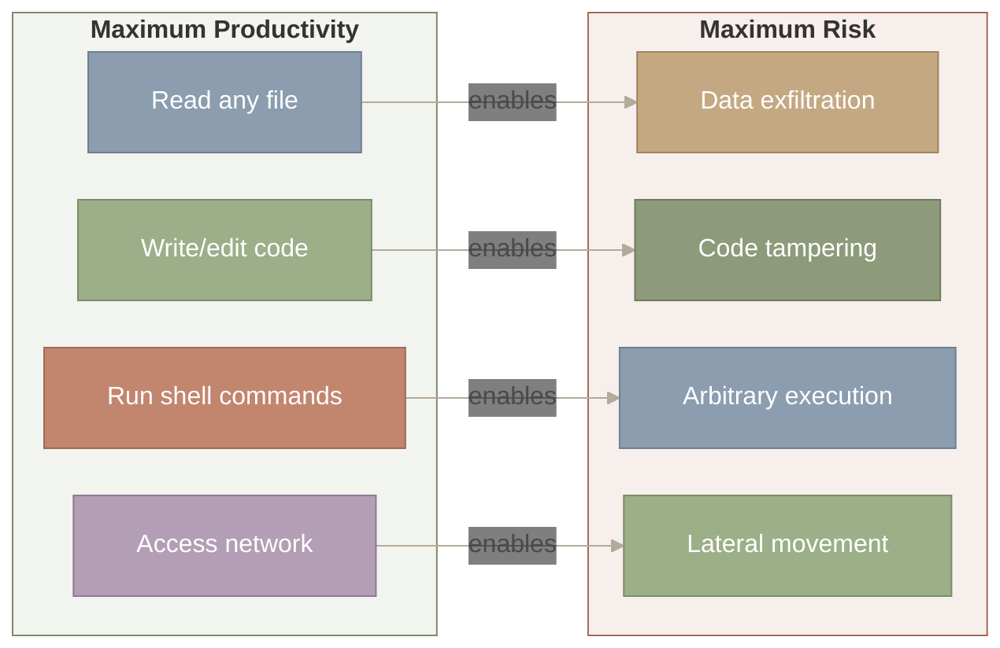
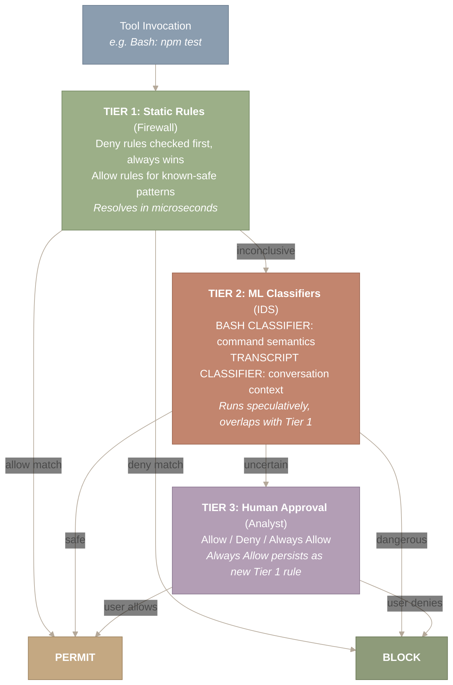
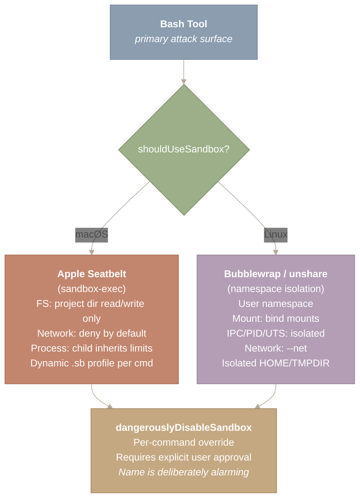
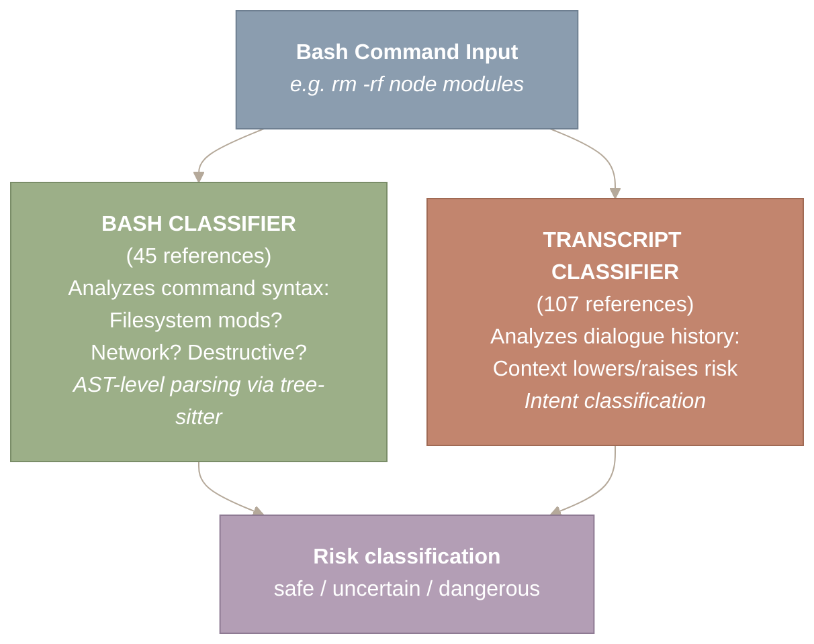
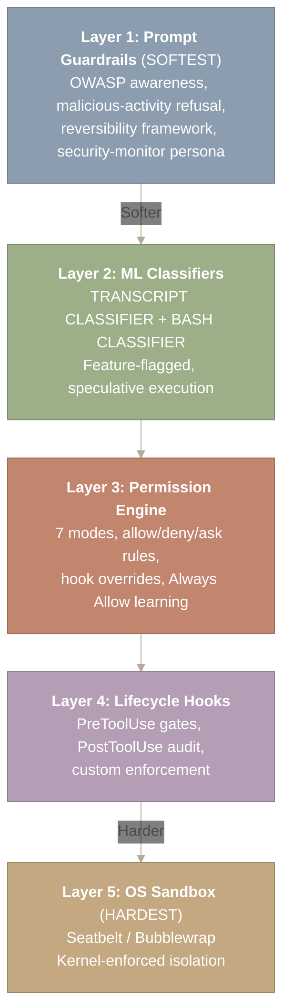

> 译者说明：本文按 2026-08-12 抓取的网页完整翻译，保留原始章节、代码、表格、Mermaid 图源、图注和链接。原文分析基于 Claude Code v2.1.88 的 Source Map；文件行数、工具数量、阈值和实现细节属于该页面快照，不应直接外推到其他版本。

# 安全与沙箱

把 shell 交给一个 AI agent，你就造出了一个强大而危险的东西。一次幻觉出来的 `rm -rf /`，就隔在高效的编码会话和灾难之间。Claude Code 的安全架构借鉴了网络安全的策略来应对这个问题：纵深防御（defense in depth）。三层权限检查、两个 ML 分类器和操作系统级沙箱构成一道道同心防线，每一层拦截前一层漏掉的东西。这是强制访问控制（MAC）——一个来自操作系统的概念——为 AI agent 重新设计的版本。

本文梳理权限架构，解释驱动每一个设计决策的安全与用户体验之间的权衡，并把沙箱与来自容器和 seccomp profile 的操作系统级隔离原语联系起来。

> **本文涵盖：**
>
>
> - 信任问题——为什么 shell 访问权限要求分层防御
> - 三层权限架构——配置规则、ML 分类器、人工批准
> - 操作系统级沙箱——Seatbelt（macOS）/ Bubblewrap（Linux）
> - 安全与体验的谱系——从只读到 YOLO 的七种模式
> - 命令风险分类——tree-sitter AST + ML 分类器

**本文涉及的源文件：**

| 文件 | 用途 | 规模 |
| --- | --- | --- |
| `src/utils/permissions/permissions.ts` | 核心权限引擎（allow/deny/ask 求值） | ~500 LOC |
| `src/utils/permissions/bashClassifier.ts` | 基于 ML 的命令风险分类 | ~400 LOC |
| `src/utils/permissions/dangerousPatterns.ts` | 危险命令模式匹配 | ~300 LOC |
| `src/utils/permissions/permissionsLoader.ts` | 从设置中加载权限规则 | ~200 LOC |
| `src/utils/permissions/yoloClassifier.ts` | 针对可信命令的自动批准分类器 | ~200 LOC |
| `src/tools/BashTool/bashSecurity.ts` | Bash 特有的安全检查 | ~300 LOC |
| `src/tools/BashTool/bashPermissions.ts` | Bash 权限求值 | ~200 LOC |
| `src/tools/BashTool/destructiveCommandWarning.ts` | 破坏性命令警告 | ~150 LOC |
| `src/utils/settings/settings.ts` | 设置管理（allow/deny/ask 规则） | ~500 LOC |

---

## 信任问题——为什么 shell 访问权限改变了一切

**一个拥有 `exec()` 的 AI agent 与一个聊天机器人有本质区别。** 你授予 shell 访问权限的那一刻，LLM 的每一种失效模式都变成了系统安全事件。

想想一个编码 agent 完成工作需要做什么。它必须读取你的文件、写入新文件、运行构建命令、安装依赖、查询网络。这些能力与一个远程攻击者想要的东西完全相同。区别在于意图——但当你的“用户”是一个偶尔会幻觉的语言模型时，意图很难验证。

这不是假设中的担忧。提示注入（prompt injection）——文件或网页中的恶意内容诱骗模型运行非预期命令——是一个已知的攻击向量。一个包含隐藏指令的 `README.md` 可以指使 agent 窃取环境变量，或以不易察觉的方式修改源代码。



*图 1：agent 生产力与安全风险之间的根本张力。agent 需要的每一项能力——读取文件、编写代码、执行 shell、访问网络——都直接映射到对应的攻击向量（数据窃取、代码篡改、任意执行、横向移动）。设计一个安全的 agent 需要同时管控这四个通道。*

图的左侧方框列出 agent 为保持生产力所需的能力；右侧方框列出同样这些能力所开启的攻击向量。每条标有“enables”（使能）的水平箭头把一项能力连接到它对应的风险——例如，“读取任意文件”使能“数据窃取”。要点在于：每一项生产力能力同时也是一个攻击面，安全架构必须同时管控全部四个通道。

朴素的方案是对每个动作都询问用户。安全，但慢到没人会用。另一个极端——全部自动批准——离灾难只差一次糟糕的幻觉。Claude Code 的答案是**纵深防御**：多个相互独立的层，每层各有长处，任何单点失效都不会是灾难性的。

---

## 三层权限架构——防火墙、IDS、分析师

**每一次 Tool 调用都会穿过一个确定性的三层决策树：静态规则、ML 分类器、人工批准。**

与网络安全的类比是精确的。每一层以不同的速度处理不同种类的威胁：



*图 2：每次 Tool 调用的三层权限决策树。第 1 层（静态规则）以微秒级速度解析已知模式，遵循“deny 规则永远胜出”的语义。第 2 层（ML 分类器）通过与第 1 层重叠的投机执行来处理陌生命令。第 3 层（人工批准）裁决真正不确定的情形，其中“Always Allow”会作为学习回路反馈回第 1 层。*

从顶部的“Tool Invocation”开始，沿箭头向下穿过三层。每一层要么就地作出决定（由两侧的箭头指向 PERMIT 或 BLOCK），要么通过“inconclusive”（无结论）或“uncertain”（不确定）把它交给下一层。第 1 层（静态规则）解析得最快。第 2 层（ML 分类器）处理陌生命令。第 3 层（人工批准）是最终裁决者，它的“Always Allow”选项会把学到的模式作为新的静态规则反馈回第 1 层。

决策流程遵循严格的优先级顺序。deny 规则最先求值，且不可被覆盖——它们代表无条件的策略边界。接下来是 Hook 覆盖（一个 `PreToolUse` hook 可以返回 Allow、Deny 或 Ask）。然后是 ask 规则，它即使在宽松模式下也强制弹出用户提示。最后，由 allow 规则和当前权限模式处理剩余部分。

规则格式使用带通配符支持的 `ToolName(argument_pattern)` 语法：

```
{
  "permissions": {
    "allow": ["Bash(npm test:*)", "Bash(git:*)", "Read"],
    "deny": ["Bash(rm -rf:*)"],
    "ask": ["Bash(git push:*)"]
  }
}
```

当用户在权限提示中选择“Always Allow”时，工具加参数的模式会被持久化到 `settings.json`，成为一条新的第 1 层 allow 规则。这形成了一个学习回路：面对陌生代码库的新用户会频繁收到提示，但经过几个会话之后，常见模式会被自动批准。系统适应了用户的工作流，同时不为真正陌生的命令牺牲安全性。

---

## 安全与体验的谱系——七种权限模式

**Claude Code 提供七种权限模式，每一种代表安全与生产力之间权衡上的一个不同位置。**

这不是偶然——它反映了这样一个现实：“合适的安全级别”完全取决于上下文。审查一个陌生人的开源项目，和在一个每次 CI 任务结束后就被销毁的 Docker 容器里跑测试，需要的是不同的约束。

```mermaid
%%{init: {'theme': 'neutral', 'flowchart': {'useMaxWidth': false, 'htmlLabels': true, 'padding': 20, 'nodeSpacing': 30, 'rankSpacing': 40}, 'themeVariables': {'primaryColor': '#8B9DAF', 'primaryTextColor': '#ffffff', 'primaryBorderColor': '#6E7F91', 'secondaryColor': '#9CAF88', 'secondaryTextColor': '#ffffff', 'secondaryBorderColor': '#7A8D68', 'tertiaryColor': '#C2856E', 'tertiaryTextColor': '#ffffff', 'tertiaryBorderColor': '#A06A54', 'lineColor': '#B5A99A', 'textColor': '#4A4A4A', 'mainBkg': '#8B9DAF', 'nodeBorder': '#6E7F91', 'clusterBkg': 'rgba(139,157,175,0.12)', 'clusterBorder': '#B5A99A', 'edgeLabelBackground': 'transparent'}}}%%
flowchart LR
  P["<b>plan</b><br>Read-only<br><i>Explore + plan</i>"]
  A["<b>ask</b><br>Ask for every tool<br><i>Maximum caution</i>"]
  BU["<b>bubble</b><br>Subagent mode<br><i>Escalate to parent</i>"]
  D["<b>default</b><br>Standard mode<br><i>Ask for destructive</i>"]
  AE["<b>acceptEdits</b><br>Auto-approve edits<br><i>Still ask for Bash</i>"]
  DA["<b>dontAsk</b><br>Auto-approve all<br><i>Deny rules honored</i>"]
  BY["<b>bypass</b><br>Skip ALL checks<br><i>YOLO mode, CI only</i>"]

  P --> A --> BU --> D --> AE --> DA --> BY

  style P fill:#9CAF88,color:#ffffff,stroke:#7A8D68
  style A fill:#9CAF88,color:#ffffff,stroke:#7A8D68
  style BU fill:#8B9DAF,color:#ffffff,stroke:#6E7F91
  style D fill:#B5A99A,color:#4A4A4A,stroke:#8A7F72
  style AE fill:#B5A99A,color:#4A4A4A,stroke:#8A7F72
  style DA fill:#C2856E,color:#ffffff,stroke:#A06A54
  style BY fill:#A06A54,color:#ffffff,stroke:#8B5642
  style P fill:#8B9DAF,color:#fff,stroke:#6E7F91
  style A fill:#9CAF88,color:#fff,stroke:#7A8D68
  style BU fill:#C2856E,color:#fff,stroke:#A06A54
  style D fill:#B39EB5,color:#fff,stroke:#8E7A93
  style AE fill:#C4A882,color:#fff,stroke:#A08562
  style DA fill:#8E9B7A,color:#fff,stroke:#6E7B5A
  style BY fill:#8B9DAF,color:#fff,stroke:#6E7F91
```



*图 3：七种权限模式，按从最严格到最宽松排列。plan 模式是只读的；ask 模式对每个工具都提示；bubble 模式升级到父 agent；default 模式只对破坏性操作提问；acceptEdits 自动批准文件写入；dontAsk 自动批准一切但仍遵守 deny 规则；bypass 完全跳过所有检查。七种模式共享同一个 PermissionPolicy 引擎，只是默认策略不同。*

七个方框从左到右按最严格（plan：只读）到最宽松（bypass：跳过所有检查）排列。沿箭头可以看到信任逐步递增的过程。每个方框标注模式名称，并用斜体概括其策略。关键在于，七种模式共享同一个 PermissionPolicy 引擎——改变的只是默认策略，而不是底层的安全逻辑。

关键在于，这些模式共享同一个底层权限引擎——一个带有可配置模式的 PermissionPolicy 对象。引擎以完全相同的方式求值每个请求；只有默认策略在变。这意味着安全逻辑只需测试一次，却以七种配置部署，降低了宽松模式引入严格模式中不存在的 bug 的概率。

`acceptEdits` 模式展示了一条有原则的边界。文件编辑可以通过 `git checkout` 撤销，所以自动批准它们是合理的风险。shell 命令未必可逆（一次数据库迁移、一个已部署的二进制文件），所以它们仍需要批准。一个动作的可逆性决定了它的默认权限级别。

这就是 **Policy 模式（策略模式）**——一族可互换的策略，藏在统一接口背后。七种模式就是七个策略实例，全都实现同一个 `authorize()` 方法。

---

## 操作系统级沙箱——混凝土碉堡的围墙

**即使所有软件层面的检查都失效，操作系统沙箱仍然约束着一条已执行命令实际能做的事情。**

权限系统运行在应用层。如果一次提示注入利用了某个解析器 bug 或竞态条件，被执行的命令将以用户的完整权限运行——除非操作系统阻止它。这就是 Claude Code 把操作系统级沙箱作为最后一道防线的原因。

Bash 工具是主要的攻击面。它是唯一能执行任意代码、派生进程、不受约束地访问网络的工具。文件类工具（Read、Write、Edit）经由 Claude Code 自己的 I/O 层运作，内置路径校验。而 Bash 是一条直通操作系统的通道。



*图 4：操作系统级沙箱架构，展示各平台特有的隔离机制。在 macOS 上，Apple Seatbelt 为每条命令动态生成一份 .sb 配置文件，限制文件系统、网络和进程能力。在 Linux 上，Bubblewrap/unshare 创建隔离的 user、mount、IPC、PID、UTS 和 network 命名空间。两个平台都支持通过刻意起得骇人的 dangerouslyDisableSandbox 标志按命令绕过沙箱，且该操作需要用户明确批准。*

图中从顶部的「Bash Tool」开始，沿箭头走到平台判断菱形。流程向左分支到 macOS（Apple Seatbelt，动态 .sb 配置文件），向右分支到 Linux（Bubblewrap/unshare，命名空间隔离）。两条分支在底部汇聚到「dangerouslyDisableSandbox」——这是按命令使用的逃生口，需要用户明确批准。这张图表明：无论在哪个平台上，沙箱架构都遵循同一个模式：识别操作系统，施加平台原生的隔离，并提供一条受控的覆盖通道。

在 macOS 上，Claude Code 利用 Apple 的 Seatbelt 框架——就是为 App Store 应用做沙箱的同一套技术。每条 Bash 命令都会得到一份动态生成的沙箱配置文件：把文件系统访问限制在项目目录和 TMPDIR 之内，默认拒绝网络访问，并控制进程派生。这份配置文件会跟随当前工作目录调整，因此沙箱贴合具体项目，而不是套用一份放之四海皆准的策略。

在 Linux 上，沙箱通过 `unshare` 使用命名空间隔离——这正是驱动 Docker 容器的同一个原语。实现上为 user、mount、IPC、PID、UTS 和 network 分别创建隔离的命名空间。沙箱内的进程看起来以 root 身份运行，但在宿主机上没有任何实际的 root 权限。

### 基于证据的绕过检测

有时沙箱对一条合法命令来说限制得过死。Claude Code 实现了基于证据的检测：当一条命令失败，且报错带有诸如「Operation not permitted」之类、或指向允许目录之外路径的「Access denied」等特征时，系统推断这是一次沙箱导致的失败，并提出用 `dangerouslyDisableSandbox: true` 重试——但必须得到用户明确批准。

按命令划分的粒度很重要。对某一条 `npm install` 禁用沙箱，并不会对下一条 `rm -rf` 也禁用它。每条命令都被独立评估。

---

## 命令风险分类——机器学习层

**两个机器学习分类器作为静态规则的补充，同时分析命令语义和对话上下文。**

静态规则能很好地处理已知模式，但真实世界中的 Agent 使用会不断产生全新的命令。开发者让 Claude Code「搭建好这个项目」，产出的命令是允许列表从未见过的。ML 分类器正是用来填补这个缺口的。



*图 5：用于命令风险评估的双分类器架构。BASH CLASSIFIER（在代码库中被引用 45 处）通过 tree-sitter AST 分析解析命令语法，沿文件系统修改、网络访问、破坏性等维度归类。TRANSCRIPT CLASSIFIER（107 处引用）分析完整对话历史，在上下文中评估意图。两个分类器与静态规则并行投机执行，当静态规则能定夺时不增加任何延迟。*

图中顶部的一条 bash 命令输入被送入两个并行运行的分类器：Bash Classifier（通过 tree-sitter AST 分析命令语法）和 Transcript Classifier（分析完整对话历史以判断意图）。两支箭头在底部汇聚为单一的风险分类输出，有三种可能标签：safe、uncertain 或 dangerous。这种双路径设计意味着系统同时评估这条命令做什么、以及模型为什么要运行它。

BASH_CLASSIFIER 关注命令语义。给定一个 shell 命令字符串，它沿安全维度归类：是否修改文件系统？是否访问网络？是否有破坏性？是否可逆？该分类器使用 tree-sitter——一个增量解析库——为命令构建抽象语法树（AST），使分析能力超出朴素的字符串匹配。它能区分 `rm -rf node_modules`（删除一个可重新生成的目录）和 `rm -rf /`（摧毁文件系统）。

TRANSCRIPT_CLASSIFIER 的视野更宽。它分析完整的对话历史，在上下文中判断意图与风险。同一条命令——`rm -rf node_modules`——会得到不同的风险评分，取决于对话内容是「清理并重新安装依赖」，还是一段暗示提示注入的可疑序列。

关键的性能优化是投机执行。两个分类器与静态规则求值并行启动。如果静态规则能定夺，分类器的结果就被丢弃——零额外延迟。如果静态规则无法定夺而分类器已完成，它的结果就参与决策。如果分类器还在运行，系统就回退到交互式询问。这种重叠意味着 ML 层永远不会拖慢常见路径。

两个分类器都由 Feature Flag 控制，意味着它们可以在服务端被启用、禁用或调整，无需客户端更新。这对安全基础设施至关重要——如果某个分类器开始产生误报，Anthropic 可以在几分钟内完成调优。

静态规则与 ML 分类器是互补关系，而不是竞争关系。规则以零成本处理已知模式，分类器以一定成本处理新模式，投机执行保证只有当静态规则无法定夺时你才付出 ML 的成本。这与 CPU 中的分支预测是同一种优化——对常见情形做投机，猜错了再恢复。

---

## 提示词级护栏——最外层防线

**最后一层不作用于代码层面，而作用于提示词层面，在任何工具被调用之前塑造模型的行为。**

Claude Code 的 System Prompt 包含若干安全片段。`system-prompt-censoring-assistance-with-malicious-activities` 片段确立了对协助恶意软件、漏洞利用或社会工程攻击的基线拒绝。编码规范中嵌入了对 OWASP Top 10 的防范意识，引导模型在生成的代码中避开 SQL 注入、XSS 和路径遍历。

一套可逆性与爆炸半径框架指示模型：优先选择可逆操作而非不可逆操作，小范围改动而非大范围改动，先读后写的模式而非盲目覆盖。对于 auto 模式（无人值守运行），额外的片段会注入一个安全监控人格，持续评估是否存在提示注入企图。

这些提示词级护栏是最外层、也是最不可靠的一层——提示词约束可以被精心构造的对抗输入绕过。这正是系统不单独依赖它们的原因。它们是第一道防线，覆盖面最广，拦下最常见的问题，漏网的部分交给更深的层处理。

提示词级防护成本低（除了 token 外没有运行时开销）、覆盖面宽（覆盖所有模型行为），但质地软（可被对抗输入绕过）。操作系统级沙箱成本高（有进程开销）、覆盖面窄（只约束 Bash），但质地硬（由内核强制）。一个完整的系统两者都需要。

---

## 完整的安全堆栈——把它们组合在一起

五层防御构成同心屏障，每一层各有不同的长处，确保任何单点失效都不会造成灾难。



*图 6：完整的五层安全堆栈，按从最软到最硬的执行力度排列。第 1 层（Prompt 护栏）通过 OWASP 风险认知和可逆性启发式规则塑造模型行为。第 2 层（ML 分类器）以投机方式运行风险评估，由 Feature Flag 控制。第 3 层（权限引擎）应用七种可配置模式，配合 allow/deny/ask 规则。第 4 层（生命周期 Hook）支持自定义的 PreToolUse 门控和 PostToolUse 审计。第 5 层（OS 沙箱）提供内核级强制的 Seatbelt 或 Bubblewrap 隔离。攻击者必须穿透全部五层同心屏障才能造成危害。*

**阅读这张图的方法。** 从顶部的第 1 层（Prompt 护栏）开始——这是最软、覆盖面最广的防御——沿着箭头向下，穿过执行力度逐层增强的防御，直到最底部的第 5 层（OS 沙箱）——这是最硬、覆盖面最窄的防御。每一层负责拦截从上一层漏过来的威胁。攻击者必须穿透全部五层同心屏障才能造成危害，这正是纵深防御（defense in depth）的本质。

---

## 总结

**AI Agent 的安全是一个架构问题，而不是一个功能特性。** Claude Code 的五层防御不是事后拼贴上去的一张安全功能清单。它是一个贯穿每一次工具调用的结构元素：从覆盖最广的 Prompt 层准则，到覆盖最窄的内核强制沙箱。每一层单独看都有价值，但它们的力量来自组合。

**安全与体验的权衡是一个光谱，而不是非此即彼。** 七种权限模式让用户可以为不同场景选择合适的摩擦程度。这七种模式由同一个引擎驱动——只是默认策略不同。这是 Policy 模式在安全领域的应用，它意味着安全逻辑只需测试一次，却能以七种配置部署。

**静态规则和 ML 分类器是互补的，而不是互相竞争的。** 规则以零成本处理已知风险；分类器付出一些成本处理未知风险。投机执行保证了 ML 层只在需要时才增加延迟。这与 CPU 使用分支预测的思路一致——对常见情况做投机，猜错了再恢复。

**OS 沙箱是最后一道防线。** 当所有软件层面的检查都被绕过——无论是因为 bug、盲区还是社会工程——沙箱约束的是在物理层面可以做什么。它是保安身后的混凝土掩体墙。基于证据的绕过检测确保沙箱不会把工具变得没法用，而故意起得吓人的 `dangerouslyDisableSandbox` 这个名字则防止它被随手滥用。

**系统会从用户身上学习。** 权限提示中的每一次"Always Allow"都会变成一条新的静态规则，降低未来的摩擦。一个刚接触陌生代码库的新用户会被频繁提示；经过几个会话之后，同一个用户就很少被打断了。权限系统无需显式配置就能适应用户的工作流。

---

*本系列的下一篇：[Part II.3：Hooks 与生命周期](https://y-agent.github.io/inside-claude-code/11-hooks-lifecycle.html) 和 [Part VI.1：Model Context Protocol](https://y-agent.github.io/inside-claude-code/10-model-context-protocol.html)——Claude Code 的扩展点，以及让单个二进制文件支撑多样工作流的设计模式。*
