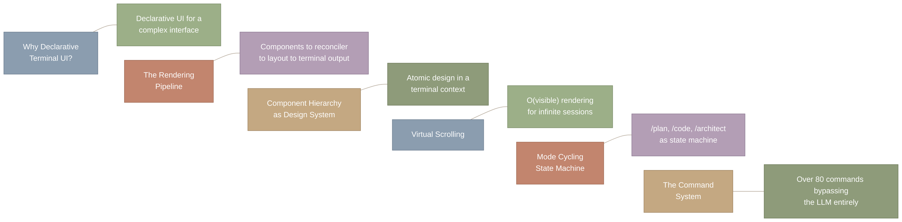
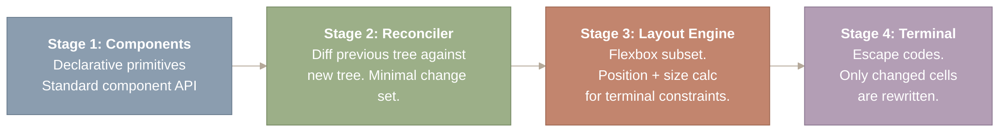
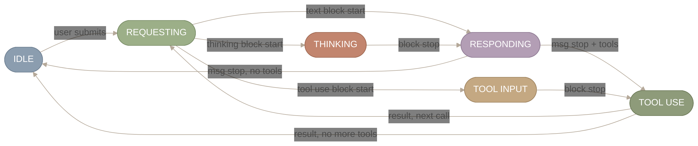
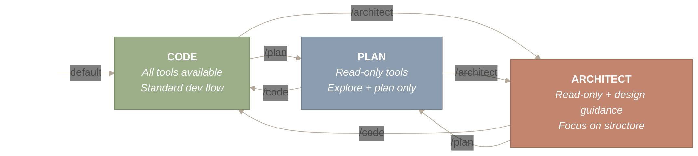
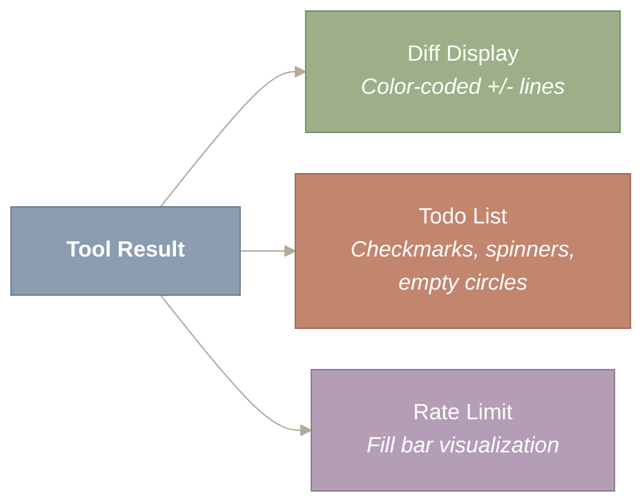

# CLI, Commands & Terminal UI

Open a terminal, type `claude`, and you are looking at a React application. Not a thin wrapper around `readline`. Not a blessed/curses UI. A full React component tree – 389 files, 1,623 component patterns, 81,546 lines of UI code – rendered to your TTY through ANSI escape codes. Claude Code’s terminal UI uses the same declarative component model as a modern web app: JSX, hooks, state management, reconciliation. The rendering target just happens to be a grid of characters instead of a grid of pixels.

This architectural choice has profound implications. It means the terminal UI gets the same development ergonomics as a web application – component composition, local state, memoization, declarative updates – while running in the most universal display environment in computing. The post explores why React in a terminal works, how virtual scrolling makes long conversations performant, and how mode cycling turns the agent into a state machine.

*Figure 1: Six topics covered in this post: why declarative terminal UI matters for managing complex concurrent state, the four-stage rendering pipeline from components to escape codes, the atomic design component hierarchy across 389 files, O(visible) virtual scrolling for long sessions, mode cycling as a state machine (/plan, /code, /architect), and over 80 slash commands that bypass the LLM entirely.*

**How to read this diagram.** Each row pairs a topic (left box) with its one-line summary (right box), and the six rows are arranged top to bottom in the order they appear in the post. Read the left column for the section names and the right column for the key insight of each section. The invisible connectors (~) between rows indicate that these are independent topics unified by the common theme of terminal UI architecture.

**Source files covered in this post:**

| File | Purpose | Size |
| --- | --- | --- |
| `src/components/App.tsx` | Root application component | ~300 LOC |
| `src/components/Messages.tsx` | Virtual message list renderer | ~400 LOC |
| `src/components/PromptInput/` | Multi-line input system | 12+ files |
| `src/components/permissions/` | Permission dialogs and UI | 20+ files |
| `src/components/messages/` | Message type renderers (text, tool, error, compact) | 35+ files |
| `src/components/Spinner/` | Animated braille-dot spinners | ~10 files |
| `src/components/design-system/` | Shared UI primitives (Button, Box, Text) | ~15 files |
| `src/commands/` | 86+ slash command handlers | 103 directories |
| `src/hooks/useGlobalKeybindings.tsx` | Keyboard shortcut bindings | ~500 LOC |
| `src/ink/` | Ink framework extensions (Box, Text, VirtualList) | 50 files |
| `src/services/PromptSuggestion/` | Prompt prediction and speculative execution | 2 files |
| `src/services/tips/` | Rotating educational tips in spinner | 3 files |
| `src/buddy/` | Companion pet system (sprites, animation, rarity) | 6 files |
| `src/projectOnboardingState.ts` | Two-step project onboarding flow | ~100 LOC |
| `src/utils/claudeInChrome/` | Browser automation via native messaging | 3 files |
| `src/utils/secureStorage/` | Platform-specific credential storage | 5 files |
| `src/utils/nativeInstaller/` | Binary distribution and atomic updates | 2 files, ~2,000 LOC |

## Why React in a Terminal? – Declarative vs. Imperative UI

**The decision to use React for a terminal application is not about aesthetics – it is about managing complexity that would overwhelm imperative approaches.**

Consider what Claude Code’s interface must handle simultaneously. Messages stream in token by token. Permission prompts overlay the conversation as modal dialogs. Tool outputs vary wildly – diffs, file trees, todo lists, tables, code blocks with syntax highlighting. Five distinct UI states (requesting, thinking, responding, tool-input, tool-use) transition based on asynchronous streaming events. Long conversations accumulate hundreds of messages that must scroll efficiently.

A traditional terminal approach – `process.stdout.write()` calls, manual cursor positioning, hand-managed ANSI codes – would collapse under this complexity. Every streaming event would require imperative logic to figure out which cells to update, which escape codes to emit, and how to handle the interaction between overlapping concerns (a permission prompt appearing during a streaming response, for example).

React Ink solves this by applying React’s core insight: *the reconciler is not tied to the DOM*. React’s reconciler manages a tree of elements, diffs updates, and calls lifecycle methods. What happens after reconciliation – writing to the browser DOM, sending native view commands, or emitting terminal escape codes – is pluggable. React Ink plugs in a terminal backend.

*Figure 2: The four-stage declarative rendering pipeline. Stage 1: components are declared using standard React JSX primitives (Box, Text, Static, Spacer). Stage 2: the reconciler diffs the previous tree against the new tree, producing a minimal change set. Stage 3: the Yoga layout engine computes flexbox positions and sizes within terminal width/height constraints. Stage 4: only changed terminal cells are rewritten via ANSI escape codes, minimizing stdout writes.*

**How to read this diagram.** Follow the four stages left to right. Stage 1 (Components) is where developers write declarative JSX. Stage 2 (Reconciler) diffs the old and new component trees. Stage 3 (Layout Engine) computes positions using Yoga flexbox. Stage 4 (Terminal) emits ANSI escape codes, rewriting only changed cells. The key insight is that only the final stage is terminal-specific – the first three stages are identical to how React works in a browser.

Ink’s primitive components map to terminal concepts: `<Box>` is a flex container (the terminal’s `
`), `<Text>` is styled text (the terminal’s ``), `<Static>` renders content once and excludes it from future reconciliation, and `<Spacer>` is a flexbox spacer. Yoga – Facebook’s cross-platform layout engine implementing a CSS Flexbox subset – calculates positions given the terminal’s width and height constraints. This is why `<Box>` supports `flexDirection`, `alignItems`, `justifyContent` – they map directly to Yoga’s layout properties. ::: {.callout-warning title=“Trade-off”} React Ink gains declarative components and reconciliation efficiency but pays a cost in terminal rendering speed – stdout writes are synchronous and slower than DOM updates. Every unnecessary re-render shows up as flicker or lag. This constraint drives the performance optimizations discussed later. :::

---

## Component Hierarchy – Atomic Design in a Terminal

**Claude Code’s 389 UI files form a design system with clear separation between structural containers, content renderers, and interactive elements.**

```mermaid
%%{init: {'theme': 'neutral', 'flowchart': {'useMaxWidth': false, 'htmlLabels': true, 'padding': 20, 'nodeSpacing': 30, 'rankSpacing': 40}, 'themeVariables': {'primaryColor': '#8B9DAF', 'primaryTextColor': '#ffffff', 'primaryBorderColor': '#6E7F91', 'secondaryColor': '#9CAF88', 'secondaryTextColor': '#ffffff', 'secondaryBorderColor': '#7A8D68', 'tertiaryColor': '#C2856E', 'tertiaryTextColor': '#ffffff', 'tertiaryBorderColor': '#A06A54', 'lineColor': '#B5A99A', 'textColor': '#4A4A4A', 'mainBkg': '#8B9DAF', 'nodeBorder': '#6E7F91', 'clusterBkg': 'rgba(139,157,175,0.12)', 'clusterBorder': '#B5A99A', 'edgeLabelBackground': 'transparent'}}}%%
flowchart TD
  App["<b>App</b><br><i>root component</i>"]

  App --> Msg["Messages<br><i>virtual list</i>"]
  App --> PI["PromptInput<br><i>12+ files</i>"]
  App --> Perm["Permissions<br><i>20+ files</i>"]
  App --> Spin["Spinner"]
  App --> DS["Design System"]

  Msg --> AM["AssistantMessage"]
  Msg --> UM["UserMessage"]
  Msg --> TUM["ToolUseMessage"]
  Msg --> TRM["ToolResultMessage"]
  Msg --> SM["SystemMessage"]

  PI --> TI["TextInput"]
  PI --> AC["AutoComplete"]
  PI --> HN["HistoryNav"]

  Perm --> PM["PermissionModal"]
  Perm --> SE["ShimmerEffect"]
  Perm --> KH["KeyboardHints"]

  DS --> SB["StyledBox"]
  DS --> TT["ThemedText"]
  DS --> ST["SpacingTokens"]
  DS --> LP["LayoutPatterns"]

  style App fill:#8B9DAF,color:#fff,stroke:#6E7F91
  style Msg fill:#9CAF88,color:#fff,stroke:#7A8D68
  style PI fill:#C2856E,color:#fff,stroke:#A06A54
  style Perm fill:#B39EB5,color:#fff,stroke:#8E7A93
  style Spin fill:#C4A882,color:#fff,stroke:#A08562
  style DS fill:#8E9B7A,color:#fff,stroke:#6E7B5A
  style AM fill:#8B9DAF,color:#fff,stroke:#6E7F91
  style UM fill:#9CAF88,color:#fff,stroke:#7A8D68
  style TUM fill:#C2856E,color:#fff,stroke:#A06A54
  style TRM fill:#B39EB5,color:#fff,stroke:#8E7A93
  style SM fill:#C4A882,color:#fff,stroke:#A08562
  style TI fill:#8E9B7A,color:#fff,stroke:#6E7B5A
  style AC fill:#8B9DAF,color:#fff,stroke:#6E7F91
  style HN fill:#9CAF88,color:#fff,stroke:#7A8D68
  style PM fill:#C2856E,color:#fff,stroke:#A06A54
  style SE fill:#B39EB5,color:#fff,stroke:#8E7A93
  style KH fill:#C4A882,color:#fff,stroke:#A08562
  style SB fill:#8E9B7A,color:#fff,stroke:#6E7B5A
  style TT fill:#8B9DAF,color:#fff,stroke:#6E7F91
  style ST fill:#9CAF88,color:#fff,stroke:#7A8D68
  style LP fill:#C2856E,color:#fff,stroke:#A06A54
```

The hierarchy follows a pattern recognizable from atomic design methodology: atoms (primitives like `<Text>`, `<Box>`) compose into molecules (styled boxes, themed text), which compose into organisms (message renderers, permission dialogs), which compose into the full application.

*Figure 3: The top three levels of Claude Code’s UI component tree. The root App component delegates to five subsystems: Messages (a virtual list rendering five message types including AssistantMessage, ToolUseMessage, and ToolResultMessage), PromptInput (multi-line editing with autocomplete and history navigation), Permissions (modal dialogs with shimmer effects and keyboard hints), Spinner, and a shared Design System providing StyledBox, ThemedText, SpacingTokens, and LayoutPatterns.*

**How to read this diagram.** Start at the root App node at the top and follow the arrows downward through three levels. The first level shows five major subsystems (Messages, PromptInput, Permissions, Spinner, Design System). The second level breaks each subsystem into its constituent components – for example, Messages fans out into five message types (AssistantMessage, UserMessage, etc.), while PromptInput contains TextInput, AutoComplete, and HistoryNav. This tree structure mirrors the actual React component hierarchy in the codebase.

The `Messages` component is the most architecturally significant piece. It implements a virtual message list – the terminal equivalent of virtual scrolling in web UIs (think `react-window` or `react-virtualized`). Rather than rendering every message in a long conversation, it renders only the messages visible in the current terminal viewport plus a small buffer. Messages outside the viewport are unmounted; new ones mount as the user scrolls. Render time stays O(visible) rather than O(total), which matters enormously when conversations accumulate hundreds of messages.

The `PromptInput` system is not a simple `readline` wrapper. It supports multi-line editing, tab completion, history navigation, slash command auto-complete with fuzzy matching, and paste detection. The input component manages its own cursor position, selection state, and composition events – the same complexity as a browser text input, implemented for a terminal.

---

## Virtual Scrolling – O(visible) Rendering

**The key performance insight: in a terminal, you cannot render 500 messages and rely on the scroll buffer. You must manage what is visible yourself.**

In a web browser, you can render a long list and let the browser handle scrolling – the DOM and GPU take care of off-screen elements. In a terminal, there is no such luxury. Everything written to stdout is sent to the terminal emulator, which must process every character. Rendering 500 messages on every frame would be catastrophic for performance.

Claude Code solves this with the same technique used by virtual list libraries in web UIs, adapted for terminal constraints:

```mermaid
%%{init: {'theme': 'neutral', 'flowchart': {'useMaxWidth': false, 'htmlLabels': true, 'padding': 20, 'nodeSpacing': 30, 'rankSpacing': 40}, 'themeVariables': {'primaryColor': '#8B9DAF', 'primaryTextColor': '#ffffff', 'primaryBorderColor': '#6E7F91', 'secondaryColor': '#9CAF88', 'secondaryTextColor': '#ffffff', 'secondaryBorderColor': '#7A8D68', 'tertiaryColor': '#C2856E', 'tertiaryTextColor': '#ffffff', 'tertiaryBorderColor': '#A06A54', 'lineColor': '#B5A99A', 'textColor': '#4A4A4A', 'mainBkg': '#8B9DAF', 'nodeBorder': '#6E7F91', 'clusterBkg': 'rgba(139,157,175,0.12)', 'clusterBorder': '#B5A99A', 'edgeLabelBackground': 'transparent'}}}%%
flowchart LR
  subgraph Static["Static Region (unmounted)"]
    M1["Message 1"]
    M2["Message 2"]
    M3["..."]
    M495["Message 495"]
  end

  subgraph Active["Active Region (live components)"]
    M496["Message 496<br><i>buffer</i>"]
    M497["Message 497<br><i>visible</i>"]
    M498["Message 498<br><i>visible</i>"]
    M499["Message 499<br><i>visible</i>"]
    M500["Message 500<br><i>current</i>"]
    PIn["PromptInput"]
  end

  Static -- "Rendered once, excluded<br>from reconciliation" --> Active

  style M1 fill:#8B9DAF,color:#fff,stroke:#6E7F91
  style M2 fill:#9CAF88,color:#fff,stroke:#7A8D68
  style M3 fill:#C2856E,color:#fff,stroke:#A06A54
  style M495 fill:#B39EB5,color:#fff,stroke:#8E7A93
  style M496 fill:#C4A882,color:#fff,stroke:#A08562
  style M497 fill:#8E9B7A,color:#fff,stroke:#6E7B5A
  style M498 fill:#8B9DAF,color:#fff,stroke:#6E7F91
  style M499 fill:#9CAF88,color:#fff,stroke:#7A8D68
  style M500 fill:#C2856E,color:#fff,stroke:#A06A54
  style PIn fill:#B39EB5,color:#fff,stroke:#8E7A93
```

*Figure 4: Virtual message list rendering showing the separation between the Static region (messages 1 through 495, rendered once then unmounted from React’s reconciliation tree) and the Active region (a small buffer plus visible messages 497-500 and the PromptInput). Only the Active region participates in reconciliation passes, keeping render time at O(visible) regardless of total conversation length.*

**How to read this diagram.** The left subgraph (Static Region) represents all historical messages that have been rendered once and then unmounted from React’s reconciliation tree. The right subgraph (Active Region) shows the small window of live components – a buffer message, a few visible messages, and the PromptInput. The arrow between regions indicates that messages flow from active to static as the conversation progresses. Only the active region participates in re-renders, which is why performance stays O(visible) regardless of conversation length.

|  | Without virtual list | With virtual list |
| --- | --- | --- |
| **Render time** | O(total) | O(visible) |
| **Messages processed** | 500 messages = slow | ~5 messages = constant |

Ink’s `<Static>` component is the key enabler. Once a message has been fully rendered and the conversation has moved past it, the message is wrapped in `<Static>`. This tells Ink the content will never change, so it is written to stdout once and excluded from future reconciliation passes. For a conversation with 200 messages, only the current message and input area participate in React’s reconciliation – the other 199 are frozen.

This optimization, combined with memoized context assembly (caching expensive computations like `getSystemContext()`) and parallel startup side effects (prefetching keychain credentials and MDM data before React mounts), keeps the UI responsive despite the inherent slowness of terminal output.

---

## The UI State Machine – Five States, Event-Driven Transitions

**At any moment, the terminal UI is in one of five states, each with distinct visual presentation. Transitions are driven by streaming API events – the UI never polls.**

The five states map directly to what is happening in the agent loop:

*Figure 5: The UI state machine with six states (IDLE, REQUESTING, THINKING, RESPONDING, TOOL INPUT, TOOL USE) and their event-driven transitions. User submission triggers REQUESTING; SSE content_block_start events branch to THINKING, RESPONDING, or TOOL INPUT depending on block type. TOOL USE loops back to REQUESTING when more tool calls follow, or returns to IDLE when the turn completes. The UI never polls – all transitions are driven by push-based streaming events.*

**How to read this diagram.** Begin at IDLE on the left – the resting state where the user types input. Follow “user submits” to REQUESTING, then observe the three-way branch: the API response can start a thinking block, a text block, or a tool use block, routing to THINKING, RESPONDING, or TOOL INPUT respectively. From RESPONDING and TOOL USE, follow the edges back: “msg stop, no tools” or “result, no more tools” return to IDLE, while “msg stop + tools” or “result, next call” loop through TOOL USE and REQUESTING for multi-tool turns.

**IDLE**: Awaiting user input. The prompt input is active.

**REQUESTING**: API request in flight. A braille-dot spinner (`⠋⠙⠹⠸⠼⠴⠦⠧⠇⠏`) signals that the system is active, preventing users from assuming the app has frozen during the 1-3 second network latency.

**THINKING**: Extended chain-of-thought reasoning. A distinct visual indicator (not the spinner) communicates “model is reasoning, not waiting for network.” This distinction sets correct expectations when thinking takes 10-30 seconds.

**RESPONDING**: Text streaming in token by token with a typewriter effect. Markdown formatting is applied in real time. This is the most visually dynamic state.

**TOOL-INPUT / TOOL-USE**: A tool’s JSON parameters accumulate as they stream in, then the tool executes with live output. For long-running Bash commands, output streams in real time.

Transitions are driven by SSE (Server-Sent Events) from the Anthropic API. Each event type maps to a state change: `message_start` triggers REQUESTING, `content_block_start` with type “thinking” triggers THINKING, type “text” triggers RESPONDING, type “tool_use” triggers TOOL-INPUT. The UI is purely reactive – it reacts to a push-based stream, never polls.

This is a **finite state machine (FSM)** driven by an event stream. Each state defines what the UI renders; each event triggers a transition. The FSM ensures the UI is always in a well-defined state, even when events arrive in unexpected orders. Compare to TCP’s state machine (LISTEN, SYN-SENT, ESTABLISHED, etc.) – same pattern, different domain.

---

## Mode Cycling – /plan, /code, /architect

**Slash commands like `/plan`, `/code`, and `/architect` switch the agent between operating modes, each changing available tools and behavioral guidelines.**

Mode cycling is a state machine layered on top of the UI state machine. While the UI state machine tracks *what is happening right now* (thinking, responding, executing), the mode state machine tracks *how the agent should behave overall*:

*Figure 6: Mode cycling state machine with three fully connected states. CODE (default) provides all tools and standard dev flow. PLAN restricts to read-only tools for exploration and planning only. ARCHITECT provides read-only tools plus design guidance focused on structure. Each transition atomically reconfigures the available tool set, system prompt behavioral guidelines, and permission level in a single operation.*

**How to read this diagram.** The entry point arrow on the left shows that CODE is the default mode. The three states – PLAN, CODE, and ARCHITECT – are fully connected: every slash command transition (labeled on the edges) is available from every state. Each node lists what that mode provides: CODE has all tools, PLAN restricts to read-only for exploration, and ARCHITECT adds design guidance to the read-only constraint. Switching modes atomically reconfigures tools, prompts, and permissions in a single operation.

Each mode modifies three aspects simultaneously: the set of available tools (plan mode restricts to read-only tools), the system prompt (injecting mode-specific behavioral guidelines), and the permission level (plan mode is the most restrictive). This means switching modes is not just a label change – it reconfigures the agent’s capabilities, instructions, and security posture in one atomic operation.

---

## The Command System – Over 80 Shortcuts Bypassing the LLM

**Slash commands provide deterministic, instant-response interactions for operations that do not require model intelligence.**

Claude Code exposes over 80 slash commands organized by function:

| Category | Examples | What They Do |
| --- | --- | --- |
| **Session** | `/clear`, `/compact`, `/status` | Manage conversation state |
| **Mode** | `/plan`, `/auto`, `/chat`, `/architect` | Switch agent operating mode |
| **Code ops** | `/commit`, `/pr`, `/review-pr` | Git workflows without LLM |
| **Agent** | `/agent`, `/team`, `/task` | Spawn sub-agents, manage tasks |
| **MCP** | `/mcp add`, `/mcp list`, `/mcp remove` | Manage MCP server connections |
| **Schedule** | `/schedule`, `/cron` | One-time or recurring tasks |
| **Debug** | `/stuck`, `/debug` | Escape loops, inspect state |
| **Skills** | `/simplify`, `/loop`, `/code-review` | Activate domain-specific skills |

Commands are parsed by an argparse-inspired router before the input reaches the LLM. If the input starts with `/`, it is intercepted and routed to the command handler. Unknown commands fall through to the model with a warning. This design ensures that `/compact` triggers immediate context compaction – no LLM round trip, no token cost, no latency.

A subtle but important detail: commands can be queued while the agent is executing. If you type `/compact` during a tool execution, it does not interrupt the current operation. Instead, it enters a priority queue and executes between agent iterations. Safety-critical commands (mode changes, permission modifications) are processed before informational ones (status queries), preventing race conditions.

---

## Rich Output Rendering – Beyond console.log

**Each type of tool output has its own specialized renderer, transforming structured data into terminal-native displays.**

Claude Code does not dump raw text. File edits render as unified diffs with color-coded added/removed lines. Todo items render as expandable trees with checkmarks, spinners, and empty circles. Rate limits display as fill bars. Code blocks get syntax highlighting by language. Full markdown rendering supports headers, lists, bold/italic, links, and blockquotes – all reflowed to fit terminal width while maintaining semantic structure.

*Figure 7: Specialized output renderers for different tool result types. File edits render as color-coded unified diffs with added/removed line indicators. Todo items render as expandable trees with checkmarks, spinners, and empty circles for tracking progress. Rate limits display as fill bar visualizations. Each renderer transforms structured data into a terminal-native display optimized for its content type.*

**How to read this diagram.** Start at the Tool Result box on the left, which represents the raw structured data returned by any tool execution. Follow the three arrows rightward to see how the result branches into specialized renderers: Diff Display for file edits (color-coded +/- lines), Todo List for task tracking (checkmarks and spinners), and Rate Limit for usage bars. Each renderer transforms the same structured input into a terminal-native visual format optimized for its content type.

---

## Theming – Five Variants for Universal Access

**Five theme variants ensure Claude Code is usable across dark terminals, light terminals, and limited-color environments like SSH sessions and screen readers.**

The theming system is not a foreground/background toggle. Each theme defines a complete color vocabulary: primary content, secondary content, accents, permission prompt colors, shimmer animation, syntax highlighting, and interactive elements. The **ANSI theme** is particularly important – it falls back to the 16 standard ANSI colors for terminals that do not support RGB, ensuring Claude Code works in constrained environments where `rgb(87,105,247)` would render as garbage.

---

## Summary

**React in a terminal is not a novelty – it is an engineering decision with concrete benefits.** Declarative components, reconciliation-based updates, and Yoga flexbox layout give a terminal application the same development ergonomics as a web application. The 389 UI files and 81,546 lines of component code are evidence this is production-grade architecture, not an experiment. The key insight: React’s core abstraction is the reconciler, not the DOM.

**Virtual scrolling is essential for long-lived agent sessions.** Without it, rendering degrades linearly with conversation length. With it, performance stays constant regardless of how many messages have accumulated. The combination of virtual lists and Ink’s `<Static>` component transforms O(total) rendering into O(visible) – the same optimization that makes infinite scroll work in web UIs.

**The UI state machine provides visual transparency into agent internals.** Five states – requesting, thinking, responding, tool-input, tool-use – each with distinct visual presentation, ensure the user always knows what the system is doing. The state machine is driven by streaming SSE events, not polling, which means the UI reacts instantly to changes.

**Mode cycling treats configuration as a state machine.** Switching between `/plan`, `/code`, and `/architect` is not flipping a flag – it atomically reconfigures tools, prompts, and permissions. This ensures mode changes are always consistent, preventing the bugs that arise when related settings change independently.

**The command system is a DSL for agent control.** Over 80 slash commands provide deterministic, instant-response operations that bypass the LLM. This separation – LLM for intelligence, commands for control – means predictable operations never incur token cost or model latency.

## Appendix: Full Slash Command Inventory

Claude Code ships 86 slash commands organized by functional area. Each command is implemented in its own directory under `src/commands/`.

| Category | Command | Implementation | Notes |
| --- | --- | --- | --- |
| **Session** | `/clear` | `src/commands/clear/` | Clear conversation history |
|  | `/compact` | `src/commands/compact/` | Trigger context compaction (API call) |
|  | `/exit` | `src/commands/exit/` | Exit CLI |
|  | `/export` | `src/commands/export/` | Export conversation |
|  | `/resume` | `src/commands/resume/` | Resume previous session |
|  | `/session` | `src/commands/session/` | Session management |
|  | `/share` | `src/commands/share/` | Share conversation transcript |
|  | `/summary` | `src/commands/summary/` | Conversation summary |
| **Planning** | `/plan` | `src/commands/plan/` | Toggle plan mode; open plan file |
|  | `/context` | `src/commands/context/` | Inspect context window |
|  | `/diff` | `src/commands/diff/` | View file diffs |
|  | `/files` | `src/commands/files/` | List modified files |
|  | `/rewind` | `src/commands/rewind/` | Rewind conversation turns |
|  | `/thinkback` | `src/commands/thinkback/` | Review reasoning trace |
| **Configuration** | `/config` | `src/commands/config/` | Edit settings |
|  | `/env` | `src/commands/env/` | Environment variables |
|  | `/model` | `src/commands/model/` | Switch model |
|  | `/effort` | `src/commands/effort/` | Set thinking depth |
|  | `/fast` | `src/commands/fast/` | Toggle fast mode |
|  | `/permissions` | `src/commands/permissions/` | Permission rules |
|  | `/privacy-settings` | `src/commands/privacy-settings/` | Privacy controls |
|  | `/sandbox-toggle` | `src/commands/sandbox-toggle/` | Toggle sandbox |
|  | `/theme` | `src/commands/theme/` | UI theme |
|  | `/vim` | `src/commands/vim/` | Vim mode |
| **Git & Code** | `/branch` | `src/commands/branch/` | Git branch management |
|  | `/review` | `src/commands/review/` | Code review (API call) |
|  | `/pr_comments` | `src/commands/pr_comments/` | View PR comments |
|  | `/autofix-pr` | `src/commands/autofix-pr/` | Auto-fix PR issues (API call) |
|  | `/issue` | `src/commands/issue/` | GitHub issue integration |
|  | `/install-github-app` | `src/commands/install-github-app/` | GitHub App setup (14 files) |
| **MCP & Plugins** | `/mcp` | `src/commands/mcp/` | MCP server management |
|  | `/plugin` | `src/commands/plugin/` | Plugin management (15 files) |
|  | `/reload-plugins` | `src/commands/reload-plugins/` | Reload plugins |
|  | `/skills` | `src/commands/skills/` | List available skills |
| **Agents** | `/agents` | `src/commands/agents/` | Agent management |
|  | `/tasks` | `src/commands/tasks/` | Background task management |
|  | `/teleport` | `src/commands/teleport/` | Transfer context to new agent |
| **Account & Auth** | `/login` | `src/commands/login/` | OAuth login |
|  | `/logout` | `src/commands/logout/` | Clear credentials |
|  | `/usage` | `src/commands/usage/` | Token usage stats |
|  | `/cost` | `src/commands/cost/` | Session cost tracking |
| **IDE & Desktop** | `/ide` | `src/commands/ide/` | IDE integration |
|  | `/desktop` | `src/commands/desktop/` | Desktop app integration |
|  | `/chrome` | `src/commands/chrome/` | Chrome extension integration |
|  | `/voice` | `src/commands/voice/` | Voice mode |
| **Remote** | `/remote-env` | `src/commands/remote-env/` | Remote environment config |
|  | `/remote-setup` | `src/commands/remote-setup/` | Remote session setup |
| **Memory** | `/memory` | `src/commands/memory/` | Memory management |
| **Hooks** | `/hooks` | `src/commands/hooks/` | Hook configuration |
| **Diagnostics** | `/doctor` | `src/commands/doctor/` | System diagnostics |
|  | `/stats` | `src/commands/stats/` | Session statistics |
|  | `/status` | `src/commands/status/` | Agent status |
|  | `/debug-tool-call` | `src/commands/debug-tool-call/` | Debug tool invocations |
|  | `/heapdump` | `src/commands/heapdump/` | Memory diagnostics |
| **Misc** | `/help` | `src/commands/help/` | Help system |
|  | `/feedback` | `src/commands/feedback/` | Submit feedback |
|  | `/release-notes` | `src/commands/release-notes/` | View release notes |
|  | `/upgrade` | `src/commands/upgrade/` | Upgrade CLI version |
|  | `/onboarding` | `src/commands/onboarding/` | First-run tutorial |
|  | `/rename` | `src/commands/rename/` | Rename session |
|  | `/copy` | `src/commands/copy/` | Copy to clipboard |
|  | `/add-dir` | `src/commands/add-dir/` | Add directory to context |
|  | `/good-claude` | `src/commands/good-claude/` | Positive reinforcement |

Most commands are lightweight UI operations that do not consume API tokens. Exceptions include `/compact` (triggers a summarization API call), `/review` (sends code to the model for review), and `/autofix-pr` (reads PR diff and generates fixes).

---

## Appendix A: Prompt Suggestion and Speculative Execution

After each assistant turn, Claude Code can predict what the user will type next and display it as a gray placeholder in the prompt input. If the user accepts (Tab), the suggestion is submitted immediately. Behind the scenes, a speculation engine may have already begun executing the predicted command in an isolated overlay filesystem.

### Suggestion Generation

The system uses a forked agent — a lightweight subprocess that piggybacks on the parent’s prompt cache — with a carefully tuned prompt:

> *Predict what THEY would type — not what you think they should do. THE TEST: Would they think “I was just about to type that”?*

The fork denies all tools (model can only generate text, not execute) and uses low effort. Suggestions pass through 13 content filters that reject meta-reasoning (“nothing found”), evaluative responses (“looks good”), Claude-voice phrases (“Let me…”), and suggestions outside a 2–12 word window. Single words are allowed only from a curated set (e.g., `push`, `commit`, `deploy`, `yes`, `no`).

**Feature gating:** `tengu_chomp_inflection` GrowthBook flag, disabled for non-interactive sessions and swarm teammates, user-toggleable via settings.

### Speculative Execution

When a suggestion is displayed and speculation is enabled, Claude Code immediately begins executing the predicted command in a copy-on-write overlay filesystem at `$CLAUDE_TEMP/speculation/{PID}/{id}`:

| Tool Category | Speculation Behavior |
| --- | --- |
| Read-only (Read, Glob, Grep, LSP) | Allowed; reads from overlay if file was previously written there, else from main CWD |
| Write (Edit, Write) | Redirected to overlay; original copied on first write |
| Bash (read-only) | Allowed |
| Bash (write) | Denied; sets boundary |
| All others | Denied; sets boundary |

Speculation is bounded: max 20 turns, max 100 messages. When speculation completes or hits a boundary (a denied tool call), it records a `CompletionBoundary` with type (`complete`, `bash`, `edit`, `denied_tool`). On acceptance, overlay files are copied to the real CWD and speculated messages are injected into the conversation history.

**Pipelined suggestions.** When speculation completes fully, the system immediately generates a *next* suggestion using the speculated work as context — creating a chain of predictions. The user sees the first suggestion; the second is ready the moment they accept.

**Source files:** `src/services/PromptSuggestion/promptSuggestion.ts` (suggestion lifecycle, 13 filters), `src/services/PromptSuggestion/speculation.ts` (overlay FS, speculative execution, pipelining), `src/hooks/usePromptSuggestion.ts` (React hook with engagement tracking).

## Appendix B: Product UX Subsystems

Several product UX subsystems operate alongside the core agent but are not part of the agent loop.

### Tips System

A rotating educational messaging system displayed in the spinner while Claude is thinking. The registry contains 60+ built-in tips with contextual relevance conditions (new-user warmup, IDE-specific tips, subscription nudges). Selection uses an LRU algorithm (show the tip not displayed for the longest time) with per-tip cooldown windows (3–30 sessions between repeats). Tips can be overridden via `spinnerTipsOverride.tips[]` in settings or disabled via `spinnerTipsEnabled: false`. Some tips are internal-only (`USER_TYPE === 'ant'`), and marketing nudges are gated by GrowthBook flags.

**Source files:** `src/services/tips/tipRegistry.ts`, `src/services/tips/tipScheduler.ts`, `src/services/tips/tipHistory.ts`.

### Project Onboarding

A two-step project-level onboarding flow shown to new users: (1) create an app or clone a repo, (2) create a `CLAUDE.md` with `/init`. Shown at most 4 times per project, then permanently hidden. State is cached in `projectConfig.hasCompletedProjectOnboarding` to avoid filesystem checks on subsequent renders.

**Source file:** `src/projectOnboardingState.ts`.

### Claude-in-Chrome

Browser automation integration via an MCP server named `computer-use` that controls Chrome/Chromium browsers through native messaging. Supports Chrome, Brave, Arc, Chromium, Edge, Vivaldi, and Opera. Enabled via `--chrome` CLI flag, `CLAUDE_CODE_ENABLE_CFC` env var, or auto-detected if the extension is installed (auto-enable gated by `tengu_chrome_auto_enable`). The system installs a native host manifest for the browser’s native messaging protocol, and a 60-line system prompt governs browser automation behavior.

**Source files:** `src/utils/claudeInChrome/common.ts` (browser detection), `src/utils/claudeInChrome/setup.ts` (MCP server setup, manifest installation), `src/utils/claudeInChrome/prompt.ts` (browser automation guidelines).

### Buddy Companion

An AI-generated pet companion rendered beside the input box. Companions are deterministically generated from a hash of the user ID — species, eyes, hats, stats, and rarity are derived from the hash, not random. Rarity distribution: common (60%), uncommon (25%), rare (10%), epic (4%), legendary (1%). The companion hatches via the `/buddy` command, displays speech bubbles, idle animations, and a pet-hearts burst effect. A teaser notification window ran April 1–7, 2026. Feature-gated via `feature('BUDDY')` build flag.

**Source files:** `src/buddy/companion.ts` (deterministic bone generation), `src/buddy/CompanionSprite.tsx` (sprite rendering, animation), `src/buddy/prompt.ts` (companion personality), `src/buddy/useBuddyNotification.tsx` (teaser notification).

### Secure Storage

A credential storage abstraction with platform-specific backends: macOS Keychain (`macOsKeychainStorage.ts`), plaintext fallback for Linux/Windows (`plainTextStorage.ts`), and a cascading `fallbackStorage.ts` that tries the primary backend before falling back. A background `keychainPrefetch.ts` pre-caches credentials to avoid blocking startup. Linux `libsecret` support is not yet implemented.

**Source files:** `src/utils/secureStorage/index.ts` (factory), `src/utils/secureStorage/macOsKeychainStorage.ts`, `src/utils/secureStorage/plainTextStorage.ts`.

### Native Installer

Production binary distribution with multi-process-safe installation. The installer (`installer.ts`, 1,700+ lines) manages symlinks, atomic updates (temp-then-rename pattern), PID-based file locking with stale-lock recovery, and version retention (keeps 2 most recent versions). Downloads use stall detection (60s timeout), 3 retries, and checksum verification. A server-side `maxVersion` kill switch can force downgrades. Platform support includes Linux (musl/glibc detection), macOS, and Windows (direct copy, no symlinks).

**Source files:** `src/utils/nativeInstaller/installer.ts` (installation, locking, cleanup), `src/utils/nativeInstaller/download.ts` (binary download, checksums).

---

*Next in the series: [Part V.2: Auth, Providers & Feature Flags](https://y-agent.github.io/inside-claude-code/09-auth-providers-flags.html) – OAuth for terminal apps, multi-provider adapters, and 88 feature flags enabling continuous delivery inside a CLI tool.*
