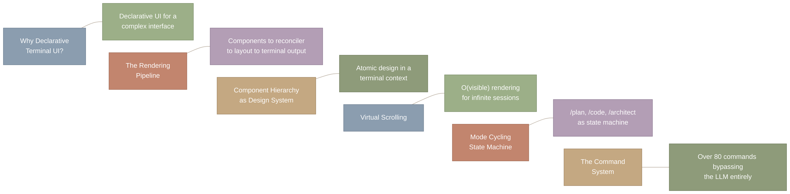
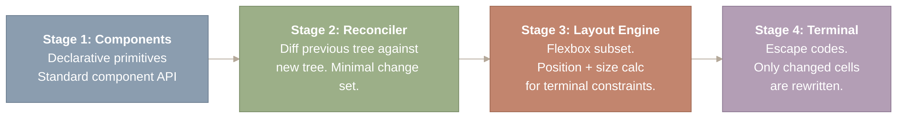
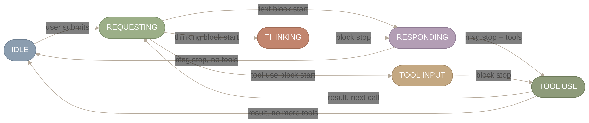
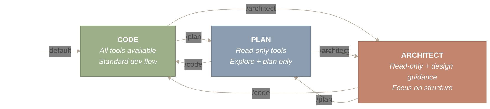
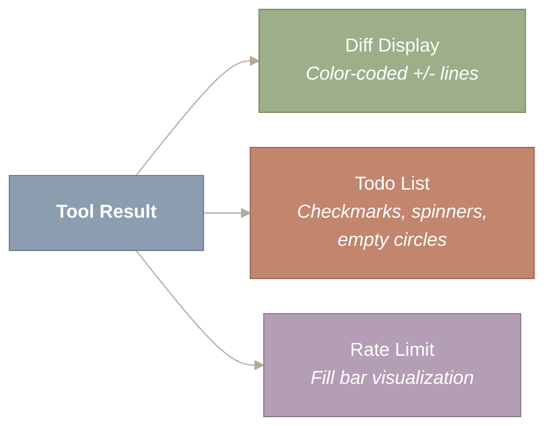

> 译者说明：本文按 2026-08-12 抓取的网页完整翻译，保留原始章节、代码、表格、Mermaid 图源、图注和链接。原文分析基于 Claude Code v2.1.88 的 Source Map；文件行数、工具数量、阈值和实现细节属于该页面快照，不应直接外推到其他版本。

# CLI、Commands 与终端 UI

打开终端，输入 `claude`，你眼前其实是一个 React 应用。它有一棵完整的 React 组件树——389 个文件、1,623 个组件模式、81,546 行 UI 代码——再通过 ANSI 转义码渲染到 TTY 上。Claude Code 的终端 UI 没有采用简单的 `readline` 封装或 blessed/curses 式界面，而是沿用了现代 Web 应用的声明式组件模型：JSX、Hooks、状态管理、reconciliation（协调/差异比对）。区别只在于，最后渲染的是字符网格，不是像素网格。

这个架构选择影响深远。终端 UI 因而能获得与 Web 应用相同的开发体验——组件组合、局部状态、memoization、声明式更新——同时运行在计算机世界中最通用的显示环境里。下面分别来看 React 为什么能在终端里工作，虚拟滚动如何让长对话保持流畅，以及模式循环如何把 Agent 变成一台状态机。

*图 1：本文涵盖的六个主题：为什么声明式终端 UI 对管理复杂并发状态至关重要、从组件到转义码的四阶段渲染管线、横跨 389 个文件的原子化设计组件层级、面向长会话的 O(visible) 虚拟滚动、作为状态机的模式循环（/plan、/code、/architect），以及 80 多个完全绕过 LLM 的斜杠命令。*

**读图说明。** 每一行把一个主题（左侧方框）和它的一句话摘要（右侧方框）配成一对，六行从上到下按它们在文中出现的顺序排列。左列是各节的名称，右列是每节的核心要点。行与行之间的不可见连接线（~）表示这些是彼此独立的主题，由"终端 UI 架构"这一共同主题串联起来。

**本文涉及的源文件：**

| 文件 | 用途 | 规模 |
| --- | --- | --- |
| `src/components/App.tsx` | 根应用组件 | ~300 LOC |
| `src/components/Messages.tsx` | 虚拟消息列表渲染器 | ~400 LOC |
| `src/components/PromptInput/` | 多行输入系统 | 12+ 个文件 |
| `src/components/permissions/` | 权限对话框与 UI | 20+ 个文件 |
| `src/components/messages/` | 消息类型渲染器（文本、工具、错误、compact） | 35+ 个文件 |
| `src/components/Spinner/` | 盲文点阵动画加载指示器（spinner） | ~10 个文件 |
| `src/components/design-system/` | 共享 UI 基础组件（Button、Box、Text） | ~15 个文件 |
| `src/commands/` | 86+ 个斜杠命令处理器 | 103 个目录 |
| `src/hooks/useGlobalKeybindings.tsx` | 键盘快捷键绑定 | ~500 LOC |
| `src/ink/` | Ink 框架扩展（Box、Text、VirtualList） | 50 个文件 |
| `src/services/PromptSuggestion/` | 提示预测与投机执行 | 2 个文件 |
| `src/services/tips/` | spinner 中轮播的教学小贴士 | 3 个文件 |
| `src/buddy/` | 陪伴宠物系统（精灵图、动画、稀有度） | 6 个文件 |
| `src/projectOnboardingState.ts` | 两步式项目引导流程 | ~100 LOC |
| `src/utils/claudeInChrome/` | 通过 native messaging 实现浏览器自动化 | 3 个文件 |
| `src/utils/secureStorage/` | 平台特定的凭据存储 | 5 个文件 |
| `src/utils/nativeInstaller/` | 二进制分发与原子更新 | 2 个文件，~2,000 LOC |

## 为什么在终端里用 React？——声明式 vs. 命令式 UI

**Claude Code 在终端里使用 React，是为了处理命令式方案难以承受的界面复杂度。**

看看 Claude Code 的界面需要同时处理什么。消息逐 token 流入。权限提示以模态对话框的形式覆盖在对话之上。工具输出五花八门——diff、文件树、待办列表、表格、带语法高亮的代码块。五种不同的 UI 状态（requesting、thinking、responding、tool-input、tool-use）根据异步流式事件不断切换。长对话会累积数百条消息，必须高效滚动。

传统的终端方案——`process.stdout.write()` 调用、手动定位光标、手工管理 ANSI 码——会在这种复杂度下崩溃。每一个流式事件都需要命令式逻辑来判断该更新哪些单元格、发出哪些转义码，以及如何处理多个重叠关注点之间的相互作用（比如在流式响应进行中突然弹出权限提示）。

React Ink 解决这个问题的方式，是运用 React 的核心洞见：*reconciler 并不绑定 DOM*。React 的 reconciler 管理一棵元素树、对更新做差异比对、调用生命周期方法。reconciliation 完成之后做什么——写入浏览器 DOM、发送原生视图命令、还是输出终端转义码——是可插拔的。React Ink 插入的正是一个终端后端。

*图 2：四阶段声明式渲染管线。阶段 1：使用标准 React JSX 基础组件（Box、Text、Static、Spacer）声明组件。阶段 2：reconciler 将前一棵树与新树做差异比对，产出最小变更集。阶段 3：Yoga 布局引擎在终端宽/高约束内计算 flexbox 位置和尺寸。阶段 4：只通过 ANSI 转义码重写发生变化的终端单元格，把 stdout 写入量降到最低。*

**读图说明。** 从左到右依次经过四个阶段。阶段 1（Components）是开发者编写声明式 JSX 的地方。阶段 2（Reconciler）对新旧组件树做差异比对。阶段 3（Layout Engine）用 Yoga flexbox 计算位置。阶段 4（Terminal）输出 ANSI 转义码，只重写变化的单元格。核心在于：只有最后一个阶段是终端特有的——前三个阶段与 React 在浏览器中的工作方式完全一致。

Ink 的基础组件对应到终端概念：`<Box>` 是 flex 容器（对应终端的 `
`），`<Text>` 是带样式的文本（对应终端的 ``），`<Static>` 把内容渲染一次之后就排除在后续 reconciliation 之外，`<Spacer>` 则是 flexbox 的间隔组件。Yoga——Facebook 的跨平台布局引擎，实现了 CSS Flexbox 的一个子集——在给定的终端宽高约束下计算位置。这就是为什么 `<Box>` 能支持 `flexDirection`、`alignItems`、`justifyContent`——它们直接映射到 Yoga 的布局属性。 ::: {.callout-warning title=“Trade-off”} React Ink 获得了声明式组件和 reconciliation 的效率，但代价是终端渲染速度——stdout 写入是同步的，比 DOM 更新慢。每一次不必要的重渲染都会表现为闪烁或卡顿。这一约束推动了后文要讨论的性能优化。 :::

---

## 组件层级——终端里的原子设计

**Claude Code 的 389 个 UI 文件构成了一套设计系统，其中结构容器、内容渲染器和交互元素之间有着清晰的职责分离。**

```mermaid
%%{init: {'theme': 'neutral', 'flowchart': {'useMaxWidth': false, 'htmlLabels': true, 'padding': 20, 'nodeSpacing': 30, 'rankSpacing': 40}, 'themeVariables': {'primaryColor': '#8B9DAF', 'primaryTextColor': '#ffffff', 'primaryBorderColor': '#6E7F91', 'secondaryColor': '#9CAF88', 'secondaryTextColor': '#ffffff', 'secondaryBorderColor': '#7A8D68', 'tertiaryColor': '#C2856E', 'tertiaryTextColor': '#ffffff', 'tertiaryBorderColor': '#A06A54', 'lineColor': '#B5A99A', 'textColor': '#4A4A4A', 'mainBkg': '#8B9DAF', 'nodeBorder': '#6E7F91', 'clusterBkg': 'rgba(139,157,175,0.12)', 'clusterBorder': '#B5A99A', 'edgeLabelBackground': 'transparent'}}}%%
flowchart TD
  App["<b>App</b><br><i>root component</i>"]

  App --> Msg["Messages<br><i>virtual list</i>"]
  App --> PI["PromptInput<br><i>12+ files</i>"]
  App --> Perm["Permissions<br><i>20+ files</i>"]
  App --> Spin["Spinner"]
  App --> DS["Design System"]

  Msg --> AM["AssistantMessage"]
  Msg --> UM["UserMessage"]
  Msg --> TUM["ToolUseMessage"]
  Msg --> TRM["ToolResultMessage"]
  Msg --> SM["SystemMessage"]

  PI --> TI["TextInput"]
  PI --> AC["AutoComplete"]
  PI --> HN["HistoryNav"]

  Perm --> PM["PermissionModal"]
  Perm --> SE["ShimmerEffect"]
  Perm --> KH["KeyboardHints"]

  DS --> SB["StyledBox"]
  DS --> TT["ThemedText"]
  DS --> ST["SpacingTokens"]
  DS --> LP["LayoutPatterns"]

  style App fill:#8B9DAF,color:#fff,stroke:#6E7F91
  style Msg fill:#9CAF88,color:#fff,stroke:#7A8D68
  style PI fill:#C2856E,color:#fff,stroke:#A06A54
  style Perm fill:#B39EB5,color:#fff,stroke:#8E7A93
  style Spin fill:#C4A882,color:#fff,stroke:#A08562
  style DS fill:#8E9B7A,color:#fff,stroke:#6E7B5A
  style AM fill:#8B9DAF,color:#fff,stroke:#6E7F91
  style UM fill:#9CAF88,color:#fff,stroke:#7A8D68
  style TUM fill:#C2856E,color:#fff,stroke:#A06A54
  style TRM fill:#B39EB5,color:#fff,stroke:#8E7A93
  style SM fill:#C4A882,color:#fff,stroke:#A08562
  style TI fill:#8E9B7A,color:#fff,stroke:#6E7B5A
  style AC fill:#8B9DAF,color:#fff,stroke:#6E7F91
  style HN fill:#9CAF88,color:#fff,stroke:#7A8D68
  style PM fill:#C2856E,color:#fff,stroke:#A06A54
  style SE fill:#B39EB5,color:#fff,stroke:#8E7A93
  style KH fill:#C4A882,color:#fff,stroke:#A08562
  style SB fill:#8E9B7A,color:#fff,stroke:#6E7B5A
  style TT fill:#8B9DAF,color:#fff,stroke:#6E7F91
  style ST fill:#9CAF88,color:#fff,stroke:#7A8D68
  style LP fill:#C2856E,color:#fff,stroke:#A06A54
```

这个层级遵循了原子设计方法论中常见的模式：原子（如 `<Text>`、`<Box>` 这样的基础原语）组合成分子（带样式的盒子、带主题的文本），分子再组合成组织（消息渲染器、权限对话框），组织最终组合成完整的应用。

*图 3：Claude Code UI 组件树的最上三层。根组件 App 将职责委托给五个子系统：Messages（一个虚拟列表，渲染包括 AssistantMessage、ToolUseMessage 和 ToolResultMessage 在内的五种消息类型）、PromptInput（支持自动补全和历史导航的多行编辑）、Permissions（带微光效果和键盘提示的模态对话框）、Spinner，以及一个共享的 Design System（提供 StyledBox、ThemedText、SpacingTokens 和 LayoutPatterns）。*

**图中内容的读法。** 从顶部的根节点 App 开始，沿箭头向下穿过三个层级。第一层是五个主要子系统（Messages、PromptInput、Permissions、Spinner、Design System）。第二层把每个子系统拆成各自的组成组件——例如 Messages 分支出五种消息类型（AssistantMessage、UserMessage 等），而 PromptInput 包含 TextInput、AutoComplete 和 HistoryNav。这棵树与代码库中真实的 React 组件层级一一对应。

`Messages` 组件是架构上最关键的部分。它实现了一个虚拟消息列表——相当于终端版的 Web UI 虚拟滚动（类似 `react-window` 或 `react-virtualized`）。它不会渲染长对话中的每一条消息，只渲染当前终端视口内可见的消息，外加一小段缓冲区。视口之外的消息会被卸载；用户滚动时新消息再挂载进来。渲染耗时保持在 O(可见数量) 而非 O(总数)，当对话累积到数百条消息时，这一点影响巨大。

`PromptInput` 系统并不是一个简单的 `readline` 封装。它支持多行编辑、Tab 补全、历史导航、带模糊匹配的斜杠命令自动补全，以及粘贴检测。这个输入组件自己管理光标位置、选区状态和组合输入事件——复杂度与浏览器的文本输入框相当，只不过是在终端里实现的。

---

## 虚拟滚动——O(可见数量) 的渲染

**这里的关键性能认知是：在终端里，你不能渲染 500 条消息然后指望滚动缓冲区兜底，必须自己管理哪些内容可见。**

在 Web 浏览器里，你可以渲染一个很长的列表，把滚动交给浏览器处理——DOM 和 GPU 会负责屏幕外的元素。终端里没有这种待遇。写入 stdout 的每一个字节都会被送往终端模拟器，由它逐字符处理。如果每一帧都渲染 500 条消息，性能将是灾难性的。

Claude Code 的解法与 Web UI 虚拟列表库使用的技术相同，只是针对终端的约束做了适配：

```mermaid
%%{init: {'theme': 'neutral', 'flowchart': {'useMaxWidth': false, 'htmlLabels': true, 'padding': 20, 'nodeSpacing': 30, 'rankSpacing': 40}, 'themeVariables': {'primaryColor': '#8B9DAF', 'primaryTextColor': '#ffffff', 'primaryBorderColor': '#6E7F91', 'secondaryColor': '#9CAF88', 'secondaryTextColor': '#ffffff', 'secondaryBorderColor': '#7A8D68', 'tertiaryColor': '#C2856E', 'tertiaryTextColor': '#ffffff', 'tertiaryBorderColor': '#A06A54', 'lineColor': '#B5A99A', 'textColor': '#4A4A4A', 'mainBkg': '#8B9DAF', 'nodeBorder': '#6E7F91', 'clusterBkg': 'rgba(139,157,175,0.12)', 'clusterBorder': '#B5A99A', 'edgeLabelBackground': 'transparent'}}}%%
flowchart LR
  subgraph Static["Static Region (unmounted)"]
    M1["Message 1"]
    M2["Message 2"]
    M3["..."]
    M495["Message 495"]
  end

  subgraph Active["Active Region (live components)"]
    M496["Message 496<br><i>buffer</i>"]
    M497["Message 497<br><i>visible</i>"]
    M498["Message 498<br><i>visible</i>"]
    M499["Message 499<br><i>visible</i>"]
    M500["Message 500<br><i>current</i>"]
    PIn["PromptInput"]
  end

  Static -- "Rendered once, excluded<br>from reconciliation" --> Active

  style M1 fill:#8B9DAF,color:#fff,stroke:#6E7F91
  style M2 fill:#9CAF88,color:#fff,stroke:#7A8D68
  style M3 fill:#C2856E,color:#fff,stroke:#A06A54
  style M495 fill:#B39EB5,color:#fff,stroke:#8E7A93
  style M496 fill:#C4A882,color:#fff,stroke:#A08562
  style M497 fill:#8E9B7A,color:#fff,stroke:#6E7B5A
  style M498 fill:#8B9DAF,color:#fff,stroke:#6E7F91
  style M499 fill:#9CAF88,color:#fff,stroke:#7A8D68
  style M500 fill:#C2856E,color:#fff,stroke:#A06A54
  style PIn fill:#B39EB5,color:#fff,stroke:#8E7A93
```

*图 4：虚拟消息列表的渲染方式，展示了 Static 区域（第 1 到 495 条消息，渲染一次后就从 React 的协调树中卸载）与 Active 区域（一小段缓冲区加上可见的第 497–500 条消息和 PromptInput）之间的分离。只有 Active 区域参与协调（reconciliation）过程，因此无论对话总长多少，渲染耗时都保持在 O(可见数量)。*

**图中内容的读法。** 左侧子图（Static 区域）代表所有已经渲染过一次、随后从 React 协调树中卸载的历史消息。右侧子图（Active 区域）展示存活组件构成的小窗口——一条缓冲消息、几条可见消息和 PromptInput。两个区域之间的箭头表示：随着对话推进，消息从 active 区域流向 static 区域。只有 active 区域参与重新渲染，所以无论对话多长，性能都保持在 O(可见数量)。

|  | 不使用虚拟列表 | 使用虚拟列表 |
| --- | --- | --- |
| **渲染耗时** | O(总数) | O(可见数量) |
| **处理的消息数** | 500 条 = 慢 | ~5 条 = 恒定 |

Ink 的 `<Static>` 组件是实现这一切的关键。当一条消息已经完整渲染、对话也已经向前推进之后，这条消息会被包进 `<Static>`。这相当于告诉 Ink：这段内容永远不再变化，因此只向 stdout 写一次，并从后续所有协调过程中排除。对一段 200 条消息的对话来说，只有当前消息和输入区参与 React 的协调——其余 199 条都被冻结。

这项优化，再加上记忆化的上下文组装（缓存 `getSystemContext()` 这类高开销计算）和并行的启动副作用（在 React 挂载之前预取钥匙串凭据和 MDM 数据），让 UI 在终端输出天然缓慢的情况下依然保持响应。

---

## UI 状态机——五个状态，事件驱动的转换

**在任意时刻，终端 UI 都处于五个状态之一，每个状态有各自的视觉呈现。状态转换由流式 API 事件驱动——UI 从不轮询。**

这五个状态与 Agent Loop 中正在发生的事情直接对应：

*图 5：UI 状态机，包含六个状态（IDLE、REQUESTING、THINKING、RESPONDING、TOOL INPUT、TOOL USE）及它们由事件驱动的转换。用户提交触发 REQUESTING；SSE 的 content_block_start 事件根据块类型分支到 THINKING、RESPONDING 或 TOOL INPUT。当后续还有工具调用时，TOOL USE 循环回到 REQUESTING；当本轮结束时返回 IDLE。UI 从不轮询——所有转换都由推送式的流式事件驱动。*

**图中内容的读法。** 从左侧的 IDLE 开始——这是用户输入时的静止状态。沿“user submits”（用户提交）进入 REQUESTING，然后观察三路分支：API 响应可能以思考块、文本块或工具使用块开始，分别路由到 THINKING、RESPONDING 或 TOOL INPUT。从 RESPONDING 和 TOOL USE 出发沿返回的边看：“msg stop, no tools”（消息结束，无工具）或“result, no more tools”（结果返回，没有更多工具）回到 IDLE；而“msg stop + tools”（消息结束且有工具）或“result, next call”（结果返回，进行下一次调用）则经过 TOOL USE 和 REQUESTING 循环，构成多工具调用的回合。

**IDLE**：等待用户输入。提示输入框处于激活状态。

**REQUESTING**：API 请求进行中。一个盲文点样式的 spinner（`⠋⠙⠹⠸⠼⠴⠦⠧⠇⠏`）表明系统正在工作，避免用户在 1–3 秒的网络延迟期间误以为应用卡死。

**THINKING**：扩展思维链推理中。一个区别于 spinner 的独立视觉指示器传达的是“模型在推理，而不是在等网络”。当思考需要 10–30 秒时，这种区分能让用户形成正确的预期。

**RESPONDING**：文本逐 token 流入，呈现打字机效果。Markdown 格式实时套用。这是视觉上最动态的状态。

**TOOL-INPUT / TOOL-USE**：工具的 JSON 参数随流式传输逐步累积，然后工具开始执行并实时输出。对长时间运行的 Bash 命令，输出是实时流入的。

状态转换由来自 Anthropic API 的 SSE（Server-Sent Events，服务器发送事件）驱动。每种事件类型对应一次状态变化：`message_start` 触发 REQUESTING；`content_block_start` 中类型为 “thinking” 的触发 THINKING，类型为 “text” 的触发 RESPONDING，类型为 “tool_use” 的触发 TOOL-INPUT。UI 是纯粹响应式的——它对一个推送式的事件流做出反应，从不轮询。

这是一个由事件流驱动的**有限状态机（FSM）**。每个状态定义 UI 渲染什么；每个事件触发一次转换。即使事件以非预期的顺序到达，FSM 也能保证 UI 始终处于定义明确的状态。可以类比 TCP 的状态机（LISTEN、SYN-SENT、ESTABLISHED 等）——同样的模式，不同的领域。

---

## 模式循环 – /plan、/code、/architect

**`/plan`、`/code` 和 `/architect` 这类斜杠命令会在不同操作模式之间切换 Agent，每种模式都会改变可用工具和行为准则。**

模式循环是一个叠加在 UI 状态机之上的状态机。UI 状态机追踪的是*此刻正在发生什么*（思考中、回复中、执行中），而模式状态机追踪的是*Agent 整体上应该如何行动*：

*图 6：模式循环状态机，包含三个全连接的状态。CODE（默认）提供全部工具和标准开发流程。PLAN 将工具限制为只读，仅用于探索和规划。ARCHITECT 提供只读工具，外加聚焦于结构设计的设计指导。每次切换都在单次操作中原子性地重新配置可用工具集、System Prompt 行为准则和权限级别。*

图中左侧的入口箭头表示 CODE 是默认模式。PLAN、CODE 和 ARCHITECT 三个状态是全连接的：每条边上标注的斜杠命令切换，从任意状态都可以发起。每个节点列出了该模式提供的能力：CODE 拥有全部工具，PLAN 限制为只读以便探索，ARCHITECT 在只读约束之上增加了设计指导。模式切换会在单次操作中原子性地重新配置工具、Prompt 和权限。

每种模式同时修改三个方面：可用工具集（plan 模式限制为只读工具）、System Prompt（注入特定模式的行为准则）、权限级别（plan 模式最为严格）。这意味着切换模式不只是换一个标签——它是在一次原子操作中重新配置 Agent 的能力、指令和安全姿态。

---

## 命令系统——绕过 LLM 的 80 多个快捷方式

**斜杠命令为不需要模型智能的操作提供了确定性的即时响应交互。**

Claude Code 公开了 80 多个按功能组织的斜杠命令：

| 类别 | 示例 | 作用 |
| --- | --- | --- |
| **会话（Session）** | `/clear`、`/compact`、`/status` | 管理会话状态 |
| **模式（Mode）** | `/plan`、`/auto`、`/chat`、`/architect` | 切换 Agent 操作模式 |
| **代码操作** | `/commit`、`/pr`、`/review-pr` | 不经 LLM 的 Git 工作流 |
| **Agent** | `/agent`、`/team`、`/task` | 派生子 Agent、管理任务 |
| **MCP** | `/mcp add`、`/mcp list`、`/mcp remove` | 管理 MCP 服务器连接 |
| **调度（Schedule）** | `/schedule`、`/cron` | 一次性或周期性任务 |
| **调试（Debug）** | `/stuck`、`/debug` | 跳出循环、检查状态 |
| **Skills** | `/simplify`、`/loop`、`/code-review` | 激活特定领域的 Skill |

命令在输入到达 LLM 之前，由一个仿照 argparse 设计的路由器解析。如果输入以 `/` 开头，就会被拦截并路由到命令处理器。未知命令会带着警告透传给模型。这种设计确保 `/compact` 会立即触发上下文压缩——没有 LLM 往返、没有 Token 开销、没有延迟。

一个细微但重要的细节：命令可以在 Agent 执行期间排队。如果你在工具执行过程中输入 `/compact`，它不会打断当前操作，而是进入一个优先队列，在 Agent 两次迭代之间执行。安全攸关的命令（模式切换、权限修改）会先于信息类命令（状态查询）被处理，从而避免竞态条件。

---

## 富文本输出渲染——不止于 console.log

**每一类工具输出都有专门的渲染器，把结构化数据转换成终端原生的展示形式。**

Claude Code 不会直接倾倒原始文本。文件编辑渲染为统一 diff，新增和删除的行用颜色区分。待办事项渲染为可展开的树，带有对勾、加载动画和空心圆。速率限制显示为填充条。代码块按语言做语法高亮。完整的 Markdown 渲染支持标题、列表、粗体/斜体、链接和引用块——全部按终端宽度重排，同时保持语义结构。

*图 7：针对不同工具结果类型的专用输出渲染器。文件编辑渲染为带颜色区分的统一 diff，标出新增/删除的行。待办事项渲染为可展开的树，用对勾、加载动画和空心圆跟踪进度。速率限制显示为填充条可视化。每个渲染器都把结构化数据转换成针对其内容类型优化的终端原生展示。*

从左侧的 Tool Result 方框开始，它代表任何工具执行返回的原始结构化数据。沿着向右的三条箭头，可以看到结果分流到不同的专用渲染器：文件编辑进入 Diff Display（带颜色区分的 +/- 行），任务跟踪进入 Todo List（对勾和加载动画），用量条进入 Rate Limit。每个渲染器把同一份结构化输入转换成针对其内容类型优化的终端原生视觉格式。

---

## 主题系统——为普遍可访问性准备的五套变体

**五套主题变体确保 Claude Code 在深色终端、浅色终端，以及 SSH 会话和屏幕阅读器等颜色受限的环境中都能正常使用。**

主题系统不是一个简单的前景色/背景色开关。每套主题定义了一套完整的色彩词汇表：主要内容、次要内容、强调色、权限提示颜色、微光动画、语法高亮和交互元素。**ANSI 主题**尤为重要——它会回退到 16 个标准 ANSI 颜色，以适配不支持 RGB 的终端，确保 Claude Code 在受限环境中也能工作，而在那些环境里 `rgb(87,105,247)` 会渲染成乱码。

---

## 小结

**在终端里使用 React，有明确的工程收益。** 声明式组件、基于 reconciliation 的更新和 Yoga flexbox 布局，让终端应用获得了与 Web 应用相近的开发体验。389 个 UI 文件和 81,546 行组件代码说明这已经是一套生产级架构。它依赖的是 React 的 reconciler；有没有 DOM 并不影响这套抽象成立。

**虚拟滚动对长时间运行的 Agent 会话必不可少。** 没有它，渲染性能会随会话长度线性退化；有了它，无论累积多少消息，性能都能保持稳定。虚拟列表与 Ink 的 `<Static>` 组件结合后，渲染只处理当前可见的内容，复杂度从 O(总量) 降到 O(可见部分)。Web UI 的无限滚动也是同一套思路。

**UI 状态机让 Agent 内部状态对视觉透明。** 五个状态——requesting、thinking、responding、tool-input、tool-use——各自有独特的视觉呈现，确保用户始终知道系统在做什么。状态机由流式 SSE 事件驱动，而不是轮询，这意味着 UI 对变化的反应是即时的。

**模式循环把配置当作状态机来管理。** 在 `/plan`、`/code` 和 `/architect` 之间切换时，系统会原子性地重新配置工具、Prompt 和权限，而非只翻转一个开关。这样一来，模式切换总能保持一致，也不会因几项相关设置各自变化而留下错位状态。

**命令系统是一种用于控制 Agent 的 DSL。** 80 多个斜杠命令提供确定性的即时响应操作，完全绕过 LLM。这种分离——LLM 负责智能、命令负责控制——意味着可预测的操作永远不产生 Token 开销和模型延迟。

## 附录：斜杠命令完整清单

Claude Code 附带 86 个斜杠命令，按功能领域组织。每个命令都在 `src/commands/` 下拥有自己的实现目录。

| 类别 | 命令 | 实现 | 说明 |
| --- | --- | --- | --- |
| **会话** | `/clear` | `src/commands/clear/` | 清除对话历史 |
|  | `/compact` | `src/commands/compact/` | 触发上下文压缩（调用 API） |
|  | `/exit` | `src/commands/exit/` | 退出 CLI |
|  | `/export` | `src/commands/export/` | 导出对话 |
|  | `/resume` | `src/commands/resume/` | 恢复之前的会话 |
|  | `/session` | `src/commands/session/` | 会话管理 |
|  | `/share` | `src/commands/share/` | 分享对话记录 |
|  | `/summary` | `src/commands/summary/` | 对话摘要 |
| **规划** | `/plan` | `src/commands/plan/` | 切换 plan 模式；打开计划文件 |
|  | `/context` | `src/commands/context/` | 检查上下文窗口 |
|  | `/diff` | `src/commands/diff/` | 查看文件 diff |
|  | `/files` | `src/commands/files/` | 列出已修改的文件 |
|  | `/rewind` | `src/commands/rewind/` | 回退对话轮次 |
|  | `/thinkback` | `src/commands/thinkback/` | 查看推理轨迹 |
| **配置** | `/config` | `src/commands/config/` | 编辑设置 |
|  | `/env` | `src/commands/env/` | 环境变量 |
|  | `/model` | `src/commands/model/` | 切换模型 |
|  | `/effort` | `src/commands/effort/` | 设置思考深度 |
|  | `/fast` | `src/commands/fast/` | 切换快速模式 |
|  | `/permissions` | `src/commands/permissions/` | 权限规则 |
|  | `/privacy-settings` | `src/commands/privacy-settings/` | 隐私控制 |
|  | `/sandbox-toggle` | `src/commands/sandbox-toggle/` | 切换沙箱 |
|  | `/theme` | `src/commands/theme/` | UI 主题 |
|  | `/vim` | `src/commands/vim/` | Vim 模式 |
| **Git 与代码** | `/branch` | `src/commands/branch/` | Git 分支管理 |
|  | `/review` | `src/commands/review/` | 代码审查（调用 API） |
|  | `/pr_comments` | `src/commands/pr_comments/` | 查看 PR 评论 |
|  | `/autofix-pr` | `src/commands/autofix-pr/` | 自动修复 PR 问题（调用 API） |
|  | `/issue` | `src/commands/issue/` | GitHub issue 集成 |
|  | `/install-github-app` | `src/commands/install-github-app/` | GitHub App 配置（14 个文件） |
| **MCP 与插件** | `/mcp` | `src/commands/mcp/` | MCP 服务器管理 |
|  | `/plugin` | `src/commands/plugin/` | 插件管理（15 个文件） |
|  | `/reload-plugins` | `src/commands/reload-plugins/` | 重新加载插件 |
|  | `/skills` | `src/commands/skills/` | 列出可用技能 |
| **Agent** | `/agents` | `src/commands/agents/` | Agent 管理 |
|  | `/tasks` | `src/commands/tasks/` | 后台任务管理 |
|  | `/teleport` | `src/commands/teleport/` | 将上下文转移到新 agent |
| **账户与认证** | `/login` | `src/commands/login/` | OAuth 登录 |
|  | `/logout` | `src/commands/logout/` | 清除凭据 |
|  | `/usage` | `src/commands/usage/` | Token 用量统计 |
|  | `/cost` | `src/commands/cost/` | 会话成本跟踪 |
| **IDE 与桌面端** | `/ide` | `src/commands/ide/` | IDE 集成 |
|  | `/desktop` | `src/commands/desktop/` | 桌面应用集成 |
|  | `/chrome` | `src/commands/chrome/` | Chrome 扩展集成 |
|  | `/voice` | `src/commands/voice/` | 语音模式 |
| **远程** | `/remote-env` | `src/commands/remote-env/` | 远程环境配置 |
|  | `/remote-setup` | `src/commands/remote-setup/` | 远程会话设置 |
| **记忆** | `/memory` | `src/commands/memory/` | 记忆管理 |
| **Hook** | `/hooks` | `src/commands/hooks/` | Hook 配置 |
| **诊断** | `/doctor` | `src/commands/doctor/` | 系统诊断 |
|  | `/stats` | `src/commands/stats/` | 会话统计 |
|  | `/status` | `src/commands/status/` | Agent 状态 |
|  | `/debug-tool-call` | `src/commands/debug-tool-call/` | 调试工具调用 |
|  | `/heapdump` | `src/commands/heapdump/` | 内存诊断 |
| **其他** | `/help` | `src/commands/help/` | 帮助系统 |
|  | `/feedback` | `src/commands/feedback/` | 提交反馈 |
|  | `/release-notes` | `src/commands/release-notes/` | 查看发布说明 |
|  | `/upgrade` | `src/commands/upgrade/` | 升级 CLI 版本 |
|  | `/onboarding` | `src/commands/onboarding/` | 首次运行教程 |
|  | `/rename` | `src/commands/rename/` | 重命名会话 |
|  | `/copy` | `src/commands/copy/` | 复制到剪贴板 |
|  | `/add-dir` | `src/commands/add-dir/` | 将目录添加到上下文 |
|  | `/good-claude` | `src/commands/good-claude/` | 正向鼓励 |

大多数命令是轻量的 UI 操作，不消耗 API token。例外包括 `/compact`（触发一次摘要 API 调用）、`/review`（将代码发送给模型审查）和 `/autofix-pr`（读取 PR diff 并生成修复）。

---

## 附录 A：提示建议与推测执行

每轮 assistant 回复结束后，Claude Code 可以预测用户接下来会输入什么，并以灰色占位符的形式显示在提示输入框中。如果用户接受（按 Tab），该建议会立即提交。在幕后，推测引擎可能已经开始在一个隔离的覆盖文件系统中执行预测出的命令。

### 建议生成

系统使用一个 fork 出来的 agent——一个寄生在父进程 Prompt Caching 上的轻量子进程——配合精心调整的提示词：

> *预测他们会输入什么——而不是你认为他们应该做什么。检验标准是：他们会不会想“我正打算输入这个”？*

这个 fork 拒绝所有工具（模型只能生成文本，不能执行），并使用低 effort。建议要经过 13 个内容过滤器，会拒绝元推理（“nothing found”）、评价性回复（“looks good”）、Claude 口吻的短语（“Let me…”），以及超出 2–12 个词窗口的建议。单个词只允许来自一个精选集合（例如 `push`、`commit`、`deploy`、`yes`、`no`）。

**功能开关：** 由 `tengu_chomp_inflection` 这个 GrowthBook flag 控制，对非交互式会话和 swarm 队友禁用，用户可通过设置切换。

### 推测执行

当建议被显示且推测执行已启用时，Claude Code 会立即在 `$CLAUDE_TEMP/speculation/{PID}/{id}` 处的写时复制（copy-on-write）覆盖文件系统中开始执行预测的命令：

| 工具类别 | 推测执行行为 |
| --- | --- |
| 只读（Read、Glob、Grep、LSP） | 允许；若文件之前写入过覆盖层则从覆盖层读取，否则从主 CWD 读取 |
| 写入（Edit、Write） | 重定向到覆盖层；首次写入时复制原文件 |
| Bash（只读） | 允许 |
| Bash（写入） | 拒绝；设置边界 |
| 其他所有工具 | 拒绝；设置边界 |

推测执行是有界的：最多 20 轮，最多 100 条消息。当推测执行完成或触达边界（一次被拒绝的工具调用）时，它会记录一个 `CompletionBoundary`，并带类型（`complete`、`bash`、`edit`、`denied_tool`）。接受建议时，覆盖层中的文件会被复制到真实的 CWD，推测产生的消息会被注入对话历史。

**流水线式建议。** 当推测执行完整跑完时，系统会立即以推测出的工作为上下文生成*下一条*建议——形成一条预测链。用户看到的是第一条建议；他们一旦接受，第二条就已准备就绪。

**源文件：** `src/services/PromptSuggestion/promptSuggestion.ts`（建议生命周期，13 个过滤器）、`src/services/PromptSuggestion/speculation.ts`（覆盖文件系统、推测执行、流水线）、`src/hooks/usePromptSuggestion.ts`（带参与度跟踪的 React hook）。

## 附录 B：产品 UX 子系统

有几个产品 UX 子系统与核心 agent 并行运行，但不属于 Agent Loop。

### 提示语系统

在 Claude 思考时显示在 spinner 中的轮播教学消息系统。注册表包含 60 多条内置提示语，并带有上下文相关条件（新用户热身、IDE 专属提示、订阅引导）。选择采用 LRU 算法（显示最长时间未展示的提示语），每条提示语有冷却窗口（重复展示之间间隔 3–30 个会话）。提示语可通过设置中的 `spinnerTipsOverride.tips[]` 覆盖，或通过 `spinnerTipsEnabled: false` 禁用。部分提示语仅限内部使用（`USER_TYPE === 'ant'`），营销引导由 GrowthBook flag 控制。

**源文件：** `src/services/tips/tipRegistry.ts`、`src/services/tips/tipScheduler.ts`、`src/services/tips/tipHistory.ts`。

### 项目引导

向新用户展示的两步项目级引导流程：(1) 创建一个应用或克隆一个仓库，(2) 通过 `/init` 创建一个 `CLAUDE.md`。每个项目最多展示 4 次，之后永久隐藏。状态缓存在 `projectConfig.hasCompletedProjectOnboarding` 中，避免后续渲染时重复做文件系统检查。

**源文件：** `src/projectOnboardingState.ts`。

### Claude-in-Chrome

通过一个名为 `computer-use` 的 MCP 服务器实现浏览器自动化集成，该服务器经由 native messaging（原生消息）机制控制 Chrome/Chromium 浏览器。支持 Chrome、Brave、Arc、Chromium、Edge、Vivaldi 和 Opera。可通过 `--chrome` CLI 标志、`CLAUDE_CODE_ENABLE_CFC` 环境变量启用；若检测到已安装浏览器扩展则自动启用（自动启用由 `tengu_chrome_auto_enable` 控制）。系统会为浏览器的 native messaging 协议安装一个 native host manifest，并有一段 60 行的 system prompt 来约束浏览器自动化行为。

**源文件：** `src/utils/claudeInChrome/common.ts`（浏览器检测）、`src/utils/claudeInChrome/setup.ts`（MCP 服务器搭建、manifest 安装）、`src/utils/claudeInChrome/prompt.ts`（浏览器自动化准则）。

### Buddy Companion（伙伴宠物）

一个由 AI 生成、渲染在输入框旁边的宠物伙伴。伙伴由用户 ID 的哈希值确定性地生成——物种、眼睛、帽子、属性数值和稀有度全部从哈希推导，而非随机。稀有度分布：普通（60%）、少见（25%）、稀有（10%）、史诗（4%）、传说（1%）。伙伴通过 `/buddy` 命令孵化，会显示对话气泡、待机动画，以及爱心迸发的抚摸特效。预告通知窗口在 2026 年 4 月 1 日至 7 日运行。该功能通过 `feature('BUDDY')` 构建标志做 Feature Flag 控制。

**源文件：** `src/buddy/companion.ts`（确定性的骨骼生成）、`src/buddy/CompanionSprite.tsx`（精灵图渲染、动画）、`src/buddy/prompt.ts`（伙伴性格）、`src/buddy/useBuddyNotification.tsx`（预告通知）。

### Secure Storage（安全存储）

一套凭证存储抽象，带平台特定的后端：macOS Keychain（`macOsKeychainStorage.ts`）、Linux/Windows 的明文回退方案（`plainTextStorage.ts`），以及一个级联式的 `fallbackStorage.ts`——先尝试主后端，失败后再回退。一个后台的 `keychainPrefetch.ts` 会预缓存凭证，避免阻塞启动流程。Linux 上的 `libsecret` 支持尚未实现。

**源文件：** `src/utils/secureStorage/index.ts`（工厂）、`src/utils/secureStorage/macOsKeychainStorage.ts`、`src/utils/secureStorage/plainTextStorage.ts`。

### Native Installer（原生安装器）

面向生产环境的二进制分发，安装过程具备多进程安全性。安装器（`installer.ts`，1,700 多行）负责管理符号链接、原子更新（先写临时文件再重命名的模式）、基于 PID 的文件锁（含过期锁恢复），以及版本保留（保留最近 2 个版本）。下载带有停滞检测（60 秒超时）、3 次重试和校验和验证。服务器端的 `maxVersion` 熔断开关可以强制降级。平台支持包括 Linux（检测 musl/glibc）、macOS 和 Windows（直接复制，不用符号链接）。

**源文件：** `src/utils/nativeInstaller/installer.ts`（安装、加锁、清理）、`src/utils/nativeInstaller/download.ts`（二进制下载、校验和）。

---

*本系列下一篇：[Part V.2：认证、Provider 与 Feature Flag](https://y-agent.github.io/inside-claude-code/09-auth-providers-flags.html)——面向终端应用的 OAuth、多 Provider 适配器，以及让 CLI 工具实现持续交付的 88 个 Feature Flag。*
