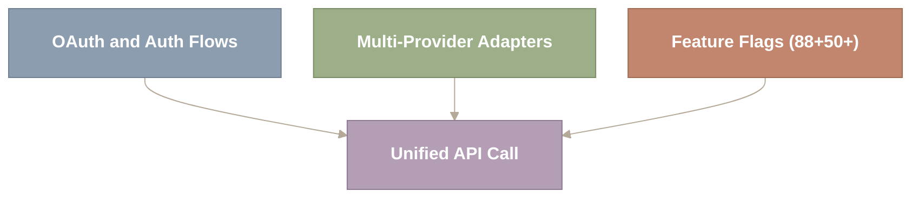
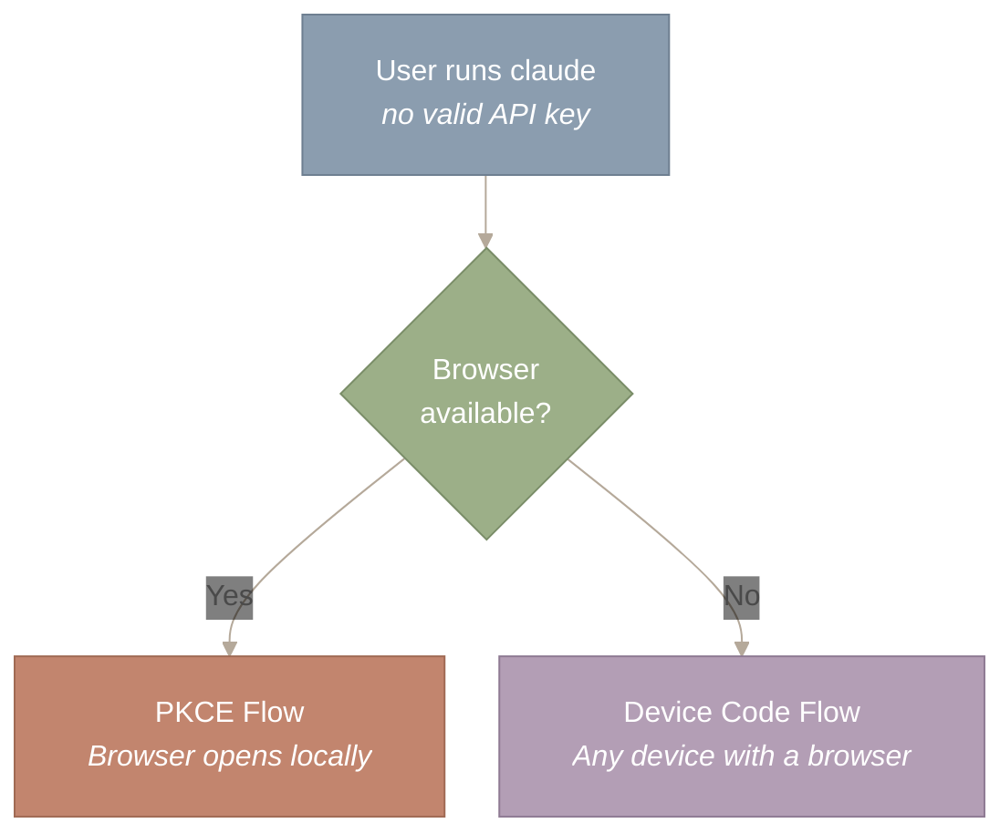
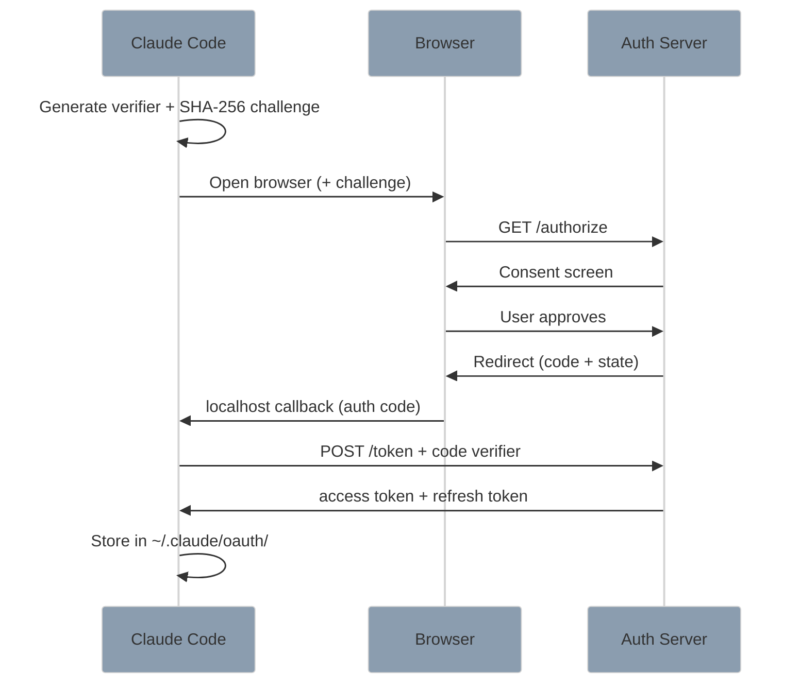
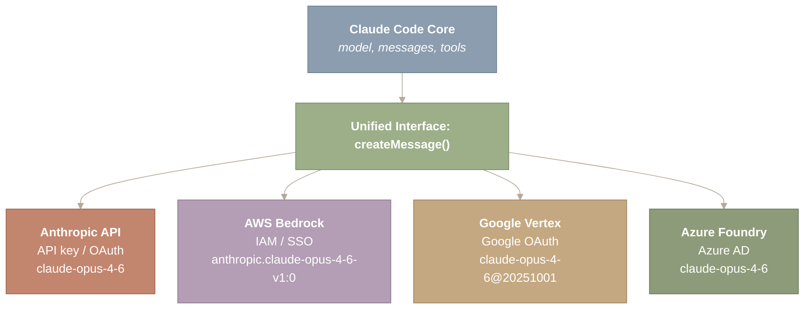
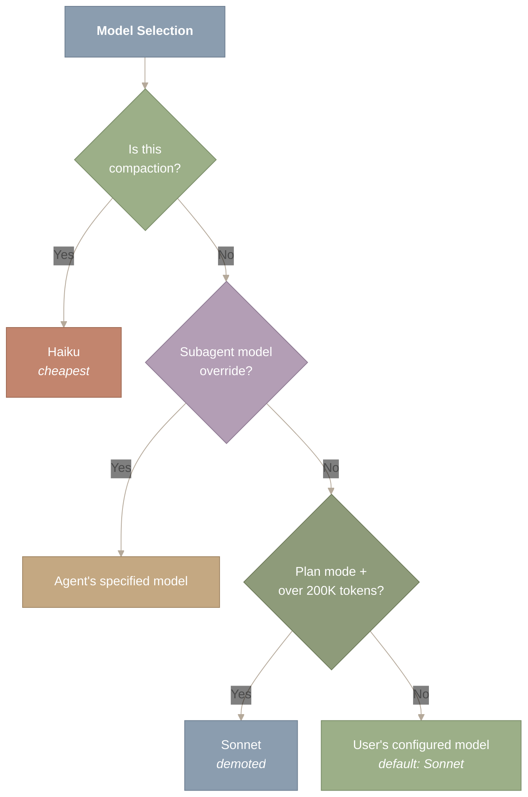
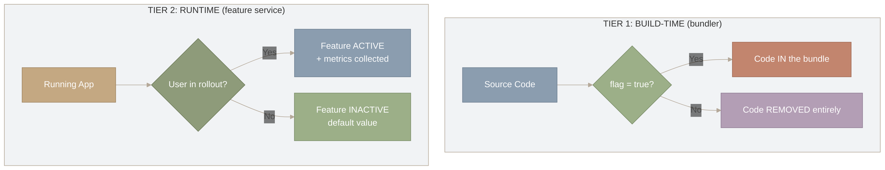
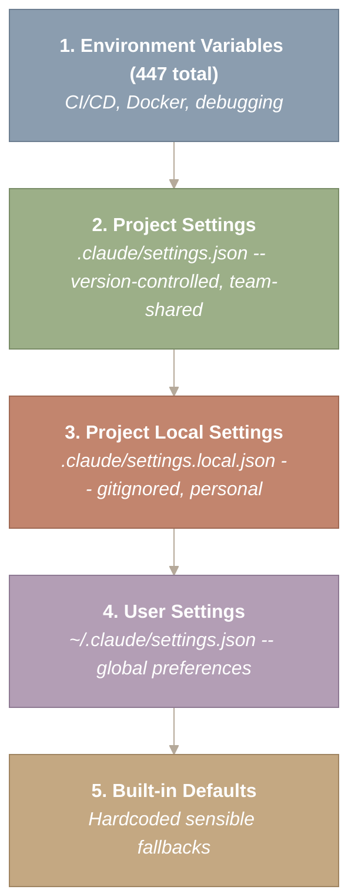

# Auth, Providers & Feature Flags

How do you log a user into a terminal application that has no browser? How does one codebase talk to four different cloud providers, each with its own authentication scheme, model ID format, and feature timeline? And how do you ship 88 experimental features inside a CLI tool without breaking production? These three problems – authentication, multi-provider support, and feature flags – form the invisible infrastructure layer that separates a demo from a product. None of them involve clever prompts or agent loops, but all of them are essential to making Claude Code work at enterprise scale.

This post covers the three pillars of Claude Code’s infrastructure: OAuth flows adapted for terminal environments, the Adapter pattern applied to LLM providers, and a two-tier feature flag system that enables continuous delivery in a CLI tool.



*Figure 1: The three infrastructure pillars – authentication, multi-provider adapters, and feature flags – converge into a unified API call path. Each pillar solves a distinct enterprise requirement (identity, portability, and safe deployment), yet all three must cooperate on every API request. Removing any one pillar would reduce Claude Code from a production system to a prototype.*

**How to read this diagram.** Three boxes at the top represent the three infrastructure pillars – OAuth and Auth Flows, Multi-Provider Adapters, and Feature Flags – each solving a distinct enterprise requirement. All three arrows converge on the single Unified API Call box at the bottom, showing that every API request must pass through all three systems. Removing any one pillar would break the production chain.

**Source files covered in this post:**

| File | Purpose | Size |
| --- | --- | --- |
| `src/utils/auth.ts` | Authentication utilities (token management, keyring) | ~800 LOC |
| `src/services/oauth/` | OAuth 2.0 PKCE + device code flows | 5 files |
| `src/utils/model/model.ts` | Model selection and routing logic | ~400 LOC |
| `src/utils/model/providers.ts` | Multi-provider support (Anthropic, Bedrock, Vertex, Azure) | ~300 LOC |
| `src/utils/model/bedrock.ts` | AWS Bedrock-specific adapter | ~200 LOC |
| `src/services/api/getModel.ts` | Runtime model selection (`getRuntimeMainLoopModel()`) | ~200 LOC |
| `src/services/analytics/growthbook.ts` | GrowthBook feature flag client | ~300 LOC |
| `src/services/analytics/` | Telemetry, Datadog metrics, event logging | 9 files |
| `src/utils/settings/settings.ts` | Settings management (user/project/local/managed) | ~500 LOC |

## OAuth for Terminal Apps – When There Is No Browser

**CLI applications face a unique authentication challenge: the standard “redirect to browser, get a callback” flow assumes a GUI that terminal apps do not have.**

Think about how you log into a web application. You click “Sign in with Google,” a browser opens, you approve, and the browser redirects back to the application. This works because the web app has a URL the authorization server can redirect to. A terminal application has no URL. It has `stdin` and `stdout`. This mismatch between OAuth’s browser-centric design and the terminal’s text-only interface is the core UX challenge Claude Code must solve.

Claude Code implements two OAuth flows, each targeting a different environment. The choice is not a preference – it is dictated by whether a browser is physically available.



*Figure 2: OAuth flow selection logic – a single binary decision (browser available or not) routes the user to one of two authentication paths. PKCE opens a local browser and captures the callback on localhost, while Device Code displays a short code the user enters on any browser-equipped device. This branching ensures every developer environment, from a GUI laptop to a headless SSH session, has a viable authentication path.*

**How to read this diagram.** Start at the top where the user runs `claude` without a valid API key. The diamond decision node asks a single question: is a browser available? The “Yes” branch leads to the PKCE flow (browser opens locally on the same machine), while the “No” branch leads to the Device Code flow (user enters a short code on any device with a browser). This binary decision ensures every environment – from GUI laptops to headless SSH sessions – has a viable authentication path.

### PKCE: The Localhost Trick

PKCE (Proof Key for Code Exchange) – a protocol that lets public clients (applications that cannot store secrets, like CLI tools) authenticate securely – is the primary flow for developers at their laptops.

The trick is simple but clever: Claude Code spins up a temporary HTTP server on `localhost`, then opens the user’s browser to the authorization URL. When the user approves, the authorization server redirects back to `http://localhost:{PORT}/callback`, where Claude Code’s ephemeral server is listening. The CLI captures the authorization code, shuts down the server, and exchanges the code for tokens.

The “proof key” part adds a critical security layer. Before opening the browser, Claude Code generates a random code_verifier and sends only its SHA-256 hash (the code_challenge) to the authorization server. When exchanging the authorization code for tokens, Claude Code proves it originated the request by presenting the original verifier. Even if an attacker intercepts the authorization code, they cannot exchange it without the verifier.



*Figure 3: PKCE flow sequence showing the full seven-step handshake between Claude Code, the user’s browser, and the authorization server. The critical security property is the commitment-scheme structure: the SHA-256 challenge is sent before approval, and the original verifier is revealed only during the token exchange, preventing authorization-code interception attacks. Tokens are stored locally in ~/.claude/oauth/ for silent re-authentication.*

**How to read this diagram.** Time flows downward in this sequence diagram. The three participants (Claude Code, Browser, Auth Server) exchange messages in a seven-step handshake. Start at the top where Claude Code generates the verifier and challenge, then follow the arrows down through the browser redirect flow. The critical security property is visible in the asymmetry: the SHA-256 challenge is sent early (step 2), but the original verifier is only revealed at the token exchange (step 8), preventing interception attacks. The flow ends with tokens stored locally for silent re-authentication.

### Device Code Flow: For Headless Environments

The PKCE flow requires a local browser. For SSH sessions, remote servers, CI pipelines, and Docker containers, Claude Code falls back to the Device Code flow – a protocol designed for devices with limited input, like smart TVs, that maps perfectly to “I am SSHed into a server with no GUI.”

The flow decouples the two parties entirely. Claude Code requests a device code from the server, then displays a URL and a short code in the terminal:

```
Visit: https://claude.ai/device
Enter code: ABCD-1234
```

The user opens that URL on *any* device with a browser – their phone, another laptop, a tablet – and enters the code. Meanwhile, Claude Code polls the token endpoint at regular intervals, waiting for approval. Once the user approves on their phone, the next poll returns the tokens.

This is the same pattern Netflix uses when you sign in on a new TV. The insight is that authentication does not require the authenticating device and the authorizing device to be the same machine.

### Credential Storage

Both flows store credentials identically: `~/.claude/oauth/credentials.json` with atomic writes and file permission checks. A refresh token enables silent re-authentication when the access token expires. For containerized environments where mounting files is awkward, `CLAUDE_CODE_OAUTH_TOKEN_FILE_DESCRIPTOR` passes the token via a file descriptor – a Unix-native pattern that avoids touching the filesystem entirely.

---

## Multi-Provider Support – The Adapter Pattern in Action

**Claude Code supports four API providers through a single internal interface. This is the Adapter pattern from your design patterns textbook, applied at the scale of cloud infrastructure.**

The motivation is competitive, not just technical. Enterprise customers do not want to create new vendor relationships when they already have AWS or Google Cloud contracts with negotiated pricing, compliance certifications, and existing billing. Multi-provider support lets Claude Code meet customers where their infrastructure already lives.



*Figure 4: Multi-provider adapter architecture showing how a single createMessage() interface dispatches to four cloud backends. Each backend differs in authentication scheme (API key, IAM/SSO, Google OAuth, Azure AD) and model identifier format, yet the core engine never sees these differences. The adapter layer translates canonical model names and normalizes response formats at the boundary.*

**How to read this diagram.** Start at the top with Claude Code Core, which produces a generic request (model, messages, tools). The arrow passes through the Unified Interface (createMessage()), which is the single point of abstraction. From there, four arrows fan out to the four provider backends, each showing its distinct authentication scheme and model ID format. The core engine never sees provider-specific differences – all translation happens at this adapter boundary.

### Provider Selection: A Priority Chain

The selection logic is a simple priority chain, implemented in `getAPIProvider()`:

```
function getAPIProvider(): 'anthropic' | 'bedrock' | 'vertex' | '3p' {
  if (process.env.CLAUDE_CODE_USE_BEDROCK) return 'bedrock'
  if (process.env.CLAUDE_CODE_USE_VERTEX) return 'vertex'
  if (process.env.ANTHROPIC_BASE_URL) return '3p'
  return 'anthropic'  // default
}
```

The order matters. If both `CLAUDE_CODE_USE_BEDROCK` and `CLAUDE_CODE_USE_VERTEX` are set (a misconfiguration), Bedrock wins. The `3p` (third-party) provider is a catch-all for any Anthropic-compatible API – local proxies, compliance gateways, or alternative deployments.

This is the Chain of Responsibility pattern. Each provider check is a handler in a chain. The first handler that matches takes ownership. Compare this to how Express middleware resolves routes, or how Java exception handlers walk up the catch chain.

### Model ID Normalization: The Translation Layer

Each provider uses a different format for model identifiers. The internal name `claude-opus-4-6` must be translated per-provider before every API call:

| Internal ID | Anthropic | Bedrock | Vertex |
| --- | --- | --- | --- |
| `claude-opus-4-6` | `claude-opus-4-6` | `anthropic.claude-opus-4-6-v1:0` | `claude-opus-4-6@20251001` |
| `claude-sonnet-4-6` | `claude-sonnet-4-6` | `anthropic.claude-sonnet-4-6-v1:0` | `claude-sonnet-4-6@20251001` |

*The normalization layer also handles fallback chains: Opus falls back to Sonnet, Sonnet to Haiku. A configuration that works on the Anthropic API still functions on Bedrock even if the exact model version is not yet available.*

This normalization function (normalizeModelStringForAPI()) is the core of the Adapter pattern. Claude Code’s internal code never thinks about provider-specific formats. It uses canonical model names everywhere, and the adapter layer translates at the boundary.

### Intelligent Model Selection

Claude Code does not use a single model for all operations. The `getRuntimeMainLoopModel()` function implements cost-aware routing:



*Figure 5: Model selection decision tree implementing cost-aware routing across three decision points. Compaction is routed to Haiku (cheapest), subagent overrides are honored when set, and planning sessions exceeding 200K tokens are demoted from Opus to Sonnet. This tiered strategy optimizes global session cost rather than per-turn quality, reflecting the insight that not every agent operation demands the most capable model.*

**How to read this diagram.** Start at the top “Model Selection” node and follow the decision tree downward through three diamond-shaped decision points. At each branch, the “Yes” path exits to a specific model (Haiku for compaction, the agent’s override model, Sonnet for long planning sessions), while the “No” path continues to the next check. If all three checks fail, the flow reaches the default: the user’s configured model. The key takeaway is that cost optimization happens automatically – cheaper models are selected whenever the task does not require frontier reasoning.

The plan-mode demotion is a pragmatic cost decision. Long planning sessions accumulate hundreds of thousands of tokens, and paying Opus pricing for every turn would be prohibitively expensive. Sonnet handles plan reasoning at a fraction of the cost. Compaction always uses Haiku – summarizing conversation history is a well-structured task that does not require deep reasoning.

This tiered model routing trades optimal quality for cost predictability. A user on Opus still gets Haiku for compaction and Sonnet for long planning sessions. The system optimizes globally (minimize total session cost) rather than locally (use the best model for every turn).

---

## Feature Flags as Deployment Infrastructure

**Claude Code ships 88+ build-time feature flags and 50+ runtime flags. This is not technical debt – it is the continuous delivery infrastructure that lets a small team ship weekly to millions of users without breaking production.**

Feature flags are standard in web applications – Netflix showing you a redesigned homepage while your neighbor sees the old one. What is unusual about Claude Code is the scale of feature flagging inside a CLI tool and the two-tier architecture that makes it work.

### Tier 1: Build-Time Flags – Dead Code Elimination

Build-time flags are evaluated by the Bun bundler at compilation time. They are not just conditional checks – they are tree-shaking boundaries. When a flag evaluates to `false`, the bundler eliminates the entire code path, including all imports, string literals, and side effects:

```
if (feature('VOICE_MODE')) {
  // When VOICE_MODE is false, this block AND the
  // ./voice module are eliminated from the bundle
  const voice = await import('./voice')
  voice.startStreaming()
}
```

This is more aggressive than runtime feature flags. A runtime flag keeps the code in the bundle and skips it at execution time. A build-time flag removes the code entirely, reducing bundle size and ensuring that unreleased features cannot be reverse-engineered from the shipped binary.



*Figure 6: Two-tier feature flag lifecycle showing how build-time and runtime gates serve complementary purposes. Tier 1 (build-time) uses the Bun bundler to tree-shake disabled features out of the binary entirely, preventing reverse engineering. Tier 2 (runtime) evaluates flags against user identity and rollout percentages after the code has shipped, enabling gradual activation and instant rollback without redeployment.*

**How to read this diagram.** The two subgraphs represent the two tiers operating at different stages of the software lifecycle. In Tier 1 (left, build-time), source code passes through a bundler flag check: “true” includes the code in the binary, “false” removes it entirely via tree-shaking. In Tier 2 (right, runtime), the running app checks whether the user is in the rollout: “yes” activates the feature with metrics, “no” falls back to the default. The two tiers are complementary – Tier 1 controls what ships in the binary, Tier 2 controls what activates for each user.

| Result (Tier 1) | Result (Tier 2) |
| --- | --- |
| Smaller bundle | Per-user targeting |
| No dead code paths | Gradual rollout (5% to 50%) |
| Features invisible | A/B testing |
| 88+ flags | Instant rollback, 50+ flags |

The most heavily gated features (in a v2.1.88 snapshot; counts shift between releases) reveal Claude Code’s roadmap:

| Flag | Approx. References | What It Gates |
| --- | --- | --- |
| **KAIROS** | ~154 | Asynchronous background agent work |
| **TRANSCRIPT_CLASSIFIER** | ~107 | ML-based auto-mode decision making |
| **TEAMMEM** | ~51 | Team memory synchronization |
| **VOICE_MODE** | ~46 | Speech-to-text streaming input |
| **PROACTIVE** | ~37 | Agent suggests actions unprompted |
| **COORDINATOR_MODE** | ~32 | Multi-agent swarm orchestration |

KAIROS, at roughly 154 references in that snapshot, touches the agent loop, the UI, session management, and the SDK. Its deep integration suggests a major unreleased capability: agents that work in the background while the developer does something else.

### Tier 2: Runtime Flags – Gradual Rollout

Runtime flags complement build-time flags by controlling behavior after the code has shipped. They are evaluated against user identity, organization membership, and rollout percentages:

```
getFeatureValue_CACHED_MAY_BE_STALE('tengu_fast_mode', false)
```

The function name is deliberately verbose. `CACHED_MAY_BE_STALE` warns callers that the returned value might be slightly outdated. Flag values are fetched from the feature service and cached locally with a staleness tolerance. This prioritizes latency (no network call on every flag check) over strict consistency (a rollout change might take a few minutes to propagate).

Runtime flags enable capabilities that build-time flags cannot: gradual rollout (5% of users, then 25%, then 100%), A/B testing, per-organization targeting, and instant rollback without a new deployment.

### The Interaction Between Tiers

A feature might live behind both tiers simultaneously. The build-time flag ensures the code is not shipped to users who should never see it. The runtime flag controls gradual rollout among users who have the code. This layered gating is how Anthropic can safely experiment with major features like voice input or coordinator mode without risking the stability of the core product.

---

## Cost Tracking – One Interface, Four Pricing Models

**Every LLM provider charges differently, but users need a single, consistent view of what they are spending. The cost model abstraction normalizes diverse pricing into one interface.**

Each provider has its own pricing for input tokens, output tokens, and cached tokens. The cost tracking system must handle all of these transparently. Every API response includes `input_tokens` and `output_tokens` counts. The client tracks these per-request and aggregates them per-session, enabling the cost display in the terminal UI and the token budget enforcement system.

The abstraction looks simple from the outside – a single cost number in the status bar – but behind it is a normalization layer that maps provider-specific usage data to a uniform cost model. Different providers may also report usage differently (some include thinking tokens separately, some bundle them with output), so the normalization is not just about pricing but about what counts as a “token” in the first place.

---

## The Configuration Hierarchy – Five Levels of Override

**Claude Code’s configuration is a five-level priority chain that balances team conventions, personal preferences, and deployment requirements.**

The model follows the same precedence pattern as CSS specificity cascades, DNS resolution, or Git config (repository, then global, then system). Each level can override the level below it:



*Figure 7: Configuration priority chain showing the five-level resolution order from environment variables (highest) to built-in defaults (lowest). The chain mirrors CSS specificity: environment variables act as !important overrides, project settings enforce team conventions, local settings provide personal escape hatches, and built-in defaults serve as the user-agent stylesheet. The first defined value at any level wins.*

**How to read this diagram.** Read top to bottom as a priority chain: the highest-priority source (Environment Variables, level 1) is at the top, and the lowest (Built-in Defaults, level 5) is at the bottom. Arrows indicate fallback order – the system checks each level in sequence and uses the first defined value it finds. Levels 1-2 are typically set by teams and CI systems, level 3 is a personal gitignored escape hatch, level 4 holds global user preferences, and level 5 provides hardcoded fallbacks when nothing else is configured.

The gitignored `settings.local.json` is a small but important design detail. It acknowledges that developers need escape hatches – personal MCP servers, relaxed permissions during debugging, alternative API keys for testing – without polluting the team configuration.

`CLAUDE.md` files follow a separate discovery mechanism, walking up the directory tree from the current working directory. This supports monorepo architectures where instructions cascade from the repository root through workspace directories to individual packages. External includes from directories outside the project require explicit user approval, a security measure against malicious dependencies injecting instructions into the agent’s system prompt.

---

## Retry and Error Recovery – Not All Failures Are Equal

**The retry system distinguishes between errors that might resolve on their own and errors that require a fundamentally different strategy.**

This distinction is critical. A 529 (Overloaded) error is transient – wait and retry with exponential backoff. A 413 (Prompt Too Long) error will never succeed on retry – the request itself must change.

| Error Type | Strategy | Analogy |
| --- | --- | --- |
| **529 Overloaded** | Exponential backoff with jitter | Traffic jam: wait and retry |
| **Network errors** | Quick retry (often resolves in seconds) | Dropped call: redial |
| **413 Prompt Too Long** | Trigger reactive compaction, then retry | Suitcase too full: repack |
| **401/403 Auth error** | Attempt token refresh, else re-authenticate | Expired badge: get a new one |
| **400 Bad Request** | Do not retry (bug in request construction) | Wrong address: retrying won’t help |

The 413 recovery path is elegant. When the API reports the prompt is too long, the retry handler invokes reactive compaction (covered in [Part III.2](https://y-agent.github.io/inside-claude-code/04-context-compaction.html)), which summarizes older messages to reduce token count. The request is reconstructed with the compacted history and retried. This creates a self-healing loop where Claude Code automatically manages its own context window rather than failing and asking the user to trim manually.

The streaming fallback is also notable. When a streaming response fails mid-way, the system can switch to a `fallbackModel` rather than retrying the same model. Crucially, this fallback is non-recursive: if the fallback model also fails, the error propagates to the user. This prevents cascading retries that could consume API credits while producing nothing useful.

---

## Summary

The infrastructure layer of Claude Code reveals principles that apply far beyond AI agents:

- **OAuth for CLI tools is a solved problem with two complementary flows.** PKCE works when a browser is available (the localhost server trick). Device Code works everywhere else (decouple the authenticating device from the authorizing device). Together, they cover every developer environment from laptops to SSH sessions to CI containers.
- **Multi-provider support is the Adapter pattern at cloud scale.** One canonical internal representation, translation at the boundaries. The same principle that drives character encoding normalization and database abstraction layers applies to LLM API providers. The key insight: normalize not just the API but the metrics, model IDs, and error codes too.
- **Two-tier feature flags combine safety with flexibility.** Build-time flags eliminate unreleased code from the binary (safe). Runtime flags enable gradual rollout and instant rollback (flexible). Neither tier alone is sufficient. Together, they let a team ship weekly to millions of users without breaking production.
- **Cost-aware model routing is resource scheduling in disguise.** Using Haiku for compaction, Sonnet for long planning sessions, and Opus for complex reasoning is the same resource allocation problem as scheduling CPU-bound tasks on fast cores and I/O-bound tasks on efficient cores.
- **Configuration hierarchies should respect both teams and individuals.** The five-level priority chain gives teams enforcement (version-controlled project settings) while giving individuals escape hatches (gitignored local settings). Environment variables serve as the ultimate override for automation.

The invisible infrastructure is what makes the visible agent experience possible. Every token Claude Code generates has been authenticated, routed to the correct provider, shaped by active feature flags, and configured through a five-level priority chain. When it all works – which is nearly always – nobody thinks about it. That is the highest compliment an infrastructure layer can receive.

---

*Next: [Part VI.1: Model Context Protocol](https://y-agent.github.io/inside-claude-code/10-model-context-protocol.html) – where Claude Code connects to external tools and services through a universal protocol, extending the agent’s capabilities beyond its built-in tool set.*
