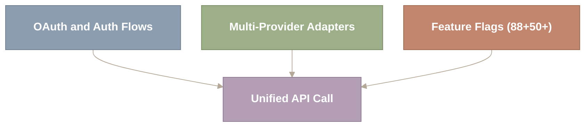
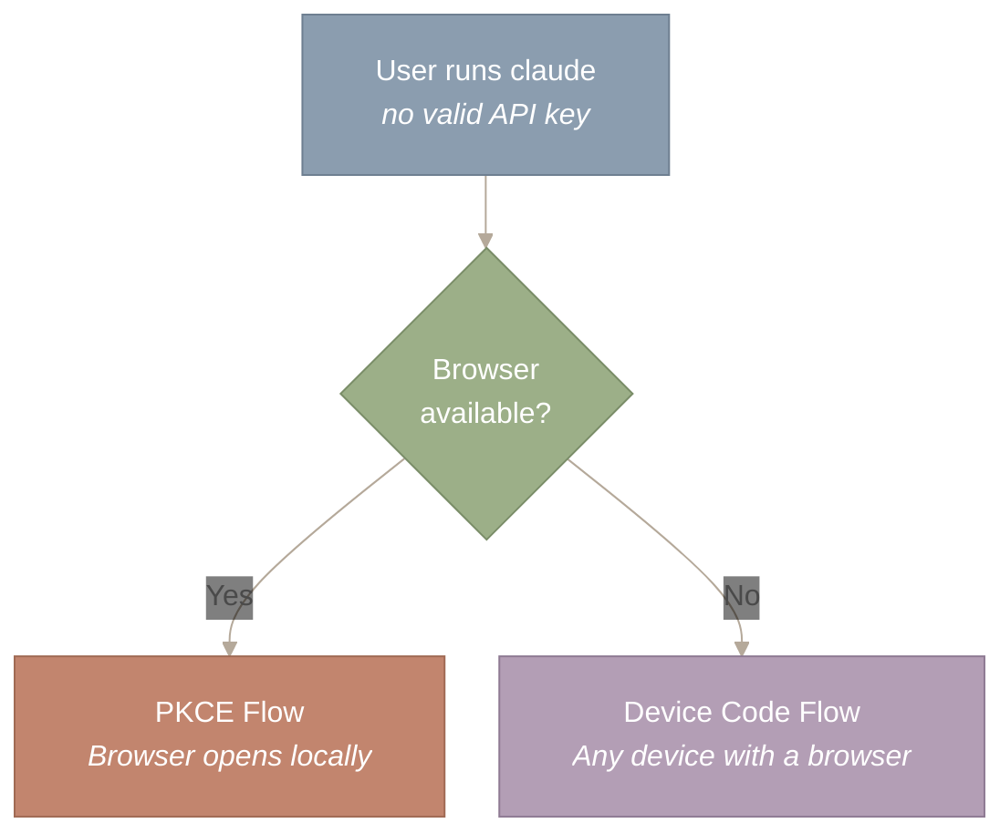
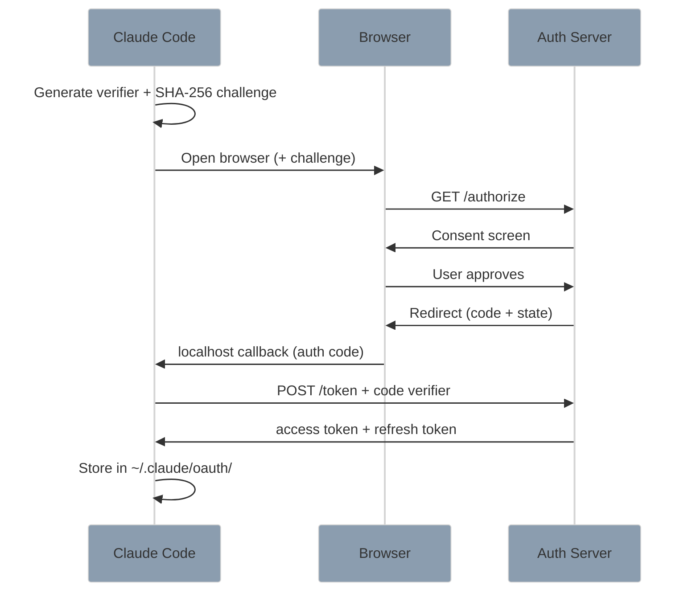
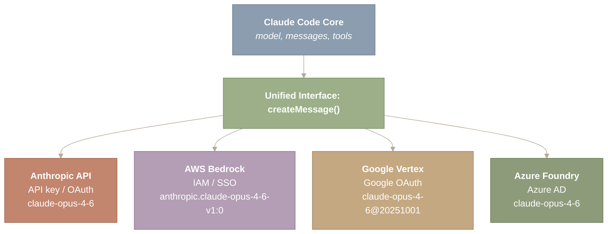
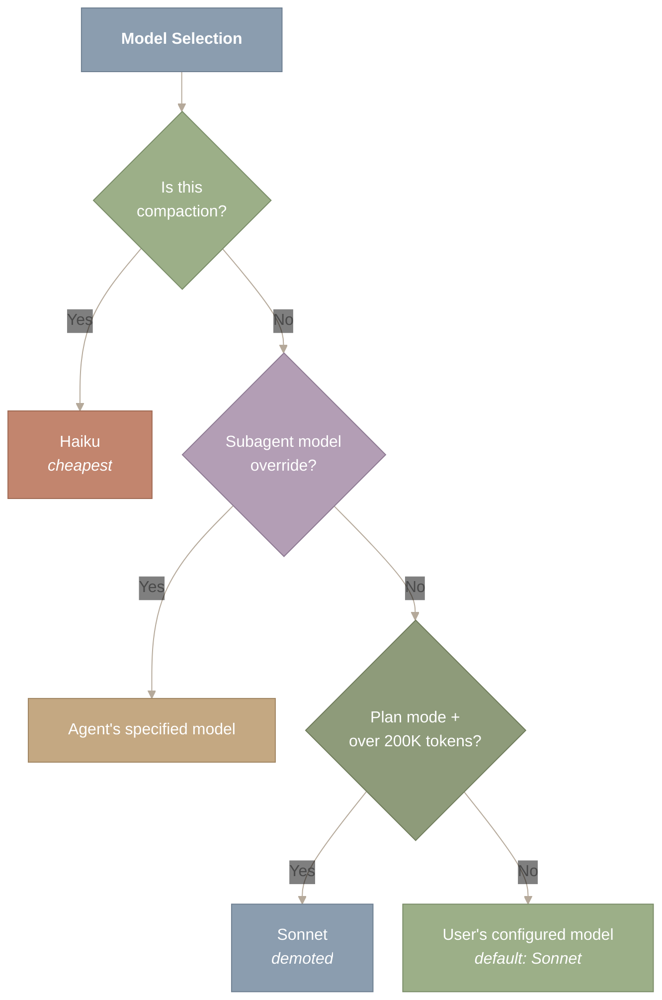
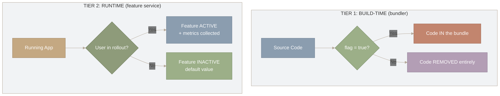
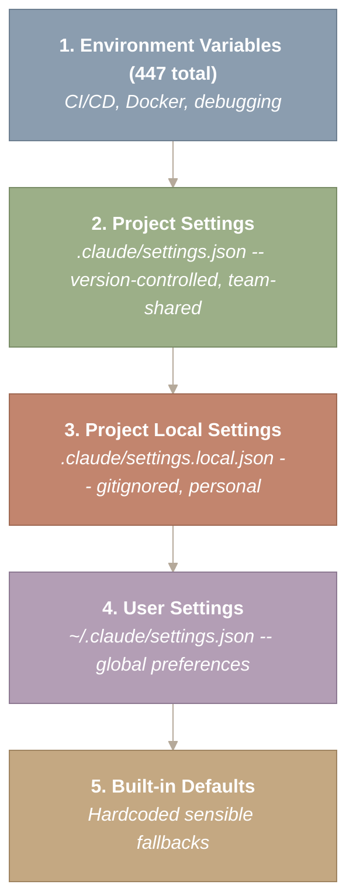

> 译者说明：本文按 2026-08-12 抓取的网页完整翻译，保留原始章节、代码、表格、Mermaid 图源、图注和链接。原文分析基于 Claude Code v2.1.88 的 Source Map；文件行数、工具数量、阈值和实现细节属于该页面快照，不应直接外推到其他版本。

# 认证、Provider 与 Feature Flag

如何让一个没有浏览器的终端应用完成用户登录？一套代码库如何与四家不同的云厂商对话——它们各有自己的认证方案、模型 ID 格式和功能上线节奏？如何在一个 CLI 工具里塞进 88 个实验性功能而不搞垮生产环境？这三个问题——认证、多 Provider 支持和 Feature Flag——构成了把 demo 和产品区分开来的隐形基础设施层。它们不涉及任何巧妙的 Prompt 或 Agent Loop，但要让 Claude Code 在企业级规模下运转，三者缺一不可。

本文介绍 Claude Code 基础设施的三大支柱：为终端环境改造的 OAuth 流程、应用于 LLM Provider 的 Adapter（适配器）模式，以及让 CLI 工具实现持续交付的两级 Feature Flag（功能开关）系统。



*图 1：三大基础设施支柱——认证、多 Provider 适配器和 Feature Flag——汇聚到一条统一的 API 调用路径上。每个支柱解决的是一项独立的企业级需求（身份、可移植性、安全部署），但在每一次 API 请求上三者必须协同工作。抽掉任何一个支柱，Claude Code 都会从生产系统退化为原型。*

图中顶部三个方框分别代表三大基础设施支柱——OAuth 与认证流程、多 Provider 适配器、Feature Flag——各自解决一项独立的企业级需求。三条箭头全部汇聚到底部唯一的“统一 API 调用”方框上，表明每一次 API 请求都必须经过这三套系统。抽掉任何一个支柱，整条生产链路都会断掉。

**本文涉及的源文件：**

| 文件 | 用途 | 规模 |
| --- | --- | --- |
| `src/utils/auth.ts` | 认证工具（Token 管理、keyring） | ~800 LOC |
| `src/services/oauth/` | OAuth 2.0 PKCE + 设备码流程 | 5 个文件 |
| `src/utils/model/model.ts` | 模型选择与路由逻辑 | ~400 LOC |
| `src/utils/model/providers.ts` | 多 Provider 支持（Anthropic、Bedrock、Vertex、Azure） | ~300 LOC |
| `src/utils/model/bedrock.ts` | AWS Bedrock 专用适配器 | ~200 LOC |
| `src/services/api/getModel.ts` | 运行时模型选择（`getRuntimeMainLoopModel()`） | ~200 LOC |
| `src/services/analytics/growthbook.ts` | GrowthBook Feature Flag 客户端 | ~300 LOC |
| `src/services/analytics/` | 遥测、Datadog 指标、事件日志 | 9 个文件 |
| `src/utils/settings/settings.ts` | 设置管理（user/project/local/managed） | ~500 LOC |

## 终端应用的 OAuth——当浏览器不存在时

CLI 应用面临一个独特的认证难题：标准的“跳转到浏览器、再回调回来”的流程假设存在一个 GUI，而终端应用没有 GUI。

回想一下你是怎么登录网页应用的。点击“使用 Google 登录”，浏览器打开，你点同意，浏览器再重定向回应用。这套流程之所以可行，是因为网页应用有一个 URL，授权服务器可以把请求重定向回来。终端应用没有 URL，它只有 `stdin` 和 `stdout`。OAuth 以浏览器为中心的设计与终端纯文本界面之间的这种错位，正是 Claude Code 必须解决的核心用户体验难题。

Claude Code 实现了两种 OAuth 流程，各自面向不同的环境。选择哪一种并不是偏好问题——它完全由浏览器在物理上是否可用来决定。



*图 2：OAuth 流程选择逻辑——一个二元判断（浏览器是否可用）把用户导向两条认证路径之一。PKCE 打开本地浏览器并在 localhost 上捕获回调，而设备码流程显示一个短码，用户在任何带浏览器的设备上输入它。这个分支确保从带 GUI 的笔记本到无头 SSH 会话在内的每一种开发环境，都有一条可行的认证路径。*

从最上方开始：用户运行 `claude`，但没有有效的 API key。菱形判断节点只问一个问题：浏览器可用吗？“是”分支进入 PKCE 流程（浏览器在同一台机器上本地打开），“否”分支进入设备码流程（用户在任何带浏览器的设备上输入一个短码）。这个二元判断确保从带 GUI 的笔记本到无头 SSH 会话，每种环境都有一条可行的认证路径。

### PKCE：localhost 技巧

PKCE（Proof Key for Code Exchange）——一种让公共客户端（像 CLI 工具这样无法保存密钥的应用）安全完成认证的协议——是开发者在笔记本上工作时使用的主流程。

这个技巧很简单，但很巧妙：Claude Code 在 `localhost` 上启动一个临时 HTTP 服务器，然后把用户的浏览器打开到授权 URL。用户点击同意后，授权服务器重定向回 `http://localhost:{PORT}/callback`，而 Claude Code 的临时服务器正在那里监听。CLI 捕获授权码，关掉服务器，再用授权码换取 Token。

“proof key”部分加了一层关键的安全保护。在打开浏览器之前，Claude Code 生成一个随机的 code_verifier，只把它的 SHA-256 哈希值（即 code_challenge）发给授权服务器。在用授权码换 Token 时，Claude Code 出示原始的 verifier，证明自己就是发起请求的那一方。即使攻击者截获了授权码，没有 verifier 也无法完成兑换。



*图 3：PKCE 流程时序图，展示 Claude Code、用户浏览器与授权服务器之间完整的七步握手。关键的安全性质在于其承诺方案（commitment-scheme）结构：SHA-256 challenge 在用户同意之前就已发出，而原始 verifier 直到 Token 兑换时才公开，从而防止授权码截获攻击。Token 存储在本地的 ~/.claude/oauth/ 下，用于静默重新认证。*

这张时序图中时间自上而下流动。三个参与方（Claude Code、浏览器、授权服务器）通过七步握手交换消息。从最上方 Claude Code 生成 verifier 和 challenge 开始，沿箭头向下跟进浏览器的重定向流程。关键的安全性质体现在不对称性上：SHA-256 challenge 很早就发出（第 2 步），而原始 verifier 直到 Token 兑换时才公开（第 8 步），从而防止截获攻击。流程结束时 Token 存储在本地，用于静默重新认证。

### 设备码流程：面向无头环境

PKCE 流程要求本地有浏览器。对于 SSH 会话、远程服务器、CI 流水线和 Docker 容器，Claude Code 退回到设备码流程——这个协议是为输入能力受限的设备（比如智能电视）设计的，恰好完美对应“我 SSH 进了一台没有 GUI 的服务器”这种场景。

该流程把两方彻底解耦。Claude Code 先向服务器请求一个设备码，然后在终端里显示一个 URL 和一个短码：

```
Visit: https://claude.ai/device
Enter code: ABCD-1234
```

用户在*任何*带浏览器的设备上打开那个 URL——手机、另一台笔记本、平板——输入短码。与此同时，Claude Code 以固定间隔轮询 Token 端点，等待批准。用户在手机上点下同意后，下一次轮询就会返回 Token。

这和你在新电视上登录 Netflix 时用的是同一个模式。它背后的认识是：认证并不要求发起认证的设备与批准授权的设备是同一台机器。

### 凭据存储

两种流程以完全相同的方式存储凭据：`~/.claude/oauth/credentials.json`，写入采用原子写，并检查文件权限。当访问 Token 过期时，刷新 Token 可以实现静默重新认证。对于挂载文件不方便的容器化环境，`CLAUDE_CODE_OAUTH_TOKEN_FILE_DESCRIPTOR` 通过文件描述符传入 Token——这是一种 Unix 原生的做法，完全不触碰文件系统。

---

## 多供应商支持——适配器模式的实战应用

**Claude Code 通过一个统一的内部接口支持四家 API 供应商。这就是设计模式教科书里的适配器（Adapter）模式，被应用到了云基础设施的规模上。**

这样做的动机首先是商业竞争，其次才是技术。企业客户不愿意在已经拥有 AWS 或 Google Cloud 合同（其中包含谈好的价格、合规认证和现有账单体系）的情况下再去建立新的供应商关系。多供应商支持让 Claude Code 可以进入客户基础设施所在的地方。



*图 4：多供应商适配器架构，展示单个 createMessage() 接口如何分发到四个云后端。各后端在认证方案（API key、IAM/SSO、Google OAuth、Azure AD）和模型标识符格式上各不相同，但核心引擎完全看不到这些差异。适配层负责翻译规范的模型名称，并在边界处统一响应格式。*

这张图从上往下看：最上方是 Claude Code Core，它产生一个通用请求（model、messages、tools）。箭头穿过统一接口（createMessage()），这是唯一的抽象点。从那里分出四支箭头，指向四个供应商后端，每个后端都标注了各自的认证方案和模型 ID 格式。核心引擎永远看不到供应商特有的差异——所有翻译都发生在这个适配边界上。

### 供应商选择：一条优先级链

选择逻辑是一条简单的优先级链，实现在 `getAPIProvider()` 中：

```
function getAPIProvider(): 'anthropic' | 'bedrock' | 'vertex' | '3p' {
  if (process.env.CLAUDE_CODE_USE_BEDROCK) return 'bedrock'
  if (process.env.CLAUDE_CODE_USE_VERTEX) return 'vertex'
  if (process.env.ANTHROPIC_BASE_URL) return '3p'
  return 'anthropic'  // default
}
```

顺序很重要。如果 `CLAUDE_CODE_USE_BEDROCK` 和 `CLAUDE_CODE_USE_VERTEX` 同时被设置（一种配置错误），Bedrock 会胜出。`3p`（第三方）供应商是一个兜底项，适用于任何与 Anthropic 兼容的 API——本地代理、合规网关或替代部署。

这是责任链（Chain of Responsibility）模式。每个供应商检查都是链上的一个处理器，第一个匹配的处理器取得所有权。可以对比 Express 中间件解析路由的方式，或者 Java 异常处理器沿 catch 链向上查找的方式。

### 模型 ID 规范化：翻译层

每个供应商使用不同的模型标识符格式。内部名称 `claude-opus-4-6` 必须在每次 API 调用之前按供应商进行翻译：

| 内部 ID | Anthropic | Bedrock | Vertex |
| --- | --- | --- | --- |
| `claude-opus-4-6` | `claude-opus-4-6` | `anthropic.claude-opus-4-6-v1:0` | `claude-opus-4-6@20251001` |
| `claude-sonnet-4-6` | `claude-sonnet-4-6` | `anthropic.claude-sonnet-4-6-v1:0` | `claude-sonnet-4-6@20251001` |

*规范化层还处理回退链：Opus 回退到 Sonnet，Sonnet 回退到 Haiku。在 Anthropic API 上可用的配置，即使 Bedrock 上还没有完全相同的模型版本，依然能正常工作。*

这个规范化函数（normalizeModelStringForAPI()）是适配器模式的核心。Claude Code 的内部代码从不考虑供应商特有的格式。它在各处都使用规范的模型名称，由适配层在边界处完成翻译。

### 智能模型选择

Claude Code 不会对所有操作使用同一个模型。`getRuntimeMainLoopModel()` 函数实现了成本感知的路由：



*图 5：模型选择决策树，在三个决策点上实现成本感知路由。压缩（Compaction）被路由到 Haiku（最便宜），subagent 的模型覆盖设置在已设置时会被采用，超过 200K token 的规划会话会从 Opus 降级到 Sonnet。这种分层策略优化的是整个会话的全局成本，而不是每一轮的质量，背后是这样的判断：并非每个 agent 操作都需要最强的模型。*

这张图从最上方的“模型选择”节点开始，沿决策树向下依次经过三个菱形决策点。在每个分支处，“是”路径通向某个具体模型（压缩用 Haiku、agent 的覆盖模型、长规划会话用 Sonnet），“否”路径则继续进入下一项检查。如果三项检查都未命中，流程到达默认值：用户配置的模型。要点在于成本优化是自动发生的——只要任务不需要前沿推理能力，就会选用更便宜的模型。

计划模式下的降级是一个务实的成本决策。长规划会话会累积数十万 token，如果每一轮都按 Opus 的价格付费，成本高到无法承受。Sonnet 能以零头的成本完成规划推理。压缩则始终使用 Haiku——总结对话历史是一项结构明确的任务，不需要深度推理。

这种分层模型路由是用最优质量换取成本的可预测性。使用 Opus 的用户，压缩时仍然得到 Haiku，长规划会话时仍然得到 Sonnet。系统做的是全局优化（最小化整个会话的总成本），而不是局部优化（每一轮都用最好的模型）。

---

## Feature Flag 作为部署基础设施

**Claude Code 携带 88 个以上的构建期 Feature Flag 和 50 个以上的运行期 flag。这不是技术债——它是持续交付基础设施，让一个小团队可以每周向数百万用户发布，而不搞坏生产环境。**

Feature Flag 在 Web 应用中很常见——Netflix 给你看重新设计的首页，而你的邻居看到的还是旧版。Claude Code 的不同寻常之处在于：一个 CLI 工具内部有如此大规模的 flag 化，以及支撑它运转的两层架构。

### 第一层：构建期 Flag——死代码消除

构建期 flag 由 Bun 打包器在编译时求值。它们不只是条件判断——它们是 tree-shaking 的边界。当一个 flag 求值为 `false` 时，打包器会消除整条代码路径，包括所有 import、字符串字面量和副作用：

```
if (feature('VOICE_MODE')) {
  // When VOICE_MODE is false, this block AND the
  // ./voice module are eliminated from the bundle
  const voice = await import('./voice')
  voice.startStreaming()
}
```

这比运行期 Feature Flag 更激进。运行期 flag 会把代码留在产物里，只是在执行时跳过；构建期 flag 则把代码整个移除，既减小了包体积，也确保未发布的功能无法从发布的二进制中被逆向出来。



*图 6：两层 Feature Flag 的生命周期，展示构建期和运行期闸门如何承担互补的职能。第一层（构建期）利用 Bun 打包器把被禁用的功能通过 tree-shaking 完全从二进制中剔除，防止逆向工程。第二层（运行期）在代码发布之后，针对用户身份和灰度比例求值 flag，从而支持渐进式激活和无需重新部署的即时回滚。*

这张图里的两个子图代表在软件生命周期不同阶段起作用的两个层。第一层（左侧，构建期）中，源代码经过打包器的 flag 检查：“true”把代码编入二进制，“false”通过 tree-shaking 将其完全移除。第二层（右侧，运行期）中，正在运行的应用检查用户是否在灰度范围内：“是”则激活功能并记录指标，“否”则回退到默认行为。两层是互补的——第一层控制二进制里装什么，第二层控制对每个用户激活什么。

| 第一层的效果 | 第二层的效果 |
| --- | --- |
| 更小的包体积 | 按用户定向 |
| 没有死代码路径 | 渐进式灰度（5% 到 50%） |
| 功能不可见 | A/B 测试 |
| 88+ 个 flag | 即时回滚，50+ 个 flag |

被 gate 得最重的功能（基于 v2.1.88 的一份快照；各版本之间数量会有变化）透露了 Claude Code 的路线图：

| Flag | 大致引用数 | 它 gate 的功能 |
| --- | --- | --- |
| **KAIROS** | ~154 | 异步后台 agent 工作 |
| **TRANSCRIPT_CLASSIFIER** | ~107 | 基于 ML 的自动模式决策 |
| **TEAMMEM** | ~51 | 团队记忆同步 |
| **VOICE_MODE** | ~46 | 语音转文字的流式输入 |
| **PROACTIVE** | ~37 | agent 主动建议操作，无需提示 |
| **COORDINATOR_MODE** | ~32 | 多 agent 集群编排 |

KAIROS 在那份快照中约有 154 处引用，触及 agent loop、UI、会话管理和 SDK。这种深度集成指向一项重大的未发布能力：在开发者做别的事情时，agent 可以在后台工作。

### 第二层：运行期 Flag——渐进式灰度

运行期 flag 与构建期 flag 互补，负责在代码发布之后控制行为。它们针对用户身份、组织成员资格和灰度比例来求值：

```
getFeatureValue_CACHED_MAY_BE_STALE('tengu_fast_mode', false)
```

这个函数名是故意写得冗长的。`CACHED_MAY_BE_STALE` 提醒调用者：返回的值可能稍微过时。flag 的值从 feature 服务获取后在本地缓存，并容忍一定的陈旧度。这样做是把延迟（每次检查 flag 都不发网络请求）置于严格一致性（灰度变更可能需要几分钟才能传播到各处）之上。

运行期 flag 能实现构建期 flag 做不到的能力：渐进式灰度（先 5% 用户，再 25%，再 100%）、A/B 测试、按组织定向，以及无需新部署的即时回滚。

### 层级之间的交互

一个功能可能同时受到两级开关的控制。构建期开关确保代码不会被交付给永远不应该看到它的用户；运行时开关则在已经拿到代码的用户群体中控制渐进式发布。正是这种分层门控，让 Anthropic 能够安全地试验语音输入、coordinator mode 这样的重大功能，而不危及核心产品的稳定性。

---

## 成本追踪——一个接口，四种定价模型

每家 LLM 提供商的计费方式都不同，但用户需要对自己花了多少钱有一个统一、一致的视图。成本模型的抽象把五花八门的定价归一化到同一个接口之下。

每家提供商对输入 token、输出 token 和缓存 token 都有各自的定价。成本追踪系统必须透明地处理所有这些差异。每个 API 响应都包含 `input_tokens` 和 `output_tokens` 计数。客户端按请求记录这些数据，并按会话聚合，从而支撑终端 UI 中的成本显示和 token 预算执行系统。

这个抽象从外部看很简单——状态栏上一个单独的成本数字——但它背后是一个归一化层，把特定于提供商的用量数据映射到统一的成本模型。不同提供商报告用量的方式也可能不同（有的把思考 token 单独列出，有的把它并入输出 token），所以归一化的对象不只是定价，还包括首先"什么算一个 token"这个问题本身。

---

## 配置层级——五级覆盖

Claude Code 的配置是一条五级优先级链，用来平衡团队约定、个人偏好和部署要求。

这个模型沿用了与 CSS 特异性级联、DNS 解析或 Git config（先是仓库级，再是全局级，再是系统级）相同的优先级模式。每一级都可以覆盖它下面的一级：



*图 7：配置优先级链，展示从环境变量（最高）到内置默认值（最低）的五级解析顺序。这条链与 CSS 特异性相对应：环境变量相当于 !important 覆盖，项目设置强制执行团队约定，本地设置提供个人的"逃生舱口"，内置默认值则相当于 user-agent 样式表。在任意级别上，第一个被定义的值胜出。*

图中自上而下是一条优先级链：最高优先级的来源（环境变量，第 1 级）在顶部，最低的（内置默认值，第 5 级）在底部。箭头表示回退顺序——系统按顺序检查每一级，使用它找到的第一个已定义的值。第 1–2 级通常由团队和 CI 系统设置，第 3 级是个人的、被 gitignore 的逃生舱口，第 4 级保存全局用户偏好，第 5 级在其他什么都没配置时提供硬编码的兜底值。

被 gitignore 的 `settings.local.json` 是一个细小但重要的设计细节。它承认开发者需要逃生舱口——个人 MCP 服务器、调试时放宽的权限、用于测试的备用 API key——而又不污染团队配置。

`CLAUDE.md` 文件遵循另一套发现机制：从当前工作目录开始沿目录树向上查找。这支持 monorepo 架构，让指令从仓库根目录逐级向下贯穿工作区目录直到单个包。来自项目目录之外的外部 include 需要用户显式批准，这是一项安全措施，防止恶意依赖向 Agent 的 System Prompt 注入指令。

---

## 重试与错误恢复——并非所有失败都相同

重试系统区分两类错误：一类可能自行恢复，另一类则需要根本不同的策略。

这个区分至关重要。529（Overloaded，过载）错误是暂时的——等待并用指数退避重试即可。413（Prompt Too Long，提示过长）错误重试多少次都不会成功——必须改变请求本身。

| 错误类型 | 策略 | 类比 |
| --- | --- | --- |
| **529 Overloaded（过载）** | 带抖动的指数退避 | 堵车：等一等再试 |
| **网络错误** | 快速重试（通常几秒内恢复） | 电话掉线：重拨 |
| **413 Prompt Too Long（提示过长）** | 触发反应式压缩，然后重试 | 行李箱太满：重新打包 |
| **401/403 认证错误** | 尝试刷新 token，否则重新认证 | 工牌过期：换一张新的 |
| **400 Bad Request（错误请求）** | 不重试（请求构造存在 bug） | 地址写错：重试也没用 |

413 的恢复路径很巧妙。当 API 报告提示过长时，重试处理器会调用反应式压缩（在 [Part III.2](https://y-agent.github.io/inside-claude-code/04-context-compaction.html) 中介绍），对较早的消息做摘要以减少 token 数量。随后用压缩过的历史重新构造请求并重试。这形成了一个自愈循环：Claude Code 自动管理自己的上下文窗口，而不是直接失败、要求用户手动删减。

流式响应中途失败时，系统可以切换到 `fallbackModel`，而不是继续用同一个模型重试。这个回退不会递归：如果回退模型也失败，错误会直接抛给用户，从而避免无休止的级联重试白白消耗 API 额度。

---

## 总结

Claude Code 的基础设施层揭示了一些适用面远超 AI Agent 的原则：

- **CLI 工具的 OAuth 是一个已被解决的问题，有两条互补的流程。** 有浏览器可用时，PKCE 可行（localhost 服务器技巧）。其他所有场景，Device Code 可行（把发起认证的设备和完成授权的设备解耦）。两者合起来覆盖了从笔记本到 SSH 会话再到 CI 容器的所有开发环境。
- **多提供商支持就是云规模的适配器模式。** 一个规范化的内部表示，在边界处做翻译。驱动字符编码归一化和数据库抽象层的同一条原则，同样适用于 LLM API 提供商。关键点在于：要归一化的不只是 API，还有指标、模型 ID 和错误码。
- **两级 Feature Flag 把安全性和灵活性结合了起来。** 构建期开关把未发布的代码从二进制中剔除（安全）。运行时开关支持渐进式发布和即时回滚（灵活）。单独任何一级都不够。两级合起来，团队才能每周向数百万用户发布而不搞坏生产环境。
- **感知成本的模型路由本质上是伪装的资源调度。** 用 Haiku 做压缩、用 Sonnet 跑长规划会话、用 Opus 处理复杂推理，这与"把 CPU 密集型任务调度到性能核、把 I/O 密集型任务调度到能效核"是同一个资源分配问题。
- **配置层级应当同时尊重团队和个人。** 五级优先级链既给团队提供强制手段（纳入版本控制的项目设置），也给个人留出逃生舱口（被 gitignore 的本地设置）。环境变量则充当面向自动化的最终覆盖手段。

正是这些看不见的基础设施，让看得见的 Agent 体验成为可能。Claude Code 生成的每一个 token，都经过了认证、被路由到正确的提供商、被生效的 Feature Flag 塑形、并经由一条五级优先级链完成配置。当这一切正常运转时——几乎总是如此——没有人会想起它。这是对基础设施层最高的褒奖。

---

*下一篇：[Part VI.1: Model Context Protocol](https://y-agent.github.io/inside-claude-code/10-model-context-protocol.html)——Claude Code 在那里通过一个通用协议连接外部工具和服务，把 Agent 的能力扩展到内置工具集之外。*
