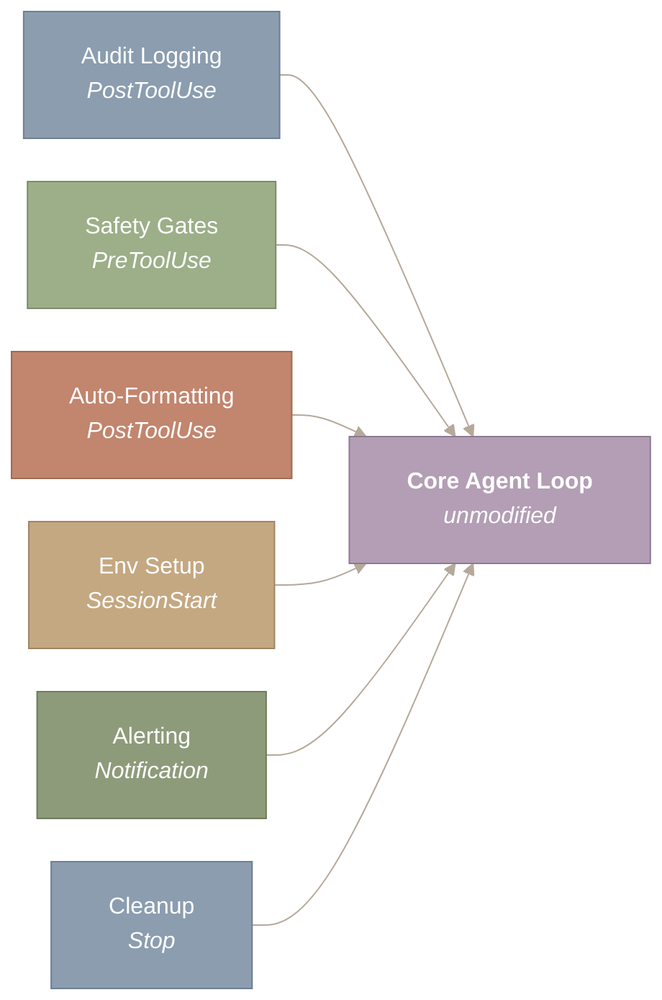
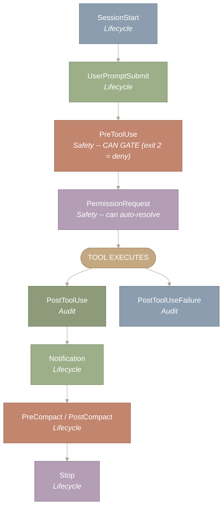
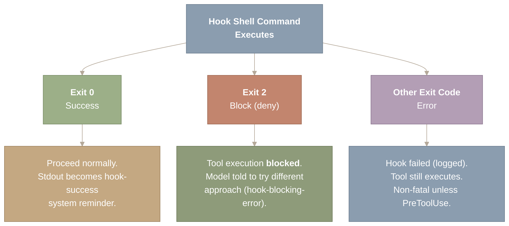
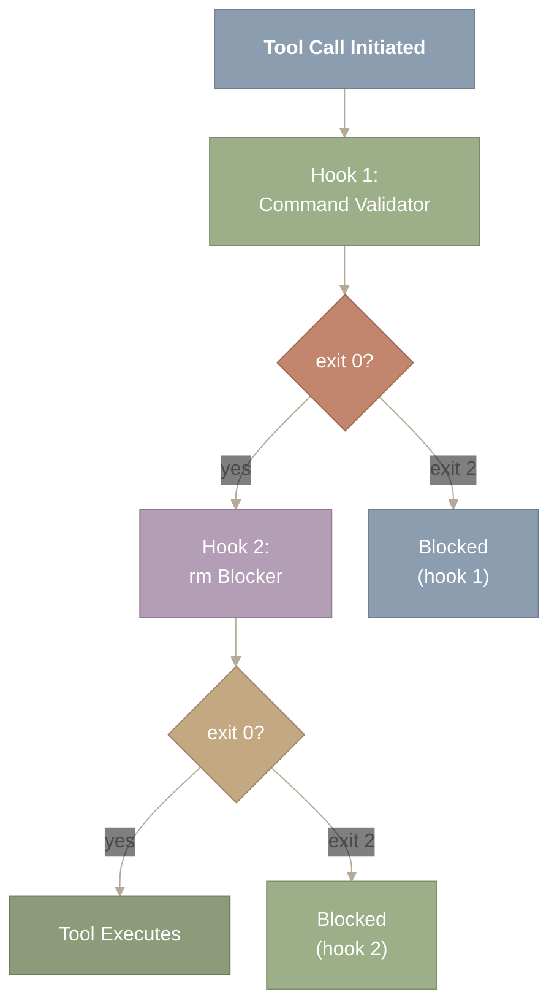
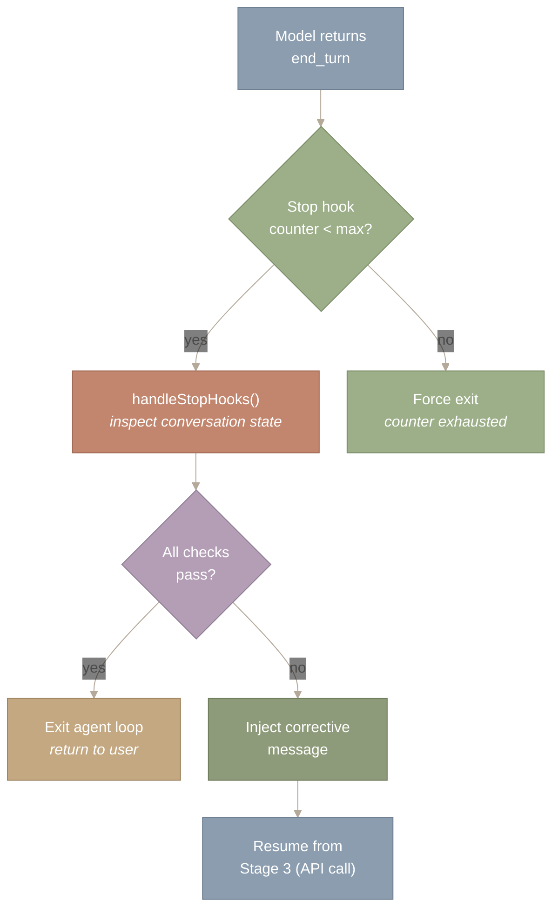
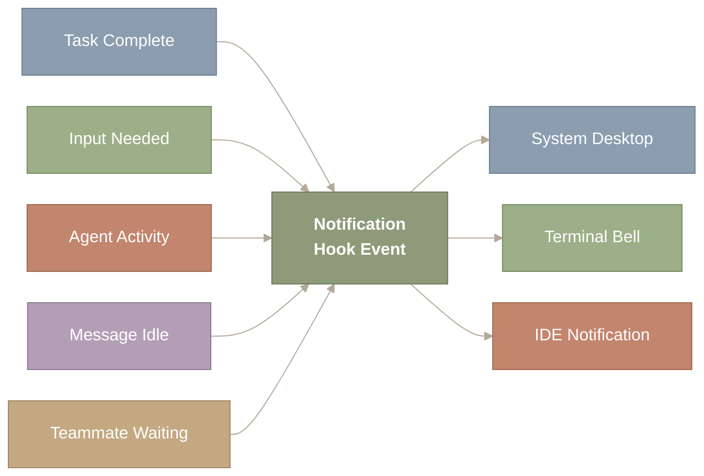

# Hooks & Lifecycle Events

## Introduction: Why Lifecycle Hooks Matter

**How do you enforce invariants on an AI agent without forking the codebase?** An enterprise needs to block production database writes. A team needs to auto-format every file write. A solo developer needs to log every shell command. These are cross-cutting concerns – they cut across every subsystem and need to be composable, configurable, and external to the agent’s core code.

Claude Code’s hooks solve this. Instead of modifying tool execution code to add formatting, logging, or gating, you configure hooks that fire at lifecycle events. Each hook is a shell command – any language, any tool – that receives context via environment variables and can observe, modify, or block the action. This design turns Claude Code from a fixed-behavior binary into a configurable execution pipeline where every significant event can be intercepted.



*Figure 1: Hooks as aspect-oriented programming applied to an AI agent. Six categories of cross-cutting concerns – audit logging (PostToolUse), safety gates (PreToolUse), auto-formatting (PostToolUse), environment setup (SessionStart), alerting (Notification), and cleanup (Stop) – attach to the core agent loop without modifying any of its code. This separation means Claude Code’s tool execution logic remains unchanged regardless of how many hooks are configured, preserving testability while enabling arbitrary customization.*

**How to read this diagram.** The central node is the Core Agent Loop, which remains unmodified. Six cross-cutting concerns radiate inward toward it, each labeled with the lifecycle event it attaches to: Audit Logging and Auto-Formatting use PostToolUse, Safety Gates use PreToolUse, Env Setup uses SessionStart, Alerting uses Notification, and Cleanup uses Stop. The arrows point toward the core, showing that hooks observe or intercept the agent – they do not change its internal logic.

The PreToolUse/PostToolUse pair is exactly the Intercepting Filter pattern from enterprise Java – a chain of filters that process a request before and after the core handler. In Spring, it is `HandlerInterceptor.preHandle()` / `postHandle()`. In Express.js, it is middleware. Same pattern, different domain.

**Source files covered in this post:**

| File | Purpose | Size |
| --- | --- | --- |
| `src/utils/hooks/hookEvents.ts` | Hook event type definitions (27 lifecycle events) | ~200 LOC |
| `src/utils/hooks/hookHelpers.ts` | Hook execution helpers (spawn, timeout, result parsing) | ~300 LOC |
| `src/utils/hooks/hooksConfigManager.ts` | Hook configuration loading and matcher dispatch | ~400 LOC |
| `src/utils/hooks/sessionHooks.ts` | Session-level hook orchestration | ~250 LOC |
| `src/utils/hooks/postSamplingHooks.ts` | Post-sampling hook integration (stop hooks) | ~200 LOC |
| `src/utils/hooks/execAgentHook.ts` | Agent-spawned hook execution | ~150 LOC |
| `src/services/notifier.ts` | Notification delivery (desktop, terminal bell, IDE) | ~300 LOC |

---

## Core Hook Events

Claude Code exposes over 25 lifecycle events (see [Appendix](https://y-agent.github.io/inside-claude-code/11-hooks-lifecycle.html#appendix-full-sdk-hook-surface) for the complete list). The 10 most operationally important events – the ones you will configure hooks for in practice – fire at specific points in the agent’s execution. They divide into three categories: **safety-critical** events that can block execution, **audit** events that observe without blocking, and **lifecycle** events that manage session boundaries.



*Figure 2: Timeline of the 10 core lifecycle events during a typical agent turn, organized by category. Safety-critical events (PreToolUse, PermissionRequest) sit before tool execution and can block it via exit code 2. Audit events (PostToolUse, PostToolUseFailure) sit after execution and observe outcomes without altering them. Lifecycle events (SessionStart, UserPromptSubmit, PreCompact, PostCompact, Notification, Stop) mark session boundaries and context management milestones. Only the safety-critical events can alter the execution path.*

**How to read this diagram.** Start at the top with SessionStart and follow the arrows downward through the timeline of a single agent turn. Safety-critical events (PreToolUse, PermissionRequest) appear before the central TOOL EXECUTES node and are the only events that can alter the execution path. After tool execution, the flow branches: success goes to PostToolUse, failure goes to PostToolUseFailure. The remaining lifecycle events (Notification, PreCompact/PostCompact, Stop) occur as the session winds down.

The following table provides a reference for these 10 core events:

| Event | Category | Can Block? | When It Fires | Context Available |
| --- | --- | --- | --- | --- |
| **SessionStart** | Lifecycle | No | Session begins | Session ID, working directory |
| **UserPromptSubmit** | Lifecycle | No | User submits a prompt | Prompt text, session state |
| **PreToolUse** | Safety | **Yes** (exit 2) | Before any tool executes | Tool name, input arguments |
| **PermissionRequest** | Safety | **Yes** (auto-resolve) | Permission check triggered | Tool, permission level, arguments |
| **PostToolUse** | Audit | No | After tool succeeds | Tool name, input, output |
| **PostToolUseFailure** | Audit | No | After tool fails | Tool name, input, error |
| **PreCompact** | Lifecycle | No | Before context compaction | Token count, message count |
| **PostCompact** | Lifecycle | No | After context compaction | New token count, removed count |
| **Notification** | Lifecycle | No | Agent sends a notification | Notification text, type |
| **Stop** | Lifecycle | No | Session ends | Session ID, turn count |

The critical distinction is that only **PreToolUse** and **PermissionRequest** can alter the execution path. A PreToolUse hook returning exit code 2 blocks the tool entirely – the model is told the action was denied and must try a different approach. A PermissionRequest hook can auto-resolve the permission check, bypassing the user prompt. All other events are observational: the hook runs, but its outcome does not change what happens next.

**What the system prompt tells the model about hooks.** The system prompt includes a hooks section that frames hooks as user-controlled interceptors:

> *“Users may configure ‘hooks’, shell commands that execute in response to events like tool calls, in settings. Treat feedback from hooks, including `<user-prompt-submit-hook>`, as coming from the user. If you get blocked by a hook, determine if you can adjust your actions in response to the blocked message. If not, ask the user to check their hooks configuration.”*

This framing is important: the model treats hook output as user feedback, not system noise. When a PreToolUse hook blocks a `Write` call with “files in `src/generated/` are auto-generated — do not edit,” the model treats this the same as if the user had typed that instruction. This is why hooks are effective behavioral constraints — they speak with the user’s authority.

---

## Hook Configuration: The settings.json Format

Hooks are configured in `settings.json` with a matcher-based dispatch system. Each hook definition specifies an event, an optional matcher to filter which invocations trigger it, and one or more shell commands to execute.

```
{
  "hooks": {
    "PreToolUse": [
      {
        "matcher": { "tool": "Bash" },
        "hooks": [
          {
            "type": "command",
            "command": "python3 /path/to/validate_bash.py"
          }
        ]
      }
    ],
    "PostToolUse": [
      {
        "matcher": { "tool": "Write" },
        "hooks": [
          {
            "type": "command",
            "command": "prettier --write $FILE_PATH"
          }
        ]
      }
    ],
    "SessionStart": [
      {
        "hooks": [
          {
            "type": "command",
            "command": "echo 'Session started' >> /tmp/claude-audit.log"
          }
        ]
      }
    ]
  }
}
```

Matchers filter on three dimensions:

- **Tool name** (`"tool": "Bash"`) – matches a specific tool.
- **Command pattern** (`"command": "rm *"`) – matches shell commands containing a pattern.
- **File pattern** (`"file": "*.py"`) – matches file operations on specific paths.

When no matcher is specified, the hook fires for every invocation of that event. Multiple hooks on the same event run sequentially – a hook that fails on PreToolUse blocks execution before subsequent hooks even run. This sequential execution guarantees deterministic behavior: hooks compose as a pipeline, not as concurrent handlers.

The configuration can live in three locations, with the same cascade semantics as the rest of Claude Code’s settings:

1. **Project-level** (`.claude/settings.json`) – applies to a specific repository.
2. **User-level** (`~/.claude/settings.json`) – applies to all projects for one user.
3. **Enterprise-level** (managed policy) – applies organization-wide.

Project-level hooks override user-level hooks for the same event and matcher. This means a team can define standard hooks in the repository, and individual developers can add personal hooks without conflicting.

---

## Execution Model: Shell Commands and Exit Code Semantics

Hooks execute as shell commands in a child process. The hook receives its context through **environment variables** – the tool name, input arguments, file paths, and session metadata are all available as `$TOOL_NAME`, `$TOOL_INPUT`, `$FILE_PATH`, and similar variables. The hook’s stdout is captured and can be fed back to the model.

The exit code determines the outcome:



*Figure 3: Hook exit code semantics showing three possible outcomes from any hook invocation. Exit 0 signals approval and the tool proceeds normally, with stdout captured as a system reminder. Exit 2 signals deliberate denial and blocks the tool, with the model receiving a hook-blocking-error message explaining why. Any other exit code signals an error in the hook script itself, which is logged but does not necessarily block execution. The choice of exit 2 (rather than 1) for blocking is deliberate: it avoids false positives from scripts that crash with exit 1.*

**How to read this diagram.** Start at the top where the hook shell command executes. Three branches fan out representing the three possible exit codes. The left branch (Exit 0) leads to normal operation with stdout captured as a system reminder. The center branch (Exit 2) leads to the tool being blocked, with the model told to try a different approach. The right branch (any other exit code) indicates an error in the hook script itself, which is logged but does not necessarily stop execution. The critical distinction is that only exit 2 is treated as a deliberate denial.

- **Exit 0** – Success. The hook ran and approved the action (or observed it without objection). For PreToolUse, this means “proceed.” For PostToolUse, this means “observation recorded.”
- **Exit 2** – Block. The action is denied. Only meaningful for PreToolUse and PermissionRequest. The tool does not execute, and the model receives a `hook-blocking-error` system reminder explaining that the action was blocked.
- **Any other exit code** – Error. The hook itself failed (crash, timeout, misconfiguration). For PreToolUse, the behavior depends on the failure mode: a hard failure may block the tool; a soft failure may log and continue.

The choice of exit code 2 (rather than exit code 1) for blocking is deliberate. Exit code 1 is the universal “something went wrong” signal in Unix. Exit code 2 is conventionally used for “misuse of shell builtins” – a less common code that is unlikely to be produced accidentally by a hook script that crashes. This reduces false positives: a Python script that throws an unhandled exception exits with code 1 (error, not intentional block), while a script that deliberately decides to deny an action exits with code 2.

---

## The Feedback Loop: System Reminders

The critical detail that makes hooks useful to the model – rather than merely useful to humans – is that hook outcomes are fed back into the conversation via system reminders. Without this feedback, hooks would be invisible to the model. It would not know its Write was followed by a prettier pass, or that its Bash command was blocked by a safety hook.

Four reminder types communicate what happened:

| Reminder Type | Meaning | Model Behavior |
| --- | --- | --- |
| `hook-success` | Hook ran and approved | Proceed normally |
| `hook-blocking-error` | Hook denied the action | Try a different approach |
| `hook-stopped-continuation` | Hook halted the session | Stop and report |
| `hook-additional-context` | Hook provided extra info | Incorporate into reasoning |

The `hook-additional-context` type is particularly powerful. A PostToolUse hook can run a linter on a file the model just wrote and inject the linter output as additional context. The model then sees the lint errors in its next turn and can fix them – creating a tight automated feedback loop without any human intervention. This is the same pattern as CI/CD pipelines that run checks on every commit, except the feedback loop is within a single agent session rather than across git pushes.

---

## Use Cases: Linting, Logging, and Custom Permission Gates

The abstract architecture becomes concrete through use cases. The following examples illustrate the three primary patterns: **enforcement** (blocking unsafe actions), **automation** (running side effects), and **auditing** (recording what happened).

### Enforcement: Blocking Production Database Writes

```
{
  "hooks": {
    "PreToolUse": [{
      "matcher": { "tool": "Bash", "command": "*production*" },
      "hooks": [{
        "type": "command",
        "command": "echo 'BLOCKED: production commands are not allowed' && exit 2"
      }]
    }]
  }
}
```

Any Bash command containing “production” is blocked before execution. The model receives the blocking message and is told to try a different approach. This is the simplest form of policy enforcement – a pattern match on the command string with a hard deny.

### Automation: Auto-Formatting on Write

```
{
  "hooks": {
    "PostToolUse": [{
      "matcher": { "tool": "Write", "file": "*.ts" },
      "hooks": [{
        "type": "command",
        "command": "prettier --write $FILE_PATH && eslint --fix $FILE_PATH"
      }]
    }]
  }
}
```

Every TypeScript file write is followed by Prettier formatting and ESLint auto-fixing. The model does not need to know about these tools or remember to run them. The hook ensures consistent formatting regardless of what the model produces. This is the Decorator pattern applied at the tool level: the Write tool’s behavior is transparently enhanced without changing its interface.

### Auditing: Logging All Tool Calls

```
{
  "hooks": {
    "PostToolUse": [{
      "hooks": [{
        "type": "command",
        "command": "echo \"$(date -u) | $TOOL_NAME | $SESSION_ID\" >> /var/log/claude-audit.log"
      }]
    }]
  }
}
```

Every tool invocation is logged with a timestamp, tool name, and session ID. No matcher means the hook fires for every tool. This creates a complete audit trail of the agent’s actions – essential for enterprise compliance and debugging.

### Composition: Multiple Hooks on the Same Event

Hooks compose naturally. A single PreToolUse event can have multiple hook entries with different matchers, and they execute sequentially:

```
{
  "hooks": {
    "PreToolUse": [
      {
        "matcher": { "tool": "Bash" },
        "hooks": [{ "type": "command", "command": "python3 validate_commands.py" }]
      },
      {
        "matcher": { "tool": "Bash", "command": "rm *" },
        "hooks": [{ "type": "command", "command": "echo 'BLOCKED: rm not allowed' && exit 2" }]
      }
    ]
  }
}
```

The first hook validates all Bash commands through a Python script. The second hook specifically blocks any `rm` command. If the first hook passes, the second still runs. If either returns exit 2, the tool is blocked. This sequential composition mirrors how middleware stacks work in web frameworks: each layer can pass, modify, or reject the request.



*Figure 4: Hook composition as a sequential pipeline for PreToolUse events. Two hooks with different matchers execute in order: Hook 1 (a command validator) runs first, and if it passes (exit 0), Hook 2 (an rm blocker) runs next. If either hook returns exit 2, execution stops immediately and the tool is blocked. This sequential composition guarantees deterministic behavior and mirrors middleware stacks in web frameworks, where each layer can pass, modify, or reject the request.*

**How to read this diagram.** Start at the top where a tool call is initiated. The flow passes through Hook 1 (Command Validator), then hits a diamond decision: if exit 0, execution continues to Hook 2 (rm Blocker); if exit 2, the tool is blocked immediately. Hook 2 follows the same pattern – exit 0 proceeds to tool execution, exit 2 blocks. The key insight is the sequential, short-circuit nature: any hook returning exit 2 halts the pipeline without running subsequent hooks.

---

## Stop Hooks – Convergence Guards for the Agent Loop

**Stop hooks are a special case in the hooks architecture: they fire when the model signals `end_turn`, but before the agent loop actually exits.** Their job is to catch premature termination — situations where the model *thinks* it is done but has left work incomplete.

The mechanism lives in the agent loop’s `CHECK STOP REASON` state (see [Part I.2: End-to-End Workflow](https://y-agent.github.io/inside-claude-code/01-end-to-end-workflow.html)). When the model’s response has `stop_reason: "end_turn"`, the loop calls `handleStopHooks()` before returning control to the user. The stop hook handler inspects the conversation state and decides whether the model should continue.



*Figure 5: Stop hook decision flow. When the model signals end_turn, the stop hook handler inspects conversation state — checking whether file edits were followed by test runs, whether the original task was addressed, and whether the model’s final message is a reasonable completion. If any check fails, a corrective message is injected and the loop resumes from the API call stage. A counter caps the number of times stop hooks can fire per session, preventing the convergence guard from itself diverging.*

**How to read this diagram.** Start at the top where the model returns end_turn. The first diamond checks whether the stop hook counter has been exceeded – if yes, the loop force-exits to prevent infinite cycling. If the counter is under the cap, handleStopHooks() inspects conversation state. If all checks pass, the agent exits normally. If any check fails (e.g., files were edited but tests were not run), a corrective message is injected and the loop resumes from the API call stage. This creates a bounded self-correction loop.

**What stop hooks check.** The `handleStopHooks()` function examines the conversation history for patterns that indicate incomplete work:

- **Untested edits.** If the model modified source files (via Edit or Write) but never invoked Bash to run tests, the stop hook injects a corrective message: *“You modified source files but did not run the test suite. Please verify your changes.”* This is the most common stop hook trigger.
- **Unverified builds.** If the model changed configuration files (package.json, tsconfig.json, Makefile) but never ran a build command, the hook flags the gap.
- **Incomplete task signals.** The `stopHookResult.preventContinuation` flag lets the hook explicitly prevent the loop from exiting, returning a reason string (e.g., `"stop_hook_prevented"`) that is logged for debugging.

**The counter guard.** Stop hooks can themselves cause divergence — the model runs tests, tests fail, model edits code, signals `end_turn`, stop hook fires again, and the cycle repeats. To prevent this, a counter tracks how many times stop hooks have fired in the current session. After the cap is reached, the loop exits regardless of hook results. This is a meta-termination guard: a termination condition on the termination condition itself.

---

## The Notification System – Alerting Across Channels

**The Notification lifecycle event is one of the core hook events, but behind it sits a full notification subsystem with five trigger types, configurable delivery channels, and idle-detection logic.**

Notifications solve a specific UX problem: when Claude Code runs in the background – a sub-agent compiling a project, a teammate waiting for input – how does the user know something needs attention? The answer is a configurable notification pipeline that fires through the `Notification` hook event and delivers alerts through the user’s preferred channel.



*Figure 6: Notification flow showing how five trigger types (task complete, input needed, agent activity, message idle, teammate waiting) converge on the Notification hook event and fan out to three configurable delivery channels (system desktop, terminal bell, IDE notification). The preferredNotifChannel setting controls routing, with ‘auto’ selecting the best channel based on execution context. Because notifications dispatch through hooks, users can intercept them for custom routing to Slack, email, or other services.*

**How to read this diagram.** Five trigger types on the left (Task Complete, Input Needed, Agent Activity, Message Idle, Teammate Waiting) all converge on the central Notification Hook Event hub. From the hub, arrows fan out to three delivery channels on the right (System Desktop, Terminal Bell, IDE Notification). The structure is a funnel: many input signals are normalized through one hook event, then dispatched to the user’s preferred output channel.

### Five Notification Triggers

Each trigger type corresponds to a distinct user-attention scenario:

| Trigger | Setting | Default | When It Fires |
| --- | --- | --- | --- |
| **Task complete** | `taskCompleteNotifEnabled` | `true` | Background sub-agent finishes execution |
| **Input needed** | `inputNeededNotifEnabled` | `true` | Agent needs user input (permission prompt, question) |
| **Agent activity** | `agentPushNotifEnabled` | `true` | Teammate idle summaries, team coordination events |
| **Message idle** | `messageIdleNotifThresholdMs` | `60000` (1 min) | No user interaction for the configured threshold |
| **Teammate waiting** | (via agent push) | `true` | Persistent teammate goes idle, awaiting new work |

The idle notification is the most operationally interesting. The `messageIdleNotifThresholdMs` setting (default: 60 seconds) starts a timer when the agent finishes its response. If the user does not respond within the threshold, a notification fires. This catches a common scenario: the user switches to another window, forgets Claude Code is waiting, and minutes pass. The notification pulls them back.

### Delivery Channels

The `preferredNotifChannel` setting (default: `"auto"`) controls how notifications reach the user:

- **System desktop** – native OS notification (macOS Notification Center, Linux `notify-send`).
- **Terminal bell** – `\a` character, which triggers the terminal emulator’s bell behavior (often a dock badge or title flash).
- **IDE notification** – delivered through the VS Code or JetBrains extension’s notification API.
- **Auto** – the system picks the best channel based on context: IDE notification when running inside an extension, system desktop when running in a standalone terminal.

### Hook Integration

Because notifications dispatch through the `Notification` hook event, users can intercept and customize them. A hook configured for the `Notification` event receives the notification text and type as environment variables. This enables:

- **Custom routing** – forward notifications to Slack, email, or a webhook.
- **Filtering** – suppress notifications for certain trigger types.
- **Enrichment** – add project context or links to the notification message.

```
{
  "hooks": {
    "Notification": [{
      "hooks": [{
        "type": "command",
        "command": "curl -X POST $SLACK_WEBHOOK -d '{\"text\": \"Claude Code: $NOTIFICATION_TEXT\"}'"
      }]
    }]
  }
}
```

This is the same extensibility model as the other hook events – shell commands with environment variable context – but applied to the alerting layer rather than the execution layer.

**Notification system reminders.** When notifications fire, the system injects reminders into the conversation as `<system-reminder>` tags. Five trigger types generate notifications: task completion, input needed, agent activity, message idle (after 60 seconds by default), and teammate waiting. Three delivery channels are available: system desktop notifications, terminal bell, and IDE notifications. The `preferredNotifChannel` setting (default: `"auto"`) selects the channel, and per-event settings (`taskCompleteNotifEnabled`, `inputNeededNotifEnabled`, `agentPushNotifEnabled`) provide fine-grained control.

---

## Hooks in the Broader Extension Architecture

Hooks occupy a unique position among Claude Code’s extension mechanisms. Where MCP adds new capabilities (see [Part VI.1](https://y-agent.github.io/inside-claude-code/10-model-context-protocol.html)), skills modify reasoning (see [Part VI.2](https://y-agent.github.io/inside-claude-code/12-skills-system.html)), and plugins compose the full stack (see [Part VI.3](https://y-agent.github.io/inside-claude-code/13-plugin-architecture.html)), hooks are the only enforcement mechanism in the entire system.

| Mechanism | What It Does | Can Block? |
| --- | --- | --- |
| MCP | Adds external tool capabilities | No |
| Skills | Modifies agent behavior via prompt injection | No |
| Custom Agents | Creates isolated personas with restricted tools | No |
| Slash Commands | Gives users direct control | No |
| **Hooks** | **Intercepts execution pipeline** | **Yes (exit 2)** |

This uniqueness is what makes hooks essential for enterprise deployments. Skills can *suggest* that the agent avoid certain actions. MCP can *provide* safer alternatives. But only hooks can *enforce* invariants. If your policy says “never delete production data,” a skill can ask the model to comply, but a hook can guarantee it. The difference between guidance and enforcement is the difference between a suggestion and a law.

Hooks also interact with MCP tools seamlessly. A hook configured to match `mcp__github__*` will intercept every GitHub MCP tool call, applying the same audit logging and policy enforcement as for built-in tools. This is because MCP tools are first-class citizens in the tool registry – hooks see no difference between `Bash` and `mcp__github__create_issue`.

---

## Summary

Claude Code’s hook system reveals several design principles applicable to any system that needs user-configurable behavior modification.

**Hooks are shell commands, not plugins.** This is a deliberate simplicity choice. Any language can serve as a hook handler. A one-line bash script and a complex Python validator are equally viable. The trade-off is power versus portability – shell commands are universally available but lack the type safety and composability of a plugin SDK. For an AI agent that must integrate with arbitrary developer workflows, the universality of shell commands outweighs the elegance of a typed API.

**Exit code semantics must be unambiguous.** The choice of exit code 2 for “block” (rather than exit code 1) prevents false positives from crashing scripts. In a system where a false positive means the agent cannot use a tool, this distinction matters. Every convention in the exit code scheme exists to minimize the risk of a hook accidentally blocking a legitimate action.

**Feedback to the model is non-negotiable.** A hook system that only operates behind the scenes – blocking tools without explanation, running formatters without acknowledgment – leaves the model confused about why its actions succeed or fail. System reminders close the loop: the model knows what happened, why, and what to do next. This transforms hooks from a human-facing policy mechanism into a model-facing collaboration protocol.

**The only enforcement point is the most important one.** Among Claude Code’s six extension mechanisms, hooks are the sole mechanism that can prevent an action. This concentration of enforcement into a single, well-defined system is deliberate: it means there is exactly one place to look when auditing what constraints are active, exactly one format for policy definitions, and exactly one execution model to reason about. Scattering enforcement across multiple mechanisms would make the system harder to audit and easier to bypass.

---

---

## Appendix: Full List of Hook Events

The 10 events detailed above are the most operationally important, but the full SDK defines 27 hook event types. Many of the additional events are used internally for observability, coordination, and configuration tracking. Hook event types are defined in `src/utils/hooks/hookEvents.ts`.

| # | Event | Category | Can Block? | Implementation | Notes |
| --- | --- | --- | --- | --- | --- |
| 1 | **PreToolUse** | Safety | Yes (exit 2) | `src/utils/hooks/hookHelpers.ts` | Fires before every tool call |
| 2 | **PostToolUse** | Audit | No | `src/utils/hooks/hookHelpers.ts` | Fires after tool success |
| 3 | **PostToolUseFailure** | Audit | No | `src/utils/hooks/hookHelpers.ts` | Fires after tool error |
| 4 | **Notification** | Lifecycle | No | `src/services/notifier.ts` | Alert delivery (desktop/bell/IDE) |
| 5 | **UserPromptSubmit** | Lifecycle | Yes | `src/utils/hooks/execPromptHook.ts` | User submits a prompt |
| 6 | **SessionStart** | Lifecycle | No | `src/utils/hooks/sessionHooks.ts` | Session begins |
| 7 | **SessionEnd** | Lifecycle | No | `src/utils/hooks/sessionHooks.ts` | Session ends |
| 8 | **Stop** | Lifecycle | No | `src/utils/hooks/postSamplingHooks.ts` | Agent stops (end_turn) |
| 9 | **StopFailure** | Lifecycle | No | `src/utils/hooks/postSamplingHooks.ts` | Agent failed to stop cleanly |
| 10 | **SubagentStart** | Agent | No | `src/utils/hooks/execAgentHook.ts` | Sub-agent spawned |
| 11 | **SubagentStop** | Agent | No | `src/utils/hooks/execAgentHook.ts` | Sub-agent finished |
| 12 | **PreCompact** | Lifecycle | No | `src/services/compact/compact.ts` | Before context compaction |
| 13 | **PostCompact** | Lifecycle | No | `src/services/compact/compact.ts` | After context compaction |
| 14 | **PermissionRequest** | Safety | Yes | `src/hooks/useCanUseTool.tsx` | Can auto-resolve permission |
| 15 | **PermissionDenied** | Safety | No | `src/hooks/useCanUseTool.tsx` | Permission was denied |
| 16 | **Setup** | Lifecycle | No | `src/utils/hooks/sessionHooks.ts` | Initial setup phase |
| 17 | **TeammateIdle** | Agent | No | `src/tools/AgentTool/runAgent.ts` | Persistent teammate went idle |
| 18 | **TaskCreated** | Agent | No | `src/tools/TaskCreateTool/` | Background task created |
| 19 | **TaskCompleted** | Agent | No | `src/tools/TaskStopTool/` | Background task completed |
| 20 | **Elicitation** | Interaction | No | `src/tools/AskUserQuestionTool/` | Agent asks clarifying question |
| 21 | **ElicitationResult** | Interaction | No | `src/tools/AskUserQuestionTool/` | User responds to elicitation |
| 22 | **ConfigChange** | Configuration | No | `src/utils/settings/settings.ts` | A setting was modified |
| 23 | **WorktreeCreate** | Git | No | `src/tools/EnterWorktreeTool/` | Git worktree created |
| 24 | **WorktreeRemove** | Git | No | `src/tools/ExitWorktreeTool/` | Git worktree removed |
| 25 | **InstructionsLoaded** | Lifecycle | No | `src/utils/claudemd.ts` | CLAUDE.md / instructions parsed |
| 26 | **CwdChanged** | Lifecycle | No | `src/utils/hooks/hookHelpers.ts` | Working directory changed |
| 27 | **FileChanged** | Filesystem | No | `src/utils/hooks/fileChangedWatcher.ts` | Watched file changed on disk |

Most hook configurations will use the 10 core events from the main body of this post. The additional events are available for advanced observability, CI/CD integration, and multi-agent coordination workflows.

---

*Next in the series: [Part VI.2: Skills System](https://y-agent.github.io/inside-claude-code/12-skills-system.html) – how SKILL.md files inject domain expertise into the system prompt, turning a general-purpose agent into a specialized one.*
