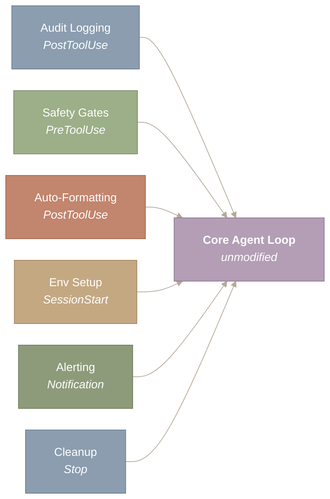
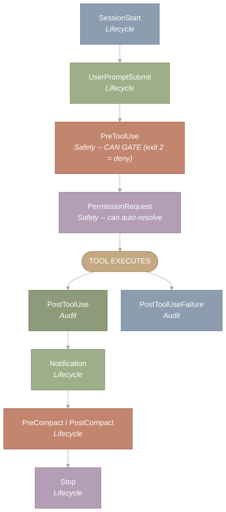
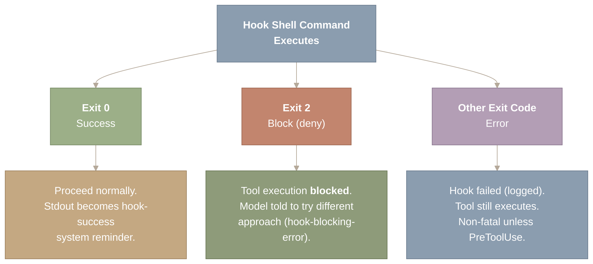
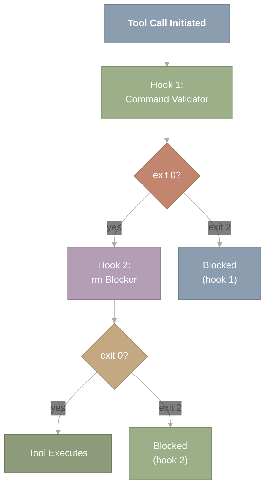
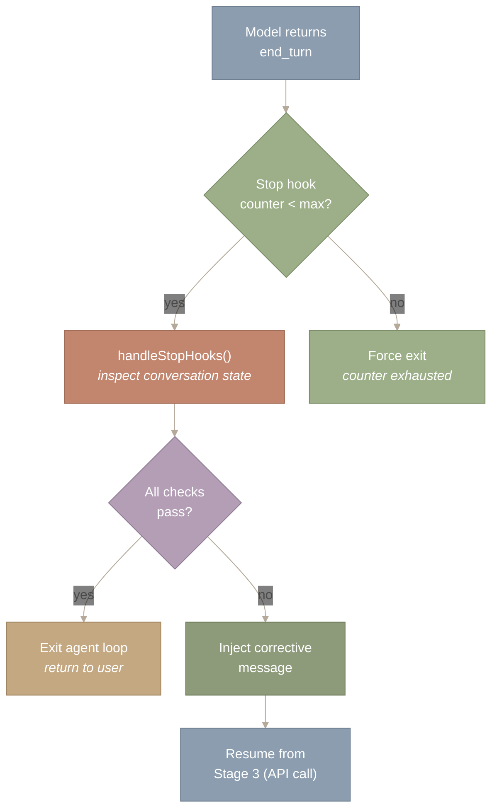
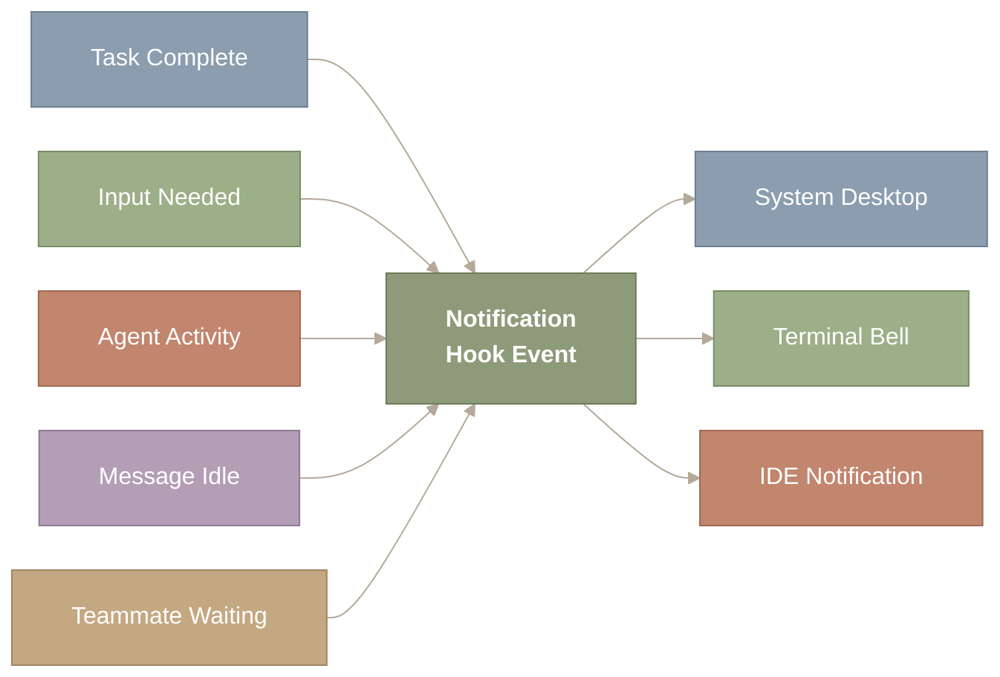

> 译者说明：本文按 2026-08-12 抓取的网页完整翻译，保留原始章节、代码、表格、Mermaid 图源、图注和链接。原文分析基于 Claude Code v2.1.88 的 Source Map；文件行数、工具数量、阈值和实现细节属于该页面快照，不应直接外推到其他版本。

# Hooks 与生命周期事件

## 引言：为什么生命周期 Hook 很重要

如何在不 fork 代码库的情况下，对一个 AI agent 强制施加不变量？一家企业需要阻止对生产数据库的写入；一个团队需要对每次文件写入自动做格式化；一个独立开发者需要记录每一条 shell 命令。这些都是横切关注点（cross-cutting concerns）——它们横跨每一个子系统，需要可组合、可配置，并且独立于 agent 的核心代码之外。

Claude Code 的 Hook 就是为此而生。你不必修改工具执行代码来加入格式化、日志或拦截逻辑，而是配置在生命周期事件上触发的 Hook。每个 Hook 就是一条 shell 命令——任何语言、任何工具都可以——它通过环境变量接收上下文，可以观察、修改或阻断这次动作。这个设计把 Claude Code 从一个行为固定的二进制程序，变成了一条可配置的执行流水线：每一个重要事件都可以被拦截。



*图 1：把面向切面编程（aspect-oriented programming）应用到 AI agent 上的 Hook。六类横切关注点——审计日志（PostToolUse）、安全闸门（PreToolUse）、自动格式化（PostToolUse）、环境初始化（SessionStart）、告警（Notification）和清理（Stop）——挂载到核心 agent loop 上，而不修改它的任何代码。这种分离意味着无论配置了多少 Hook，Claude Code 的工具执行逻辑都保持不变，既保住了可测试性，又允许任意定制。*

图中央是保持不变的 Core Agent Loop（核心 agent 循环）。六个横切关注点向它汇聚，各自标注了所挂载的生命周期事件：Audit Logging 和 Auto-Formatting 使用 PostToolUse，Safety Gates 使用 PreToolUse，Env Setup 使用 SessionStart，Alerting 使用 Notification，Cleanup 使用 Stop。箭头全部指向核心，表示 Hook 是在观察或拦截 agent——它们不改变 agent 的内部逻辑。

PreToolUse/PostToolUse 这一对恰好就是企业级 Java 里的 Intercepting Filter（拦截过滤器）模式——一串过滤器在核心处理器之前和之后处理请求。在 Spring 里它是 `HandlerInterceptor.preHandle()` / `postHandle()`；在 Express.js 里它是中间件（middleware）。同一个模式，换了个领域。

**本文涉及的源文件：**

| 文件 | 用途 | 规模 |
| --- | --- | --- |
| `src/utils/hooks/hookEvents.ts` | Hook 事件类型定义（27 个生命周期事件） | ~200 行 |
| `src/utils/hooks/hookHelpers.ts` | Hook 执行辅助函数（spawn、超时、结果解析） | ~300 行 |
| `src/utils/hooks/hooksConfigManager.ts` | Hook 配置加载与 matcher 分发 | ~400 行 |
| `src/utils/hooks/sessionHooks.ts` | 会话级 Hook 编排 | ~250 行 |
| `src/utils/hooks/postSamplingHooks.ts` | 采样后 Hook 集成（stop hook） | ~200 行 |
| `src/utils/hooks/execAgentHook.ts` | 由 agent 触发的 Hook 执行 | ~150 行 |
| `src/services/notifier.ts` | 通知投递（桌面通知、终端响铃、IDE） | ~300 行 |

---

## 核心 Hook 事件

Claude Code 暴露了超过 25 个生命周期事件（完整列表见[附录](https://y-agent.github.io/inside-claude-code/11-hooks-lifecycle.html#appendix-full-sdk-hook-surface)）。其中 10 个在运维上最重要——也就是你实际会去配置 Hook 的那些——在 agent 执行过程中的特定时刻触发。它们分为三类：**安全关键（safety-critical）**事件，可以阻断执行；**审计（audit）**事件，只观察不阻断；以及**生命周期（lifecycle）**事件，负责管理会话边界。



*图 2：一次典型 agent 回合中 10 个核心生命周期事件的时间线，按类别组织。安全关键事件（PreToolUse、PermissionRequest）位于工具执行之前，可以通过退出码 2 阻断执行。审计事件（PostToolUse、PostToolUseFailure）位于执行之后，观察结果但不改变结果。生命周期事件（SessionStart、UserPromptSubmit、PreCompact、PostCompact、Notification、Stop）标记会话边界和上下文管理的节点。只有安全关键事件能改变执行路径。*

从顶部的 SessionStart 开始，沿着箭头向下走完一个 agent 回合的时间线。安全关键事件（PreToolUse、PermissionRequest）出现在中央的 TOOL EXECUTES 节点之前，是唯一能改变执行路径的事件。工具执行之后流程分叉：成功进入 PostToolUse，失败进入 PostToolUseFailure。其余生命周期事件（Notification、PreCompact/PostCompact、Stop）发生在会话收尾阶段。

下表是这 10 个核心事件的速查表：

| 事件 | 类别 | 能否阻断？ | 触发时机 | 可用上下文 |
| --- | --- | --- | --- | --- |
| **SessionStart** | 生命周期 | 否 | 会话开始 | 会话 ID、工作目录 |
| **UserPromptSubmit** | 生命周期 | 否 | 用户提交 prompt | prompt 文本、会话状态 |
| **PreToolUse** | 安全 | **能**（退出码 2） | 任何工具执行之前 | 工具名、输入参数 |
| **PermissionRequest** | 安全 | **能**（自动裁决） | 权限检查被触发 | 工具、权限级别、参数 |
| **PostToolUse** | 审计 | 否 | 工具成功之后 | 工具名、输入、输出 |
| **PostToolUseFailure** | 审计 | 否 | 工具失败之后 | 工具名、输入、错误 |
| **PreCompact** | 生命周期 | 否 | 上下文压缩之前 | Token 数、消息数 |
| **PostCompact** | 生命周期 | 否 | 上下文压缩之后 | 新的 Token 数、被移除的数量 |
| **Notification** | 生命周期 | 否 | agent 发送通知 | 通知文本、类型 |
| **Stop** | 生命周期 | 否 | 会话结束 | 会话 ID、回合数 |

关键区别在于：只有 **PreToolUse** 和 **PermissionRequest** 能改变执行路径。一个返回退出码 2 的 PreToolUse Hook 会彻底阻断该工具——模型会被告知动作被拒绝，必须换一种做法。PermissionRequest Hook 可以自动裁决权限检查，跳过向用户弹出的确认。其余所有事件都是观察性的：Hook 照常运行，但它的结果不会改变接下来发生的事。

**System Prompt 是怎么向模型描述 Hook 的。** System Prompt（系统提示词）里有一个 Hook 小节，把 Hook 定性为用户控制的拦截器：

> *“用户可以在设置中配置 ‘hooks’，即响应工具调用等事件而执行的 shell 命令。把来自 Hook 的反馈——包括 `<user-prompt-submit-hook>`——当作用户本人的意见。如果你被某个 Hook 阻断，判断自己能否根据阻断信息调整行为；如果不能，请让用户检查他们的 Hook 配置。”*

这个定性很重要：模型把 Hook 的输出去当作用户反馈，而不是系统噪音。当一个 PreToolUse Hook 阻断了一次 `Write` 调用并给出“`src/generated/` 下的文件是自动生成的——不要编辑”时，模型对它的处理方式和用户亲手敲下这条指令完全一样。这正是 Hook 能成为有效行为约束的原因——它们以用户的权威在说话。

---

## Hook 配置：settings.json 格式

Hook 在 `settings.json` 中配置，采用基于 matcher（匹配器）的分发机制。每个 Hook 定义要指定一个事件、一个可选的 matcher（用于过滤哪些调用会触发它），以及一条或多条要执行的 shell 命令。

```
{
  "hooks": {
    "PreToolUse": [
      {
        "matcher": { "tool": "Bash" },
        "hooks": [
          {
            "type": "command",
            "command": "python3 /path/to/validate_bash.py"
          }
        ]
      }
    ],
    "PostToolUse": [
      {
        "matcher": { "tool": "Write" },
        "hooks": [
          {
            "type": "command",
            "command": "prettier --write $FILE_PATH"
          }
        ]
      }
    ],
    "SessionStart": [
      {
        "hooks": [
          {
            "type": "command",
            "command": "echo 'Session started' >> /tmp/claude-audit.log"
          }
        ]
      }
    ]
  }
}
```

Matcher 在三个维度上做过滤：

- **工具名**（`"tool": "Bash"`）——匹配某个具体工具。
- **命令模式**（`"command": "rm *"`）——匹配包含特定模式的 shell 命令。
- **文件模式**（`"file": "*.py"`）——匹配对特定路径的文件操作。

不指定 matcher 时，该 Hook 对此事件的每一次调用都会触发。同一事件上的多个 Hook 按顺序执行——一个在 PreToolUse 上失败的 Hook 会在后续 Hook 运行之前就阻断执行。这种顺序执行保证了确定性行为：Hook 之间是流水线式的组合，而不是并发处理器。

配置可以放在三个位置，级联语义与 Claude Code 其余设置一致：

1. **项目级**（`.claude/settings.json`）——作用于某个特定仓库。
2. **用户级**（`~/.claude/settings.json`）——作用于该用户的所有项目。
3. **企业级**（托管策略）——作用于整个组织。

对于同一事件和同一 matcher，项目级 Hook 覆盖用户级 Hook。这意味着团队可以在仓库里定义标准 Hook，而开发者个人可以添加自己的 Hook，两者不会冲突。

---

## 执行模型：Shell 命令与退出码语义

Hook 以子进程中的 shell 命令形式执行。Hook 通过**环境变量**接收上下文——工具名称、输入参数、文件路径和会话元数据都可以作为 `$TOOL_NAME`、`$TOOL_INPUT`、`$FILE_PATH` 及类似的变量获取。Hook 的 stdout 会被捕获，并可以被回传给模型。

退出码决定执行结果：



*图 3：Hook 退出码语义，展示了任意一次 Hook 调用的三种可能结果。退出码 0 表示批准，工具正常继续执行，stdout 会被捕获为一条 system reminder。退出码 2 表示有意拒绝，会阻断工具执行，模型会收到一条 hook-blocking-error 消息说明原因。其他任何退出码表示 Hook 脚本本身出错，这种情况会被记录，但不一定阻断执行。选择退出码 2（而不是 1）来表示阻断是有意为之的：它避免了那些以退出码 1 崩溃的脚本造成误报。*

图中，Hook shell 命令从最顶端开始执行。三个分支向外展开，对应三种可能的退出码。左侧分支（退出码 0）进入正常运行，stdout 被捕获为 system reminder。中间分支（退出码 2）导致工具被阻断，模型被告知换一种方式尝试。右侧分支（其他任何退出码）表示 Hook 脚本本身出错，会被记录，但不一定中断执行。最关键的区别在于，只有退出码 2 被视为有意拒绝。

- **退出码 0**——成功。Hook 运行并批准了该操作（或观察了该操作且没有异议）。对 PreToolUse 来说，这意味着"继续执行"。对 PostToolUse 来说，这意味着"观察已记录"。
- **退出码 2**——阻断。该操作被拒绝。只对 PreToolUse 和 PermissionRequest 有意义。工具不会执行，模型会收到一条 `hook-blocking-error` system reminder，说明该操作已被阻断。
- **其他任何退出码**——错误。Hook 本身执行失败（崩溃、超时、配置错误）。对 PreToolUse 来说，行为取决于失败模式：硬失败可能会阻断工具；软失败可能只记录日志然后继续。

选择退出码 2（而不是退出码 1）来表示阻断是有意为之的。退出码 1 是 Unix 中通用的"出了点问题"信号。退出码 2 按照惯例用于"shell 内建命令使用不当"——这是一个不太常见的退出码，崩溃的 Hook 脚本不太会意外产生它。这减少了误报：一个抛出未处理异常的 Python 脚本以退出码 1 退出（错误，而非有意阻断），而一个有意决定拒绝某操作的脚本以退出码 2 退出。

---

## 反馈回路：System Reminder

让 Hook 对模型有用——而不仅仅对人类有用——的关键细节在于：Hook 的结果会通过 system reminder 回传到对话中。没有这个反馈，Hook 对模型来说就是不可见的。模型不会知道自己的 Write 之后跑了一遍 prettier，也不会知道自己的 Bash 命令被一个安全 Hook 拦截了。

四种 reminder 类型用来传达发生了什么：

| Reminder 类型 | 含义 | 模型行为 |
| --- | --- | --- |
| `hook-success` | Hook 运行并批准 | 正常继续 |
| `hook-blocking-error` | Hook 拒绝了该操作 | 换一种方式尝试 |
| `hook-stopped-continuation` | Hook 中止了会话 | 停止并报告 |
| `hook-additional-context` | Hook 提供了额外信息 | 纳入推理过程 |

`hook-additional-context` 类型尤其强大。一个 PostToolUse Hook 可以对模型刚写入的文件运行 linter，并把 linter 的输出作为额外上下文注入。模型随后在下一轮就能看到这些 lint 错误并进行修复——形成了一个无需任何人工干预的紧密自动反馈回路。这和每次提交都运行检查的 CI/CD 流水线是同一种模式，只不过这里的反馈回路发生在单个 Agent 会话内部，而不是跨多次 git push。

---

## 使用场景：Lint、日志记录与自定义权限闸门

抽象架构要通过使用场景才能落地。下面的例子展示了三种主要模式：**强制执行**（阻断不安全的操作）、**自动化**（运行副作用操作）和**审计**（记录发生了什么）。

### 强制执行：阻断生产数据库写入

```
{
  "hooks": {
    "PreToolUse": [{
      "matcher": { "tool": "Bash", "command": "*production*" },
      "hooks": [{
        "type": "command",
        "command": "echo 'BLOCKED: production commands are not allowed' && exit 2"
      }]
    }]
  }
}
```

任何包含"production"的 Bash 命令都会在执行前被阻断。模型收到阻断消息，并被告知换一种方式尝试。这是最简单的策略执行形式——对命令字符串做模式匹配，然后硬性拒绝。

### 自动化：写入后自动格式化

```
{
  "hooks": {
    "PostToolUse": [{
      "matcher": { "tool": "Write", "file": "*.ts" },
      "hooks": [{
        "type": "command",
        "command": "prettier --write $FILE_PATH && eslint --fix $FILE_PATH"
      }]
    }]
  }
}
```

每次写入 TypeScript 文件后，都会接着执行 Prettier 格式化和 ESLint 自动修复。模型不需要知道这些工具的存在，也不需要记得去运行它们。无论模型产出的内容是什么，Hook 都能保证一致的格式。这是装饰器模式（Decorator pattern）在工具层面的应用：Write 工具的行为被透明地增强，而其接口没有改变。

### 审计：记录所有工具调用

```
{
  "hooks": {
    "PostToolUse": [{
      "hooks": [{
        "type": "command",
        "command": "echo \"$(date -u) | $TOOL_NAME | $SESSION_ID\" >> /var/log/claude-audit.log"
      }]
    }]
  }
}
```

每一次工具调用都会连同时间戳、工具名称和会话 ID 一起被记录。没有 matcher 意味着该 Hook 对每个工具都会触发。这会为 Agent 的操作创建一份完整的审计追踪记录——这对企业合规和调试至关重要。

### 组合：同一事件上的多个 Hook

Hook 可以自然地组合。单个 PreToolUse 事件可以配置多个带不同 matcher 的 Hook 条目，它们按顺序执行：

```
{
  "hooks": {
    "PreToolUse": [
      {
        "matcher": { "tool": "Bash" },
        "hooks": [{ "type": "command", "command": "python3 validate_commands.py" }]
      },
      {
        "matcher": { "tool": "Bash", "command": "rm *" },
        "hooks": [{ "type": "command", "command": "echo 'BLOCKED: rm not allowed' && exit 2" }]
      }
    ]
  }
}
```

第一个 Hook 通过一个 Python 脚本校验所有 Bash 命令。第二个 Hook 专门阻断任何 `rm` 命令。如果第一个 Hook 通过，第二个仍然会运行。只要其中任何一个返回退出码 2，工具就会被阻断。这种顺序组合与 Web 框架中中间件栈的工作方式一致：每一层都可以放行、修改或拒绝请求。



*图 4：PreToolUse 事件中，Hook 组合表现为一条顺序流水线。两个带不同 matcher 的 Hook 按顺序执行：Hook 1（命令校验器）先运行，如果它通过（退出码 0），接着运行 Hook 2（rm 阻断器）。只要任意一个 Hook 返回退出码 2，执行就立即停止，工具被阻断。这种顺序组合保证了确定性的行为，与 Web 框架中的中间件栈一致——每一层都可以放行、修改或拒绝请求。*

图中，一次工具调用从最顶端发起。流程先经过 Hook 1（命令校验器），然后遇到一个菱形判断点：如果是退出码 0，执行继续进入 Hook 2（rm 阻断器）；如果是退出码 2，工具立即被阻断。Hook 2 遵循同样的模式——退出码 0 则进入工具执行，退出码 2 则阻断。要点在于这种顺序的、短路式的特性：任何返回退出码 2 的 Hook 都会中止整条流水线，后续的 Hook 不会运行。

---

## Stop Hook——Agent Loop 的收敛守卫

Stop hook 是 hooks 架构中的一个特例：它们在模型发出 `end_turn` 信号时触发，但发生在 agent loop 真正退出之前。它们的职责是拦截过早终止——即模型*认为*自己已经完成、但实际上留下了未完成工作的情况。

这一机制位于 agent loop 的 `CHECK STOP REASON` 状态中（参见[第一部分第 2 节：端到端工作流程](https://y-agent.github.io/inside-claude-code/01-end-to-end-workflow.html)）。当模型的响应带有 `stop_reason: "end_turn"` 时，loop 会在把控制权交还给用户之前调用 `handleStopHooks()`。Stop hook 处理器检查对话状态，并决定模型是否应该继续工作。



*图 5：Stop hook 决策流程。当模型发出 end_turn 信号时，stop hook 处理器检查对话状态——包括文件编辑之后是否运行了测试、原始任务是否得到处理、模型的最后一条消息是否是合理的完成标志。任何一项检查失败，都会注入一条纠正消息，loop 从 API 调用阶段恢复执行。一个计数器限制了每个会话中 stop hook 的触发次数，防止收敛守卫自身发生发散。*

图中从顶部模型返回 end_turn 开始。第一个菱形判断 stop hook 计数器是否已超限——如果是，loop 强制退出，以防无限循环。如果计数器低于上限，handleStopHooks() 检查对话状态。所有检查通过时，agent 正常退出；任何一项检查失败（例如修改了文件但没有运行测试）时，注入一条纠正消息，loop 从 API 调用阶段恢复执行。由此形成一个有上界的自我纠正循环。

**Stop hook 检查什么。** `handleStopHooks()` 函数在对话历史中寻找表明工作未完成的模式：

- **未经测试的编辑。** 如果模型修改了源文件（通过 Edit 或 Write），但从未调用 Bash 运行测试，stop hook 会注入一条纠正消息：*“You modified source files but did not run the test suite. Please verify your changes.”*（你修改了源文件但没有运行测试套件，请验证你的改动。）这是最常见的 stop hook 触发原因。
- **未验证的构建。** 如果模型修改了配置文件（package.json、tsconfig.json、Makefile）但从未运行构建命令，hook 会标记出这个缺口。
- **任务未完成的信号。** `stopHookResult.preventContinuation` 标志让 hook 可以显式阻止 loop 退出，并返回一个原因字符串（例如 `"stop_hook_prevented"`），该字符串会被记录下来用于调试。

**计数器守卫。** Stop hook 自身也可能导致发散——模型运行测试，测试失败，模型修改代码，发出 `end_turn` 信号，stop hook 再次触发，循环往复。为防止这种情况，一个计数器记录当前会话中 stop hook 的触发次数。达到上限后，无论 hook 的结果如何，loop 都会退出。这是一个元终止守卫：给终止条件本身再加一个终止条件。

---

## 通知系统——跨通道告警

Notification 生命周期事件是核心 hook 事件之一，但在它背后是一整套通知子系统，包含五种触发类型、可配置的投递通道以及空闲检测逻辑。

通知解决的是一个具体的用户体验问题：当 Claude Code 在后台运行时——比如一个子 agent 正在编译项目，或者一个 teammate 在等待输入——用户如何知道有事需要关注？答案是一条可配置的通知管线：它通过 `Notification` hook 事件触发，再通过用户偏好的通道投递告警。



*图 6：通知流程，展示五种触发类型（任务完成、需要输入、agent 活动、消息空闲、teammate 等待）如何汇聚到 Notification hook 事件，再分发到三个可配置的投递通道（系统桌面、终端响铃、IDE 通知）。preferredNotifChannel 设置控制路由，取值为 'auto' 时根据执行环境选择最佳通道。由于通知通过 hook 分发，用户可以拦截它们，自定义路由到 Slack、邮件或其他服务。*

图中左侧的五种触发类型（任务完成、需要输入、Agent 活动、消息空闲、Teammate 等待）全部汇聚到中央的 Notification Hook 事件枢纽。从枢纽出发，箭头分发到右侧的三个投递通道（系统桌面、终端响铃、IDE 通知）。整体结构是一个漏斗：多个输入信号经由一个 hook 事件归一化，再派发到用户偏好的输出通道。

### 五种通知触发类型

每种触发类型对应一种不同的需要用户注意的场景：

| 触发类型 | 设置项 | 默认值 | 触发时机 |
| --- | --- | --- | --- |
| **任务完成** | `taskCompleteNotifEnabled` | `true` | 后台子 agent 执行完毕 |
| **需要输入** | `inputNeededNotifEnabled` | `true` | Agent 需要用户输入（权限确认、提问） |
| **Agent 活动** | `agentPushNotifEnabled` | `true` | Teammate 空闲摘要、团队协调事件 |
| **消息空闲** | `messageIdleNotifThresholdMs` | `60000`（1 分钟） | 超过设定阈值没有用户交互 |
| **Teammate 等待** | （通过 agent 推送） | `true` | 持久运行的 teammate 进入空闲，等待新任务 |

空闲通知在实际使用中最有意思。`messageIdleNotifThresholdMs` 设置（默认 60 秒）在 agent 结束响应时启动一个计时器。如果用户在阈值时间内没有回应，就触发一条通知。它覆盖了一个常见场景：用户切到另一个窗口，忘记 Claude Code 还在等待，好几分钟就这样过去。通知把他们拉回来。

### 投递通道

`preferredNotifChannel` 设置（默认：`"auto"`）控制通知如何送达用户：

- **系统桌面**——原生操作系统通知（macOS 通知中心、Linux 上的 `notify-send`）。
- **终端响铃**——`\a` 字符，触发终端模拟器的响铃行为（通常表现为 Dock 图标角标或标题闪烁）。
- **IDE 通知**——通过 VS Code 或 JetBrains 扩展的通知 API 投递。
- **Auto（自动）**——系统根据上下文选择最佳通道：在扩展内运行时用 IDE 通知，在独立终端中运行时用系统桌面通知。

### Hook 集成

由于通知通过 `Notification` hook 事件分发，用户可以拦截并定制它们。为 `Notification` 事件配置的 hook 会以环境变量的形式收到通知文本和类型。这使得以下做法成为可能：

- **自定义路由**——把通知转发到 Slack、邮件或某个 webhook。
- **过滤**——屏蔽某些触发类型的通知。
- **增强**——给通知消息添加项目上下文或链接。

```
{
  "hooks": {
    "Notification": [{
      "hooks": [{
        "type": "command",
        "command": "curl -X POST $SLACK_WEBHOOK -d '{\"text\": \"Claude Code: $NOTIFICATION_TEXT\"}'"
      }]
    }]
  }
}
```

这与其他 hook 事件使用的是同一套可扩展模型——带环境变量上下文的 shell 命令——只是应用在了告警层，而不是执行层。

**通知系统的提醒注入。** 通知触发时，系统会以 `<system-reminder>` 标签的形式把提醒注入对话。五种触发类型都会产生通知：任务完成、需要输入、agent 活动、消息空闲（默认 60 秒后）以及 teammate 等待。可用的投递通道有三个：系统桌面通知、终端响铃和 IDE 通知。`preferredNotifChannel` 设置（默认：`"auto"`）选择通道，而各事件的独立设置（`taskCompleteNotifEnabled`、`inputNeededNotifEnabled`、`agentPushNotifEnabled`）提供细粒度控制。

---

## Hooks 在整体扩展架构中的位置

在 Claude Code 的扩展机制中，Hooks 占据一个独特的位置。MCP 增加新能力（见 [Part VI.1](https://y-agent.github.io/inside-claude-code/10-model-context-protocol.html)），Skills 修改推理过程（见 [Part VI.2](https://y-agent.github.io/inside-claude-code/12-skills-system.html)），插件把整套机制组合起来（见 [Part VI.3](https://y-agent.github.io/inside-claude-code/13-plugin-architecture.html)），而 Hooks 是整个系统中唯一的强制执行机制。

| 机制 | 作用 | 能否阻断？ |
| --- | --- | --- |
| MCP | 增加外部工具能力 | 否 |
| Skills | 通过 prompt 注入修改 Agent 行为 | 否 |
| 自定义 Agents | 创建工具受限的隔离角色 | 否 |
| Slash Commands | 让用户直接控制 | 否 |
| **Hooks** | **拦截执行管线** | **是（exit 2）** |

这种独特性正是 Hooks 对企业部署至关重要的原因。Skills 可以*建议* Agent 避免某些动作，MCP 可以*提供*更安全的替代方案，但只有 Hooks 能*强制*守住不变量。如果你的策略规定"绝不删除生产数据"，Skill 可以请求模型遵守，而 Hook 可以保证这一点。引导与强制的区别，就是建议与法律的区别。

Hooks 也能与 MCP 工具无缝配合。配置为匹配 `mcp__github__*` 的 Hook 会拦截每一次 GitHub MCP 工具调用，对其施加与内置工具相同的审计日志和策略执行。这是因为 MCP 工具在工具注册表中是一等公民——Hooks 看不出 `Bash` 和 `mcp__github__create_issue` 之间有任何区别。

---

## 总结

Claude Code 的 Hook 系统揭示了若干设计原则，适用于任何需要用户可配置行为修改的系统。

**Hooks 是 shell 命令，不是插件。** 这是一个刻意的简化选择。任何语言都可以充当 Hook 处理器，一行 bash 脚本和一个复杂的 Python 校验器同样可行。代价是在能力与可移植性之间取舍——shell 命令随处可用，但缺乏插件 SDK 的类型安全和可组合性。对于一个必须接入任意开发者工作流的 AI Agent 来说，shell 命令的普适性胜过了类型化 API 的优雅。

**退出码语义必须无歧义。** 用退出码 2 表示"阻断"（而不是退出码 1），可以防止脚本崩溃造成误判。在一个误判就意味着 Agent 无法使用工具的系统中，这个区分很重要。退出码方案中的每一条约定，都是为了把 Hook 意外阻断合法动作的风险降到最低。

**向模型反馈是不可省略的。** 一个只在幕后运作的 Hook 系统——不加解释地阻断工具、不做说明地运行格式化程序——会让模型搞不清自己的动作为什么成功或失败。System Reminder 闭合了这个回路：模型知道发生了什么、为什么发生、接下来该做什么。这把 Hooks 从面向人类的策略机制，变成了面向模型的协作协议。

**唯一的强制执行点就是最重要的那个。** 在 Claude Code 的六种扩展机制中，Hooks 是唯一能阻止动作发生的机制。把强制执行集中到单一、定义清晰的系统中是刻意的：审计当前生效的约束时只需看一个地方，策略定义只有一种格式，需要推理的执行模型也只有一个。把强制执行分散到多个机制中，只会让系统更难审计、更容易被绕过。

---

---

## 附录：Hook 事件完整列表

上文详细介绍的 10 个事件是实际运维中最重要的，但完整的 SDK 定义了 27 种 Hook 事件类型。许多额外事件用于内部的可观测性、协调和配置追踪。Hook 事件类型定义在 `src/utils/hooks/hookEvents.ts` 中。

| # | 事件 | 类别 | 能否阻断？ | 实现 | 说明 |
| --- | --- | --- | --- | --- | --- |
| 1 | **PreToolUse** | 安全 | 是（exit 2） | `src/utils/hooks/hookHelpers.ts` | 每次工具调用前触发 |
| 2 | **PostToolUse** | 审计 | 否 | `src/utils/hooks/hookHelpers.ts` | 工具成功后触发 |
| 3 | **PostToolUseFailure** | 审计 | 否 | `src/utils/hooks/hookHelpers.ts` | 工具报错后触发 |
| 4 | **Notification** | 生命周期 | 否 | `src/services/notifier.ts` | 提醒投递（桌面/响铃/IDE） |
| 5 | **UserPromptSubmit** | 生命周期 | 是 | `src/utils/hooks/execPromptHook.ts` | 用户提交 prompt |
| 6 | **SessionStart** | 生命周期 | 否 | `src/utils/hooks/sessionHooks.ts` | 会话开始 |
| 7 | **SessionEnd** | 生命周期 | 否 | `src/utils/hooks/sessionHooks.ts` | 会话结束 |
| 8 | **Stop** | 生命周期 | 否 | `src/utils/hooks/postSamplingHooks.ts` | Agent 停止（end_turn） |
| 9 | **StopFailure** | 生命周期 | 否 | `src/utils/hooks/postSamplingHooks.ts` | Agent 未能正常停止 |
| 10 | **SubagentStart** | Agent | 否 | `src/utils/hooks/execAgentHook.ts` | 子 Agent 启动 |
| 11 | **SubagentStop** | Agent | 否 | `src/utils/hooks/execAgentHook.ts` | 子 Agent 完成 |
| 12 | **PreCompact** | 生命周期 | 否 | `src/services/compact/compact.ts` | 上下文压缩之前 |
| 13 | **PostCompact** | 生命周期 | 否 | `src/services/compact/compact.ts` | 上下文压缩之后 |
| 14 | **PermissionRequest** | 安全 | 是 | `src/hooks/useCanUseTool.tsx` | 可自动处理权限请求 |
| 15 | **PermissionDenied** | 安全 | 否 | `src/hooks/useCanUseTool.tsx` | 权限被拒绝 |
| 16 | **Setup** | 生命周期 | 否 | `src/utils/hooks/sessionHooks.ts` | 初始设置阶段 |
| 17 | **TeammateIdle** | Agent | 否 | `src/tools/AgentTool/runAgent.ts` | 持久队友进入空闲 |
| 18 | **TaskCreated** | Agent | 否 | `src/tools/TaskCreateTool/` | 后台任务创建 |
| 19 | **TaskCompleted** | Agent | 否 | `src/tools/TaskStopTool/` | 后台任务完成 |
| 20 | **Elicitation** | 交互 | 否 | `src/tools/AskUserQuestionTool/` | Agent 提出澄清问题 |
| 21 | **ElicitationResult** | 交互 | 否 | `src/tools/AskUserQuestionTool/` | 用户回应澄清请求 |
| 22 | **ConfigChange** | 配置 | 否 | `src/utils/settings/settings.ts` | 某项设置被修改 |
| 23 | **WorktreeCreate** | Git | 否 | `src/tools/EnterWorktreeTool/` | Git worktree 创建 |
| 24 | **WorktreeRemove** | Git | 否 | `src/tools/ExitWorktreeTool/` | Git worktree 移除 |
| 25 | **InstructionsLoaded** | 生命周期 | 否 | `src/utils/claudemd.ts` | CLAUDE.md / 指令解析完成 |
| 26 | **CwdChanged** | 生命周期 | 否 | `src/utils/hooks/hookHelpers.ts` | 工作目录变更 |
| 27 | **FileChanged** | 文件系统 | 否 | `src/utils/hooks/fileChangedWatcher.ts` | 被监视的文件在磁盘上发生变化 |

大多数 Hook 配置只会用到本文正文中介绍的 10 个核心事件。额外的事件可用于高级可观测性、CI/CD 集成和多 Agent 协调工作流。

---

*本系列下一篇：[Part VI.2: Skills 系统](https://y-agent.github.io/inside-claude-code/12-skills-system.html)——SKILL.md 文件如何把领域专业知识注入 System Prompt，把通用 Agent 变成专用 Agent。*
