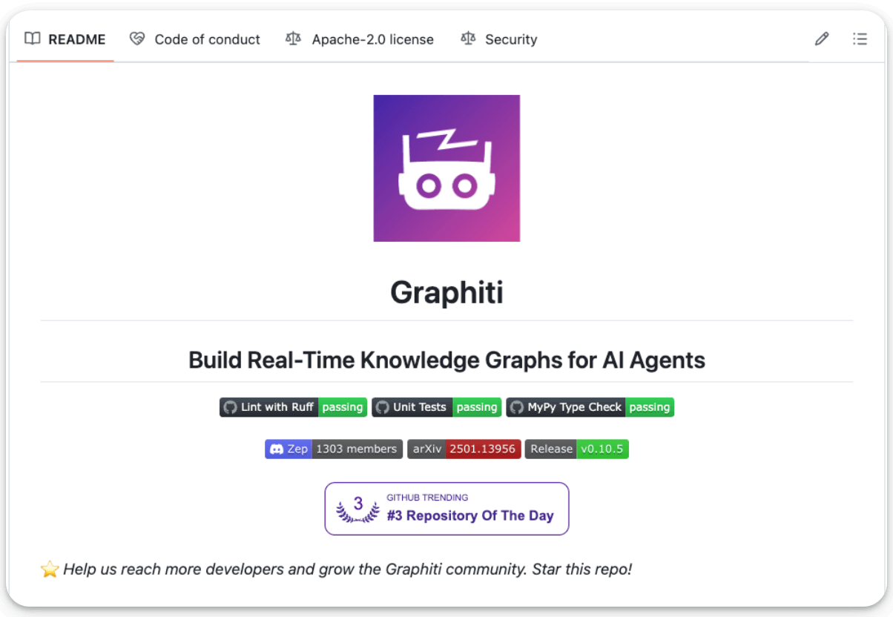
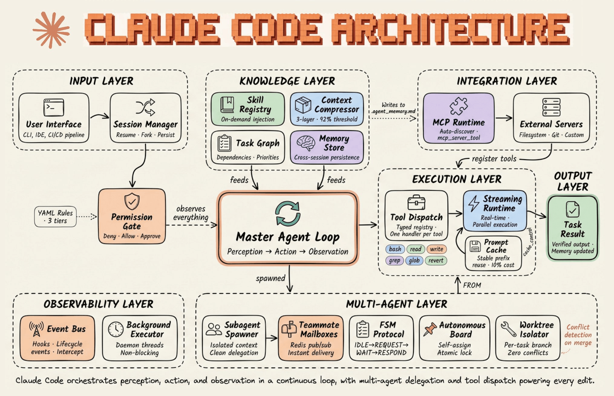
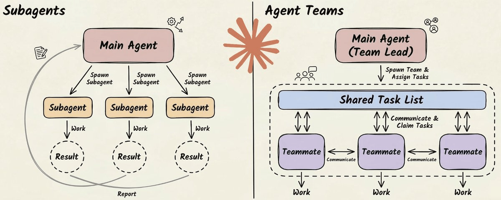
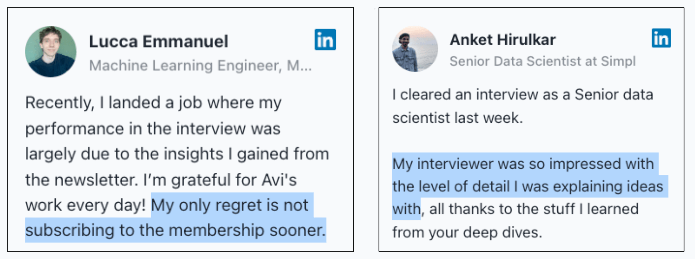
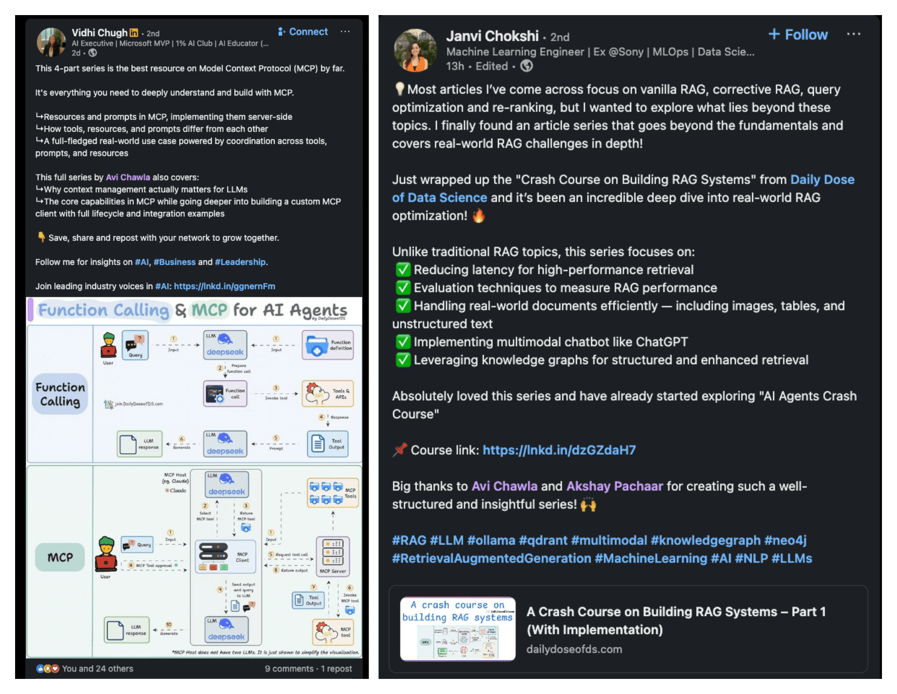

# Claude Code's Architecture, Explained Visually!

- Author: Avi Chawla
- Source: <https://blog.dailydoseofds.com/p/claude-codes-architecture-explained>
- Retrieved: 2026-08-02

### **[Build Real-Time Knowledge Graphs for AI Agents](https://github.com/getzep/graphiti)**

RAG can’t keep up with real-time data.

**[Graphiti](https://github.com/getzep/graphiti)**builds live, bi-temporal knowledge graphs so your AI agents always reason on the freshest facts. Supports semantic, keyword, and graph-based search.

100% open-source with 26,000 stars.

**[GitHub repo (don’t forget to star the repo) →](https://github.com/getzep/graphiti)**

[Graphiti on GitHub](https://github.com/getzep/graphiti)

---

### [Claude Code’s architecture, explained visually!](https://www.dailydoseofds.com/p/the-anatomy-of-an-agent-harness/)

Claude Code is a lot more than a CLI that invokes the Claude models.

The actual system has six layers, and the model is just one node inside the loop. The diagram breaks down every component:

𝗜𝗻𝗽𝘂𝘁 𝗟𝗮𝘆𝗲𝗿 handles session management, permission gating, and YAML-based trust tiers before anything reaches the model.

𝗞𝗻𝗼𝘄𝗹𝗲𝗱𝗴𝗲 𝗟𝗮𝘆𝗲𝗿 holds the skill registry, context compressor, task graph, and cross-session memory store. This is where harness intelligence lives outside the weights.

The context compressor is a 5-layer cascade that kicks in when the context window hits roughly 95% capacity. It doesn’t summarize your conversation the way ChatGPT does. Instead, it runs structured extraction on file paths, code snippets, and error histories while pruning redundant tool outputs. The goal is to keep the context usable, not just smaller.

𝗘𝘅𝗲𝗰𝘂𝘁𝗶𝗼𝗻 𝗟𝗮𝘆𝗲𝗿 runs tool dispatch through a typed registry with one handler per tool, like bash, read, write, grep, glob, and revert.

The streaming runtime handles parallel execution, and the prompt cache reuses stable prefixes at roughly 10% of the original cost.

𝗜𝗻𝘁𝗲𝗴𝗿𝗮𝘁𝗶𝗼𝗻 𝗟𝗮𝘆𝗲𝗿 connects the MCP runtime to external servers (filesystem, git, custom). Tools register inward, and memory writes outward to a markdown file (agent_memory.md) that persists across sessions.

𝗠𝘂𝗹𝘁𝗶-𝗔𝗴𝗲𝗻𝘁 𝗟𝗮𝘆𝗲𝗿 is the most underappreciated piece, and it works very differently from what most people assume.

Claude Code supports two levels of parallelism: subagents and agent teams (**[covered here in detail](https://www.dailydoseofds.com/p/claude-subagents-vs-agent-teams/)**).

- Subagents are lightweight workers that run inside your session. They get their own context window, do a focused task (search the codebase, explore a file tree), and return results to the parent. They can’t talk to each other, and they can’t spawn their own subagents. It’s a strict parent-child hierarchy.
- Agent teams go further. One session acts as a team lead, and it spawns independent teammates, each running as a full Claude Code instance with its own context window. The team lead breaks a task into subtasks, assigns them, and monitors progress.

The coordination happens through two mechanisms → a shared task list (JSON files on disk) and a mailbox system for peer-to-peer messaging.

Each teammate gets git worktree isolation. It’s a separate working directory with its own branch, sharing the same repository history.

This means agents can write to overlapping parts of the codebase without file conflicts. When they finish, worktrees with no changes are cleaned up automatically. Worktrees with changes persist for human review before merging.

𝗢𝗯𝘀𝗲𝗿𝘃𝗮𝗯𝗶𝗹𝗶𝘁𝘆 𝗟𝗮𝘆𝗲𝗿 wraps everything. An event bus with lifecycle hooks logs all tool calls and messages, creating a complete audit trail of the agent’s actions and decisions.

Background executors run daemon threads non-blocking, so observability never stalls the main loop.

---

The master agent loop sits at the center of all six layers, and it’s deliberately simple. It assembles context, calls the model, receives a tool request, executes it, feeds the result back in, and repeats. Every iteration is one turn.

Within a turn, the model might request a tool call. That request flows through the permission system, gets executed, and the output feeds back into the loop as the next input.

The loop itself is single-threaded on purpose. All the intelligence lives in the layers around it, not in the loop logic. Anthropic calls it a “dumb loop” because the model reasons, and the harness mediates.

This is the architecture behind Claude Code.

**[We recently wrote this article, which is a deep-dive on how Anthropic, OpenAI, LangChain, and others build this pattern from the ground up →](https://www.dailydoseofds.com/p/the-anatomy-of-an-agent-harness/)**

That’s a wrap!

---

### **P.S. For those wanting to develop “Industry ML” expertise:**

At the end of the day, all businesses care about*impact*. That’s it!

- Can you reduce costs?
- Drive revenue?
- Can you scale ML models?
- Predict trends before they happen?

We have discussed several other topics (with implementations) that align with such topics.

[Develop "Industry ML" Skills](https://www.dailydoseofds.com/membership)

Here are some of them:

- Learn everything about MCPs in this[​](https://www.dailydoseofds.com/model-context-protocol-crash-course-part-1/)**[crash course with 9 parts →](https://www.dailydoseofds.com/model-context-protocol-crash-course-part-1/)**[​](https://www.dailydoseofds.com/model-context-protocol-crash-course-part-1/)
- Learn how to build Agentic systems in**[a crash course with 14 parts](https://www.dailydoseofds.com/ai-agents-crash-course-part-1-with-implementation/)**.
- Learn how to build real-world RAG apps and evaluate and scale them in**[this crash course](https://www.dailydoseofds.com/a-crash-course-on-building-rag-systems-part-1-with-implementations/)**.

- Learn sophisticated graph architectures and how to train them on graph data.
- So many real-world NLP systems rely on pairwise context scoring. Learn scalable approaches**[here](https://www.dailydoseofds.com/bi-encoders-and-cross-encoders-for-sentence-pair-similarity-scoring-part-1/)**.
- Learn how to run large models on small devices using[​](https://www.dailydoseofds.com/quantization-optimize-ml-models-to-run-them-on-tiny-hardware/)**[Quantization techniques](https://www.dailydoseofds.com/quantization-optimize-ml-models-to-run-them-on-tiny-hardware/)**.
- Learn how to generate prediction intervals or sets with strong statistical guarantees for increasing trust using[​](https://www.dailydoseofds.com/conformal-predictions-build-confidence-in-your-ml-models-predictions/)**[Conformal Predictions](https://www.dailydoseofds.com/conformal-predictions-build-confidence-in-your-ml-models-predictions/)**.
- Learn how to identify causal relationships and answer business questions using causal inference in**[this crash course](https://www.dailydoseofds.com/a-crash-course-on-causality-part-1/)**.
- Learn how to scale and implement ML model training in this**[practical guide](https://www.dailydoseofds.com/how-to-scale-model-training/)**.
- Learn techniques to reliably**[test new models in production](https://www.dailydoseofds.com/5-must-know-ways-to-test-ml-models-in-production-implementation-included/)**.
- Learn how to build privacy-first ML systems using[​](https://www.dailydoseofds.com/federated-learning-a-critical-step-towards-privacy-preserving-machine-learning/)**[Federated Learning](https://www.dailydoseofds.com/federated-learning-a-critical-step-towards-privacy-preserving-machine-learning/)**.
- Learn 6 techniques with implementation to**[compress ML models](https://www.dailydoseofds.com/model-compression-a-critical-step-towards-efficient-machine-learning/)**.

All these resources will help you cultivate key skills that businesses and companies care about the most.
