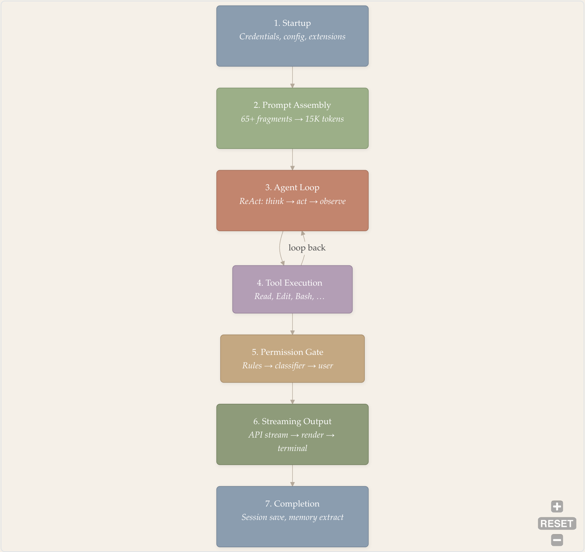
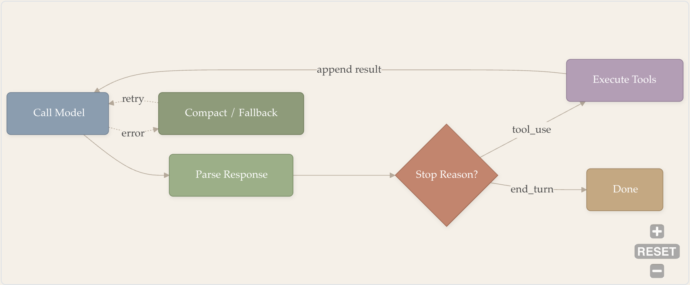

# End-to-End Workflow

- Author: Zhuoran Yang
- Source: <https://y-agent.github.io/inside-claude-code/01-end-to-end-workflow.html>
- Retrieved: 2026-08-02

1. [I. Overview](./00-birds-eye-architecture.html)
2. [I.2 — End-to-End Workflow](./01-end-to-end-workflow.html)

Tracing a single query from terminal keystroke to final output through seven architectural stages

## Introduction: One Query, Seven Stages

You type `Fix the bug in auth.ts` and press Enter. Twelve seconds later, Claude Code has read the file, identified the issue, applied an edit, and printed a summary. The journey passes through seven stages: (1) **Startup** loads credentials, config, and extensions; (2) **Prompt Assembly** merges 65+ fragments into a ~15K-token system prompt; (3) the **Agent Loop** runs the ReAct cycle of think → act → observe; (4) **Tool Execution** dispatches Read, Edit, Bash, and other tools; (5) the **Permission Gate** enforces safety rules before each tool fires; (6) **Streaming Output** renders the API response token-by-token in the terminal; and (7) **Completion** persists the session and extracts memories. Stages 3 and 4 form a loop that may cycle dozens of times before the task resolves.



*Figure 1: The seven stages of a query’s journey through Claude Code. Stages 3 and 4 form a loop: the model reasons, calls a tool, observes the result, and repeats until the task is complete or a termination guard fires.*

**How to read this diagram.** Start at Stage 1 (top) and follow the arrows downward through the seven numbered stages. The critical feature is the loop-back arrow between Stage 4 (Tool Execution) and Stage 3 (Agent Loop) – this cycle repeats until the model finishes its task. Stages below the loop (5 through 7) execute once during the exit sequence.

The seven stages divide naturally into three phases. The local phase (Stages 1–2) runs entirely on your machine in under 200 milliseconds: parsing input, loading configuration, and assembling the system prompt. The loop phase (Stages 3–6) cycles between the Anthropic API and local tool execution, potentially dozens of times. The exit phase (Stage 7) persists state and renders the outcome. We trace each in turn.

---

## Stage 1: Startup and Input

**Before Claude Code can process your query, it needs to authenticate you, load project-specific settings, and discover what tools are available. All of this happens in under 400 milliseconds.**

When you run `claude "Fix the bug in auth.ts"`, the system performs three initialization tasks in parallel:

1. **Load credentials** — retrieve API keys from the operating system’s secure storage
2. **Read configuration** — collect settings from multiple sources (environment variables, project files, user preferences), where more specific settings override general ones
3. **Discover extensions** — find any MCP servers (external tool providers) that the project has configured

Running these in parallel rather than sequentially cuts startup time roughly in half (from ~800ms to ~400ms). The system also loads the feature flags described in [Part I.1](./00-birds-eye-architecture.html) — the 88 compile-time flags and 50+ runtime gates that determine which capabilities are active.

Once initialization completes, the system determines the execution mode. Our command-line query goes directly to the agent engine. Interactive commands like `/help` or `/clear` would be handled locally with zero API cost. But our natural-language prompt needs the model, so the input string `"Fix the bug in auth.ts"` is packaged as a user message and forwarded to Stage 2.

See [Part V.1](./08-cli-commands-ui.html) for the full startup sequence and [Part V.2](./09-auth-providers-flags.html) for the configuration and feature flag system.

---

## Stage 2: System Prompt Assembly

**Before the model sees a single token of your query, a pipeline assembles 65+ fragments into a single system prompt — the instructions that tell the model who it is, what it can do, and how it should behave. This prompt consumes approximately 15,000 of the 200,000-token context window, so every token spent on instructions is a token unavailable for reasoning.**

A system prompt is analogous to the preamble of a research paper: it establishes context, constraints, and conventions before the actual content begins. The model reads the system prompt before every API call, so its content directly shapes the model’s behavior. The assembly pipeline layers sections in priority order, starting with a fixed identity prefix:

```
You are Claude Code, Anthropic's official CLI for Claude.
```

Then it appends sections covering safety rules, output style, tool usage conventions, and memory instructions – the **static fragments** that rarely change between turns. After those come **dynamic fragments** that vary per request: CLAUDE.md content discovered by walking up the directory tree, tool schemas for the 40 available tools, active skill definitions, git repository state, OS platform information, and agent-specific instructions.


*Figure 2: System prompt assembly. Static fragments (identity, safety, style, memory) and dynamic fragments (tool schemas, CLAUDE.md, git status, skills) merge into a single ~15K-token system prompt. The prompt is split into two cache blocks: Block 1 holds core instructions that are identical across turns; Block 2 holds per-project configuration that changes only when the user edits CLAUDE.md.*

**How to read this diagram.** The two subgraphs at the top represent the two sources of prompt content: Static Fragments (identity, safety, style, memory) and Dynamic Fragments (tool docs, CLAUDE.md, git status, skills). Both flow downward into the merged System Prompt node, which then splits into two Cache Blocks. The subgraph boundary separates content that is identical across turns (static) from content that varies per request (dynamic). The key takeaway is that the final prompt is layered for caching – Block 1 (core instructions) rarely changes, while Block 2 (project config) changes only when CLAUDE.md is edited.

The **static fragments** (top row in the figure) are fixed across turns within a session: the model’s identity, safety rules, output style, and memory instructions. The **dynamic fragments** (bottom row) vary per request: tool schemas describing the ~40 available tools (73 schema documents total), `CLAUDE.md` project-specific instructions discovered by walking up the directory tree, current git repository status, and any active skill definitions.

The ordering matters for cost. The Anthropic API supports prompt caching: if the first \(N\) tokens of the prompt are byte-identical to a recent request, the server reuses its cached internal representation instead of reprocessing them. Claude Code exploits this by splitting the assembled prompt into two cache blocks:

- **Cache Block 1** (core instructions): identity, safety rules, tool schemas — content that changes only across Claude Code versions. This block is identical across all turns in a session.
- **Cache Block 2** (project config): `CLAUDE.md` content, which changes only when the user edits project instructions.

Each block is marked with `cache_control: { type: 'ephemeral' }`, giving it a 5-minute server-side time-to-live (TTL). In a 20-turn session, the first turn processes all ~15K tokens; the remaining 19 turns hit the cache, reducing system prompt cost by roughly 85%.

See [Part III.1: Prompt Assembly](./03-prompt-assembly.html) for the full fragment taxonomy and assembly pipeline.

---

## Stage 3: The Agent Loop

**The assembled prompt, conversation history, and user message enter the ReAct loop — a cycle of reasoning and acting that repeats until the model signals completion or a guard triggers termination.**

The heart of Claude Code is `query.ts`: a 1,729-line asynchronous generator implementing the ReAct (Reason + Act) pattern. For our query, the loop begins by constructing the API request: the system prompt from Stage 2, plus the message array containing our user message `"Fix the bug in auth.ts"`, plus the schemas for all available tools.



*Figure 3: The ReAct loop. Each iteration calls the model, parses its response, and either executes tools (looping back) or terminates. Error recovery handles context overflow and API failures.*

**How to read this diagram.** Follow the solid arrows left to right through the happy path: Call Model, Parse Response, then the Stop Reason decision diamond. If the stop reason is “tool_use,” the flow loops back through Execute Tools to Call Model for another iteration. If the stop reason is “end_turn,” the loop exits to Done. The dotted arrows show the error path: a failure during the API call routes to Compact/Fallback, which retries the model call.

Each iteration of the loop sends the full conversation (system prompt + history + user message) to the Claude API and streams back the response. The response is parsed into three block types:

- **Text blocks** — the model’s natural-language reasoning, rendered to the terminal
- **Thinking blocks** — extended chain-of-thought reasoning, displayed in a collapsible section
- **`tool_use` blocks** — structured JSON requesting a specific tool call (e.g., “read file X” or “edit line Y”)

For our query, the model’s first response might be: “Let me read auth.ts to understand the bug” followed by a `tool_use` block requesting the `Read` tool with `file_path: "auth.ts"`. The `stop_reason` is `tool_use`, so the loop continues to Stage 4. The tool result (the file contents) is appended to the conversation history, and the loop calls the model again — now with the file contents in context.

**Handling long tool responses.** Tool results can be large: a `Read` of a 500-line file produces ~4K tokens, a `Grep` across a monorepo can return 30K tokens. If a tool result exceeds the truncation threshold, the system truncates it and appends a note informing the model that the output was cut. The model can then request a more targeted query (e.g., reading a specific line range instead of the full file). This prevents a single tool call from consuming a disproportionate share of the context budget. See [Part IV.1: Tool Result Truncation](./05-tool-system.html#tool-result-truncation----protecting-the-context-budget) for the full truncation mechanics.

**Three termination guards** prevent the loop from running indefinitely:

1. **Turn counter** (divergence guard). A configurable `maxTurns` parameter sets a hard ceiling on loop iterations. This is the simplest termination guarantee — no matter how the agent misbehaves, the counter eventually fires. The default is generous (dozens of turns) but finite.
2. **Stop hooks** (convergence guard). When the model signals completion (`end_turn`), lifecycle callbacks inspect the final state before the loop actually exits. A stop hook might check: “Did you modify test files but never run the tests?” If the check fails, the hook injects an error message and the loop resumes — giving the model a chance to correct the oversight. A counter prevents stop hooks from firing indefinitely, avoiding the meta-problem of a termination guard that itself diverges. See [Part III.4: Stop Hooks Deep-Dive](./11-hooks-lifecycle.html#stop-hooks----convergence-guards-for-the-agent-loop) for the implementation details.
3. **Repetition detection** (oscillation guard). The system tracks recent tool calls and detects cycles — the agent requesting the same file read or the same edit repeatedly without making progress. When repetition is detected, the loop injects a warning message that breaks the cycle.

**Context budget management.** Before each API call, the system checks whether the accumulated conversation history is approaching the 200K-token context window limit. If `|system_prompt| + |history| + |tools|` exceeds roughly 75% of the window, auto-compaction triggers — summarizing older conversation turns to reclaim space while preserving the most recent context. This is analogous to garbage collection: triggered by memory pressure, with progressively aggressive strategies as the budget tightens. See [Part III.2](./04-context-compaction.html) for the full compaction cascade.

See [Part II.1](./02-agent-loop-query-engine.html) for the complete agent loop architecture.

---

## Stage 4: Tool Execution

**The model has decided to act. Its `tool_use` block is dispatched to one of 40 tools, each implementing a uniform contract: a name, an input schema, and an execute function. Tools run sequentially for determinism, with one critical optimization – read-only tools may overlap via streaming execution.**

Every tool in Claude Code implements the same interface:

```typescript
type Tool = {
  name: string
  inputSchema: ToolInputJSONSchema
  execute(ctx: ToolUseContext): Promise<ToolResult>
}
```

For our query’s first iteration, the model calls `Read` with `{ file_path: "auth.ts" }`. The tool executor validates the input against the JSON Schema, runs the tool, and appends the result (the file contents) to the conversation history as a `tool_result` message. The loop returns to Stage 3: the model now has the file contents in context and can reason about the bug.

On the second iteration, the model identifies the issue and calls `Edit` with a `str_replace` operation specifying the old and new code. Before this tool executes, it must pass through the permission gate (Stage 5). On the third iteration, the model might call `Bash` to run `npm test`, verifying the fix.


*Figure 4: Tool execution flow for a typical bug-fix query. Each turn invokes one tool with a different permission path: Read is auto-allowed (read-only), Edit triggers the permission gate (file mutation), and Bash is scored by the ML classifier (arbitrary shell command). Tool results are appended to the conversation history, giving the model new observations for the next reasoning step.*

**How to read this diagram.** Each subgraph (Turn 1, Turn 2, Turn 3) represents one iteration of the agent loop. Inside each turn, the tool name on the left flows through its permission path (labeled on the arrow) to the result on the right. The arrows between turns show the model reasoning between iterations. Notice the three different permission paths: Read is auto-allowed (no gate), Edit triggers the full permission gate, and Bash is scored by the ML classifier – illustrating how different tools face different security scrutiny.

Tools execute **sequentially** within a turn – a deliberate design choice. When the model edits a file and then reads it back, the read must see the edit. Parallel execution would introduce race conditions that cascade into wasted tokens and broken trust. The one exception is the StreamingToolExecutor, which overlaps *read-only* tools (Read, Grep, Glob) in parallel while serializing side-effecting tools (Edit, Write, Bash). This is the readers-writers problem from concurrent programming: shared reads, exclusive writes.

See [Part IV.1: Tool System](./05-tool-system.html) for the full tool registry and execution pipeline.

---

## Stage 5: Permission and Safety

**Before any side-effecting tool executes, it passes through a three-tier permission gate. Static rules check first, an ML classifier scores risk second, and interactive user approval serves as the final arbiter. An OS-level sandbox constrains the blast radius regardless of what the permission system decides.**

When our query’s `Edit` tool call arrives at the permission gate, three checks run in sequence:


*Figure 5: The three-tier permission gate with OS-level sandbox as a containment backstop. Tier 1 checks static configuration rules; Tier 2 runs an ML classifier on shell commands; Tier 3 prompts the user for interactive approval. At each tier, a definitive verdict (allow, deny, safe) short-circuits the remaining checks. The OS-level sandbox constrains blast radius regardless of the permission outcome.*

**How to read this diagram.** Start at Tier 1 (top) and follow the decision arrows downward. At each tier, a definitive verdict short-circuits the remaining checks: “allow” goes directly to Execute, “deny” goes to Error Result, and “safe” from the ML classifier also goes to Execute. Only uncertain outcomes flow to the next tier. The final path from Tier 3 passes through the OS-Level Sandbox before reaching Execute – the sandbox is a containment backstop that applies regardless of how the tool was approved.

**Tier 1: Static rules.** Seven configuration sources (environment variables, local settings, project settings, user settings, and more) are checked in priority order. Each source can mark a tool as `allow`, `deny`, or `ask`. For our Edit tool call, a typical configuration marks file edits as `ask` – proceed to Tier 2.

**Tier 2: ML classifier.** For Bash tool calls, a machine learning classifier parses the shell command into an abstract syntax tree (AST) using tree-sitter, a parser generator widely used for syntax highlighting and code analysis. The classifier then scores each command’s risk based on the parsed structure. Commands like `npm test` are classified as safe; commands like `rm -rf /` are classified as destructive. The classifier fires speculatively, in parallel with the Tier 1 check, to hide ML latency behind I/O. For our `Edit` call, the classifier is not applicable (it targets shell commands), so the system proceeds to Tier 3.

**Tier 3: Interactive approval.** A modal dialog renders in the terminal, showing the proposed edit with full context – file path, old text, new text, and a diff view. The user presses `y` to approve or `n` to deny. The approved tool then executes within the OS-level sandbox.

The **OS-level sandbox** is the final containment layer. On macOS, a Seatbelt profile restricts filesystem access to the project directory and a handful of system paths. On Linux, Bubblewrap provides equivalent namespace isolation. The sandbox operates independently of the permission system – even if a bug in the classifier allows a dangerous command through, the sandbox constrains its blast radius.

See [Part IV.2: Safety and Sandbox](./06-safety-sandbox.html) for the full permission pipeline and sandbox implementation.

---

## Stage 6: Streaming Output

**While the model generates its response, tokens stream from the Anthropic API through the agent loop’s generator to the terminal renderer. The pull-based generator design ensures the renderer never falls behind the API’s output rate.**

The streaming architecture connects three components: the API client, the AsyncGenerator loop, and the terminal renderer.

The API client receives the model’s response as a stream of incremental chunks over a long-lived HTTP connection. Each chunk carries a fragment — a few tokens of text, a piece of tool-call JSON, or a reasoning token. These chunks are yielded by the `query()` generator to the renderer.

Because the generator is pull-based (the renderer requests each chunk when ready), backpressure is automatic: if the terminal is busy updating the display, the generator simply pauses until the next chunk is requested. This prevents memory buildup during burst output — the producer cannot outrun the consumer.

The terminal renderer updates the screen efficiently using double buffering: it computes the new display in an off-screen buffer, diffs it against the current screen, and writes only the characters that changed. For our query, this means streaming text appears in real time, code diffs are syntax-highlighted as they arrive, and progress indicators animate without flickering.

The rendering pipeline handles multiple content types: plain text flows directly to the output, code blocks receive syntax highlighting, tool results render with collapsible detail views, and permission dialogs appear as modal prompts with keyboard navigation.

See [Part V.1: CLI and Terminal UI](./08-cli-commands-ui.html) for the full rendering architecture.

---

## Stage 7: Completion

**The model returns `end_turn`. The loop runs stop hooks, persists session state, extracts memories, and renders the final output.**

When the model’s `stop_reason` is `end_turn`, the agent loop does not immediately exit. First, stop hooks inspect the final state. A hook might detect that the model edited source files but never ran tests, injecting a message like “You should verify your changes by running the test suite.” If a stop hook fires, the loop resumes from Stage 3 – the model sees the injected message and acts on it.

Assuming all stop hooks pass, the loop enters its exit sequence:

1. **Session persistence.** The full conversation history – system prompt, user messages, assistant responses, tool results – is serialized and stored. Sessions can be resumed later with `claude --resume`.
2. **Memory extraction.** The auto-memory system (`services/autoDream/`) scans the conversation for reusable knowledge: project conventions discovered during the interaction, user preferences expressed through feedback, and domain facts that would be useful in future sessions. Extracted memories are stored in a SQLite database with FTS5 full-text search indexing.
3. **Terminal rendering.** The final assistant message renders to the terminal. For our query, this might be a summary: “Fixed the null check bug in auth.ts at line 42. The issue was a missing optional chain operator on the user object. Tests pass.” The message includes a formatted diff of the change and the test output.

The loop phase (Stages 3–6) dominates wall-clock time, with API latency and tool execution accounting for most of the cost. A straightforward bug fix might complete in a handful of turns; a complex refactoring task can run for dozens of turns over several minutes. The local phases (Stages 1–2 and Stage 7) are fast by comparison.

---

## Putting It Together: The Full Trace

With all seven stages examined, we can now see the complete picture. Our query `"Fix the bug in auth.ts"` touched every layer of the six-layer architecture described in [Part I.1](./00-birds-eye-architecture.html):

| Stage | Layer | What Happened |
| --- | --- | --- |
| 1. Startup | Layer 1: Entry | Credentials, config, extensions loaded in parallel |
| 2. Assembly | Layer 5: Services | 65+ fragments assembled into 15K-token system prompt |
| 3. Agent Loop | Layer 2: Agent Loop | AsyncGenerator called API, parsed streaming response |
| 4. Tool Execution | Layer 3: Tools | Read, Edit, Bash dispatched sequentially |
| 5. Permission | Layer 4: Security | Static rules, classifier, user approval for Edit |
| 6. Streaming | Layer 6: Terminal UI | Tokens streamed and rendered incrementally |
| 7. Completion | Layer 5: Services | Session saved, memories extracted, output rendered |

The stages are not independent – they share a single unifying constraint. The context window budget (\(|system| + |history| + |tools| + |output| \leq 200K\) tokens) shapes every design decision: why fragments are conditionally included (Stage 2), why compaction triggers at 75% capacity (Stage 3), why tool outputs are truncated (Stage 4), and why prompt caching splits the system prompt into two blocks (Stage 2). The context window is finite, and the architecture is a coordinated response to that finitude.

Each stage in the pipeline exists for a reason traceable to one of three constraints: **time** (the user expects sub-second startup), **tokens** (the 200K context window is a hard ceiling), or **safety** (an autonomous agent must not cause irreversible harm). The architecture is not a collection of independent design decisions – it is a system where each stage’s design follows from these three constraints and the stages that precede it.

---

## Series Navigation

This post traced the full journey at survey depth. Each subsequent post dives into one stage:

| Stage | Deep-Dive |
| --- | --- |
| 1. Startup | [Part V.1 — CLI and UI](./08-cli-commands-ui.html), [Part V.2 — Auth and Providers](./09-auth-providers-flags.html) |
| 2. Prompt Assembly | [Part III.1 — Prompt Assembly](./03-prompt-assembly.html) |
| 3. Agent Loop | [Part II.1 — Agent Loop](./02-agent-loop-query-engine.html) |
| 4. Tool Execution | [Part IV.1 — Tool System](./05-tool-system.html) |
| 5. Permission & Safety | [Part IV.2 — Safety and Sandbox](./06-safety-sandbox.html) |
| 6. Streaming & Multi-Agent | [Part II.3 — Multi-Agent Orchestration](./07-multi-agent-orchestration.html) |
| 7. Extensions | [Part VI.1 — MCP](./10-model-context-protocol.html), [Part III.4 — Hooks](./11-hooks-lifecycle.html) |

*Next: [Part II.1 — Agent Loop and Query Engine](./02-agent-loop-query-engine.html), where we examine the generator abstraction that makes the ReAct loop composable, streamable, and resilient.*

---

*This analysis is based on the Claude Code v2.1.88 source map, extracted and studied for educational purposes. All code snippets are reconstructed from the source map and may differ from the actual implementation. Claude Code is a product of Anthropic, PBC.*
