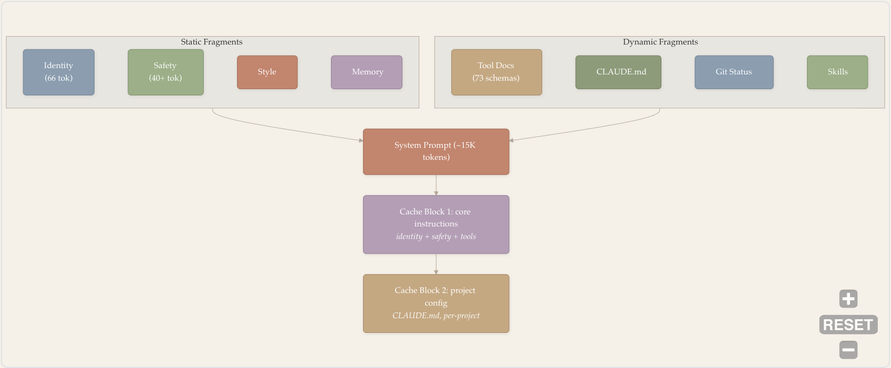
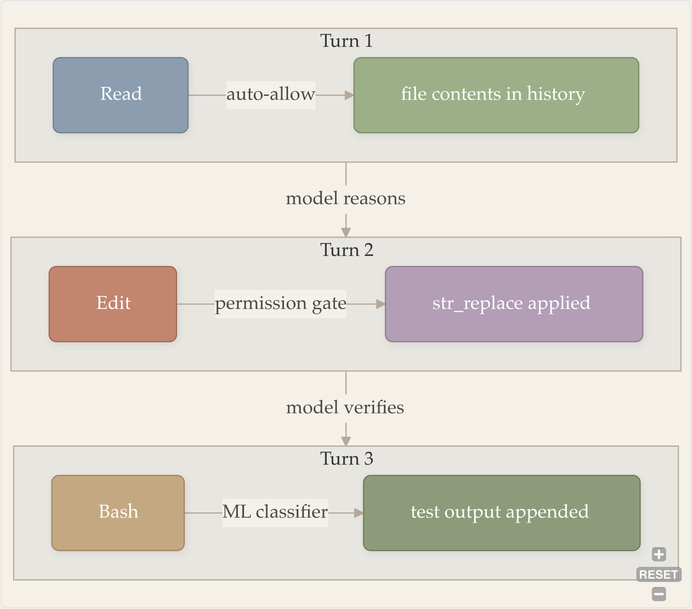
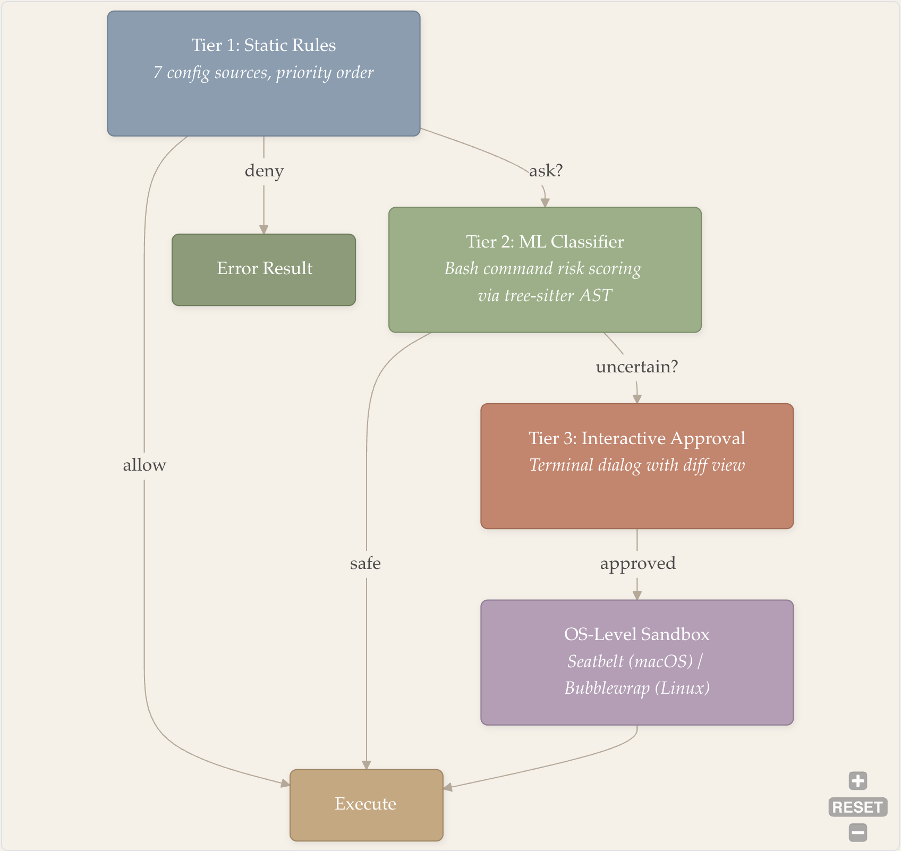

# 端到端工作流

- 原题：*End-to-End Workflow*
- 作者：Zhuoran Yang
- 原文：<https://y-agent.github.io/inside-claude-code/01-end-to-end-workflow.html>
- 获取日期：2026-08-02

> 译者说明：本文按原网页顺序完整翻译，保留五张原始流程图、代码、表格和站内链接。分析基于 Claude Code v2.1.88 的 Source Map；文中的文件行数、工具数量、Prompt 大小、延迟和阈值均属于该快照或作者测量，不应直接外推到其他版本。

1. [第一部分：总览](./00-birds-eye-architecture.html)
2. [第一部分第 2 篇：端到端工作流](./01-end-to-end-workflow.html)

本文从一次具体请求出发，顺着 Claude Code 的内部流程，看看终端里的一行命令怎样变成最终结果。

## 引言：一个请求，七个阶段

你输入 `Fix the bug in auth.ts`，按下回车。十二秒后，Claude Code 已经读过文件、找到问题、完成编辑，并在终端里给出总结。屏幕上只过去了十几秒，内部却走完了七步：启动（Startup）负责加载凭据、配置和扩展；Prompt 组装（Prompt Assembly）把 65 个以上的片段合并成约 15K Token 的 System Prompt；Agent Loop 运行“思考 → 行动 → 观察”的 ReAct 循环；工具执行（Tool Execution）把 Read、Edit、Bash 等调用落到本机；权限闸门（Permission Gate）检查操作能否执行；流式输出（Streaming Output）把 API 响应逐 Token 送到终端；最后，完成（Completion）阶段保存会话并提取记忆。Agent Loop 与工具执行会往返多轮，直到任务结束。


*图 1：一次请求经过 Claude Code 的七个阶段。第 3 和第 4 阶段形成循环：模型进行推理、调用工具、观察结果并重复上述过程，直到任务完成或触发终止保护。*

图中大部分箭头自上而下，只有工具执行之后的箭头回到 Agent Loop。这条回路才是整套流程的核心：模型先判断下一步该做什么，工具把动作执行出来，结果再回到上下文，供模型继续判断。任务完成后，流程才离开循环，进入收尾步骤。

按运行位置和职责看，这七步可以分成三段。启动和 Prompt 组装属于本地准备，作者测得这部分耗时不到 200 毫秒；Agent Loop、工具执行、权限检查和流式输出构成主体，程序在 Anthropic API 与本地环境之间反复往返；最后一步负责保存状态并显示结果。下面沿着这条路径逐段来看。

---

## 阶段 1：启动与输入

Claude Code 还没有开始处理问题时，启动程序已经在准备它接下来要用的环境：认证信息、项目设置和可用工具都要在这里加载。按原文分析的版本快照，这些初始化工作会在 400 毫秒内完成。

运行 `claude "Fix the bug in auth.ts"` 时，系统会并行完成三项初始化任务：

1. **加载凭据**：从操作系统的安全存储中取得 API Key；
2. **读取配置**：汇总环境变量、项目文件和用户偏好，更具体的设置覆盖更一般的设置；
3. **发现扩展**：查找项目配置的 MCP Server，也就是外部工具提供者。

这三项任务并行运行，作者测得的启动时间因此从约 800 毫秒降到约 400 毫秒。与此同时，系统还会加载[第一部分第 1 篇](./00-birds-eye-architecture.html)介绍的 Feature Flag，包括 88 个编译时 Flag 和 50 多个运行时 Gate。Claude Code 当前会开放哪些能力，也在这里确定。

初始化完成后，系统根据输入选择执行方式。`/help`、`/clear` 等交互命令可以在本地直接处理，不需要调用 API；`"Fix the bug in auth.ts"` 是自然语言请求，需要模型参与，因此会被包装成一条 User Message，交给下一步处理。

完整启动序列见[第五部分第 1 篇](./08-cli-commands-ui.html)，配置与 Feature Flag 系统见[第五部分第 2 篇](./09-auth-providers-flags.html)。

---

## 阶段 2：组装 System Prompt

用户消息送进模型之前，Claude Code 会先组装 System Prompt。原文分析的版本需要合并 65 个以上的片段，总计约 15,000 Token。它们规定模型的身份、工具和行动边界，也会直接占用 200K 的上下文窗口。

System Prompt 先替模型交代工作环境。每次 API 调用都会带上这些内容，所以项目约定、安全规则和工具说明都会影响模型接下来的选择。组装时，程序先放入固定的身份前缀：

```
You are Claude Code, Anthropic's official CLI for Claude.
```

接下来是安全规则、输出风格、工具使用约定和记忆指令。这些内容很少随轮次改变，可以视为**静态片段**。程序随后加入**动态片段**：沿目录树发现的 `CLAUDE.md`、40 个可用工具的 Schema、当前启用的 Skill、Git 仓库状态、操作系统信息，以及特定 Agent 的指令。



*图 2：System Prompt 组装。静态片段（身份、安全、风格、记忆）和动态片段（工具 Schema、CLAUDE.md、Git 状态、Skill）合并为约 15K Token 的 System Prompt。Prompt 被拆为两个 Cache Block：Block 1 保存轮次间完全一致的核心指令；Block 2 保存只有在用户修改 CLAUDE.md 时才变化的项目配置。*

图 2 把这些材料分成静态与动态两组。静态部分包括模型身份、安全规则、输出风格和记忆指令；动态部分包括约 40 个工具的 Schema（共 73 个 Schema 文档）、项目中的 `CLAUDE.md`、Git 状态和当前使用的 Skill。两组内容合并成 System Prompt 后，又按变化频率拆成两个 Cache Block。

这里的排列顺序与调用成本有关。Anthropic API 支持 Prompt Caching：如果新请求开头的前 (N) 个 Token 与最近一次请求逐字节一致，服务器可以复用缓存中的内部表示。Claude Code 因此把 Prompt 拆成两块：

- **Cache Block 1（核心指令）**：身份、安全规则和工具 Schema；这些内容通常只在 Claude Code 版本变化时改变，在同一会话的所有轮次中保持一致。
- **Cache Block 2（项目配置）**：`CLAUDE.md` 内容，通常只有用户修改项目指令时才变化。

两块都标记为 `cache_control: { type: 'ephemeral' }`，在服务器端保留 5 分钟（TTL）。按原文给出的 20 轮会话示例，第一轮需要处理全部约 15K Token，后续 19 轮则命中缓存，System Prompt 的成本由此降低约 85%。

完整的片段分类和组装流水线见[第三部分第 1 篇：Prompt Assembly](./03-prompt-assembly.html)。

---

## 阶段 3：Agent Loop

准备好的 Prompt 会与对话历史、用户消息一起进入 ReAct Loop。模型在这里交替进行推理和行动，直到返回完成信号，或者被保护机制终止。

在原文分析的版本中，这段逻辑位于 `query.ts`。它是一个 1,729 行的异步生成器，实现了 ReAct（Reason + Act）模式。以当前例子来说，第一次 API 请求会带上刚才组装的 System Prompt、包含 `"Fix the bug in auth.ts"` 的消息数组，以及所有可用工具的 Schema。


*图 3：ReAct Loop。每次迭代都会调用模型、解析响应，然后执行工具并返回循环，或者结束运行。错误恢复负责处理上下文溢出和 API 失败。*

图 3 的实线是正常路径：调用模型、解析响应，再检查 Stop Reason。`tool_use` 表示还有工具要执行，执行结果会回到下一轮模型调用；`end_turn` 表示本轮工作可以结束。虚线画的是恢复路径，API 调用失败后，程序会经过 Compact/Fallback 再尝试调用模型。

每轮迭代都会把完整对话发送给 Claude API，其中包括 System Prompt、历史消息和当前用户消息。返回内容以流式方式接收，并被解析为三类 Block：

- **Text Block**：模型生成的自然语言，由终端显示；
- **Thinking Block**：扩展推理内容，显示在可折叠区域中；
- **`tool_use` Block**：调用工具所需的结构化 JSON，例如“读取文件 X”或“编辑第 Y 行”。

在这个例子里，模型第一次响应时可能先说明要读取 `auth.ts`，同时给出一个 `tool_use` Block，请求 Read 工具读取 `file_path: "auth.ts"`。由于 Stop Reason 是 `tool_use`，程序接着执行工具。读到的文件内容被追加进对话历史，模型在下一轮调用中便能看到它。

工具结果有时会很长。原文估算，读取一个 500 行文件约需 4K Token，在 Monorepo 中运行 Grep 则可能返回 30K Token。超过阈值后，系统会截断结果，并明确告诉模型哪些内容没有完整保留。模型可以据此缩小查询范围，例如只读取相关行，而不是再次载入整份文件。这样，一次工具调用就不会挤占过多上下文。完整机制见[第四部分第 1 篇：Tool Result Truncation](./05-tool-system.html#tool-result-truncation----protecting-the-context-budget)。

为了避免循环失控，系统设置了三种保护：

1. **轮次计数器（发散保护）**。`maxTurns` 为迭代次数设定硬上限。默认值允许数十轮，但循环不能无限继续。
2. **Stop Hook（收敛保护）**。模型发出 `end_turn` 后，生命周期回调会在真正退出前检查结果。例如，模型改了测试文件却没有运行测试，Hook 就可以注入一条错误消息，让循环恢复并补上验证步骤。另一个计数器限制 Stop Hook 的触发次数，防止保护机制自身陷入循环。实现细节见[第三部分第 4 篇：Stop Hooks Deep-Dive](./11-hooks-lifecycle.html#stop-hooks----convergence-guards-for-the-agent-loop)。
3. **重复检测（振荡保护）**。系统记录近期工具调用。如果 Agent 没有取得进展，却反复读取同一文件或重复同一编辑，系统会插入警告，要求它换一种做法。

每次调用 API 前，系统还会检查对话历史是否逼近 200K Token 的窗口上限。当 `|system_prompt| + |history| + |tools|` 超过窗口的约 75% 时，自动压缩开始总结较早的轮次，同时保留最近上下文。预算越紧，压缩策略也越激进。完整机制见[第三部分第 2 篇](./04-context-compaction.html)。

完整的 Agent Loop 架构见[第二部分第 1 篇](./02-agent-loop-query-engine.html)。

---

## 阶段 4：工具执行

模型返回 `tool_use` 后，Claude Code 要把这项请求交给对应工具。原文分析的版本提供约 40 个工具，虽然用途不同，但都遵循同一套接口：工具名称、输入 Schema 和执行函数。

Claude Code 中的每个工具都实现相同接口：

```typescript
type Tool = {
  name: string
  inputSchema: ToolInputJSONSchema
  execute(ctx: ToolUseContext): Promise<ToolResult>
}
```

第一次迭代中，模型调用 Read，并传入 `{ file_path: "auth.ts" }`。执行器先用 JSON Schema 验证参数，再运行工具。读到的文件内容随后作为 `tool_result` 追加到对话历史。循环回到 Agent Loop 时，模型有了新的信息，可以继续判断 Bug 出在哪里。

第二次迭代中，模型可能已经找到问题，于是调用 Edit，并用 `str_replace` 指定旧代码和新代码。编辑不能直接落盘，还要先经过权限检查。修改完成后，第三次迭代再调用 Bash 运行 `npm test`，把测试结果交还给模型。



*图 4：典型 Bug 修复请求中的工具执行流程。每轮调用一种工具，并经过不同权限路径：Read 自动获准，Edit 触发权限闸门，Bash 由机器学习分类器评分。工具结果被追加进对话历史，为模型下一轮推理提供新观察。*

图 4 把这三轮放在一起。Read 是只读操作，可以自动获准；Edit 会触发完整的权限检查；Bash 能执行任意 Shell 命令，因此还要经过机器学习分类器评分。工具的风险不同，执行路径也不会完全一样。

同一轮中的工具通常按顺序执行。假如模型先编辑文件再读取，后一次读取必须看到刚才的修改；贸然并行会产生竞态条件，模型也可能依据过期结果继续推理。`StreamingToolExecutor` 对只读调用做了例外处理：Read、Grep、Glob 可以重叠执行，Edit、Write、Bash 等有副作用的操作仍然串行。这与并发编程中的读写者约束相同：读取可以共享，写入需要独占。

完整的工具注册表和执行流水线见[第四部分第 1 篇：Tool System](./05-tool-system.html)。

---

## 阶段 5：权限与安全

只要工具会修改文件或执行命令，Claude Code 就要先判断这项操作是否允许。权限闸门分三层：静态规则、机器学习分类器和用户确认。通过检查之后，工具仍然受到操作系统级沙箱的限制。

示例中的 Edit 调用会沿图 5 所示的路径接受检查：



*图 5：三层权限闸门，操作系统级沙箱作为最后的隔离屏障。Tier 1 检查静态配置规则；Tier 2 使用机器学习分类器分析 Shell 命令；Tier 3 请求用户交互式批准。每一层得到确定结论后都会短路剩余检查；无论权限结果怎样，沙箱都会限制影响范围。*

检查从 Tier 1 开始，但不一定走完三层。静态规则返回 `allow` 时，工具可以直接进入 Execute；返回 `deny` 时，程序产生 Error Result。只有结果不确定，流程才继续向下。机器学习分类器判断为 `safe` 也能直接放行，否则由用户作最后决定。执行发生在 OS-Level Sandbox 内，批准并不等于取消隔离。

**Tier 1：静态规则。**系统按优先级检查七种配置来源，包括环境变量、本地设置、项目设置和用户设置。每个来源都可以把工具标成 `allow`、`deny` 或 `ask`。以这里的 Edit 为例，典型配置会返回 `ask`，流程因而继续向下。

**Tier 2：机器学习分类器。**这一层用于 Bash 调用。Tree-sitter 先把 Shell 命令解析成抽象语法树（AST），分类器再根据语法结构评估风险。按照原文的例子，`npm test` 会被判断为安全，`rm -rf /` 则会被识别为破坏性命令。分类器与 Tier 1 的检查推测并行，用 I/O 等待时间遮蔽分类延迟。Edit 不是 Shell 命令，不适用这一层，因此继续交给用户确认。

**Tier 3：交互式批准。**终端弹出确认框，展示文件路径、替换前后的文本和 Diff。用户按 `y` 批准，按 `n` 拒绝；获批操作随后进入沙箱执行。

权限检查之外还有一层操作系统级隔离。macOS 使用 Seatbelt Profile，把文件系统访问限制在项目目录和少量系统路径；Linux 使用 Bubblewrap 提供相应的 Namespace 隔离。沙箱独立运行，即使权限判断出现错误，它仍能限制命令可触及的范围。

完整权限流水线和沙箱实现见[第四部分第 2 篇：Safety and Sandbox](./06-safety-sandbox.html)。

---

## 阶段 6：流式输出

模型开始返回响应后，Token 会从 Anthropic API 进入 Agent Loop 的生成器，再交给终端渲染器。中间没有等待完整回答一次性返回，文本和工具调用片段都会边到达边处理。

这条流式链路连接 API Client、`AsyncGenerator` Loop 和终端渲染器。

API Client 通过长连接接收增量数据块。一个数据块可能包含几个文本 Token、一部分工具调用 JSON，或者一个推理 Token。`query()` 生成器收到后，依次把它们 `yield` 给渲染器。

生成器采用拉取模式：渲染器准备好后才请求下一个数据块。终端忙于更新画面时，生成器会停在当前位置；等渲染器再次请求，数据才继续向下游流动。这种反压机制避免了突发输出在内存中不断堆积。

终端渲染器用双缓冲更新画面：先在离屏缓冲区算出新画面，再与当前屏幕比较，只重绘发生变化的字符。因此，文本可以逐步出现，代码 Diff 到达后立即获得语法高亮，进度指示器也能持续动画而不闪烁。

不同内容会进入不同的显示组件：普通文本直接输出，代码块添加语法高亮，工具结果收进可折叠区域，权限请求则显示为支持键盘操作的模态框。

完整渲染架构见[第五部分第 1 篇：CLI and Terminal UI](./08-cli-commands-ui.html)。

---

## 阶段 7：完成

模型返回 `end_turn`，只表示它认为任务已经结束。Claude Code 在退出循环前还要运行 Stop Hook；检查通过后，才会保存会话、提取记忆并显示最终结果。

例如，Stop Hook 发现模型改了源文件却没有运行测试，就可以注入一条要求验证改动的消息。Agent Loop 随即恢复，模型读到这条消息后继续调用工具。这样，`end_turn` 只是一次退出申请，真正结束还要通过外部检查。

Stop Hook 全部通过后，程序依次完成三件事：

1. **保存会话。**System Prompt、用户消息、Assistant 响应和工具结果会被序列化，以后可以用 `claude --resume` 恢复。
2. **提取记忆。**自动记忆系统 `services/autoDream/` 扫描对话，找出可复用的项目约定、用户偏好和领域事实，并存入带有 FTS5 全文搜索索引的 SQLite 数据库。
3. **显示结果。**最终 Assistant 消息、格式化 Diff 和测试输出被渲染到终端。在当前例子中，消息可能写明：`auth.ts` 第 42 行的空值检查已经修复，原因是 `user` 对象缺少可选链操作符，测试已经通过。

实际耗时主要发生在循环阶段，尤其是 API 往返和工具执行。简单 Bug 可能几轮就能解决，复杂重构则会持续几十轮，耗时数分钟；启动、Prompt 组装和退出处理相对很短。

---

## 合在一起：完整轨迹

回头看 `"Fix the bug in auth.ts"`，这条请求先后经过[第一部分第 1 篇](./00-birds-eye-architecture.html)所说的六层架构：

| 阶段 | 所属层次 | 发生的事情 |
| --- | --- | --- |
| 1. 启动 | Layer 1：入口 | 并行加载凭据、配置和扩展 |
| 2. 组装 | Layer 5：服务 | 把 65 个以上片段组装为 15K Token 的 System Prompt |
| 3. Agent Loop | Layer 2：Agent Loop | `AsyncGenerator` 调用 API 并解析流式响应 |
| 4. 工具执行 | Layer 3：工具 | 顺序分派 Read、Edit、Bash |
| 5. 权限 | Layer 4：安全 | 对 Edit 依次进行静态规则、分类器和用户审批 |
| 6. 流式输出 | Layer 6：终端 UI | 增量传输和渲染 Token |
| 7. 完成 | Layer 5：服务 | 保存会话、提取记忆并渲染输出 |

表中的步骤虽然分属不同层次，却都要服从同一个上下文预算：\(|system| + |history| + |tools| + |output| \leq 200K\) Token。Prompt 片段需要按条件加入，对话达到约 75% 容量时需要压缩，过长的工具输出必须截断，System Prompt 也要按变化频率拆成两个 Cache Block。它们解决的是同一个问题：如何在有限窗口里保留下一步行动真正需要的信息。

另外两项约束是时间与安全。启动任务并行，是为了缩短用户等待；工具按风险走不同权限路径，是为了避免自主操作越过边界。七个阶段之所以连成现在的样子，正是因为每一步都要同时顾及响应时间、Token 预算和操作风险。

---

## 系列导航

下面是原系列中与各阶段对应的深入阅读：

| 阶段 | 深入阅读 |
| --- | --- |
| 1. 启动 | [第五部分第 1 篇：CLI and UI](./08-cli-commands-ui.html)、[第五部分第 2 篇：Auth and Providers](./09-auth-providers-flags.html) |
| 2. Prompt 组装 | [第三部分第 1 篇：Prompt Assembly](./03-prompt-assembly.html) |
| 3. Agent Loop | [第二部分第 1 篇：Agent Loop](./02-agent-loop-query-engine.html) |
| 4. 工具执行 | [第四部分第 1 篇：Tool System](./05-tool-system.html) |
| 5. 权限与安全 | [第四部分第 2 篇：Safety and Sandbox](./06-safety-sandbox.html) |
| 6. 流式输出与 Multi-Agent | [第二部分第 3 篇：Multi-Agent Orchestration](./07-multi-agent-orchestration.html) |
| 7. 扩展 | [第六部分第 1 篇：MCP](./10-model-context-protocol.html)、[第三部分第 4 篇：Hooks](./11-hooks-lifecycle.html) |

*下一篇是[第二部分第 1 篇：Agent Loop and Query Engine](./02-agent-loop-query-engine.html)，主题是支撑 ReAct Loop 组合、流式运行和故障恢复的生成器抽象。*

---

*本文分析基于 Claude Code v2.1.88 的 Source Map，提取和研究仅用于教育目的。所有代码片段均从 Source Map 重建，可能与实际实现不同。Claude Code 是 Anthropic, PBC 的产品。*
