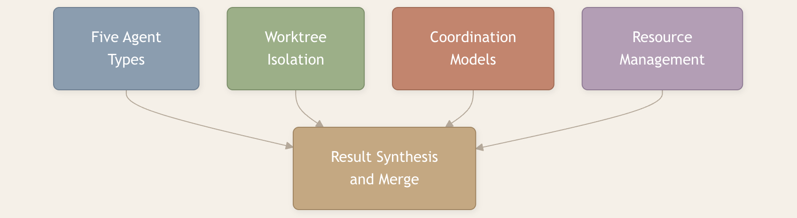
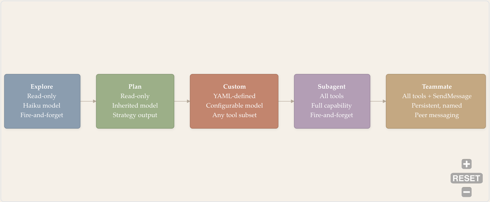
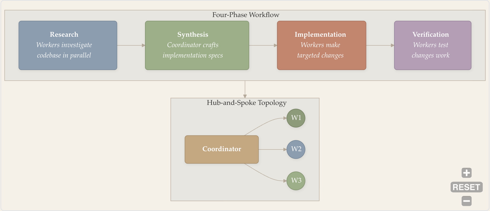
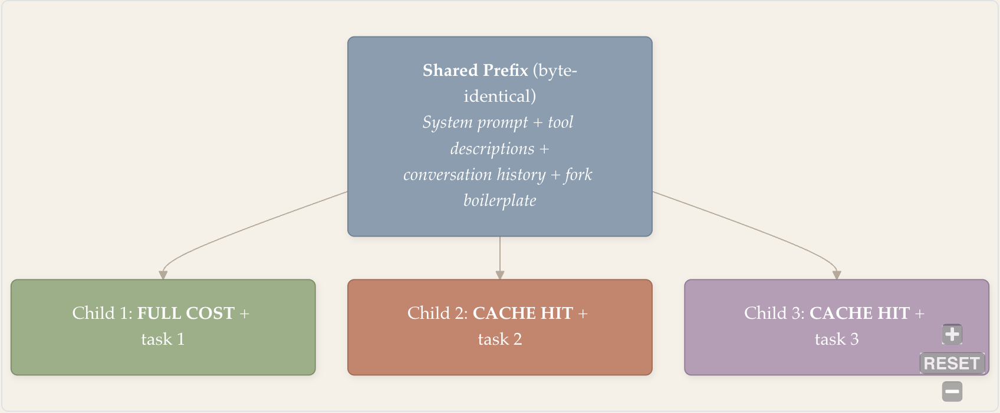

# 多智能体编排

- 作者：Zhuoran Yang
- 原文：<https://y-agent.github.io/inside-claude-code/07-multi-agent-orchestration.html>
- 获取日期：2026-08-02
- 说明：本文为原文的中文全译，保留原有结构、代码、表格、公式与插图。原文基于作者分析的 Claude Code 特定版本；函数名、功能开关、模型配置和规模数据可能随版本变化，本文按原文翻译，不将其视为当前版本的官方保证。

1. [II. Agent Harness](./02-agent-loop-query-engine.html)
2. [II.3 — 多智能体编排](./07-multi-agent-orchestration.html)

AI 的 `fork()` —— 五种智能体类型、worktree 隔离与集群协作

## 为什么需要多智能体？

在 Unix 中，当一个进程需要同时做两件事时，它会调用 `fork()`。内核复制该进程——相同的二进制、相同的内存布局、相同的文件描述符——然后让子进程独立运行。父进程可以等待结果，也可以继续自己的工作。这是操作系统并行计算的基本原语：复制自身、各自分岔，最后重新汇合。

Claude Code 对 AI 智能体做了同样的事。

当一项任务大到单个上下文窗口无法容纳，或多块工作可以彼此独立推进时，主智能体会生成子智能体——每个子智能体都有自己的上下文、工具和工作目录。子智能体执行任务、回报结果，然后终止；父智能体再综合这些结果。这不是为了修辞而勉强拉长的类比。代码真的把它称为“fork”：功能开关叫 `FORK_SUBAGENT`，函数叫 `buildForkedMessages`，子进程的系统提示词以这句话开头：*“停下。先读这里。你是一个 fork 出来的工作进程。你不是主智能体。”*

本文介绍 Claude Code 如何把任务拆给多个智能体、如何用 git worktree 隔离它们的工作、如何管理预算，以及如何综合它们的结果。这正是系统编程中 MapReduce、fork-join 并行和 Actor 模型并发共同体现的“分解—执行—聚合”模式。每个子智能体运行的 agent loop 见[第二部分第 1 篇](./02-agent-loop-query-engine.html)；派发智能体所用的工具系统见[第四部分第 1 篇](./05-tool-system.html)；约束其行为的安全层见[第四部分第 2 篇](./06-safety-sandbox.html)。



*图 1：本文涵盖的多智能体编排四大支柱——五种智能体类型、git worktree 隔离、协调模型（Coordinator 与 Teammate）以及资源管理（token 预算、模型选择和清理）——最终都汇入结果综合与合并阶段，由父智能体整合子智能体输出。*

**读图方法。** 从左侧四个框开始：五种智能体类型、Worktree 隔离、协调模型和资源管理。它们分别对应本文的主要章节。四条箭头都汇入右侧的“结果综合与合并”，表示这些支柱是相互独立的关注点，但最终都会在父智能体整合子智能体输出时结合起来。

**本文涉及的源文件：**

| 文件 | 用途 | 规模 |
| --- | --- | --- |
| `src/tools/AgentTool/AgentTool.tsx` | AgentTool 入口与 UI | 约 500 LOC |
| `src/tools/AgentTool/runAgent.ts` | 智能体执行与清理 | 约 400 LOC |
| `src/tools/AgentTool/forkSubagent.ts` | 基于 fork 的异步工作进程 | 约 300 LOC |
| `src/tools/AgentTool/loadAgentsDir.ts` | 智能体发现与 YAML frontmatter 解析 | 约 756 LOC |
| `src/tools/AgentTool/builtInAgents.ts` | 内置智能体定义（Explore、Plan 等） | 约 300 LOC |
| `src/tools/AgentTool/prompt.ts` | 子智能体系统提示词组装 | 约 200 LOC |
| `src/tools/AgentTool/agentMemory.ts` | 智能体作用域内存管理 | 约 150 LOC |
| `src/services/teamMemorySync/` | 团队内存同步协议 | 5 个文件 |
| `src/coordinator/` | 集群 Coordinator 模式 | 约 3 个文件 |

---

## `fork()` 类比

子智能体与 Unix 进程之间的联系并非比喻，而是结构上的对应。Unix 的 `fork()` 会创建一个拥有父进程内存副本的子进程；Claude Code 的 fork 路径会创建一个拥有父智能体对话历史和系统提示词副本的子智能体。Unix 子进程继承文件描述符；fork 子智能体继承父智能体完全相同的工具池。Unix 子进程运行在自己的虚拟地址空间中；fork 子智能体运行在自己的 git worktree 中。隔离边界、通信原语和生命周期管理都能一一映射。

AgentTool 的实现横跨 `tools/AgentTool/` 中 14 个文件、超过 6,000 行 TypeScript，是所有委派行为的唯一入口。Claude Code 中的每个子智能体——无论是廉价的只读探索者，还是持续运行数小时的长期 teammate——都通过这一工具生成：

```typescript
interface AgentInput {
  prompt: string;             // 完整的任务描述
  description: string;        // 3—5 个词的摘要（用于任务列表）
  subagent_type?: string;     // "Explore" | "Plan" | "subagent" | "teammate" | "custom"
  model?: "sonnet" | "opus" | "haiku";  // 单个智能体的模型覆盖
  run_in_background?: boolean;  // 异步执行（返回 task_id）
  name?: string;              // 使智能体可通过 SendMessage 寻址
  isolation?: "worktree";     // Git worktree 隔离
}
```

每个字段都是编排智能体可以操作的一根杠杆。`model` 字段支持按智能体优化成本：只做简单搜索的 Explore 智能体运行在最便宜的 `haiku` 上，而实现复杂逻辑的 Subagent 使用能力最强的 `opus`。`run_in_background` 决定父智能体是阻塞等待（同步委派），还是继续工作（异步执行）。`name` 则让智能体能通过 `SendMessage` 接收后续消息，从而支持多轮协作。

关键细节在于省略 `subagent_type` 时会发生什么。启用 `FORK_SUBAGENT` 功能开关时，省略类型会触发隐式 fork——子智能体继承父智能体完整的对话上下文和系统提示词。关闭该开关时，系统默认使用 `general-purpose` 智能体类型。这一个条件分支区分了两种完全不同的生成策略：从空白开始的委派，与继承上下文的 fork。

### 两条生成路径——Fork 与全新智能体

代码库实现了两条不同的生成路径，子智能体在两种路径中收到的上下文差异极大。

**路径 A：Fork。** 当模型调用 Agent 工具但*没有*指定 `subagent_type` 时触发。子智能体获得父智能体的**完整对话历史**、**完全相同的系统提示词**，以及父智能体的**原样工具池**（字节级一致，以共享提示词缓存）。`buildForkedMessages()` 会在父对话后追加恰好两条消息：

1. 父智能体最后一条 assistant 消息的克隆（包括全部 `tool_use`、thinking 和文本块）。
2. 一条 user 消息，其中包含占位 `tool_result` 块（所有 fork 均使用相同文本，同样是为了共享缓存）和子智能体的具体任务指令。该指令规定了 10 条不可违背的规则：不得再次委派、不得对话、不得发表题外评论、直接使用工具、严格限定范围、报告不超过 500 词、以“Scope:”开头、报告结构化事实，然后停止。

由于父智能体和所有 fork 子智能体的系统提示词、工具与对话前缀在字节层面完全相同，LLM API 的提示词缓存会把除第一个子智能体之外的请求都视为缓存命中。每个子智能体之间只有最后一条任务指令不同。

**路径 B：全新智能体。** 当模型*指定* `subagent_type`（Explore、Plan、subagent、teammate 或 custom）时触发。子智能体从**零对话上下文**开始，只收到一条包含任务提示的 user 消息。它得到根据智能体类型定义单独组装的系统提示词、新组装的工具池和新的文件状态缓存。它不知道父智能体讨论过什么、读过哪些文件，或做过哪些决定。

五种具名智能体类型全部走路径 B。Fork 路径（路径 A）是一套独立机制，只在省略类型时触发。

这就是最根本的上下文权衡：fork 子智能体看得见父智能体知道的一切（昂贵、上下文丰富），而具名类型智能体只能看到任务描述（便宜、聚焦）。Fork 适合需要父智能体累积理解的任务；具名类型适合“干净起步”和专门角色比共享历史更有价值的任务。

Agent 工具不只是一个工具，而是能创建新智能体的元工具。从父智能体看，它是一个返回结果的函数调用；从子智能体看，它是完整智能体生命周期的起点。这种“从上面看是工具、从里面看是智能体”的二重性，使系统具有递归性。它如何嵌入更广泛的工具派发管线，见[第四部分第 1 篇](./05-tool-system.html)。

---

## 五种智能体类型——成本与能力的连续谱

Claude Code 并非只有一种子智能体，而是有五种，排列在从“便宜且受限”到“昂贵且强大”的连续谱上。为任务选择正确类型，就像选择正确的数据结构：能够满足要求的最便宜方案就是最佳方案。

可以把它想成项目招聘。你不会花资深架构师的价钱让他做 grep 搜索，也不会让实习生设计系统架构。每个角色都有成本、能力集合和适合的工作范围。



*图 2：五种智能体类型沿成本—能力连续谱排列。Explore 只读、使用最便宜的 Haiku 模型且用后即弃；Plan 同样只读，但产出结构化实施策略；Custom 由 YAML 定义，可配置工具子集；Subagent 拥有完整工具访问权，处理自包含任务；Teammate 是持久且具名的智能体，可通过 SendMessage 双向通信。成本和能力从左向右递增。*

**读图方法。** 沿成本—能力连续谱从左向右阅读。最左侧的 Explore 最便宜、限制最多——只读、使用 Haiku、用后即弃。每向右一步都会增加能力和成本，最右侧的 Teammate 则拥有完整工具、持久性和点对点消息能力。箭头表示投入逐步增加：选择能够满足任务要求的最左侧类型。

### Explore

Explore 智能体是最便宜的选择。其系统提示词以一段不可能忽略的粗体文字开头：

> *“=== 关键：只读模式 ===”*

这不是礼貌性的建议。提示词中醒目的 **READ-ONLY MODE** 块明确禁止一切文件写入、创建、删除、移动和重定向。工具注册层也将其限制在 `Read`、`Glob`、`Grep`、`WebFetch`，以及会拒绝任何写命令的 `Bash`。即使模型试图调用 `Write`，调用也会在执行前被拒绝。模型被设为最便宜的 `haiku`，因为搜索并不需要前沿级推理能力。

一个重要的成本优化是：Explore 设置了 `omitClaudeMd: true`，从上下文中移除 CLAUDE.md 指令层级。Git 状态也会被省略——这是另一项在大规模运行时不断累积收益的 token 优化。代码注释称，这能“在每周超过 3,400 万次 Explore 生成中节省约 50—150 亿 token”。每周 3,400 万个 Explore 智能体是惊人的规模，也说明为什么每次生成哪怕只少几百个 token 都很重要。Explore 用后即弃：生成、搜索、返回发现、终止。

### Plan

Plan 与 Explore 共享只读工具限制，但用途根本不同：它们负责生成结构化实施计划。规划与执行被有意分开。规划需要广泛上下文（阅读许多文件以理解架构），却只需较少能力（不写文件）；执行需要更强能力，但上下文较窄（一次专注一个文件）。拆分两者可以避免在单个智能体中同时完成规划和执行所造成的上下文窗口压力。

Plan 的提示词强制采用结构化的四阶段推理流程：(i) **理解需求**，(ii) **充分探索**，(iii) **设计方案**，以及 (iv) **细化计划**。要求的输出还包括“**实施所需关键文件**”一节，列出对改动最关键的 3—5 个文件。这样的结构保证计划可执行，而不只是抽象描述。

Plan 同样设置 `omitClaudeMd: true` 并省略 git 状态，沿用 Explore 的成本优化。需要时它们可以直接读取 CLAUDE.md，但让每次生成都携带这部分内容只会浪费 token。

### Custom

Custom 智能体由 `.claude/agents/` 中带 YAML frontmatter 的 Markdown 文件定义。frontmatter 可指定名称、描述、工具允许/拒绝列表、模型、权限模式、Hooks、MCP 服务器、Skills、内存作用域和隔离模式。`loadAgentsDir.ts`（756 LOC）负责发现并解析这些定义，支持五种来源：内置、插件、用户设置、项目设置和托管策略设置。当来源冲突时，后面的来源覆盖前面的来源——项目覆盖用户，托管策略覆盖项目。比如，“security-reviewer”可被限制为只读工具，而“api-doc-writer”可以使用 `Write`，却不能使用 `Bash`。这种细粒度能力控制是团队工作流的扩展点。

### Subagent

Subagent（也称“general-purpose”类型）拥有完整工具访问权（`tools: ['*']`），并采用用后即弃模式。父智能体用一个自包含任务（如“实现 `UserService` 类”）生成 Subagent；它执行任务，然后返回。其系统提示词很简洁：

> *“完整完成任务——不要画蛇添足，但也不要留下半成品。”*

与 Explore 和 Plan 不同，general-purpose Subagent 的上下文**包含完整的 CLAUDE.md 指令层级和 git 状态**。这是有意的权衡：Subagent 会执行写操作，需要项目约定、编码标准和仓库状态才能产出正确结果。额外的提示词成本是合理的，因为 Subagent 的生成频率远低于 Explore，而且任务确实需要更丰富的上下文。

任务定义明确、需要完整能力但不需要后续交互时，适合使用 Subagent。

### Teammate

Teammate 是最复杂的类型。与其他类型不同，它们是持久且具名的。返回一次结果后它们不会终止，而是进入 idle 状态，以零计算消耗等待 `SendMessage` 的新消息。Teammate 拥有完整工具集，以及协调工具（`TaskCreate`、`TaskGet`、`TaskList`、`TaskUpdate`、`SendMessage`）。它的系统提示词最昂贵：包含主智能体的完整提示词、自定义指令和团队内存。

Idle—wake 循环是 Teammate 经济性的关键。新消息到达时，Teammate 带着上一次工作的完整上下文唤醒，处理消息，然后回应或再次 idle。这是把协程模式应用到智能体：在 yield 点挂起，恢复时保留完整状态。

---

## 子智能体提示词组装——各类型会收到什么

**每种智能体类型收到的系统提示词都根本不同。专门的 `dQ6()` 函数把三部分组合起来：智能体专用提示词、线程备注和环境信息。各类型的成本差异不只来自模型选择，也来自提示词大小。**

主智能体的系统提示词（`DX()`）分为 17 节，约 20 KB。子智能体收到的提示词要小得多——Explore 约 3 KB，缩小了 7 倍。这种大小差异是直接的成本优化：每周生成 3,400 万个 Explore 时，每一 KB 都很重要。

`dQ6()` 组装函数用三部分构建每个子智能体的提示词：


*图 3：`dQ6()` 函数组装子智能体提示词。三部分构成针对类型的系统提示词：第一部分是智能体专用提示词（Explore 约 3 KB，Teammate 约 20 KB）；第二部分是包含行为约束的线程备注（绝对路径、禁用 emoji）；第三部分是运行时环境信息（CWD、git 状态、平台）。Explore 与 Teammate 之间 7 倍的大小差，是大规模成本控制的主要杠杆。*

**读图方法。** 从左侧三个输入框开始（第一部分：智能体专用提示词；第二部分：线程备注；第三部分：环境信息），它们都会进入中央的 `dQ6()` 组装函数。随后沿箭头向右，可看到五种输出变体及各自的大致提示词大小。核心结论是 Explore（约 3 KB）和 Teammate（约 20 KB）之间有 7 倍差异，这是大规模控制成本的主要杠杆。

**第一部分：智能体专用提示词。** 各类型从这里开始分化，每种类型都会获得为自身角色调整过的提示词：

| 类型 | 开场句 | 关键指令 |
| --- | --- | --- |
| **Explore** | *“你是 Claude Code 的文件搜索专家”* | `=== 关键：只读模式 ===`；仅可使用 Glob、Grep、Read、WebFetch 和只读 Bash |
| **Plan** | *“你是一名软件架构师与规划专家”* | 只读；四阶段：理解、探索、设计、细化 |
| **General-purpose** | *“你是 Claude Code 的智能体。请根据用户消息使用工具完成任务”* | 完整工具访问权；无限制 |
| **Custom** | 由用户在 `.claude/agents/*.md` 中定义 | YAML frontmatter 指定工具允许/拒绝列表、模型和权限 |
| **Teammate** | 完整主智能体 `DX()` 提示词 + 自定义指令 + 团队内存 | 所有工具 + `SendMessage` + `TaskCreate/Get/List/Update`；持久、具名 |

Explore 和 Plan 共享一项关键优化：`omitClaudeMd: true`。它会移除 CLAUDE.md 指令层级——其中可能包含 5—15 KB 项目专用指令。代码注释称，这能“在每周超过 3,400 万次 Explore 生成中节省约 50—150 亿 token”。子智能体需要时仍可直接 `Read` CLAUDE.md，但在每次生成的系统提示词中都携带它，会在大规模运行中浪费 token。

**第二部分：线程备注。** 这是所有子智能体类型共享的一组行为约束。它们的提示词都会附加四条具体备注：(1) 使用绝对文件路径（因为子智能体的工作目录会在 Bash 调用之间重置）；(2) 不使用 emoji；(3) 工具调用前不加冒号；(4) 仅当精确文本对任务至关重要时才包含代码片段（例如找到的 bug 或用户要求的函数签名）。这些“内部规则”可避免子智能体产出让父智能体困惑的内容。

**第三部分：环境信息。** 注入每个子智能体的运行时上下文包括：当前工作目录、git 状态快照、平台（darwin/linux）、shell 类型、操作系统版本、模型 ID 和知识截止日期。如此一来，子智能体无须通过工具调用探索，就知道自己身在何处、运行在什么环境中。

Teammate 值得特别关注。它的第一部分包含*完整*主智能体提示词（`DX()`）——全部 17 节、全部行为规则——外加自定义智能体指令和同步的团队内存。因此 Teammate 是最昂贵的类型：光提示词就和主智能体一样大。理由是 Teammate 会长期存在；与只支付一次启动成本就终止的用后即弃类型不同，它们可以把启动成本摊到许多轮交互上。

Explore 的 3 KB 到 Teammate 的 20 KB，并非偶然形成的范围，而是在每周生成数百万子智能体的系统中控制成本的主要杠杆。子智能体提示词中的每一段内容都是有意取舍：它提供的能力是否值得相应 token，还是应该移除以节约预算。这与[提示词组装管线](./03-prompt-assembly.html)的条件式包含原则相同，只不过应用层级从片段变成了智能体。

---

## Worktree 隔离——代码改动的进程隔离

两个智能体并行编辑同一个文件时，会相互覆盖改动。Git worktree 通过为每个智能体提供各自的仓库工作副本解决了这一问题——也就是把进程隔离应用到文件系统。这是多智能体系统中最具实际操作意义的功能。

在 Agent 工具输入中设置 `isolation: "worktree"`，会为子智能体创建独立 git worktree。Git worktree 是一个独立工作目录，但链接到同一个 `.git` 对象数据库。各个 worktree 可以位于不同分支，拥有不同的未提交改动，互不干扰。


*图 4：用于并行智能体工作的 Git worktree 隔离。主仓库与两个 worktree（A 和 B）共享同一个 `.git` 对象数据库，却拥有独立工作目录。智能体 A 修改 `auth.ts`，智能体 B 修改 `api.ts`，彼此不干扰——类似写时复制虚拟内存：页面在写入前共享。冲突推迟到合并时解决，与人类开发者使用分支的方式相同。*

**读图方法。** 中间的 Main 子图包含共享的 `.git` 对象数据库，两侧的 Worktree A 和 Worktree B 则是独立工作目录。`.git` 到各 worktree 的虚线箭头表示对象共享。请注意 Worktree A 中的 `auth.ts` 加粗/已修改，而 Worktree B 中的 `api.ts` 加粗/已修改——每个智能体在自己的副本中编辑不同文件，互不干扰，冲突被推迟到合并阶段。

这一进程隔离类比非常精确。在操作系统中，每个进程都有自己的虚拟地址空间。进程 A 写入地址 `0x1000`，不会影响进程 B 的 `0x1000`。同样，编辑 Worktree A 中的 `auth.ts`，不会影响 Worktree B 或主目录中的 `auth.ts`。冲突发生在合并时，而不是写入时——就像 IPC 与共享内存的区别。

当 fork 子智能体在 worktree 中运行时，会通过 `buildWorktreeNotice()` 收到一条特别提示：

> *“你从工作于 [parentCwd] 的父智能体继承了上面的对话上下文。你正在 [worktreeCwd] 的隔离 git worktree 中操作——仓库相同、相对文件结构相同，但工作副本独立。继承上下文中的路径指向父智能体的工作目录；请把它们转换到你的 worktree 根目录。”*

生命周期经过了谨慎管理。`createAgentWorktree` 工具创建 worktree。若智能体完成时没有改动（由 `hasWorktreeChanges` 检查），系统会通过 `removeAgentWorktree` 自动清理。若仍有改动，智能体结果中会返回 worktree 路径和分支，供父智能体审查、合并或丢弃。这与人类开发者的流程一致：创建分支、修改、发起 PR、合并或关闭。系统不会积累废弃目录。

---

## Teammate 协议——持久的对等协作

其他所有智能体类型都是用后即弃，Teammate 系统则引入了持久性、命名和双向消息。Teammate 与其他类型有三个根本差异。

第一，它们**持久且具名**——返回结果后不会终止，而是以零计算消耗进入 idle，等待 `SendMessage` 的新消息。第二，它们可以**双向通信**——任何 teammate 都能直接给其他 teammate 发消息，形成网状拓扑，而不是星型拓扑。第三，它们共享**团队内存**——一套跨会话存在、对团队外智能体不可见的同步知识库。

`SendMessage` 工具支持点对点通信。当 teammate `backend-dev` 需要把 API 契约变更告诉 `frontend-dev` 时，它会调用 `SendMessage({ to: "frontend-dev", message: "..." })`。消息以 user 角色进入目标的对话，并在必要时将其从 idle 唤醒。这支持涌现式协调：后端开发者可以直接与前端开发者协商 API 契约，无须让每条消息都经过主智能体；测试编写者也可向后端开发者询问边界情况。主智能体不必成为所有智能体间通信的瓶颈。

进程内 teammate（由 `isInProcessTeammate()` 检查）与父智能体共享终端，能够展示权限提示；远程和后台 teammate 则不能。系统通过 `canShowPermissionPrompts` 参数跟踪这一区别，以决定智能体的权限模式应自动拒绝提示，还是把提示冒泡给用户。

团队内存通过 `services/teamMemorySync/` 同步，其中实现了一套与 Anthropic 后端服务器交互的完整同步协议。数据模型是扁平键值存储：键是团队内存目录的相对文件路径（如 `MEMORY.md`、`patterns.md`），值是 UTF-8 字符串内容。同步协议用版本号和 ETag 处理冲突，并使用逐键校验和高效检测差异。秘密扫描器（`secretScanner.ts`）与 `teamMemSecretGuard.ts` 防止凭据意外泄漏到团队内存。

---

## 集群协作——Coordinator 模式

Coordinator Mode 用中心辐射式委派模型替代普通 agent loop。该模式受 `COORDINATOR_MODE` 功能开关控制，通过 `CLAUDE_CODE_COORDINATOR_MODE` 环境变量启用，并与基于 fork 的生成互斥。Coordinator 负责规划和委派；worker 负责执行和报告。Worker 彼此不可见，也不能直接通信。

Coordinator 的系统提示词长达 369 行，定义了完整的编排协议，分成四个阶段：



*图 5：Coordinator Mode 的四阶段工作流（研究、综合、实施、验证）及其中心辐射式拓扑。研究阶段，worker 并行调查代码库；Coordinator 把发现综合为实施规格；worker 完成针对性改动；随后由 worker 验证编译和测试。Worker 彼此不可见——所有通信都经过中央 Coordinator，使其成为一种 MapReduce 风格的编排模式。*

**读图方法。** 上方子图从左到右展示四阶段流程：研究、综合、实施、验证。下方 Hub-and-Spoke 子图以 Coordinator 为中心，箭头向三个 worker（W1、W2、W3）展开。Worker 无法看到彼此，也不能相互发送消息；全部通信都经过 Coordinator。这是一种集中式 MapReduce 风格编排，Coordinator 同时是规划者和瓶颈。

Coordinator 提示词明确禁止两种醒目的反模式：

> *“绝不要写‘根据你的发现修复 bug’或‘根据研究结果实现它’。这些说法把综合工作推给了智能体，而没有由你自己完成。”*

这会强迫 Coordinator 在委派实施前真正理解研究结果。

> *“启动智能体后，简要告诉用户你启动了什么，然后结束回复。绝不要以任何形式编造或预测智能体结果。”*

这能防止 Coordinator 幻觉出尚未收到的结果。

Worker 结果以 user 角色消息中的 `<task-notification>` XML 到达。Coordinator 解析通知、提取结果，然后决定下一步：继续使用该 worker（通过 `SendMessage` 和智能体 ID）、生成一个全新 worker，或向用户报告。继续还是重新生成，由上下文重叠程度决定：

> *“重叠度高——继续。重叠度低——重新生成。”*

### Coordinator 与 Teammate

两种编排模型体现了经典的系统权衡：

| 维度 | Coordinator Mode | Teammate 系统 |
| --- | --- | --- |
| **拓扑** | 中心辐射式（星型） | 网状（点对点） |
| **Worker 生命周期** | 用后即弃、无状态 | 持久、具名、idle/wake |
| **通信** | 单向委派 | 双向消息 |
| **状态管理** | 所有状态都在 Coordinator 中 | 分布式状态 + 共享团队内存 |
| **Worker 间可见性** | Worker 彼此不可见 | Teammate 可以私信同伴 |
| **最适合** | 并行批处理 | 协作式、相互依赖的工作 |

---

## 资源管理——Token 预算、模型与清理

子智能体需要资源限制，原因与操作系统进程相同：如果没有限制，一个失控智能体就可能耗尽全部预算。Claude Code 在多个层级实施了若干约束。

**最大轮数。** 每个智能体默认最多 200 轮，可通过 frontmatter 配置。这相当于 `ulimit -t`——防止无限循环的硬性 CPU 时间限制。达到上限后，智能体会收到 `max_turns_reached` 附件消息并停止。

**按智能体选择模型。** Agent 工具输入中的 `model` 字段控制每轮成本。使用 haiku 的 Explore，成本只是使用 opus 的 Subagent 的一小部分。`getAgentModel()` 函数通过一条覆盖链解析最终模型：工具输入中的明确设置覆盖智能体定义，智能体定义覆盖父模型，父模型覆盖默认值。Custom 智能体可以指定 `model: 'inherit'` 来沿用父模型。

**权限冒泡。** Fork 智能体使用 `permissionMode: 'bubble'`——权限提示会冒泡到父终端，而不是被静默拒绝或各自处理。这样可以避免 10 个并发智能体同时向用户请求权限。

**缓存感知的 fork。** Fork 路径不只是另一种生成策略，也是一种缓存优化：它把多智能体成本从线性增长转化为近似常数。`buildForkedMessages` 确保所有 fork 子智能体以字节级相同的提示词前缀开始。LLM API 会缓存提示词前缀；两个请求共享相同前缀时，第二个就会命中缓存。通过让 fork 子智能体在 fork 点之前完全一致，Claude Code 只需支付一次完整提示词成本，之后的子智能体都能命中缓存。



*图 6：缓存感知的 fork 利用 LLM 提示词缓存。所有 fork 子智能体都以字节级相同的前缀开始（系统提示词 + 工具描述 + 对话历史 + fork 模板）。子智能体 1 支付完整提示词成本；子智能体 2 到 N 命中共享前缀缓存，只需支付各自独有的任务指令。这把多智能体成本从 O(N × M) 变为约 O(M + N × delta)，大规模运行时可降低 70%—85% 的成本。*

**读图方法。** 从顶部的“共享前缀”框开始，它表示所有子智能体共同拥有的字节级相同部分（系统提示词、工具描述、对话历史、fork 模板）。沿三条箭头向下：子智能体 1 第一次处理前缀，因此支付完整成本；子智能体 2 和 3 命中共享前缀缓存，只支付各自独有的任务指令。这会把多智能体成本从线性增长转化为近似常数。

成本节省非常显著。对于 5 个 fork 智能体，第一个子智能体支付共享前缀的完整成本；第 2—5 个都命中该前缀缓存，只支付独有指令。若不使用 fork，5 个智能体各消耗 \(M\) 个提示词 token，总成本为 \(5M\)；使用 fork 后，成本约为 \(M + 4\delta\)，大约降低 70%。

**状态访问边界**通过三种不同模式实施隔离：

| 函数 | 行为 | 目的 |
| --- | --- | --- |
| `setAppState` | 对异步智能体无操作 | 防止父智能体状态发生竞态条件 |
| `setAppStateForTasks` | 总能到达根智能体 | 任务进度必须全局可见 |
| `getAppState` | 返回根智能体的只读状态 | 在无修改风险的情况下提供一致视图 |

**清理。** 智能体终止时，`runAgent` 会在 `finally` 块中清理八类不同资源：智能体专用 MCP 服务器、会话 Hooks、提示词缓存跟踪状态、克隆的文件状态缓存、fork 上下文消息、Perfetto 跟踪条目、转录子目录映射、孤立待办项，以及后台 Bash 任务。在每周生成 3,400 万个 Explore 智能体的系统中，即使每个智能体只泄漏一点资源，规模化后也会酿成灾难。这相当于 RAII 中的析构函数：智能体启动时获取的每项资源，都必须在关闭时释放。

---

## 内存层级——什么共享，什么私有

多智能体内存模型包含四个作用域，其排列类似 CPU 缓存层级：每向外一层，容量更大、更新更慢、共享范围更广。

智能体内存是最内层的作用域——智能体终止时就消失的私有工作状态。它是智能体的草稿区：中间搜索结果、部分分析、计划草稿。其他智能体看不到它。这相当于 L1 缓存：最快、最私有、也最易失。

团队内存通过 `services/teamMemorySync/` 在同一团队的所有 teammate 之间同步。同步协议使用带版本号的条目和 ETag 检测冲突。团队外智能体看不到团队内存。这相当于 L2 缓存：在组内共享，并带有一致性协议。

**会话内存**能跨越上下文压缩而存在——上下文压缩会把较旧消息总结出来，以释放上下文空间（见[第三部分第 1 篇](./03-prompt-assembly.html)）。会话内存条目会在压缩时保留，并重新注入上下文。这相当于 L3 缓存：可以熬过局部驱逐，并在容量事件后重新填入。

**MEMORY.md** 是最外层作用域——持久化到磁盘、所有会话中的所有智能体都能读取的全局项目内存。它位于项目根目录的 `.claude/` 中，分为三个子作用域：用户级、项目级和本地级（不纳入版本控制）。这相当于主存：持久、全局可访问，也是权威记录。

这种分层方式能防止“吵闹邻居”问题。一个智能体的中间发现不会污染另一个智能体的上下文窗口。全局决策向下流动（所有智能体都读取 MEMORY.md），团队决策留在团队内，工作状态保持私有。这与 CPU 缓存层级能够有效工作的原则相同：数据局部性决定存放位置。

---

## 何时生成——智能体选择决策

并非每个任务都需要多智能体协调。只有当任务超过单个上下文窗口的处理能力，或中间输出不值得保留在父智能体上下文中时，生成、管理多个智能体并综合结果的额外开销才有意义。

一个关键架构点是：生成决策**完全由模型驱动**。系统没有强制创建子智能体的程序化启发式规则。模型会在工具菜单中看到 Agent 工具，它与 Read、Bash、Edit 和其他所有工具并列，并自主决定是否调用。Agent 工具描述包含何时适合委派的指导、有效子智能体提示词示例，以及可用智能体类型的说明。从模型的角度看，生成子智能体只是一次会返回文本结果的普通工具调用。系统没有“任务复杂度超过阈值 X 就生成子智能体”之类的规则。模型阅读上下文、评估自身能力，然后做出决定。

Fork 提示词直接概括了这个判断标准：

> *“当中间工具输出不值得保留在你的上下文里时，就 fork 自己。判断标准是定性的——‘以后还会不会需要这些输出’——而不是任务规模。”*

提示词也警告两种失败模式：

> *“不要偷看”*：不要在 fork 执行过程中读取它的输出文件——这会把工具噪声拉入父智能体上下文，违背 fork 的目的。
>
> *“不要抢跑”*：通知到达前，不得编造或预测结果。

原则很直接：能完成工作的最便宜智能体类型就是正确选择。用 Teammate 处理 Subagent 就能完成的任务，会把 token 浪费在 idle 管理开销上；用 Subagent 处理只需搜索的任务，会把 token 浪费在系统提示词中不必要的工具能力上；用 Explore 处理需要编辑文件的任务，则会把时间浪费在被拒绝的工具调用上。

---

## 总结

Claude Code 的多智能体架构体现了若干可推广到其他系统的设计原则。

**子智能体就是 AI 的 `fork()`。** 相同二进制、不同上下文、隔离的工作目录。操作系统进程管理的心智模型——fork、exec、wait、collect——可以直接迁移。协调复杂性也相同：共享状态很危险，消息传递更安全，每个子进程都需要资源限制。代码并不隐藏这种联系，反而用 `buildForkedMessages`、`isInForkChild` 和 `FORK_SUBAGENT` 等名称主动拥抱它。

**五种智能体类型的存在，是因为不同任务有不同要求。** 一端的 Explore 便宜且受限；另一端的 Teammate 昂贵且能力最大。实现会选择满足任务要求的最便宜类型——这与选择合适数据结构的推理方式相同。

**Git worktree 是代码改动的进程隔离。** 正如虚拟内存防止进程破坏彼此状态，worktree 能防止智能体覆盖彼此文件。冲突在合并时解决，就像人类开发者在不同分支工作。文件锁、操作变换，或强制智能体只能修改互不重叠的文件等替代方案，都有更差的权衡。

**缓存感知的 fork 把线性成本转化为近似常数成本。** 通过确保各个子智能体拥有字节级相同的提示词前缀，系统支付一次，随后缓存命中 N−1 次。每周 3,400 万次 Explore 生成意味着集群层面的节省以数十亿 token 计。这让 COW fork 类比变成具体实现：共享一切，只复制发生分歧的部分。

**集中式与去中心化编排是经典系统权衡。** Coordinator Mode（MapReduce 风格，Coordinator 是瓶颈）与 Teammate（Actor 模型，更复杂但吞吐更高）都不是普遍更优；任务结构决定选择。彼此独立的并行任务适合 Coordinator，相互依赖的协作任务适合 Teammate。

**瓶颈是上下文，而不是算力。** 子智能体系统的每个设计决策都能追溯到稀缺的上下文窗口。Fork 子智能体把中间输出留在父上下文之外；Explore 移除 CLAUDE.md 以节约 token；一次性智能体省略 SendMessage 尾部；fork 报告限制为 500 词。一切都是 token 经济学——正是同一约束驱动了[第三部分第 1 篇](./03-prompt-assembly.html)介绍的提示词组装管线，以及[第一部分第 1 篇](./00-birds-eye-architecture.html)介绍的架构总览。

---

*有关用户与多智能体会话交互所使用的 CLI 界面，请参阅[第五部分第 1 篇——CLI、命令与 UI](./08-cli-commands-ui.html)。有关串联 agent loop、工具与编排的端到端工作流，请参阅[第一部分第 2 篇——端到端工作流](./01-end-to-end-workflow.html)。*
