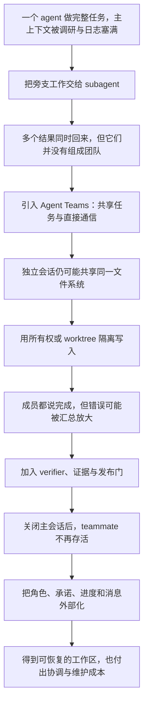

# Claude Code Multi-Agent 文章讲解大纲

## 文档定位

本文只确定讲解逻辑、事实边界与章节职责，不开始写正文，也不固定具体剧情。

正文采用三篇图解文章作为讲解骨架：

- [Claude Code's Architecture, Explained Visually](https://blog.dailydoseofds.com/p/claude-codes-architecture-explained)（下称《Architecture Visually》）；
- [End-to-End Workflow](https://y-agent.github.io/inside-claude-code/01-end-to-end-workflow.html)（下称《End-to-End》）；
- [Multi-Agent Orchestration](https://y-agent.github.io/inside-claude-code/07-multi-agent-orchestration.html)（下称《Multi-Agent Orchestration》）。

两篇论文不再承担正文顺序，而作为事实校准和问题延伸：

- 《深入 Claude Code：当代与未来 AI 智能体系统的设计空间》（下称《Dive》）；
- 《Agent Team Work Zone：面向长生命周期 Claude Code Agent Teams 的自动化持久工作区》（下称《ATWZ》）。

当前产品行为仍以 `claude-code-multi-agent-research.md` 中整理的官方文档和版本记录为准。

## 一句话主旨

Claude Code Multi-Agent 的关键，不是“同时叫来更多模型”，而是重新设计工作怎样被拆分、上下文怎样隔离、状态怎样共享、结果怎样验证，以及团队怎样穿过一次会话的死亡边界。

## 三篇图解文章怎样组成正文

三篇材料不应平行介绍，而应当由远及近地连续缩放：

| 行文阶段 | 主材料 | 视角 | 回答的问题 | 继承的视觉方法 |
| --- | --- | --- | --- | --- |
| 第一层：系统全景 | 《Architecture Visually》 | 六层 harness 总览 | Claude Code 为什么不是“模型外面套一个终端” | 一张总图先放置 Input、Knowledge、Execution、Integration、Multi-Agent、Observability |
| 第二层：一次请求 | 《End-to-End》 | 时间顺序 | 用户输入之后，模型、工具、权限和上下文怎样构成循环 | 沿一条请求画七阶段路径，再放大 Agent Loop 与权限门 |
| 第三层：复制循环 | 《Multi-Agent Orchestration》 | 空间与职责拆分 | 为什么生成多个 agent；它们隔离什么；怎样汇总 | Agent 类型谱系、worktree 隔离、Coordinator 拓扑、Fork cache 四组对照图 |

正文的缩放关系应保持清楚：

```text
六层系统地图
→ 进入其中的 Agent Loop
→ 沿一次请求跑完循环
→ 把一个循环复制为多个隔离循环
→ 加入通信、文件所有权和验证
→ 再让整个团队跨过 session 边界
```

《Architecture Visually》提供开场的直觉，《End-to-End》提供因果顺序，《Multi-Agent Orchestration》提供正文主体。不能把三篇内容简单拼接为三段综述。

## 两篇论文的校准职责

| 材料 | 观察方向 | 最适合回答的问题 | 不应过度外推的部分 |
| --- | --- | --- | --- |
| 《Dive》 | 横向拆解一次运行中的完整 harness | 一个 agent 如何循环；subagent 隔离什么；结果怎样返回；转录、压缩和恢复如何工作 | 针对特定 Claude Code 版本的源码快照，内部文件名和 feature flag 会变化 |
| 《ATWZ》 | 纵向追踪 Agent Team 的长期运行 | session 结束后 teammate 为什么消失；怎样用文件、checkpoint、registry 和 inbox 重建团队 | 描述的是一个外加运维层的设计及使用经验，不是经过对照实验验证的标准答案 |

两者之间最重要的接缝是：

```text
《Dive》：怎样让多个隔离 agent 在一次运行中工作
                    ↓
         会话结束，运行中的 teammate 消失
                    ↓
《ATWZ》：怎样把角色、承诺和进度变成可恢复的外部状态
```

## 三篇图解材料的版本校准

图解文章用于借鉴讲法和重绘结构，不直接继承全部事实。正式行文必须修正以下问题：

| 图解材料中的说法 | 正文处理 |
| --- | --- |
| Subagent 不能继续生成 subagent | 不写成恒定限制；嵌套深度随 Claude Code 版本变化 |
| 每个 Agent Teams teammate 自动获得 Git worktree | 纠正为：对话上下文隔离不自动等于文件隔离；worktree 是需要单独选择的隔离机制 |
| `Task`、`TeamCreate`、Coordinator 内部名称代表当前产品入口 | 只标为 v2.1.88 等源码快照中的内部实现；当前名称与入口回到官方文档核对 |
| 固定的 agent 数量、工具数量、prompt 大小、压缩阈值 | 只在明确标注版本和测量口径时引用 |
| Fork cache 可保证某个固定百分比的成本下降 | 只解释“共享稳定前缀可以复用 prompt cache”的机制，不承诺通用节省比例 |
| 图中的六层是 Claude Code 官方分层 | 明确它是作者为帮助理解而建立的分析模型 |

## 建议文体

选择“对话式教材”，而不是“喜剧小说＋技术报告”。原因是本题天然存在连续的失败链：每个看似合理的方案都会暴露下一层缺陷，新概念应当作为缺陷的答案出现。

对话中的学习者需要实际承担推理：区分概念、预测故障、检查反例，并在最后根据任务结构选择方案。广负责观察边界和命名问题，不能连续播报产品功能。

## 开场场景需要完成的功能

具体场景暂不固定。无论最后采用什么日常事件，都需要满足四个条件：

1. 任务确实可以拆成至少三个相对独立的部分；
2. 各部分又必须在最后汇合成一个可验证的成果；
3. 中途存在一次明确的会话边界，例如暂停、关机或隔日继续；
4. 至少有两位执行者可能接触同一份文件，从而暴露“上下文隔离不等于文件隔离”。

候选机制（需确认后才能写成剧情）：Producer 给出一项跨两天完成的技术课题；第一天先让多个 agent 并行处理，第二天尝试恢复团队。这样，会话边界不是人为插入的知识点，而是现场真正发生的问题。

## 核心问题链



## 章节大纲

### 0. 冷开场：为什么“三个人同时做”仍然会失败

**现场任务：**一个有调研、实现、验证三个部分的真实课题。

**第一直觉：**既然能同时启动三个 agent，完成时间就应接近原来的三分之一。

**预埋的三处失败：**

- 三份输出重复调查了同一背景；
- 两个 agent 触碰同一文件或基于不同版本继续工作；
- lead 收到了三个“已完成”，却无法判断整体是否正确。

本节不解释术语，只让读者先看到：并发执行、团队协作和可靠交付不是同一件事。

### 1. 拉远镜头：Claude Code 是包围模型的六层 Harness

**主视觉来源：**《Architecture Visually》的六层总图。

**需要回答：**为什么模型只是系统中的一个节点，而不是整个 Claude Code？

**讲解顺序：**

1. Input 决定请求从哪里进入，以及用户如何授权；
2. Knowledge 决定模型这一轮能看到哪些项目规则、技能和历史；
3. Execution 把模型生成的工具请求变成真实文件或命令操作；
4. Integration 通过 MCP、plugins 等方式增加外部能力；
5. Multi-Agent 生成其他独立循环；
6. Observability 记录生命周期事件并允许外部介入。

**角色动作：**学习者先把 Claude Code 误认为“会调用 shell 的 Claude”；广要求指出六层里哪一层属于模型本身。答案只有循环中心的一次模型调用，其余大多属于 harness。

**本节边界：**六层只是心智模型；不在这里展开每层的内部源码，也不接受原图里关于 worktree、嵌套和固定阈值的版本化说法。

### 2. 进入系统：Claude Code 不是一次回答，而是一个循环

**当前问题：**如果不知道单 agent 怎样工作，“多 agent”只会被误解为多开几个聊天框。

**需要讲清：**

- 模型本身是一次次无状态调用；
- harness 负责组装上下文、调用模型、执行工具、返回结果、判断是否继续；
- 权限、工具、状态和执行环境都在循环外围；
- Multi-Agent 不是换掉这个循环，而是生成多个各自运行的循环，再加入协调关系。

**主视觉来源：**《End-to-End》的七阶段请求图、Agent Loop 图、Tool Execution 图和 Permission Gate 图。

**事实校准：**《Dive》第 3—5 节与当前官方文档。

**建议图：**不重画整张复杂流程。保留一条横向路径，并用颜色强调反复发生的核心段：

```text
输入与上下文组装
→ 调用模型
→ 模型请求工具
→ 权限判断与工具执行
→ tool result 回填
↺ 再次调用模型
→ 无工具请求时结束
```

结尾把镜头停在这个循环上，为下一节“为什么复制循环”作准备。

### 3. 第一次复制：Subagent 解决“上下文污染”，不自动解决协作

**旧方法的缺陷：**调研日志、测试输出和实现细节全部进入主上下文，重要目标反而被挤压。

**引入概念：**Subagent。

**需要讲清：**

- 每个 subagent 有隔离对话、工具集和权限上下文；
- 默认 in-process 隔离的是对话，不是文件系统；
- 子 agent 完整转录进入 sidechain，父 agent 通常只接收摘要与 metadata；
- 这种设计用信息损失换取父上下文的可控增长；
- 普通 Subagent 与 Fork 的差别，是重新说明任务还是继承父会话前缀，不是“弱 agent / 强 agent”。

**验证问题：**如果子 agent 的关键反例没有写进最终摘要，父 agent 还能知道吗？答案是不保证。

**主视觉来源：**《Multi-Agent Orchestration》的 Agent 类型谱系与 Subagent Prompt Assembly。

**事实校准：**《Dive》第 7、8 节。

### 4. 多个循环怎样组织：从树状委派到 Agent Teams

**旧方法的缺陷：**多个 subagent 各自向父节点交卷，却不能自然地互相质疑、认领依赖或协商接口。

**引入概念：**Agent Teams。

**需要对比：**

| 问题 | Subagent | Agent Teams |
| --- | --- | --- |
| 主要关系 | 父子委派 | lead 与 peer teammates |
| 结果流向 | 主要回到调用者 | teammate 可直接互发消息 |
| 任务状态 | 由主 agent 编排 | 共享任务列表并处理依赖 |
| 适合工作 | 独立旁支、长输出压缩 | 需要讨论、竞争假设和持续协调的并行工作 |
| 新成本 | 背景重述、摘要损失 | 通信、任务状态、生命周期和 token 开销 |

**关键判断：**只有当成员之间的直接协调确实有价值时，Agent Teams 才比一组 Subagents 更合适。

**主视觉来源：**《Multi-Agent Orchestration》的 Coordinator 四阶段图和 Hub-and-Spoke 拓扑图。

**重要补图：**在原图旁增加 Peer-to-Peer Agent Teams 拓扑。原文重点解释 Coordinator，不能让读者误以为当前 Agent Teams 仍然只有父节点转发消息。

**事实校准：**《Dive》第 8.3 节、《ATWZ》第 2 节，以及已整理的当前官方文档。

### 5. 两种隔离：独立思考不等于独立工作区

**旧方法的缺陷：**每位 teammate 都有独立上下文，却仍可能看到并改动同一个 checkout。

**必须区分：**

```text
上下文隔离：避免推理历史互相污染
文件隔离：避免写入互相覆盖
任务所有权：避免两人对同一交付物同时负责
```

**引入手段：**明确文件/模块所有权；需要并行写入时使用 Git worktree；最终仍由 lead 或集成人员合并。

**反例：**三个只读 reviewer 共享 checkout 通常没有问题；三个实现者同时改公共接口，即使用了独立上下文也很危险。

**主视觉来源：**《Multi-Agent Orchestration》的 Git Worktree Isolation 图，但必须去掉“Agent Teams 自动获得 worktree”的暗示。

**事实校准：**《Dive》第 8.2 节；《ATWZ》第 5、8 节。

### 6. “已完成”不是证据：多 Agent 怎样放大错误

**旧方法的缺陷：**lead 若只拼接三份报告，会把局部的错误假设包装成更有气势的整体答案。

**引入概念：**验证边界。

**需要讲清：**

- 报告必须自包含，说明做了什么、观察到什么、哪些尚未验证；
- 实现者与 verifier 的证据路径应不同；
- 测试、lint、引用定位和可重现实验属于证据，不等于 agent 的自信表述；
- release gate 应 fail closed：必要证据缺失时不宣布完成；
- 同质 agent 数量增加不一定增加独立证据，角色、工具和验证路径的差异更重要。

**来源：**《Dive》第 12、13.1 节；《ATWZ》第 8.3、9、10 节；资料包中的多智能体规模研究。

### 7. 一次关机暴露真正的问题：会话恢复不等于团队恢复

**转折事件：**主会话结束，第二天恢复 transcript。

**错误直觉：**既然聊天记录、任务列表和 agent 名称还在，原来的 teammates 应该也还活着。

**事实拆分：**

| 被保存的东西 | 是否等于存活 teammate |
| --- | --- |
| 主会话 transcript | 否，只能重建对话 |
| subagent sidechain | 否，只是历史记录 |
| 任务状态或旧消息 | 否，可能已经陈旧 |
| 运行中的 teammate process/session | 会话结束后通常不存在 |
| 权限决定 | 恢复时不应默认继承 |

**核心结论：**保存 conversation residue，不等于保存能够继续履行承诺的 agency unit。

**来源：**《Dive》第 9、13.2 节；《ATWZ》第 2.2、3、6 节。

### 8. ATWZ 的回答：不要要求模型记住，把团队写进文件

**旧方法的缺陷：**靠 prompt 或 compaction summary 记住角色、未完成承诺和交接细节，既不稳定，也难审计。

**引入机制：**

- workstation：每位 teammate 自己维护的持久目录；
- role file：职责、规则和当前身份；
- working notes：过程状态与未决问题；
- checkpoint：能让新实例继续工作的最小恢复包；
- registry：团队有哪些角色及其状态；
- inbox / report：可审计的异步通信；
- reactivation：按持久状态重新生成 teammate，而不是假装旧实例仍然存活。

**需要强调：**ATWZ 是 Agent Teams 之上的运维与持久化层，不替代 Claude Code 的 agent loop，也不是让原进程永生。

**来源：**《ATWZ》第 4—8 节。

### 9. 文件也会撒谎：持久化带来的第二组故障

**旧方法的缺陷：**把状态落盘，只是把“容易遗忘”换成了“可能陈旧、冲突或不一致”。

**需要展示的失败：**

- checkpoint 从未创建或已经过期；
- timestamp 看似没更新，其实只是时区显示差异；
- ghost registration 使重生后的名字漂移；
- 多个团队使用同名 role，消息投递到错误 workstation；
- writer 与 reader 只靠文档约定，格式变化会静默破坏恢复；
- lead 越过所有权边界，热心整理了 teammate 的文件；
- 版本升级漏掉 migration，导致旧状态无法沿升级链迁移。

**概念回收：**外部状态必须配合所有权、liveness 规则、一致性检查、迁移和发布门，才构成可靠恢复。

**来源：**《ATWZ》第 6、9、10、12 节。

### 10. 最后的选择题：什么时候根本不该组队

让学习者根据任务作出选择，而不是背诵产品功能。

| 任务形态 | 首选 | 理由 |
| --- | --- | --- |
| 短、顺序依赖强、上下文高度共享 | 单 agent | 协调开销可能大于并行收益 |
| 独立旁支、输出很长、最后只需摘要 | Subagent | 隔离噪声，父节点统一综合 |
| 旁支高度依赖当前对话背景 | Fork | 减少背景重述，但继承更多上下文 |
| 多个长任务需要互相讨论或解除依赖 | Agent Teams | 直接通信和共享任务状态有实际价值 |
| 多会话并行写代码 | 上述方案 + worktrees | 文件隔离是额外维度 |
| 跨会话长期协作 | Agent Teams + 持久工作区纪律 | 角色、承诺和 checkpoint 必须外部化 |
| 大规模、重复、步骤应固定 | 显式 workflow / harness | 把编排逻辑放进可审计代码而非临场判断 |

**收束句的技术含义：**增加 agent 数量，只增加了潜在并行度；只有状态、通信、所有权和验证同时成立，才增加了系统能力。

## 建议的教学节奏

每个主体知识点固定使用以下循环：

```text
现场出现一个可观察的失败
→ 学习者给出直觉解释
→ 广指出解释中遗漏的状态边界
→ 给出术语或结构图
→ 用刚才的失败重新验证
→ 暴露下一层问题
```

广的角色声音应主要附着于这些判断：

- “它留下的是记录，不是成员。”
- “上下文分开了。文件没有。”
- “三个人都完成了。很好……所以现在，要验证三次。”

这些只是判断方向，不是可直接写入正文的定稿台词。

## 正文深度边界

### 必须讲

- agent loop 与 harness；
- Subagent、Fork、Agent Teams 的区别；
- 上下文隔离、文件隔离、任务所有权的区别；
- 摘要返回造成的信息边界；
- transcript 恢复与 teammate reactivation 的区别；
- 文件式持久化的机制和新故障；
- verifier、checkpoint 和 release gate 的作用；
- 多 agent 的 token、协调与维护成本。

### 可以放脚注或附录

- Claude Code 内部 TypeScript 文件名；
- feature flag 名称；
- 具体版本中 `Task`/`Agent`、`/fork`/`/subtask` 的变迁；
- ATWZ 各脚本和目录的完整实现；
- 与 OpenClaw、Hermes、LangGraph、AutoGen 的详细横向比较。

### 不应写成稳定事实

- 某版本内部工具或默认行为会永久不变；
- Agent Teams 一定比单 agent 更快或更正确；
- 有 transcript 就能恢复原 teammate；
- worktree 自动解决逻辑冲突和合并问题；
- ATWZ 已被实证证明优于其他持久化方案。

## 建议配图

只保留能承担概念区分的图，不复刻论文原图：

1. 六层 Harness 全景图：改写《Architecture Visually》，只保留稳定概念；
2. 一次请求的七阶段路径：改写《End-to-End》，突出循环段而不是文件名；
3. 一个 Loop 复制成多个 Loop：本文自行补出的关键过渡图；
4. Subagent 树状回传与 Agent Teams peer communication 对照图；
5. Agent 类型与上下文继承程度谱系：借鉴《Multi-Agent Orchestration》；
6. “上下文 / 文件 / 任务所有权”三层隔离图；
7. `live session → transcript residue → reactivation from checkpoint` 时间线；
8. 单 agent、Subagent、Agent Teams、持久工作区的选择表。

所有图片都应根据原理重新绘制，不直接复制三个网站的原图；图注同时标明“结构参考”来源和本文做出的事实修正。

## 写正文前仍需确认

1. 目标读者是已使用 Claude Code 的开发者，还是第一次接触 agent harness 的读者；
2. 正文是否聚焦 Agent Teams，还是保留 Agent View 与 Dynamic Workflows 的选择对照；
3. 是否安排一次本机可复现实验作为贯穿案例；
4. 最终场景采用什么课题，以及 Producer 和广分别承担什么行动；
5. 目标篇幅，以及源码细节放正文还是附录。

## 资料定位索引

- 公开来源索引：`docs/reference/claude-code/README.md`
- 《Dive》：<https://arxiv.org/abs/2604.14228>
- 《ATWZ》：<https://arxiv.org/abs/2607.22917>
- 现有资料包：`docs/plan/claude-code-multi-agent-research.md`
- 《Architecture Visually》：<https://blog.dailydoseofds.com/p/claude-codes-architecture-explained>
- 《End-to-End》：<https://y-agent.github.io/inside-claude-code/01-end-to-end-workflow.html>
- 《Multi-Agent Orchestration》：<https://y-agent.github.io/inside-claude-code/07-multi-agent-orchestration.html>
